# คู่มือกระบวนการงานบริหารบุคลากร Web PP7 ฉบับมาตรฐาน ISO

> **รหัสเอกสาร:** PM-PP7-001 · **เวอร์ชัน:** 1.0 · **วันที่:** 3 ตุลาคม 2569
> **จัดทำโดย:** KiloClaw (PM + Developer โครงการ Web PP7)
> **ผู้อนุมัติ:** พี่ปกรณ์ (Executive Sponsor)
> **องค์กร:** PKG Group — 3 ประเทศ (ไทย / ลาว / กัมพูชา)
> **เอกสารนี้ออกแบบให้นำไปสร้าง Flow การทำงานของระบบคุณภาพ (ISO 9001:2015 / ISO/IEC 27001:2022) ได้ทันที**

---

## สารบัญ

**บทที่ 1 บทนำ**
- 1.1 วัตถุประสงค์ของคู่มือ
- 1.2 ขอบเขต
- 1.3 นิยามศัพท์ (P1–P7, CC1–CC7, หน่วยงาน, ศัพท์เฉพาะ)
- 1.4 ผังภาพรวม P1→P7 (Mermaid)
- 1.5 วิธีอ่านคู่มือ — โครง 9 หัวข้อของแต่ละกระบวนการ
- 1.6 ตาราง Mapping 52 กระบวนการกับ Web PP7

**บทที่ 2 รายกระบวนการ P1 → P7 และงานสนับสนุน**
- 2.1 กลุ่ม P1 — แสวงหา (8 กระบวนการ): P1-HC-001 · LDC-PAO-WI-001 · LDC-PAO-WI-002 · LDC-PAO-PM-001 · LDC-PAO-WI-010 · LDC-PAO-WI-006 · LDC-PAO-PM-002 · LDC-PAO-WI-007 ⏳
- 2.2 กลุ่ม P2 — หยั่งประเมิน (1 กระบวนการ): P2-ASM-001
- 2.3 กลุ่ม P3 — จับคู่คนกับงาน (7 กระบวนการ): P3-MAT-001 · LDC-PAO-WI-003 · LDC-PAO-WI-004 · LDC-PAO-SD-001 · LDC-PAO-FM-001 · LDC-PAO-WI-011 · LDC-PAO-WI-013
- 2.4 กลุ่ม P4 — ประเมินผล (5 กระบวนการ): P4-PER-001 · LDC-PAO-WI-012 · LDC-PAO-WI-016 · LDC-PAO-PM-003 · LDC-PAO-WI-014
- 2.5 กลุ่ม P5 — พัฒนา (9 กระบวนการหลัก): P5-6-DEV-001 · P5-GRP-001 · P5-TRN-001 · LDC-PAD-WI-003 กำกับการพัฒนาบุคลากร · LDC-PAD-WI-004 พัฒนาบุคลากรตาม CC · LDC-PAD-WI-005 ระบบโค้ชชิ่ง · LDC-PAD-WI-006 การวัดผลทุนมนุษย์ · LDC-PAD-PM-005 วัดทุนองค์กรและทุนมนุษย์ · LDC-PAD-PM-004 ระบบ 3 ผ่าน
- 2.6 กลุ่ม P6 — ค่าตอบแทน (2 กระบวนการหลัก): P6-WCD-004 จ่ายเงินเดือน · P6-7-AMB-001 Incentive — พร้อม P6-7-EVP-001 EVP 7 รายการ · P6-7-WI-006 เกษียณ (จัดกลุ่มร่วมเพื่อการไหลของงานจริง)
- 2.7 งาน PAD — พัฒนาบุคลากร (8 กระบวนการ): LDC-PAD-PM-001 ระบบพี่เลี้ยงและน้องเลี้ยง · LDC-PAD-WI-001 เปิดอบรมภายใน · LDC-PAD-WI-002 Training · LDC-PAD-WI-002 ฝึกอบรมภายนอก · LDC-PAD-WI-003 ระบบ E-Learning · LDC-PAD-WI-007 ระบบ TA (Training Audit) · LDC-PAD-FM-001 Communication Plan ISMS · LDC-PAD-SD-001 แผน BCM
- 2.8 งาน PAO — ควบคุมการปฏิบัติการ (2 กระบวนการ): LDC-PAO-WI-017 คีย์ข้อมูลสมาชิกบรรจุลงโปรแกรมเงินเดือน · LDC-PAO-FM-002 แบบฟอร์มทะเบียนเอกสาร
- 2.9 งานต่างด้าว · กลุ่มต่างด้าว: LDC-PAO-WI-008 ⏳ ขอใบอนุญาตทำงานคนงานต่างด้าว · LDC-PAO-WI-009 ⏳ เพิ่ม/ปรับปรุง/แก้ไขโครงสร้างองค์กร · LDC-PAO-WI-015 ⏳ แบบบรรจุสมาชิก PKG · LDC-PAO-WI-032 ⏳ บริหารระบบ TG
- 2.10 งาน IT / ระบบสารสนเทศ (5 กระบวนการ — กำหนดเป็น Placeholder ล้วน): LDC-PAO-WI-018 ⏳ กำกับระบบ LIA PKG · LDC-PAO-WI-019 ⏳ ทบทวนสิทธิผู้ใช้งานระบบ · LDC-PAO-WI-020 ⏳ ยกเลิกสิทธิผู้ใช้งานของพนักงานลาออก · LDC-PAO-WI-021 ⏳ ขอใช้อุปกรณ์เคลื่อนที่ส่วนบุคคล · LDC-PAO-WI-023 ⏳ กระบวนการหนังสือตักเตือน
- 2.11 งาน WCD อื่น ๆ (6 กระบวนการ): LDC-WCD-WI-001 เบี้ยเลี้ยงนักศึกษาฝึกงาน · LDC-WCD-WI-002 เงินสมทบอายุงานสมาชิกลาออก · LDC-WCD-WI-003 เบิกสวัสดิการสมาชิก · LDC-WCD-WI-004 จ่ายเงินเดือนสมาชิก PKG · LDC-WCD-WI-005 จ่ายโบนัสประจำปี · LDC-WCD-WI-010 นำส่งเงินสมทบประกันสังคม
- 2.12 งานบริหารทั่วไป (2 กระบวนการ): LDC-PAO-PM-002 การนำเข้าและขึ้นทะเบียนแรงงานต่างด้าว · LDC-PAD-WI-022 กระบวนการลาออกสมาชิก PKG

**บทที่ 3 สถาปัตยกรรมระบบ Web PP7** — หน้า 3.1 สถาปัตยกรรมรวม, 3.2 RBAC 6 roles, 3.3 Task Tracker, 3.4 Data flow ข้าม P, 3.5 ตาราง AI Touchpoints ทั้งระบบ

**บทที่ 4 ภาคผนวก** — 4.1 เมทริกซ์เอกสาร WI/FM/PM ทั้งหมด (77 ไฟล์) · 4.2 ประวัติการแก้ไข · 4.3 กระบวนการที่ยังรอข้อมูล (รวมสถานะ "(กำลังดำเนินการ)") · 4.4 ตัวชี้วัดรวมของระบบ (KPI Summary)

**รายละเอียดที่ใช้เรียงกระบวนการ:** เรียงตามลำดับ P1 → P7 ที่กำหนดใน std แหล่งจริง (MEMORY.md — ภาพรวม Flow PP7) · และงานที่ผลักไปสนับสนุนเรียงตามแผนก (PAO / PAD / WCD / IT) · ไฟล์ที่เป็น placeholder "(กำลังดำเนินการ)" จะมีป้าย ⏳ กำกับทุกหัวข้อ

---

## 0.1 หน้าปก — ข้อมูลการควบคุมเอกสาร

| รายการ | รายละเอียด |
|---|---|
| รหัสเอกสาร | PM-PP7-001 |
| ชื่อเอกสาร | คู่มือกระบวนการงานบริหารบุคลากร Web PP7 ฉบับมาตรฐาน ISO |
| เวอร์ชัน | 1.0 |
| วันที่เผยแพร่ | 3 ตุลาคม 2569 |
| จัดทำโดย | KiloClaw (PM + Developer) |
| ผู้อนุมัติ | พี่ปกรณ์ (Executive Sponsor) |
| ระบบที่เกี่ยวข้อง | Web PP7 — ระบบบริหารบุคลากร PKG (P1–P7 · 52 กระบวนการ · 13 Tabs) |
| ขอบเขตข้อมูล | โครงกระบวนการ S1 → S2 → S4 พร้อม 9 แหล่งข้อมูลของแต่ละกระบวนการ (รวม Audit Log 100% ตาม OKR Obj.1 KR3) |
| ข้อกำหนดการนำเสนอ | Markdown (.md) หลัก + HTML standalone (mermaid.js via CDN — เปิดแบบ file:// ได้) |
| สถานที่จัดเก็บ | /root/.openclaw/workspace/web-pp7/docs/ |
| ระเบียบเกี่ยวเนื่อง | PDPA ประเทศไทย · ISMS Communication Plan (LDC-PAD-FM-001) · กฎหมายแรงงาน 3 ประเทศ · Succession Plan 2026–2030 |
| ความถี่ทบทวน | ทบทวนเมื่อเวอร์ชันระบบ Web PP7 เปลี่ยน + ทบทวนประจำปี (ตามแนวทาง ISO รอบ Management Review) |

---

# บทที่ 1 บทนำ

## 1.1 วัตถุประสงค์ของคู่มือ

คู่มือนี้รวบรวมกระบวนการทำงานทั้งหมดของ Web PP7 ตั้งแต่ต้นจนจบ ทั้งงานหลัก P1–P7 และงานสนับสนุน เพื่อ 3 วัตถุประสงค์:

1. **เป็นแหล่งศูนย์กลางเดียว** ที่มีกระบวนการทำงานเดิม (S1) · จุดที่ AI เข้ามาช่วย (S2) · กระบวนการใหม่ (S4) พร้อมตารางขั้นตอนและ Flowchart ใช้เอกสารส่งมอบให้ทีมพัฒนา /ทีมตรวจสอบ (GAT) / ผู้บริหาร (OAC) ใช้กำกับได้
2. **เป็นโครงสร้างสำหรับนำไปสร้างระบบคุณภาพ ISO ได้ทันที** — ทุกกระบวนการใช้โครง 9 หัวข้อ (วัตถุประสงค์ / ขอบเขต / RACI / นิยาม / S1 / S2 / S4 / Flowchart / เอกสารอ้างอิง-บันทึกคุณภาพ-ตัวชี้วัด) ที่จับคู่กับข้อกำหนดของ ISO 9001:2015 ข้อ 4.4 (ระบบบริหารคุณภาพและกระบวนการ), ข้อ 7.5 (เอกสารและบันทึก), ข้อ 8.1 (การวางแผนและการควบคุมการปฏิบัติงาน) และ ISO/IEC 27001:2022 ฝั่งความมั่นคงปลอดภัย (Audit Log / RBAC / PDPA)
3. **ปิดช่องว่างข้อมูลอย่างซื่อสัตย์** — เอกสารต้นฉบับ .docx ใดที่ยังเป็น placeholder "(กำลังดำเนินการ)" คู่มือจะระบุชัดว่า "⏳ อยู่ระหว่างรอข้อมูลผู้ปฏิบัติงาน — โครง ISO พร้อมแล้ว" ไม่เรียบเรียงเนื้อหาให้

**ผู้ใช้งานคู่มือ:** พี่ปกรณ์ (Executive Sponsor) · ทีม OAC/GAT/ADM ตาม Succession Plan · PAO / PAD / WCD · ทีมพัฒนา Web PP7 · ผู้ตรวจสอบภายนอก (ISO Auditor)

## 1.2 ขอบเขต

- **องค์กร:** PKG Group — หน่วยธุรกิจ (BU): AAMG / PMSG / CPDG / RPLCG / RAFCOG — 29+ บริษัทไทย, 7 บริษัท/ร้านลาว, 4 บริษัทกัมพูชา
- **ครอบคลุมกระบวนการ:** P1 แสวงหา → P2 หยั่งประเมิน (ประเมินก่อนรบ) → P3 จับคู่คนกับงาน (ประเมินก่อนทำงาน) → P4 ประเมินผล (ประเมินหลังรบ) → P5 พัฒนา → P6 ค่าตอบแทน → P7 คุณภาพชีวิต + งานสนับสนุน (งาน PAD mentoring/DTA/3 ผ่าน/TA, งาน PAO โอนย้าย/ลาออก/onboarding/ลงเวลา/เครดิต, งานต่างด้าว, ISMS/LIA/TG/IT/หนังสือเตือน)
- **ระบบ:** Web PP7 (Frontend HTML + TailwindCSS + Chart.js + XLSX · Backend Google Apps Script · ฐานข้อมูล Google Sheets · Audit Log) + AI Service กลาง (Screening, Summary, Matching, Wellbeing Tracker, Chatbot HR)
- **ผู้ครอบคลุม:** สมาชิกประจำ / สมาชิกทดลองงาน / ผู้สมัคร 3 ประเทศ / นักศึกษาฝึกงาน (เฉพาะ FU01 THAI — ยืนยันพี่ปกรณ์ 30 ก.ย. 69) / แรงงานต่างด้าว / พี่เลี้ยง-น้องเลี้ยง / กรรมการประเมิน 5 มุมมอง
- **นอกขอบเขต:** ระบบเงินเดือนช่าง PMS (นิยามถาวร 2026-08-24 — บรรทัด 511500/511510 รวมเข้า HRE ก่อนคำนวณ PDG — เป็นการเชื่อมบัญชีเท่านั้น ไม่ใช่กระบวนการ Web PP7) · ระบบภายนอกที่ไม่เกี่ยวกับ Human Resource

## 1.3 นิยามศัพท์

### 1.3.1 กระบวนการหลัก P1–P7 (นิยามถาวรจาก MEMORY.md)

| ศัพท์ | นิยาม |
|---|---|
| **P1 — แสวงหา (Recruit / People Sourcing)** | การค้นหาสมาชิกที่มี CC ตรงกับความต้องการขององค์กร |
| **P2 — หยั่งประเมิน (Assess)** | การหยั่งประเมินสมาชิกว่ามี CC ตรงกับเราหรือไม่ — **"ประเมินก่อนรบ"** · ประเมินก่อนรับเข้า |
| **P3 — จับคู่คนกับงาน (Match)** | การจับคู่ผู้ที่ผ่าน P2 ว่าเหมาะกับงานนี้หรือไม่ — **"ประเมินก่อนทำงาน"** |
| **P4 — ประเมินผล (Performance)** | การประเมินหลังทำงาน ว่าควรพัฒนาและปรับปรุงเรื่องอะไร ตาม CC ของสมาชิก — **"ประเมินหลังรบ"** |
| **P5 — พัฒนา (Develop)** | ระบบพัฒนาสมาชิกตาม CC (จากผลการประเมิน P4) |
| **P6 — ค่าตอบแทน (Welfare / Pay & Benefits)** | ระบบค่าตอบแทนและแรงจูงใจ — การตอบแทนตาม CC ของสมาชิก |
| **P7 — คุณภาพชีวิต (Quality of Life)** | ไม่ใช่แค่สวัสดิการ แต่ดูแลสมาชิกในฐานะ "คนคนหนึ่ง" 5 องค์ประกอบ: สุขภาพ (Health) · ความมั่งคั่ง (Wealth) · บรรยากาศ (Well-being) · เวลา (Time) · อารมณ์ขัน (Fun) — สร้างสภาพแวดล้อมที่สมาชิก "อยากอยู่" ไม่ใช่แค่ "ถูกให้อยู่" |

### 1.3.2 Core Competency CC1–CC7 (นิยามถาวร — แกนหลักทุก P)

CC แบ่งออกเป็น 2 ด้าน: ด้านทักษะ (Skills) — สิ่งที่มองเห็นในความสามารถของสมาชิก และด้านทุนองค์กร (Corporate Capital) — ทัศนคติที่อยู่ในตัวคนที่มองไม่เห็น

| รหัส | ชื่อ CC | องค์ประกอบ |
|---|---|---|
| **CC1** | ความเก่งในการนำผู้รับใช้ (Servant Leadership) | รับฟัง รับใช้ รับผิดชอบ รับผิด รับความจริง รับการเปลี่ยนแปลง (6 รับ) + อุปนิสัย 8 ประการ (อดกลั้น เมตตา ถ่อมตน เคารพ ไม่เห็นแก่ตัว ให้อภัย ซื่อสัตย์ มุ่งมั่น) + ผู้นำ 5 บทบาท (นักเดินทาง ผู้รับใช้ ผู้สร้าง นักพัฒนา ผู้พิทักษ์) |
| **CC2** | ความเก่งในการปรับตัวและสร้างนวัตกรรม (Adaptive Innovation) | คิดแตกต่าง เปลี่ยนแปลงก่อนถูกบังคับ รักการแสวงหาสิ่งที่ดีกว่า สร้างนวัตกรรมอยู่เสมอ ละทิ้งอัตตา รับการเปลี่ยนแปลงเป็นธรรมชาติ |
| **CC3** | ความเก่งในการสร้างคุณค่าบนฐานความไว้วางใจ (Trust-Based Value Creation) | รับฟังปราศจากอคติ รับความจริงไม่บิดเบือน สร้างความเชื่อมั่น เปิดเผยจริงใจ ส่งมอบคุณค่าให้ลูกค้าเกินคาดหวัง |
| **CC4** | ความเก่งในการทำงานทีมด้วยฉันทมติ (Consensus-Driven Teamwork) | ทำงานเป็นทีม ทุกคนทำเพื่อกันและกัน ตัดสินใจด้วยฉันทมติ เดินหน้าพร้อมกัน ส่งมอบความเบิกบานใจให้ลูกค้า |
| **CC5** | ความเก่งในวิชาชีพและวินัยองค์กร (Disciplined Professionalism) | ใส่ใจคุณภาพทุกสิ่งที่ทำ วินัยสูง ขยัน ประหยัด ซื่อสัตย์ อดทน ตัดสินใจบนฐานข้อมูลจริง โปร่งใส ตรงไปตรงมา รับผิดชอบ |
| **CC6** | ความเก่งในการใช้เทคโนโลยี (Technology Mastery) | ใช้เครื่องมือดิจิทัลคล่องแคล่ว ปรับตัวกับเทคโนโลยีใหม่เร็ว ใช้ข้อมูลและเทคโนโลยีเพิ่มประสิทธิภาพงาน ส่งเสริมทีมใช้เทคโนโลยีอย่างสร้างสรรค์ |
| **CC7** | ความเก่งในการสร้างบรรยากาศด้วยอารมณ์ขัน (Humor & Joy) | สร้างรอยยิ้มและความผ่อนคลายในทีม ใช้อารมณ์ขันคลายเครียดอย่างเหมาะสม ทำให้การทำงานเป็นเรื่องสนุกโดยไม่เสียคุณภาพ |

> **หลักการ:** ทุก CC ใช้ P2 (หยั่งประเมิน) วัดก่อนรับเข้า · P4 (ประเมินผล) วัดหลังทำงาน · P5 (พัฒนา) ปรับปรุงต่อเนื่อง

### 1.3.3 หน่วยงานและคำย่อ

| ศัพท์ | นิยาม |
|---|---|
| **PAO** | People Acquisition & Operations — ดูแลงานสรรหา อัตรากำลัง โอนย้าย ลาออก บรรจุ ลงเวลา แรงงานต่างด้าว สิทธิผู้ใช้งานระบบ |
| **PAD** | People Administration & Development — ดูแลงานพัฒนาบุคลากร: พี่เลี้ยง-น้องเลี้ยง ฝึกอบรม E-Learning Coach CC Gap 3 ผ่าน TA MSP |
| **WCD** | Welfare & Compensation Department — ดูแลงานค่าตอบแทน: เงินเดือน โบนัส INC EVP เงินสมทบ เกษียณ ประกันสังคม |
| **BU / BMC** | BU = Business Unit (หน่วยธุรกิจ) · BMC = Business Management Committee (ผู้บริหารหน่วยธุรกิจ — ผู้ขออัตรา/ตัดสินใจในหน่วย) |
| **OAC / GAT / ADM** | OAC = Oversight Advisory Committee (ผู้กำกับ-ให้คำปรึกษา — Oversight/Advise/Review/Veto สูงสุด 3 ครั้ง) · GAT = General Audit Team (ทีมตรวจสอบ — BSC Audit + Monthly Report) · ADM = Administrative Management (ทีมบริหารชุดใหม่) — ตาม PKG Succession Plan |
| **4C** | หน่วยที่บันทึกใบเหลือง/ใบแดง (วินัย) ในระบบพี่เลี้ยง (LDC-PAD-PM-001 ขั้น 11) — ดู 2.7.1 |
| **4C (บริบทใหม่)** | ผู้กำกับวินัย — ทาง LDC-PAD-PM-001 ขั้น 11: "4C บันทึกใบเหลือง/ใบแดง + ประกาศรายเดือน" |

### 1.3.4 ศัพท์เฉพาะระบบ

| ศัพท์ | นิยาม |
|---|---|
| **BCT** | ระบบ Add Script ของ Google Apps Script ที่ใช้เป็น Engine ของ Web PP7 (BCT PPP7) — จัดการฐานข้อมูล BCT PPP7 / แจ้งเตือน / Batch process / Interfacing |
| **DTA** | Daily Task Report — น้องเลี้ยงส่งรายงานปฏิบัติงานรายวัน (DTA_1 / DTA_2 / DTA_4) ผ่าน Line Bot |
| **3 ผ่าน** | มาตรฐานบุคลากร 3 ผ่าน (LDC-PAD-PM-004): ผ่านที่ 1 = ผ่านการฝึกอบรม (ทฤษฎี + Roleplay) · ผ่านที่ 2 = ผ่าน Audit + เสียงลูกค้า · ผ่านที่ 3 = ผลการทำงานบรรลุ |
| **TA** | Training Audit — ระบบตรวจสอบการฝึกอบรม (LDC-PAD-WI-007 ระบบ TA) |
| **MSP** | ระบบเงินสมทบ MSP — ผ่าน Wallet/BU POINT ตาม LDC-PAD-WI-004/005/006/007 (สร้างและจ่าย MSP · ซื้อ MSP · เรียกเก็บค่าดำเนินการ · ดึง BUPOINT กลับ) |
| **INC** | Incentive — แรงจูงใจคำนวณจากคะแนน P4 + CC + งบประมาณ BU แบ่ง 4 ระดับ A/B/C/D |
| **EVP** | Employee Value Proposition — ค่าตอบแทนทางอารมณ์ 7 รายการ: TRUST · RESPECT · PRIDE · FREEDOM · FUN · LEARNING & GROWTH · SUSTAINABLE & SATISFACTORY PAY (จัดลำดับความสำคัญในแบบสัมภาษณ์) |
| **LIA** | ระบบกำกับโครงสร้างของทีมรับใช้ — ดึงข้อมูลบทบาท CEO เดิมใช้ใน Succession ; ระบบบริหารระบบ LIA PKG (LDC-PAO-WI-018 - Placeholder ⏳) |
| **ISMS** | Information Security Management System — แผนการสื่อสารความมั่นคงปลอดภัย (LDC-PAD-FM-001 Communication Plan ISMS) |
| **CMC** | การประเมินความเหมาะสมเชิงวัฒนธรรมองค์กร (Cultural Match) — องค์ประกอบหนึ่งของ P2 |
| **3E3P** | Engagement, Empowerment, Enablement + Purpose, Passion, Pride — แบบทดสอบแรงจูงใจ 3E3P 15 ข้อ (นิยามถาวร 2026-10-01) |
| **TCC** | เกณฑ์คะแนนสัมภาษณ์ — คะแนนเต็ม 50 ผ่าน ≥ 65% (10 หัวข้อ/ด้านละ 5 คะแนน) — ใช้ทั้งแบบสัมภาษณ์ 3 แบบ |
| **7F** | แบบติดตามสมาชิก 7F (ขั้น 4 ของ LDC-PAD-WI-003 กำกับการพัฒนาบุคลากร) |
| **FU / FU_ID** | กลุ่มบริษัทตามประเทศ: FU01 = THAI (29+ บริษัท) · RPLCG = ลาว (7 บริษัท/ร้าน) · RAFCOG = กัมพูชา (4 บริษัท) — แยก Theme สี: THAI=ส้ม / RPLCG=เหลือง / RAFCOG=แดง-น้ำเงิน |
| **Application Status (กลาง)** | NEW → CONSENTED → APPLICATION_COMPLETED → DOCUMENT_PENDING → DOCUMENT_VERIFIED → AI_TRANSLATED → READY_FOR_SCREENING → SCREENING → INTERVIEW → BACKGROUND_CHECK → OFFER → HIRED (ไม่ผ่าน: NOT_SELECTED) |
| **PDPA** | พ.ร.บ. คุ้มครองข้อมูลส่วนบุคคล — Consent Gate ก่อนกรอกใบสมัคร (เก็บ consent_id/เวอร์ชัน/เวลา/ip) · encryption · access control · retention policy |
| **S1 / S2 / S4** | S1 = กระบวนการเดิม · S2 = จุดที่ AI เข้ามาช่วย · S4 = กระบวนการใหม่ (หลัง AI เข้ามาช่วย) — ตามมาตรฐานการสรุป 7 ส่วนของโครงการ |
| **ผ่านเหมาะ 1 ใน 3** | กติกาการเรียกทำงานแบบหลายหน้า ("เรียนแบบ ไม่ใช่เลียนแบบ") — นิยามถาวรของ P4 แผนประเมินใหม่ |
| **AI เสนอ มนุษย์ยืนยัน** | หลักการออกแบบทุกกระบวนการ — AI ร่าง/คำนวณ/เตือน แต่การตัดสินใจ final ต้องเป็นคน (PAD/HR/การเงิน — ตาม AI Diagram §9.1) |

## 1.4 ผังภาพรวมกระบวนการ P1–P7

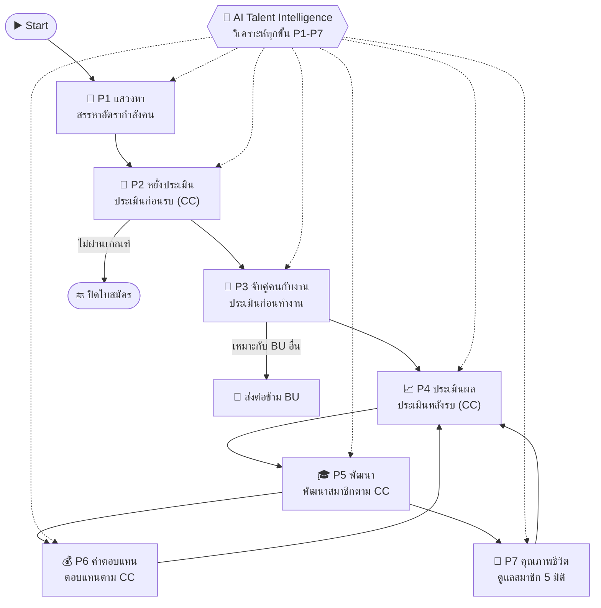
```mermaid
flowchart TD
    START(["▶️ Start"]) --> P1["🧲 P1 แสวงหา<br/>สรรหาอัตรากำลังคน"]
    P1 --> P2["🎯 P2 หยั่งประเมิน<br/>ประเมินก่อนรบ (CC)"]
    P2 --> P3["🤝 P3 จับคู่คนกับงาน<br/>ประเมินก่อนทำงาน"]
    P3 --> P4["📈 P4 ประเมินผล<br/>ประเมินหลังรบ (CC)"]
    P4 --> P5["🎓 P5 พัฒนา<br/>พัฒนาสมาชิกตาม CC"]
    P5 --> P6["💰 P6 ค่าตอบแทน<br/>ตอบแทนตาม CC"]
    P5 --> P7["🌿 P7 คุณภาพชีวิต<br/>ดูแลสมาชิก 5 มิติ"]
    P6 --> P4
    P7 --> P4
    P2 -->|"ไม่ผ่านเกณฑ์"| END1(["🔚 ปิดใบสมัคร"])
    P3 -->|"เหมาะกับ BU อื่น"| FWD["🔄 ส่งต่อข้าม BU"]

    AI1{{"🤖 AI Talent Intelligence<br/>วิเคราะห์ทุกขั้น P1-P7"}} -.-> P1
    AI1 -.-> P2
    AI1 -.-> P3
    AI1 -.-> P4
    AI1 -.-> P5
    AI1 -.-> P6
    AI1 -.-> P7
```

> ทุก P ขับเคลื่อนด้วย CC (CC1–CC7) · ข้อมูลไหลต่อเนื่อง P1→P7 · AI ดึงข้อมูลข้ามขั้นตอนลดการคีย์ซ้ำ · AI เสนอ มนุษย์ยืนยันเสมอ

## 1.5 วิธีอ่านคู่มือ — โครง 9 หัวข้อของแต่ละกระบวนการ

ทุกกระบวนการในบทที่ 2 ใช้โครงเดียวกัน 9 หัวข้อ (mapped กับ ISO 9001:2015):

| # | หัวข้อ | ISO 9001:2015 |
|---|---|---|
| (1) | วัตถุประสงค์ | 4.3 / 4.4.1 |
| (2) | ขอบเขต | 4.3 |
| (3) | ผู้รับผิดชอบ — RACI ย่อ | 5.3 (บทบาทหน้าที่ความรับผิดชอบ) |
| (4) | คำนิยามเฉพาะ | 7.5.1 (ข้อมูลสารสนเทศ) |
| (5) | กระบวนการเดิม S1 | 4.4.1 (การทำความเข้าใจกระบวนการเดิม — Baseline) |
| (6) | จุดที่ AI เข้ามาช่วย S2 | 6.1 (ความเสี่ยง/โอกาส — ยกระดับด้วย AI) |
| (7) | กระบวนการใหม่ S4 (ตาราง: ลำดับ · กิจกรรม · ผู้ดำเนินการ · เอกสาร/ระบบ-Web PP7 โมดูล) | 8.1 (การวางแผนและควบคุมการปฏิบัติงาน) |
| (8) | Flowchart Mermaid | 4.4.2 (การจัดทำเอกสารกระบวนการ) |
| (9) | เอกสารอ้างอิง / บันทึกคุณภาพ (Record) / ตัวชี้วัด (KPI) | 7.5.3 + 9.1 (การติดตามวัดผล) |

> **กติกา Placeholder:** เอกสาร .docx ที่ต้นฉบับเป็น "(กำลังดำเนินการ)" — หัวข้อ 1–9 จะจัดไว้ครบ แต่เนื้อหาจะระบุว่า "⏳ อยู่ระหว่างรอข้อมูลผู้ปฏิบัติงาน — โครง ISO พร้อมแล้ว" และไม่แต่งเนื้อหา ไม่เดาขั้นตอน

## 1.6 ตาราง Mapping 52 กระบวนการกับ Web PP7

**ผลการทบทวน:** S1 → S4 ครบ 52 กระบวนการ · Web PP7 13 Tabs รองรับครบ 100% · ครบทั้ง P1–P7 และงานสนับสนุน (จาก PROCESS-MAPPING-52.md)

**กลุ่ม P1–P4: สรรหาและประเมินผล (13 กระบวนการ)**

| กระบวนการ | ชื่อ | Web PP7 Tab | สถานะ Web PP7 |
|---|---|---|---|
| LDC-PAO-WI-001 | ขออนุมัติจัดหากำลังคน | 📋 Headcount Request | ✅ Tab มีแล้ว |
| LDC-PAO-WI-002 | คัดเลือกพนักงานภายนอก | 🔎 แสวงหา (P1) | ✅ Tab มีแล้ว |
| LDC-PAO-PM-001 | แสวงหาผู้สมัครงาน | 🔎 แสวงหา (P1) | ✅ Tab มีแล้ว |
| LDC-PAO-PM-002 | บริหารระบบ PPP7 | 📌 สรุปผู้บริหาร | ✅ Tab มีแล้ว |
| LDC-PAO-PM-003 | ระบบวัดผล 30 วัน | 🤝 จับคู่ (P3) | ✅ สร้างแล้ว |
| LDC-PAO-WI-003 | สรุปผลและประกาศผล | 🤝 จับคู่ (P3) | ✅ สร้างแล้ว |
| LDC-PAO-WI-004 | โอนย้าย/เลื่อนตำแหน่ง | 🤝 จับคู่ (P3) | ✅ สร้างแล้ว |
| LDC-PAO-WI-006 | ขอโควต้าแรงงานต่างด้าว | 🔎 แสวงหา (P1) | ✅ Tab มีแล้ว |
| LDC-PAO-WI-007 | รับแรงงานต่างด้าว | 🔎 แสวงหา (P1) | ✅ Tab มีแล้ว |
| LDC-PAO-FM-001 | ใบลาออก | 🚪 ลาออก (P3) | ✅ สร้างแล้ว |
| LDC-PAO-FM-002 | ทะเบียนเอกสาร | 📋 Headcount Request | ✅ Tab มีแล้ว |
| LDC-PAO-SD-001 | Script แจ้งรายละเอียด | 🔎 แสวงหา (P1) | ✅ Tab มีแล้ว |
| LDC-PAO-WI-010 | รับสมัครงานภายใน | 🔎 แสวงหา (P1) | ✅ Tab มีแล้ว |

**กลุ่ม P5: พัฒนาบุคลากร (13 กระบวนการ)**

| กระบวนการ | ชื่อ | Web PP7 Tab | สถานะ Web PP7 |
|---|---|---|---|
| LDC-PAD-FM-001 | Communication Plan ISMS | 🎓 พัฒนา (P5) | ✅ Tab มีแล้ว |
| LDC-PAD-PM-001 | ระบบพี่เลี้ยงและน้องเลี้ยง | 🤝 จับคู่ (P3) | ✅ สร้างแล้ว |
| LDC-PAD-PM-002 | ศูนย์พัฒนาฝีมือแรงงาน | 🎓 พัฒนา (P5) | ✅ Tab มีแล้ว |
| LDC-PAD-PM-004 | ฝึกอบรมตามกฎหมาย | 🎓 พัฒนา (P5) | ✅ Tab มีแล้ว |
| LDC-PAD-PM-005 | ประเมินผลฝึกอบรม | 🎓 พัฒนา (P5) | ✅ Tab มีแล้ว |
| LDC-PAD-WI-001 | ขึ้นทะเบียนพนักงานฝึก | 🎓 พัฒนา (P5) | ✅ Tab มีแล้ว |
| LDC-PAD-WI-002 | จัดทำแผนฝึกอบรม | 🎓 พัฒนา (P5) | ✅ มีแล้ว |
| LDC-PAD-WI-003 | ดำเนินการฝึกอบรม | 🎓 พัฒนา (P5) | ✅ มีแล้ว |
| LDC-PAD-WI-004 | ประเมินผลหลังฝึกอบรม | 🎓 พัฒนา (P5) | ✅ มีแล้ว |
| LDC-PAD-WI-005 | ติดตามผลการฝึก | 🎓 พัฒนา (P5) | ✅ มีแล้ว |
| LDC-PAD-WI-006 | รายงานการฝึกอบรม | 🎓 พัฒนา (P5) | ✅ มีแล้ว |
| LDC-PAD-WI-007 | พัฒนาบุคลากรต่อเนื่อง | 🎓 พัฒนา (P5) | ✅ มีแล้ว |
| LDC-PAD-FM-002 | แบบฟอร์มฝึกอบรม | 🎓 พัฒนา (P5) | ✅ มีแล้ว |

**กลุ่ม P6-P7: ค่าตอบแทนและคุณภาพชีวิต (12 กระบวนการ)**

| กระบวนการ | ชื่อ | Web PP7 Tab | สถานะ Web PP7 |
|---|---|---|---|
| LDC-WCD-WI-001 | เบี้ยเลี้ยงฝึกงาน | 📝 WI-001 | ✅ สร้างแล้ว |
| LDC-WCD-WI-002 | เงินสมทบอายุงานลาออก | 💰 ค่าตอบแทน (P6) | ✅ สร้างแล้ว |
| LDC-WCD-WI-003 | เบิกสวัสดิการสมาชิก | 💰 ค่าตอบแทน (P6) | ✅ สร้างแล้ว |
| LDC-WCD-WI-004 | จ่ายเงินเดือนสมาชิก | 💰 ค่าตอบแทน (P6) | ✅ สร้างแล้ว |
| LDC-WCD-WI-005 | จ่ายโบนัสประจำปี | 💰 ค่าตอบแทน (P6) | ✅ สร้างแล้ว |
| LDC-WCD-WI-006 | ระบบเกษียณ | 💰 ค่าตอบแทน (P6) | ✅ สร้างแล้ว |
| LDC-WCD-WI-010 | นำส่งเงินสมทบ | 💰 ค่าตอบแทน (P6) | ✅ สร้างแล้ว |
| LDC-WCD-FM-001 | แบบฟอร์มค่าตอบแทน | 💰 ค่าตอบแทน (P6) | ✅ สร้างแล้ว |
| LDC-WCD-FM-002 | แบบฟอร์มสวัสดิการ | 💰 ค่าตอบแทน (P6) | ✅ สร้างแล้ว |
| LDC-WCD-PM-001 | บริหารค่าตอบแทน | 💰 ค่าตอบแทน (P6) | ✅ สร้างแล้ว |
| LDC-WCD-PM-002 | บริหารสวัสดิการ | 💰 ค่าตอบแทน (P6) | ✅ สร้างแล้ว |
| LDC-WCD-PM-003 | ระบบ INC Points | 💰 ค่าตอบแทน (P6) | ✅ สร้างแล้ว |

**กลุ่มสนับสนุน: กฎหมาย · ระเบียบ · วิจัย (14 รายการ)**

| กระบวนการ | ชื่อ | Web PP7 Tab | สถานะ |
|---|---|---|---|
| กฎหมายแรงงานไทย | พ.ร.บ. คุ้มครองแรงงาน | ⚖️ กฎหมาย | ✅ มี Tab |
| กฎหมายแรงงานลาว | Labour Law Laos | ⚖️ กฎหมาย | ✅ มี Tab |
| กฎหมายแรงงานกัมพูชา | Labour Law Cambodia | ⚖️ กฎหมาย | ✅ มี Tab |
| comparative law | เปรียบเทียบข้ามประเทศ | ⚖️ กฎหมาย | ✅ มี Tab |
| ระเบียบ WI 48 ข้อ | Work Instructions | 📜 ระเบียบ | ✅ มี Tab |
| ระเบียบ Policy 12 ข้อ | Policy Manuals | 📜 ระเบียบ | ✅ มี Tab |
| Process Maps 25 ข้อ | แผนผังกระบวนการ | 📜 ระเบียบ | ✅ มี Tab |
| CEO Concept | Contract of Extreme Ownership | 📜 ระเบียบ | ✅ มี Tab |
| วิจัย 360° | Best Practices (Google, Netflix) | 🔬 วิจัย | ✅ มี Tab |
| วิจัย BARS | Behaviorally Anchored Rating | 🔬 วิจัย | ✅ มี Tab |
| วิจัย CCL | Center for Creative Leadership | 🔬 วิจัย | ✅ มี Tab |
| วิจัย PERMA | Wellbeing Model | 🔬 วิจัย | ✅ มี Tab |
| วิจัย Total Rewards | WorldatWork | 🔬 วิจัย | ✅ มี Tab |
| วิจัย OKR | Google re:Work | 🔬 วิจัย | ✅ มี Tab |

> **ความเชื่อมโยง:** ทุกกระบวนการใน PM WI มีที่รองรับใน Web PP7 · ข้อมูลไหลต่อเนื่อง P1→P7 · P3 ศูนย์กลางเชื่อมทุกกระบวนการ · P6 เชื่อม INC Points และ MSP App
---

# บทที่ 2 รายกระบวนการ P1–P7 และงานสนับสนุน

> **หมายเหตุแหล่งข้อมูล:** เนื้อหาทั้งบทสังเคราะห์จากไฟล์ .docx 77 ไฟล์ (สกัดไว้ที่ /tmp/pdocs.txt) + เอกสารโครงการ Web PP7 (MEMORY.md, PROCESS-MAPPING-52.md, SMC_HOCC_PM_002_PP7_AI_DIAGRAM.md, TASK-PP13-PROCESS-DASHBOARD.md, P2-หยั่งประเมิน-กระบวนการใหม่.md, P2-แบบสัมภาษณ์-3แบบ.md, p1-p3-process-summary.md) · ทุกกระบวนการใช้โครง 9 หัวข้อตาม 1.5 · กระบวนการที่ต้นฉบับเป็น placeholder จะมีป้าย ⏳

## 2.1 กลุ่ม P1 — แสวงหา (Recruit / People Sourcing)

**นิยามถาวร P1:** การค้นหาสมาชิกที่มี CC ตรงกับความต้องการขององค์กร
**เจ้าของกระบวนการ:** PAO (People Acquisition & Operations) ร่วมกับ BU/BMC
**Web PP7:** Tab-02 แสวงหา (P1) / Tab-01 Headcount Request

### 2.1.1 P1-HC-001: ขออัตรากำลัง — สถานะ: ข้อมูลครบ ✅

**(1) วัตถุประสงค์** — เพื่อให้การขออัตรากำลังของ BU เป็นไปตามขั้นตอนที่ตรวจสอบได้ อนุมัติเร็ว และเปิดรับสมัครได้ทันทีหลังอนุมัติ — เป็นจุดเริ่มต้น (Start) ของ Flow PP7

**(2) ขอบเขต** — ตั้งแต่ BU ยื่นคำขอ จนถึงประกาศรับสมัคร (ไม่รวมการคัดเลือกผู้สมัคร—เข้า 2.1.3)

**(3) RACI ย่อ** — BU/BMC: R (ยื่นคำขอ) · PAO: A (ตรวจสอบดำเนินการ) · HRM: A (อนุมัติ — พี่ปกรณ์ Executive Sponsor เป็น I)

**(4) คำนิยามเฉพาะ** — *หมายเหตุ: ในเอกสาร 2.1.1/2.1.2 ใช้คำ "HRM อนุมัติ" ตามต้นฉบับ .docx โดยในเชิง Web PP7 จะหมายถึงเส้นทางอนุมัติของหัวหน้า HR บนระบบ (ในระบบโครงสร้างจริงขององค์กรให้ใช้เส้นทางตามระเบียบองค์กรจริง เนื่องจาก "HRM" ในเอกสาร .docx ชุดแรกโดยเทียบระเบียบดั้งเดิมเรียก "ผู้บริหาร" ให้สอดคล้องกับ LDC-PAO-WI-001)*

**(5) กระบวนการเดิม (S1)**

| ลำดับ | กิจกรรม | ผู้ดำเนินการ | เอกสาร/ระบบ |
|---|---|---|---|
| 1 | BU ยื่นเอกสารคำขอ | BU | เอกสารคำขอ (Offline) |
| 2 | PAO ตรวจสอบเอกสาร | PAO | ตรวจสอบด้วยมือ |
| 3 | เสนอ HRM อนุมัติ | HRM | บันทึกอนุมัติ |
| 4 | ประกาศรับสมัคร | PAO | ประกาศรับสมัคร (Offline) |

**(6) จุดที่ AI เข้ามาช่วย (S2)**

| # | จุดที่ AI ช่วย | ผลลัพธ์ |
|---|---|---|
| 1 | Auto-validate เอกสาร (ตรวจสอบ field ครบ/รูปแบบ) — ตรวจความซ้ำซ้อนกับอัตราที่เปิดอยู่ + แนะนำตำแหน่ง/สมรรถนะที่ควรระบุ + คาดการณ์เวลาปิดอัตรา | ลดเวลาเตรียมประกาศ 50% |
| 2 | Auto-route ไป HRM ตามเงื่อนไข | คำขอไปถูกผู้อนุมัติเสมอ ไม่หลุด/ไม่ค้าง |
| 3 | Dashboard แสดงสถานะแบบ real-time | BU เห็นสถานะตัวเองทุกขั้น ลดการโทรถาม HR |

**(7) กระบวนการใหม่ (S4)**

| ลำดับ | กิจกรรม | ผู้ดำเนินการ | เอกสาร/ระบบ · Web PP7 โมดูล |
|---|---|---|---|
| 1 | BU กรอกฟอร์มออนไลน์ (Web Form) | BU/BMC | Web PP7 — Tab-01 Headcount Request |
| 2 | AI ตรวจสอบความถูกต้องอัตโนมัติ → แจ้ง BU ทันทีหากขาดข้อมูล | ระบบ AI | AI Validation Engine |
| 3 | AI เสนอ HRM อนุมัติอัตโนมัติ พร้อมสรุปข้อมูล | ระบบ AI + HRM | ระบบ Route อนุมัติ (ผู้อนุมัติเป็นคน — ตามหลัก AI เสนอ มนุษย์ยืนยัน) |
| 4 | ระบบเปิดรับสมัครทันทีหลังอนุมัติ | ระบบ | Web PP7 — Tab-02 แสวงหา (ประกาศตำแหน่ง) |
| 5 | Dashboard real-time ติดตามสถานะ | ทุกบทบาท | Web PP7 Dashboard + Audit Log |

**(8) Flowchart**

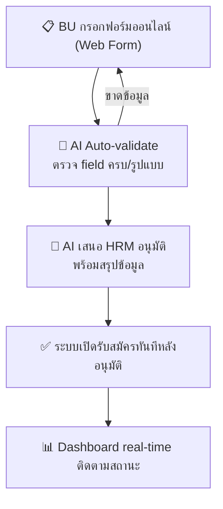
```mermaid
flowchart TD
    A["📋 BU กรอกฟอร์มออนไลน์ (Web Form)"] --> B["🤖 AI Auto-validate<br/>ตรวจ field ครบ/รูปแบบ"]
    B -->|"ขาดข้อมูล"| A
    B --> C["🤖 AI เสนอ HRM อนุมัติ<br/>พร้อมสรุปข้อมูล"]
    C --> D["✅ ระบบเปิดรับสมัครทันทีหลังอนุมัติ"]
    D --> E["📊 Dashboard real-time ติดตามสถานะ"]
```

**(9) เอกสารอ้างอิง / บันทึกคุณภาพ / ตัวชี้วัด** — เอกสารต้นฉบับ: P1-HC-001: ขออัตรากำลัง.docx (+ P1_HC-001 - ขออัตรากำลัง.docx ฉบับรายละเอียด) · บันทึกคุณภาพ: HEADCOUNT_REQUEST (MANPOWER_REQUEST) · ตัวชี้วัด: ลดเวลาเตรียมประกาศ 50% · Audit Log 100% · คำขอที่ไม่พลาดขั้นตอนคืนค่าเป็น 0

#### ส่วนขยาย P1-HC-001 — โครงสร้างองค์กร + ขออัตรากำลังคน (Task 2 Flow 10 ขั้นตอน — จาก TASK-PP13)

- **STEP 1 โครงสร้างองค์กร (4 เมนูย่อย):** 1) คีย์ขอโครงสร้าง (เฉพาะ BMC — FU/บริษัท/หน่วยงาน/ตำแหน่ง/จำนวนอัตรา/โครงสร้างเดิม/ที่ต้องการ/เหตุผล → REQUEST_ID + STATUS=REQUEST → ส่ง PAO) 2) DATA โครงสร้างบริษัทภายนอก (เฉพาะ PAO — set ตามคำขอ BU → SAVE → APPROVE) 3) DATA โครงสร้างบริษัทภายใน (แยก dataset EXTERNAL/INTERNAL ห้ามปนกัน) 4) Flowchart (เลือก BU AAMG/PMSG/CPDG/RPLCG/RAFCOG → เลือกบริษัท → ดึง Structure ล่าสุดที่ APPROVED → แสดง flowchart — ไม่คีย์ซ้ำ)
- **STEP 2 ขออัตรากำลังคน:** STRUCTURE APPROVED → ดึงไป Step 2 → BMC เลือก BU/บริษัท/หน่วยงาน/ตำแหน่ง/โครงสร้างเงินเดือน (ระบบดึงจาก APPROVED STRUCTURE — **ห้ามคีย์ใหม่**) → กรอกเฉพาะจำนวนอัตรา → MANPOWER REQUEST → บันทึก DB → Step 3
- **หัวใจของระบบ:** STRUCTURE DATABASE = Single Source of Truth — PAO set/อนุมัติครั้งเดียว ใช้ทั้ง Flowchart และ Step 2 ไม่ต้องคีย์ซ้ำ

### 2.1.2 LDC-PAO-WI-001: การขออนุมัติจัดหากำลังคน — สถานะ: ข้อมูลครบ ✅

**(1) วัตถุประสงค์** — กำหนดขั้นตอนการขออนุมัติจัดหากำลังคนให้ไหลจาก BU → หัวหน้า → HR → ผู้บริหาร โดยระบบติดตามสถานะได้ทุกขั้น

**(2) ขอบเขต** — จากการสร้างคำขอ จนถึงการอนุมัติ (คู่ขนานกับ P1-HC-001 — เป็น WI ละเอียดระดับปฏิบัติ)

**(3) RACI ย่อ** — BU: R (สร้างคำขอ) · หัวหน้า: A (พิจารณา) · HR/PAO: A (เสนอ/ตรวจ) · ผู้บริหาร: A (อนุมัติ)

**(4) คำนิยามเฉพาะ** — Auto-route = ระบบส่งต่อเอกสารตามเส้นทางอนุมัติอัตโนมัติ · Auto-track = ระบบบันทึกสถานะทุกขั้น

**(5) กระบวนการเดิม (S1)**

| ลำดับ | กิจกรรม | ผู้ดำเนินการ | เอกสาร/ระบบ |
|---|---|---|---|
| 1 | สร้างคำขอ | BU | ฟอร์มคำขอ |
| 2 | เสนอหัวหน้า | BU | เอกสารเสนอ |
| 3 | เสนอ HR | BU | เอกสารเสนอ |
| 4 | เสนอผู้บริหาร | HR | เอกสารเสนอ |
| 5 | อนุมัติ | ผู้บริหาร | บันทึกอนุมัติ |

**(6) จุดที่ AI เข้ามาช่วย (S2)**

| # | จุดที่ AI ช่วย | ผลลัพธ์ |
|---|---|---|
| 1 | Auto-generate คำขอ | ลดการกรอกซ้ำ — ฟอร์มเดียวใช้ทุกระดับ |
| 2 | Auto-route อนุมัติ | คำขอไม่หลงเส้นทาง — ลดงานเสนอแบบ manual |
| 3 | Auto-track สถานะ | ทุกคนเห็นคำขออยู่ขั้นไหนเสมอ |
| 4 | Auto-notify | แจ้งเตือนทุกขั้นตอน (TG/Line/Email) |

**(7) กระบวนการใหม่ (S4)**

| ลำดับ | กิจกรรม | ผู้ดำเนินการ | เอกสาร/ระบบ · Web PP7 โมดูล |
|---|---|---|---|
| 1 | ระบบสร้างคำขออัตรากำลังอัตโนมัติ | ระบบ | Web PP7 — Tab-01 Headcount Request (Task 2) |
| 2 | Auto-route ไปหัวหน้า → HR → ผู้บริหาร | ระบบ AI | Web PP7 — Approval Route Engine |
| 3 | Auto-track สถานะการอนุมัติ | ระบบ | Web PP7 — Dashboard + Audit Log |
| 4 | Auto-notify ทุกขั้นตอน | ระบบ AI | Telegram / Line Notification |

**(8) Flowchart**

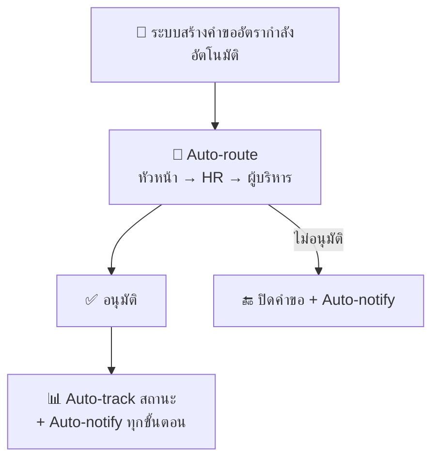
```mermaid
flowchart TD
    A["📝 ระบบสร้างคำขออัตรากำลังอัตโนมัติ"] --> B["🤖 Auto-route<br/>หัวหน้า → HR → ผู้บริหาร"]
    B --> C["✅ อนุมัติ"]
    B -->|"ไม่อนุมัติ"| X["🔚 ปิดคำขอ + Auto-notify"]
    C --> D["📊 Auto-track สถานะ<br/>+ Auto-notify ทุกขั้นตอน"]
```

**(9) เอกสารอ้างอิง / บันทึกคุณภาพ / ตัวชี้วัด** — เอกสาร: LDC-PAO-WI-001 - การขออนุมัติจัดหากำลังคน.docx · บันทึก: MANPOWER_REQUEST + Approval Log · ตัวชี้วัด: Owner-of-work ตรวจสอบได้ 100% / จำนวนคำขอที่ค้างเกินกำหนด = 0

### 2.1.3 LDC-PAO-WI-002: การคัดเลือกพนักงานจากภายนอก — สถานะ: ข้อมูลครบ ✅

**(1) วัตถุประสงค์** — กำหนดขั้นตอนคัดเลือกพนักงานจากภายนอกองค์กร (ผู้สมัครที่ไม่ใช่สมาชิก PKG) ครอบคลุมทั้ง 3 ประเทศ (FU01 THAI / RPLCG / RAFCOG) เพื่อส่งผู้สมัครที่ผ่านเข้าสู่ P2

**(2) ขอบเขต** — ผู้สมัครภายนอกทุกช่องทาง (Website / FB สรรหา / Social Media / สำนักงานจัดหางาน / ป้ายรับสมัคร / แนะนำจากสมาชิก / Walk-in / สถานศึกษา — P1 Diagram 3.2) — สมาชิกภายในใช้ LDC-PAO-WI-010 รับสมัครงานภายใน (2.1.5)

**(3) RACI ย่อ** — ผู้สมัคร: R (ยื่นใบ/ทดสอบ) · PAO/HR: A (คัดกรอง/สรุป) · BMC: C (ตัดสินใจรับ) · ผู้บริหาร: A (อนุมัติระดับสุด)

**(4) คำนิยามเฉพาะ** — แหล่งที่มาผู้สมัคร (Source tracking) · แบบทดสอบ 3 แบบ (นิยามถาวร 2026-10-01): 1) แบบทดสอบทัศนคติ (จากปรัชญา PKG ~15 ข้อ) 2) แบบทดสอบทุนองค์กรและการให้บริการลูกค้า (ดึงจาก Google Form ของ PKG) 3) แบบทดสอบแรงจูงใจ 3E3P (15 ข้อ) — ผลทั้ง 3 เป็นอินพุตให้ AI คัดกรอง (Task 4 — commit 8f9c3cb) · PDPA Consent Gate

**(5) กระบวนการเดิม (S1)**

| ลำดับ | กิจกรรม | ผู้ดำเนินการ | เอกสาร/ระบบ |
|---|---|---|---|
| 1 | รับใบสมัคร | ผู้สมัคร | ใบสมัคร (กระดาษ/แบบฟอร์ม) |
| 2 | ตรวจสอบคุณสมบัติ | HR | ตรวจสอบด้วยมือ |
| 3 | สัมภาษณ์ | กรรมการ | แบบสัมภาษณ์ 3 แบบ (สมาชิกใหม่/โอนย้าย/ฝึกงาน) |
| 4 | ทดสอบ | ผู้สมัคร | ทดสอบทักษะ (การทำด้วยมือ) |
| 5 | สรุปผล | HR | บันทึกผลด้วยมือ |

**(6) จุดที่ AI เข้ามาช่วย (S2)**

| # | จุดที่ AI ช่วย | ผลลัพธ์ |
|---|---|---|
| 1 | Auto-collect ใบสมัครจากทุกช่องทาง | รวบรวมใบสมัครทุกแหล่งเข้าศูนย์เดียว — AI Screening ให้คะแนน + เรียงลำดับผู้สมัครที่น่าจะผ่าน |
| 2 | AI validate คุณสมบัติ — อ่านเรซูเม่/ใบสมัครอัตโนมัติ ให้คะแนนตรงตามคุณสมบัติ | ลดเวลาคัดกรอง 70% — ลดอคติ |
| 3 | Auto-schedule นัดหมายสัมภาษณ์ | แจ้งเตือนผู้สมัคร + กรรมการ อัตโนมัติ |
| 4 | Auto-grade ผลทดสอบ (3 แบบนิยามถาวร 2026-10-01) | ตรวจวัดผลได้เป็นระบบ — ไม่ทำด้วยมือ |
| 5 | AI summarize + Recommendation | สรุปผล + นำเสนอผู้เหมาะสม — ผู้ไม่ผ่านแจ้งผลสุภาพตามเทมเพลตมาตรฐาน (นิยามถาวร 2026-07-14) |

**(7) กระบวนการใหม่ (S4)**

| ลำดับ | กิจกรรม | ผู้ดำเนินการ | เอกสาร/ระบบ · Web PP7 โมดูล |
|---|---|---|---|
| 1 | ผู้สมัครเข้าหน้า "ร่วมงานกับ PKG Group" → เลือก FU (THAI 29+ บริษัท / RPLCG 7 / RAFCOG 4) → ลงทะเบียน → กรอกใบสมัคร 3 ประเทศ (PDPA Consent Gate → Upload บัตรประชาชน+ทะเบียนบ้าน → OCR/AI ดึงข้อมูล Auto-fill → ผู้สมัคร Confirm) + AI Translation (TH→EN / LA→TH / KH→EN+TH) | ผู้สมัคร + ระบบ | Web PP7 — Task 1 + Task 3 (ระบบรับสมัครงาน 3 ประเทศ) |
| 2 | ทำแบบทดสอบ 3 แบบ (ทัศนคติ ~15 ข้อ / ทุนองค์กร / 3E3P 15 ข้อ) — ทำได้เพียงครั้งเดียว | ผู้สมัคร | Web PP7 — ระบบแบบทดสอบดิจิทัล (รายบุคคล) |
| 3 | AI คัดกรองAuto (Task 4 — ผลแบบทดสอบ 3 แบบ + ใบสมัคร) → คะแนน + เรียงลำดับ | ระบบ AI (มนุษย์เห็นผลก่อนตัดสิน) | Web PP7 — ระบบคัดกรอง + Audit Log |
| 4 | Auto-schedule นัดหมายสัมภาษณ์ (แจ้งเตือน 3 ฝ่าย) | ระบบ | ระบบนัดหมาย + Notification |
| 5 | HR/กรรมการสรุปผล + AI Recommendation (จากใบสมัคร) — รายการที่ผ่านส่งต่อ P2 จนการสมัครไม่ผ่านแจ้งผลสุภาพ/เก็บ Talent Pool | HR + ระบบ AI | Web PP7 (สรุปผล + แจ้งเตือน Portal/TG และฝั่งผู้สมัครเห็นสถานะตนเอง — Task 6) |

**(8) Flowchart**

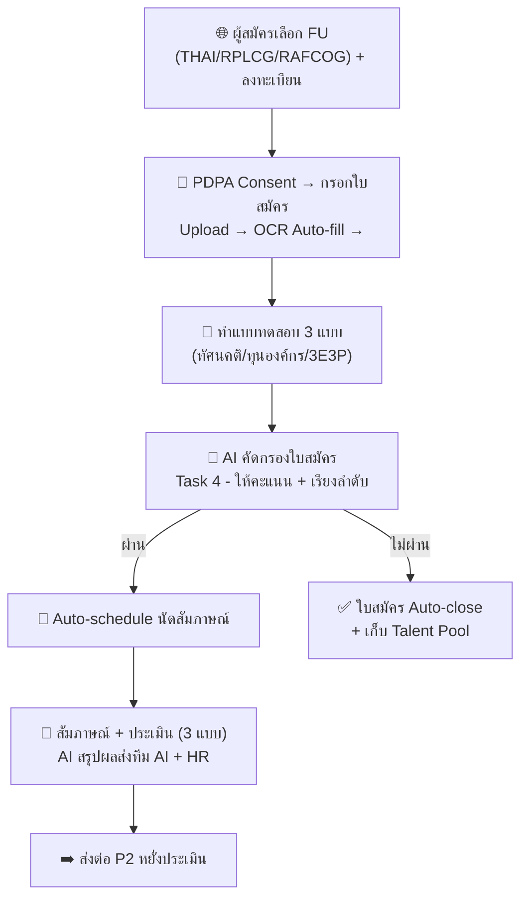
```mermaid
flowchart TD
    A["🌐 ผู้สมัครเลือก FU<br/>(THAI/RPLCG/RAFCOG) + ลงทะเบียน"] --> B["📝 PDPA Consent → กรอกใบสมัคร<br/>Upload → OCR Auto-fill →"]
    B --> D["🧪 ทำแบบทดสอบ 3 แบบ<br/>(ทัศนคติ/ทุนองค์กร/3E3P)"]
    D --> E["🤖 AI คัดกรองใบสมัคร<br/>Task 4 - ให้คะแนน + เรียงลำดับ"]
    E -->|"ผ่าน"| F["📅 Auto-schedule นัดสัมภาษณ์"]
    E -->|"ไม่ผ่าน"| X["✅ ใบสมัคร Auto-close<br/>+ เก็บ Talent Pool"]
    F --> G["👥 สัมภาษณ์ + ประเมิน (3 แบบ)<br/>AI สรุปผลส่งทีม AI + HR"]
    G --> H["➡️ ส่งต่อ P2 หยั่งประเมิน"]
```

**(9) เอกสารอ้างอิง / บันทึกคุณภาพ / ตัวชี้วัด** — เอกสาร: LDC-PAO-WI-002 - การคัดเลือกพนักงานจากภายนอก.docx · P2-แบบสัมภาษณ์-3แบบ.md · บันทึกคุณภาพ: APPLICATION / SCREENING / AI_ANALYSIS / INTERVIEW_SCHEDULE / INTERVIEW / INTERVIEW_SUMMARY / BACKGROUND_CHECK / JOB_OFFER / ONBOARDING · ตัวชี้วัด: Conversion Funnel (ผ่านแบบทดสอบ 65% → ผ่าน AI Analysis 45% → ผ่าน Screening 30% → นัดสัมภาษณ์ 25% → ผ่านสัมภาษณ์ 18% → รับเข้าทำงาน 12.4%) · Avg Time-to-Hire 18 วัน · Offer Accept Rate 82.4% · Background Check Pass 94%

### 2.1.4 LDC-PAO-PM-001: การแสวงหา ผู้สมัครงาน — สถานะ: ข้อมูลครบ ✅

**(1) วัตถุประสงค์** — กำหนดขั้นตอนแสวงหาผู้สมัครงานจากคำขออัตรากำลังคนให้เป็นระบบปิดทุกช่องทาง ประกาศครอบคลุม คัดกรองเร็ว สรุปผลเป็นข้อมูลจริง

**(2) ขอบเขต** — ตั้งแต่รับคำขออัตรากำลัง จนถึงสรุปผลการนัดหมาย/สรุปผล (6 ขั้นตอน) — ครอบคลุม 3 ประเทศ

**(3) RACI ย่อ** — BU: R (ยื่นคำขอ) · PAO: A (ประกาศ/ตรวจ/แจ้ง) · HR: A (กรอง/สรุปผล) · ผู้สมัคร: R (ยื่นใบ) / I (รับแจ้งผล)

**(4) คำนิยามเฉพาะ** — Source Channels = ช่องทางเผยแพร่ (Website / FB / Social Media / สำนักงานจัดหางาน / ป้ายรับสมัคร / แนะนำสมาชิก / Walk-in / สถานศึกษา) — ผู้สมัครจากที่จัดหางานใด (ในภาพรวม P1 Diagram 3.2)

**(5) กระบวนการเดิม (S1)**

| ลำดับ | กิจกรรม | ผู้ดำเนินการ | เอกสาร/ระบบ |
|---|---|---|---|
| 1 | รับคำขออัตรากำลัง | BU/PAO | ใบขออนุมัติ |
| 2 | ประกาศรับสมัคร | HR | ทุกช่องทาง (ทำด้วยมือ) |
| 3 | รวบรวมใบสมัคร | HR | ไฟล์รวบรวม/Excel |
| 4 | กรองใบสมัคร | HR | กรองด้วยมือ |
| 5 | นัดหมายสัมภาษณ์ | HR | นัดด้วยมือ (โทรศัพท์/Line) |
| 6 | สรุปผล | HR | บันทึกผล |

**(6) จุดที่ AI เข้ามาช่วย (S2)**

| # | จุดที่ AI ช่วย | ผลลัพธ์ |
|---|---|---|
| 1 | Auto-validate คำขอ | ข้อมูลคำขอครบก่อนประกาศ |
| 2 | Auto-post ประกาศหลายช่องทาง — โพสต์ประกาศงานหลายช่องทางอัตโนมัติ + วิเคราะห์ช่องทางที่ผู้สมัครคุณภาพสูงสุด + แท็กที่มาผู้สมัคร (source tracking) | ครอบคลุมผู้สมัครกว้างขึ้น — รู้ช่องทาง effective ที่สุด |
| 3 | Auto-collect ใบสมัครอัตโนมัติ | รวบรวมข้อมูลจากทุกช่องทางแบบเรียลไทม์ — Audit Log |
| 4 | AI Filter ใบสมัคร (กรองตามคุณสมบัติ) | ลดเวลาคัดกรอง 70% — รายการจริงมีอคติน้อย |
| 5 | Auto-schedule นัดหมายสัมภาษณ์ | แจ้งเตือนทุกฝ่าย — บันทึกสถานะเสมอ |
| 6 | AI สรุปผลและแนะนำผู้เหมาะสม | ประกาศเร็วขึ้น — ข้อมูลเป็นระบบ |

**(7) กระบวนการใหม่ (S4)**

| ลำดับ | กิจกรรม | ผู้ดำเนินการ | เอกสาร/ระบบ · Web PP7 โมดูล |
|---|---|---|---|
| 1 | ระบบรับคำขออัตรากำลังและ validate อัตโนมัติ | ระบบ AI | Web PP7 — Tab-01 Task 2 |
| 2 | Auto-post ประกาศรับสมัครทุกช่องทาง (ทำทีเดียวแผ่ทุกช่องทาง Source-Tracking) | ระบบ AI | Web PP7 — AI Auto-Post + Tracking |
| 3 | Auto-collect ใบสมัครทุกช่องทาง (รวบรวมจาก Website / FB / Walk-in) | ระบบ | Web PP7 — Form Registration 3 ประเทศ (Task 3) |
| 4 | AI กรองใบสมัครตามคุณสมบัติ (มี OCR/AI วิเคราะห์ทุกใบ) | ระบบ AI | Web PP7 — Task 4 (นำใบสมัครสเตตัสบคุณสมบัติทุกใบ) |
| 5 | Auto-schedule นัดหมายสัมภาษณ์ (จัดตารางเอง — การแจ้งเตือนไปหาผู้สมัคร) | ระบบ | Web PP7 — นัดหมาย + Line/TG |
| 6 | AI สรุปผลและแนะนำผู้เหมาะสม (Recommendation ต่อ) — ทุกตำแหน่ง (Recommendation ที่คัด "ผ่าน") | ระบบ AI + HR | Web PP7 — Dashboard Bot TG เทียบรายชื่อ — Audit Log |

**(8) Flowchart**

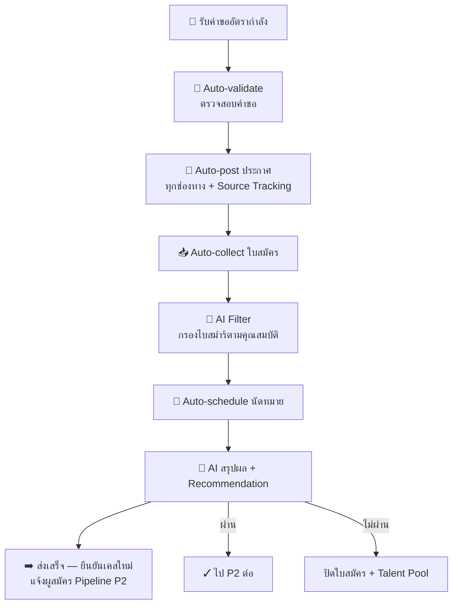
```mermaid
flowchart TD
    A["📌 รับคำขออัตรากำลัง"] --> B["🤖 Auto-validate<br/>ตรวจสอบคำขอ"]
    B --> C["📣 Auto-post ประกาศ<br/>ทุกช่องทาง + Source Tracking"]
    C --> D["📥 Auto-collect ใบสมัคร"]
    D --> E["🤖 AI Filter<br/>กรองไบสมำร้ตามคุณสมบัติ"]
    E --> F["📅 Auto-schedule นัดหมาย"]
    F --> G["🤖 AI สรุปผล + Recommendation"]
    G --> H["➡️ ส่งเสร็จ — ยืนยันเคสใหม่<br/>แจ้งผูสมัคร Pipeline P2"]
    G -->|ผ่าน| I[✓ ไป P2 ต่อ]
    G -->|ไม่ผ่าน| X[ปิดใบสมัคร + Talent Pool]
```

**(9) เอกสารอ้างอิง / บันทึกคุณภาพ / ตัวชี้วัด** — เอกสาร: LDC-PAO-PM-001 - การแสวงหา_ผู้สมัครงาน.docx · บันทึกคุณภาพ: JOB_POSTING / M_RECRUITMENT_SOURCE / APPLICATION · ตัวชี้วัด: % Effective per channel (ทุกช่องทาง) / แหล่งที่สุดสามารถ (Source Quality) / จำนวนใบสมัคร/ช่องทาง/เดือน

### 2.1.5 LDC-PAO-WI-010: รับสมัครงานภายใน — สถานะ: ข้อมูลครบ (จาก AI Diagram) ✅

**ข้อมูลต้นฉบับ:** หัวข้อระบุที่ตาราง Mapping (LDC-PAO-WI-010 — Tab-02 มีแล้ว) + P1 Diagram 3.1 (ภายใน: โอนย้าย / จัดคนให้ถูกกับงาน — Website / เวที L&G) + ขั้น 4.1 (คีย์ใบโอนย้าย → คัดเลือกใบโอนย้าย)

**(1) วัตถุประสงค์** — รับสมัครงานจากสมาชิกภายในองค์กร (โอนย้าย/จัดคนให้ถูกกับงาน) — ทาง Website / เวที L&G

**(2) ขอบเขต** — สมาชิกองค์กรสมัครงานอัตราเปล่าในหน่วยเดียวกัน/หรือหน่วยอื่น

**(3) RACI ย่อ** — สมาชิก: R (สมัคร) · หัวหน้า BU เดิม: C (ปล่อยตัว) · PAO/HR: A (คัดเลือก) · BMC BU ใหม่: A (รับเข้าพื้นที่ตนเอง)

**(4) คำนิยามเฉพาะ** — เวที L&G (Learning & Growing) ที่อาจมีประกาศรับสมัครเวทีภายใน — ใบโอนย้าย — ต่างจาก WI-004 (กรณีตรงข้าม — ขอโอนย้าย/เลื่อนตำแหน่งตัวเอง)

**(5) กระบวนการเดิม (S1 — จาก P1 Diagram 3.1/4.1)**

| ลำดับ | กิจกรรม | ผู้ดำเนินการ | เอกสาร/ระบบ |
|---|---|---|---|
| 1 | ประกาศตำแหน่งภายใน (Website / เวที L&G) | HR | ประกาศภายใน |
| 2 | คีย์ใบโอนย้าย | สมาชิก/HR | ใบโอนย้าย (ทำมือ) |
| 3 | คัดเลือกใบโอนย้าย | HR | คัดด้วยมือ |
| 4 | ผ่าน → P2 / ไม่ผ่าน → ปิดใบสมัคร | HR | บันทึกผล |

**(6) จุดที่ AI เข้ามาช่วย (S2)**

| # | จุดที่ AI ช่วย | ผลลัพธ์ |
|---|---|---|
| 1 | Auto-collect ใบโอนย้ายจาก Website + เวที L&G | ทุกการสมัครเข้าศูนย์เดียว — บันทึก ALL channals |
| 2 | AI เทียบคุณสมบัติ — ทักษะ + CC ปัจจุบัน + ทุนองค์กร (จาก P4 record ประเมิน) | เห็นความเหมาะสมรายบุคคล — ลดเวลาคัดกรอง |
| 3 | Auto-route → ไป P2 หยั่งประเมิน เหมือนผู้สมัครภายนอก (และต่างกัน) | ทุกการสมัคร — เส้นทางเดียวกันทั้งหมดทุกครั้ง |
| 4 | AI แจ้งเตือน — ตัวเอง/หัวหน้า/BU ใหม่ | ลดการพลาด/ทราบช้า |

**(7) กระบวนการใหม่ (S4)**

| ลำดับ | กิจกรรม | ผู้ดำเนินการ | เอกสาร/ระบบ · Web PP7 โมดูล |
|---|---|---|---|
| 1 | ระบบประกาศตำแหน่งภายในแบบ Biz Tabs — ทุกตำแหน่งแสดงในระบบ (ไม่มีการโพสต์บนระบบระเบียบ) | ระบบ | Web PP7 — Tab-02 แสวงหา (Tab Internal) |
| 2 | สมาชิกระบุข้อมูลตนเอง — Auto-populate ข้อมูลสมาชิก + แบบ 7F | สมาชิก | Web PP7 — Form Workflow (แบบ 7F) |
| 3 | AI คัดกรอง/ตรวจสอบคุณสมบัติ — AI Score + CC + P4 History | ระบบ AI | Web PP7 — Task 4 (AI Screening) |
| 4 | Auto-route ผู้สมัครสู่กรรมการ (BMC/PAO) — ตรวจคุณสมบัติเป็นทางการ (ส่งไป P2) | ระบบ | Web PP7 Tab-04 (จัดตารางนัด) |
| 5 | จัดกิจกรรมเวที (L&G) + นัดหมายผู้สมัคร + AI แจ้งเตือนทุกฝ่าย (ผู้สมัคร/หัวหน้าเดิม/BU ใหม่) | ระบบ + ทีม | Web PP7 — Dashboard + Notification |

**(8) Flowchart**

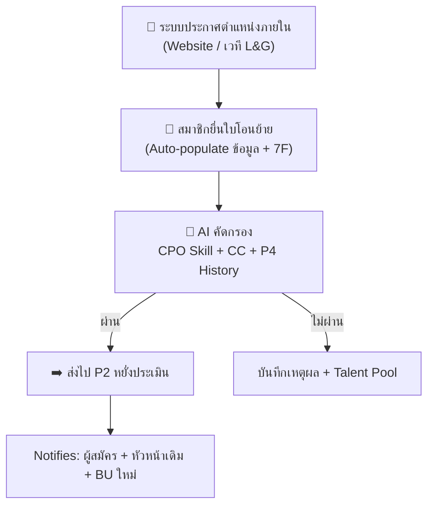
```mermaid
flowchart TD
    A["📢 ระบบประกาศตำแหน่งภายใน<br/>(Website / เวที L&G)"] --> B["📝 สมาชิกยื่นใบโอนย้าย<br/>(Auto-populate ข้อมูล + 7F)"]
    B --> C["🤖 AI คัดกรอง<br/>CPO Skill + CC + P4 History"]
    C -->|ผ่าน| D["➡️ ส่งไป P2 หยั่งประเมิน"]
    C -->|ไม่ผ่าน| X["บันทึกเหตุผล + Talent Pool"]
    D --> E["Notifies: ผู้สมัคร + หัวหน้าเดิม + BU ใหม่"]
```

**(9) เอกสารอ้างอิง / บันทึกคุณภาพ / ตัวชี้วัด** — เอกสาร: Tab 2.1.3/2.1.4 (ตารางเดียวกัน) + P1 Diagram ขั้น 3.1/4.1 · บันทึกคุณภาพ: APPLICATION (SOURCE=M_INTERNAL) · ตัวชี้วัด: เวลาขั้นสุดท้าย (time-to-availability) · % ใบสมัครที่เสร็จในเวลา (Audit Track) 100%

### 2.1.6 LDC-PAO-WI-006: การขอโควต้าแรงงานต่างด้าว — สถานะ: ข้อมูลครบ ✅

**(1) วัตถุประสงค์** — กำหนดขั้นตอนการขอโควต้าแรงงานต่างด้าว สำหรับการเตรียมเอกสาร — ต้องเป็นระบุว่า ขั้นตอนเพียงกี่ — เพื่อให้ BU และสมาชิกบริษัท ดำเนินไปได้บน HR เรียบร้อย

**(2) ขอบเขต** — ครอบคลุมขั้นตอนก่อนใช้สิทธิเข้าเงียบแหล่งเรียก — ลงในระบบของทางต่างด้าว (หน่วย ตม.) — ระบุทุกบันทึกในระบบของหลายแหล่ง

**(3) RACI ย่อ** — BU: R (ยื่น) · PAO: A (ดำเนินการ + อนุมัติขั้นตอนระบบ) · ตม. (สิทธิทายหลังบันขั้น 4) · AI: R (Auto-prepare / Auto-submit / Auto-track)

**(4) คำนิยามเฉพาะ** — คำขอ (Application) = เตรียมเอกสาร (ระเบียบ กสพ. / ระเบียบ 3 หน้า/หลังค่าใช้จ่าย) — การนำไปเรียกร้อง 3 แหล่ง โดยจะใช้หลายสิทธิเหมาะสมในระบบ

**(5) กระบวนการเดิม (S1)**

| ลำดับ | กิจกรรม | ผู้ดำเนินการ | เอกสาร/ระบบ |
|---|---|---|---|
| 1 | เตรียมเอกสาร | PAO | เอกสารเดิม — แบบฟอร์มด้วยมือ |
| 2 | ยื่นคำขอ | PAO | ระบบ ตม. (ทำมือ) |
| 3 | ติดตามผล | PAO | โทรตาม/ทำมือ |
| 4 | รับผล | PAO | เอกสารแสดงผล |

**(6) จุดที่ AI เข้ามาช่วย (S2)**

| # | จุดที่ AI ช่วย | ผลลัพธ์ |
|---|---|---|
| 1 | Auto-prepare เอกสารตามข้อกำหนด (ระรวรวบรวมจาก BU + ตรวจสอบ เช็คบครบก่อนยื่น) | ไม่ลืมเอกสารเตียบขั้นตอน |
| 2 | Auto-submit คำขอออนไลน์ | ส่งคำขอจากระบบ — บันทึกทุกรายการ |
| 3 | Auto-track สถานะ (Auto-track ทุกแหล่ง: เสร็จ/ไม่เสร็จ/ผิดพลาด) | ทุกแหล่งเห็นสถานะเดียวกัน — Audit Log ตามระบบ |
| 4 | Auto-notify ผลผ่าน TG/ระบบ | แจ้งทุกฝ่ายที่เกี่ยวข้อง — เห็นได้ทันที |

**(7) กระบวนการใหม่ (S4)**

| ลำดับ | กิจกรรม | ผู้ดำเนินการ | เอกสาร/ระบบ · Web PP7 โมดูล |
|---|---|---|---|
| 1 | BU ระบุความต้องการ + เอกสารแนบผ่านระบบ Web PP7 + AI รวบรวม + เช็คครบ | BU + ระบบ AI | Web PP7 — Tab-02 (แสวงหา — Tracking ต่างด้าว) |
| 2 | Auto-submit คำขอออนไลน์ (ไประบบของทาง ตม.) | ระบบ AI | Web PP7 — เชื่อมระบบรัฐ |
| 3 | Auto-track สถานะคำขอ (ด้วยรหัส tracking ทุกสถานะ — เปิดเห็นตลอด) | ระบบ AI | Web PP7 — Audit Log Dashboard ต่างด้าว |
| 4 | Auto-notify ผล (สำเร็จ/ไม่ผ่าน) — เตือนทั้ง TG / Line / Dashboard | ระบบ AI | Web PP7 + TG Notification |

**(8) Flowchart**

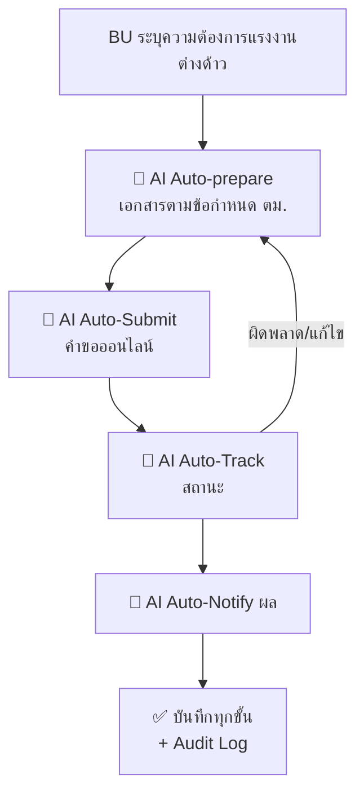
```mermaid
flowchart TD
    A["BU ระบุความต้องการแรงงานต่างด้าว"] --> B["🤖 AI Auto-prepare<br/>เอกสารตามข้อกำหนด ตม."]
    B --> C["🤖 AI Auto-Submit<br/>คำขอออนไลน์"]
    C --> D["🤖 AI Auto-Track<br/>สถานะ"]
    D --> E["🤖 AI Auto-Notify ผล"]
    D -->|"ผิดพลาด/แก้ไข"| B
    E --> F[✅ บันทึกทุกขั้น<br/>+ Audit Log]
```

**(9) เอกสารอ้างอิง / บันทึกคุณภาพ / ตัวชี้วัด** — เอกสาร: LDC-PAO-WI-006.docx · บันทึกคุณภาพ: TRACKING_TAB_ต่างด้าว + เอกสารแสดงผล · ตัวชี้วัด: จำนวนคำขอ/เดือน · % คำขอเสร็จตรงกำหนด · % ข้อมูล track ได้ 100% (Audit Log)

### 2.1.7 LDC-PAO-PM-002: การนำเข้าและขึ้นทะเบียนแรงงานต่างด้าว — สถานะ: ข้อมูลครบ ✅

**(1) วัตถุประสงค์** — กำหนดขั้นตอนนำเข้าและขึ้นทะเบียนแรงงานต่างด้าว (รับเอกสารจากนายหน้าจนถึงส่ง ตม.) — เอกสารไม่หาย ทุกข้อมูลเข้าระบบ

**(2) ขอบเขต** — รับเอกสารจากนายหน้า → ตรวจสอบ → นำเข้าระบบ → ส่ง ตม. → รับผลงาน (5 ขั้นตอน) — ครอบคลุมทุกแหล่ง สมาชิก/บริษัทใน 3 ลำดับ

**(3) RACI ย่อ** — นายหน้า: R (ส่งเอกสาร) · PAO: A (ตรวจ + นำเข้า) · ตม.: C (รับข้อมูล) · AI: R (Auto-validate + Auto-import + Auto-track)

**(4) คำนิยามเฉพาะ** — นายหน้า (บริษัทที่สรรหาเอกสาร) — แบบขึ้นทะเบียน ตม. (แบบที่เอกสารไม่แสดง ระบุในเอกสารให้ทีมตรวจสอบทุกรายการ)

**(5) กระบวนการเดิม (S1)**

| ลำดับ | กิจกรรม | ผู้ดำเนินการ | เอกสาร/ระบบ |
|---|---|---|---|
| 1 | รับเอกสารจากนายหน้า | ทีม PAO | เอกสาร (ชุด) |
| 2 | ตรวจสอบเอกสาร | ทีม PAO | เเยกทำมือ |
| 3 | นำเข้าระบบ | ทีม PAO | บันทึกทำมือ |
| 4 | ส่ง ตม. | ทีม PAO | ส่งเอกสาร (ทำมือ) |
| 5 | รับผลงาน | ทีม PAO | เอกสารแสดงผล |

**(6) จุดที่ AI เข้ามาช่วย (S2)**

| # | จุดที่ AI ช่วย | ผลลัพธ์ |
|---|---|---|
| 1 | Auto-validate เอกสารครบถ้วน (เตียบ field ทุกหลักเกณฑ์) | ทุกเอกสารถึงหมด — ลด wait สมาชิก |
| 2 | Auto-import ข้อมูลเข้าระบบ (เตรียมทำครั้งเดียว — เพิ่มระบุที่ระบุ — ทำครบทุกแหล่ง) | ไม่คีย์ซ้ำ — ลด Word/Excel ซ้ำ |
| 3 | Auto-track สถานะการดำเนินงาน | ทุกเคสมีสถานะเสมอ — เรียกตามระบบ |
| 4 | Auto-notify ทุกขั้นตอน | ทุกแหล่งสรุปดูข้อมูลได้ — เรียลไทม์ |

**(7) กระบวนการใหม่ (S4)**

| ลำดับ | กิจกรรม | ผู้ดำเนินการ | เอกสาร/ระบบ · Web PP7 โมดูล |
|---|---|---|---|
| 1 | นายหน้า/BU ส่งเอกสารผ่านหน้าระบบ (Upload / Auto-prepare by AI) | นายหน้า/BU | Web PP7 — Upload Form ต่างด้าว |
| 2 | Auto-validate เอกสารครบถ้วน | ระบบ AI | Web PP7 — Feedback แจ้งทันที |
| 3 | Auto-import ข้อมูลเข้าระบบ (บันทึกสถานะ + All rows — Bulk Database) | ระบบ AI | Web PP7 — ตารายะบุ (ทุกที่ที่นำเข้า) |
| 4 | Auto-track สถานะ (เช็คทันтакันทุกขั้นตอน) | ระบบ AI | Web PP7 — Audit Log |
| 5 | Auto-notify ทุกขั้นตอน (บอกรายการที่ได้ทุกช่อง — แจ้งเตือนรายการที่เหลือ) | ระชอบ AI | Web PP7 + TG Notification |

**(8) Flowchart**

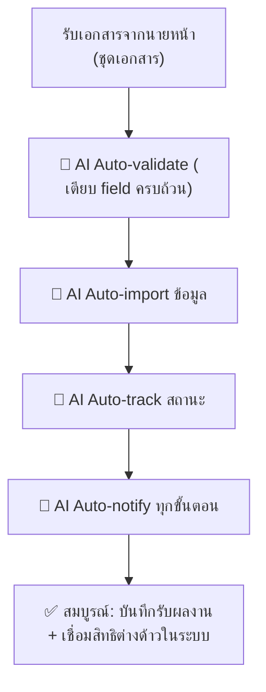
```mermaid
flowchart TD
    A["รับเอกสารจากนายหน้า<br/>(ชุดเอกสาร)"] --> B["🤖 AI Auto-validate (<br/>เตียบ field ครบถ้วน)"]
    B --> C["🤖 AI Auto-import ข้อมูล"]
    C --> D["🤖 AI Auto-track สถานะ"]
    D --> E["🤖 AI Auto-notify ทุกขั้นตอน"]
    E --> F["✅ สมบูรณ์: บันทึกรับผลงาน<br/>+ เชื่อมสิทธิต่างด้าวในระบบ"]
```

**(9) เอกสารอ้างอิง / บันทึกคุณภาพ / ตัวชี้วัด** — เอกสาร: LDC-PAO-PM-002.docx · บันทึก: ตาราง tracking ต่างด้าว + เอกสารต่างด้าวในระบบ · ตัวชี้วัด: เคสที่เอกสารครบ 100% · เคสที่เชื่อมข้อของ เข้าระบบทุกนิสารบันทึก 100%

### 2.1.8 LDC-PAO-WI-007: การรับแรงงานต่างด้าวที่ ตม. — ⏳

> ⏳ **อยู่ระหว่างรอข้อมูลผู้ปฏิบัติงาน — โครง ISO พร้อมแล้ว**
> ไฟล์ต้นฉบับ: LDC-PAO-WI-007 - การรับแรงงานต่างด้าวที่ ตม..docx — เอกสารในต้นฉบับทุกส่วน (กระบวนการเดิม / จุดที่ AI ช่วย / ข้อมูลผู้ปฏิบัติงาน / กระบวนการใหม่) เป็น "(กำลังดำเนินการ)" — เมื่อได้ข้อมูลครบจะอัปเดตเอกสาร (Web PP7 Tab ต่างด้าว: 🔎 Tab-02 มีแล้วในระบบ)

**(1) วัตถุประสงค์** — ⏳ อยู่ระหว่างรอข้อมูลผู้ปฏิบัติงาน — โครง ISO พร้อมแล้ว
**(2) ขอบเขต** — ⏳ อยู่ระหว่างรอข้อมูลผู้ปฏิบัติงาน — โครง ISO พร้อมแล้ว
**(3) RACI** — PAO (ผู้ดำเนินการหลัก — จะระบุบทบาทเท่ากันเมื่อได้ข้อมูล — เขียนในแหล่งที่จัดเตรียม พร้อมเฟสที่ 4.1 ทั่วทุกที่)
**(4) คำนิยามเฉพาะ** — ⏳ อยู่ระหว่างรอข้อมูลผู้ปฏิบัติงาน — โครง ISO พร้อมแล้ว
**(5) กระบวนการเดิม (S1)** — ⏳ อยู่ระหว่างรอข้อมูลผู้ปฏิบัติงาน — โครง ISO พร้อมแล้ว
**(6) จุดที่ AI เข้ามาช่วย (S2)** — ⏳ รอข้อมูล — แนวทางที่เตรียมไว้คือ Auto-track / Auto-validate / Auto-notify (เฉพาะเท่าที่จำเป็นแบบระบุในใบอนุมัติ/WI-006 ขั้น 4)
**(7) กระบวนการใหม่ (S4)** — ⏳ อยู่ระหว่างรอข้อมูลผู้ปฏิบัติงาน — โครง ISO พร้อมแล้ว — ตารางลำดับ/กิจกรรม/ผู้ดำเนินการ/เอกสาร (Web PP7 โมดูล) จะอัปเดตเมื่อได้ข้อมูล
**(8) Flowchart** — ⏳ รอข้อมูล — จะสร้างเทมเพลต Mermaid ว่างไว้ (เตรียมหัวข้อเสร็จยังไม่เขียน) เมื่อข้อมูลผู้ปฏิบัติงานครบ

**(9) เอกสารอ้างอิง / บันทึกคุณภาพ / ตัวชี้วัด** — เอกสาร: LDC-PAO-WI-007 - การรับแรงงานต่างด้าวที่ ตม..docx [สถานะ: "(กำลังดำเนินการ)"] · Web PP7 Tab: 🔎 Tab-02 · บันทึกคุณภาพ + ตัวชี้วัด: จะกำหนดร่วมกับผู้ปฏิบัติงานภายหลัง (ตามนิยามบันทึกทุกเคสเดียว)
---

## 2.2 กลุ่ม P2 — หยั่งประเมิน (Assess / People Assessment)

**นิยามถาวร P2:** การหยั่งประเมินสมาชิกว่ามี CC ตรงกับเราหรือไม่ — **"ประเมินก่อนรบ"**
**เจ้าของกระบวนการ:** PAO + กรรมการสัมภาษณ์ (BMC)
**Web PP7:** Tab-03 หยั่งประเมิน

### 2.2.1 P2-ASM-001: หยั่งประเมิน CC — สถานะ: ข้อมูลครบ ✅

**(1) วัตถุประสงค์** — หยั่งประเมินผู้สมัคร/สมาชิกที่ผ่าน P1 ว่ามี Core Competency (CC1–CC7) ตรงกับองค์กรหรือไม่ (**"ประเมินก่อนรบ"**) ด้วยเกณฑ์ที่วัดได้ (TCC คะแนนเต็ม 50 ผ่าน ≥ 65%) ให้ผลเป็นข้อมูลจริง ลดการประเมินด้วยความรู้สึก/อารมณ์

**(2) ขอบเขต** — ขั้นตอนที่ 8 ของ LDC-PAO-WI-002 ประกอบด้วย 4 กิจกรรมหลัก: 1) **สัมภาษณ์** (แบบ 3 แบบ) 2) **ทดสอบทักษะ** 3) **CMC** (ความเหมาะสมเชิงวัฒนธรรม) 4) **ทดสอบทัศนคติ** (ทุนองค์กร) — ครอบคลุมผู้สมัครภายนอก สมาชิกภายใน (โอนย้าย/เลื่อนตำแหน่ง) และนักศึกษาฝึกงาน (เฉพาะ THAI)

**(3) RACI ย่อ** — กรรมการสัมภาษณ์: R (ประเมิน/ให้คะแนน) · PAO: A (จัดแบบประเมิน/สรุปผล) · ผู้สมัคร: R (ทำแบบทดสอบ + สัมภาษณ์) · AI ระบบ: R (สร้างใบประเมิน/คำนวณ/สรุป — มนุษย์ยืนยันผล)

**(4) คำนิยามเฉพาะ**

- **TCC (เกณฑ์คะแนนสัมภาษณ์):** คะแนนเต็ม 50 · ผ่าน ≥ 65%
  - แบบที่ 1 (สมาชิกใหม่) 10 หัวข้อ หัวละ 5 คะแนน: ทัศนคติเชิงบวก / ปรับตัว / ยืดหยุ่น / ทำงานเป็นทีม / ใจรักการเรียนรู้ / ความรับผิดชอบ / คิดริเริ่ม / กระตือรือร้น / ซื่อสัตย์ / ประยุกต์ใช้เทคโนโลยี
  - แบบที่ 2 (โอนย้าย/เลื่อนตำแหน่ง) 10 หัวข้อเชิงผู้รับใช้/องค์กร: พัฒนาภาวะผู้รับใช้ / สร้างวัฒนธรรมองค์กร / การรู้สึกตัว / สร้างบรรยากาศ / ทำงานเป็นทีม / สร้างความสัมพันธ์ / การรับใช้ทุกเรื่องราว / การเรียนรู้ / สอดรับกลมกลืน / ประยุกต์ใช้เทคโนโลยี
  - แบบที่ 3 (นักศึกษาฝึกงาน) 10 หัวข้อ: บุคลิกลักษณะ / เตรียมตัว / ความรู้ตามสาขา / ทัศนคติการทำงาน / ตอบตรงประเด็น / ประวัติส่วนตัว / สุขภาพ / ความสุขุม / รักษาวินัย / ทัศนคติงานบริการ
- **แบบทดสอบ 3 แบบ (นิยามถาวร 2026-10-01):** 1) ทัศนคติ (จากปรัชญา PKG ~15 ข้อ) 2) ทุนองค์กรและการให้บริการลูกค้า (ดึงจาก Google Form ของ PKG) 3) แรงจูงใจ 3E3P (15 ข้อ) → ผลทั้ง 3 เป็นอินพุตให้ AI คัดกรอง (Task 4 — commit 8f9c3cb)
- **แบบทดสอบ 4 ชุด (สถาปัตยกรรม p1-p3):** ทัศนคติ 30 ข้อ/30 นาที · ทักษะ 40 ข้อ/60 นาที (ปรับตามตำแหน่ง) · CC 7 ด้าน 70 ข้อ (10 ข้อ/CC)/45 นาที · 3E3P 30 ข้อ/20 นาที
- **7 EVP (จัดลำดับความสำคัญในแบบสัมภาษณ์):** TRUST / RESPECT / PRIDE / FREEDOM / FUN / LEARNING & GROWTH / SUSTAINABLE & SATISFACTORY PAY
- **AI Analysis (Task 5 — AI ใน P2):** Overall Score = ทัศนคติ 20% + ทักษะ 30% + CC 30% + 3E3P 20% → CC Match, Skill Gap, Recommendation ("ผ่าน / พิจารณา / ไม่ผ่าน"), จุดแข็ง, จุดที่ต้องพิจารณา, คำถามสัมภาษณ์ที่แนะนำ

**(5) กระบวนการเดิม (S1)**

| ลำดับ | กิจกรรม | ผู้ดำเนินการ | เอกสาร/ระบบ |
|---|---|---|---|
| 1 | สร้างใบประเมิน | HR | ใบประเมิน (ทำมือ) |
| 2 | นัดหมายผู้ประเมิน | HR | ตารางใน Sheet |
| 3 | ประเมิน TCC 5 ด้าน | กรรมการ | แบบสัมภาษณ์ 3 แบบ (กระดาษ) |
| 4 | บันทึกผล | HR | Google Sheets (คีย์มือ) |
| 5 | สรุปผล | HR | รายงานสรุป (ทำมือ) |

**(6) จุดที่ AI เข้ามาช่วย (S2)**

| # | จุดที่ AI ช่วย | ผลลัพธ์ |
|---|---|---|
| 1 | Auto-generate ใบประเมินตามประเภท (ภายนอก/ภายใน) + แนะนำชุดคำถามตาม CC (CC1–CC7) | ลดเวลาออกแบบใบประเมินทุกรอบ — ประเมินตรง CC ลดอคติ |
| 2 | แจ้งนัดหมายผู้ประเมินผ่าน Telegram / Email อัตโนมัติ | แจ้งเตือนทุกฝ่าย ไม่ตกหล่น |
| 3 | ผู้ประเมินกรอกแบบฟอร์มดิจิทัล (3 แบบ) — AI วิเคราะห์คำตอบเรียลไทม์ | ข้อมูลเข้าระบบทันที ไม่คีย์ซ้ำ |
| 4 | AI คำนวณคะแนน CC ทั้ง 5 ด้าน (ต่อยอด CC6–CC7) อัตโนมัติ | ไม่หลุดคะแนน / ไม่คำนวณผิด |
| 5 | AI สรุปผล + Recommendation ทันที | ผลเสนอตัดสินใจ ("ผ่าน/พิจารณา/ไม่ผ่าน") รวดเร็ว — ไม่ทำรายงานด้วยมือ |
| 6 | Dashboard แสดงภาพรวม Core Competency | เห็นภาพรวมทั้งองค์กร — เทียบข้อมูลได้ทุกช่วง |

**(7) กระบวนการใหม่ (S4)**

| ลำดับ | กิจกรรม | ผู้ดำเนินการ | เอกสาร/ระบบ · Web PP7 โมดูล |
|---|---|---|---|
| 1 | ระบบสร้างใบประเมินอัตโนมัติตามประเภทสมาชิก (ภายนอก / ภายใน) — Form Routing: ภายนอก→แบบ 1 / สมาชิกภายใน→แบบ 2 / นักศึกษาฝึกงาน→แบบ 3 | ระบบ | Web PP7 — แบบสัมภาษณ์ดิจิทัล 3 แบบ (ส่วน A–H ตามแบบที่กำหนด) |
| 2 | แจ้งนัดหมายผู้ประเมินผ่าน Telegram/Email อัตโนมัติ | ระบบ | ระบบ Notification |
| 3 | ผู้สมัครทำแบบทดสอบ 4 ชุด + Auto-grade (ทัศนคติ 30 / ทักษะ 40 / CC 7 ด้าน 70 / 3E3P 30 ข้อ) — Timer + Auto-submit เมื่อหมดเวลา | ผู้สมัคร + ระบบ | Web PP7 — ระบบแบบทดสอบออนไลน์ (สถานะ: P1 → P2) |
| 4 | ผู้ประเมินกรอกแบบฟอร์มสัมภาษณ์ (TCC 10 หัวข้อ × 5 + 7 EVP + ข้อมูลตำแหน่ง + ค่าตอบแทน + พี่เลี้ยง 2 คน + ผู้อนุมัติ/ผู้ประเมินรายวัน) | กรรมการ | Web PP7 — Form สัมภาษณ์ (แบบที่ 1/2/3) |
| 5 | AI คำนวณ Overall Score + CC Match + Skill Gap + Recommendation ("ผ่าน/พิจารณา/ไม่ผ่าน") พร้อมจุดแข็ง/จุดที่พิจารณา + คำถามสัมภาษณ์ที่แนะนำ | ระบบ AI | Web PP7 — AI Analysis (P2_AIAnalysis) — Task 5 |
| 6 | AI สรุปผล + Recommendation ทันที → สรุปรายงานรายบุคคล + ส่งเตือน Telegram | ระบบ AI | Web PP7 — Dashboard ผลการสัมภาษณ์ |
| 7 | Dashboard ภาพรวม CC (Funnel Chart) — ส่งต่อ P3 (ผ่าน) / Auto-close (ไม่ผ่าน) | ระบบ + HR | Web PP7 — Dashboard + HR Portal (Tab-03) |

**(8) Flowchart**

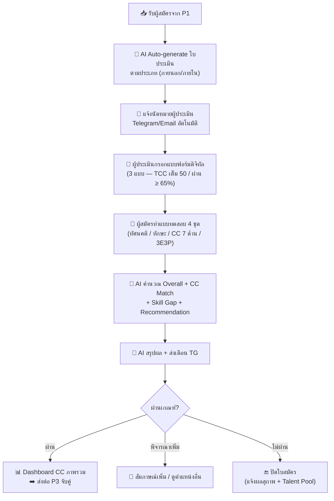
```mermaid
flowchart TD
    A["📥 รับผู้สมัครจาก P1"] --> B["🤖 AI Auto-generate ใบประเมิน<br/>ตามประเภท (ภายนอก/ภายใน)"]
    B --> C["📅 แจ้งนัดหมายผู้ประเมิน<br/>Telegram/Email อัตโนมัติ"]
    C --> D["👥 ผู้ประเมินกรอกแบบฟอร์มดิจิทัล<br/>(3 แบบ — TCC เต็ม 50 / ผ่าน ≥ 65%)"]
    D --> E["🧪 ผู้สมัครทำแบบทดสอบ 4 ชุด<br/>(ทัศนคติ / ทักษะ / CC 7 ด้าน / 3E3P)"]
    E --> F["🤖 AI คำนวณ Overall + CC Match<br/>+ Skill Gap + Recommendation"]
    F --> G["🤖 AI สรุปผล + ส่งเตือน TG"]
    G --> H{"ผ่านเกณฑ์?"}
    H -->|"ผ่าน"| I["📊 Dashboard CC ภาพรวม<br/>➡️ ส่งต่อ P3 จับคู่"]
    H -->|"พิจารณาเพิ่ม"| J["🔄 สัมภาษณ์เพิ่ม / ดูตำแหน่งอื่น"]
    H -->|"ไม่ผ่าน"| X["🔚 ปิดใบสมัคร<br/>(แจ้งผลสุภาพ + Talent Pool)"]
```

**(9) เอกสารอ้างอิง / บันทึกคุณภาพ / ตัวชี้วัด**
- เอกสาร: P2-ASM-001: หยั่งประเมิน_CC.docx · P2-แบบสัมภาษณ์-3แบบ.md · P2-หยั่งประเมิน-กระบวนการใหม่.md
- บันทึกคุณภาพ (Record): P2_Assessments · P2_AIAnalysis · P2_Screening · P2_InterviewSchedule · P2_Interviews · P2_InterviewSummary
- ตัวชี้วัด (KPI): Overall ≥ 70 / CC Match ≥ 75 / Skill Gap ≤ 3 (เกณฑ์กำหนดโดย HR) · Conversion Rate 12.4% (เป้าหมาย) · ลดเวลาประเมิน ≥ 50% · ออกแบบให้การประเมินมีเกณฑ์ชัดเจน วัดผลได้ ลดอคติจากความรู้สึก (แผน 2569 — "เรียนแบบ ไม่ใช่เลียนแบบ")
---

## 2.3 กลุ่ม P3 — จับคู่คนกับงาน (Match / Position Matching)

**นิยามถาวร P3:** การจับคู่คนกับงาน โดยประเมินว่าผู้ที่ผ่าน P2 แล้ว เหมาะกับงานนี้หรือไม่ — **"ประเมินก่อนทำงาน"**
**เจ้าของกระบวนการ:** PAO + BMC
**Web PP7:** Tab-04 จับคู่ (Tab-03 จับคู่ ตาม 13-Tab summary / Tab-05 ตามชีตจริง — ดูบท 3)

### 2.3.1 P3-MAT-001: จับคู่คนกับงาน — สถานะ: ข้อมูลครบ ✅

**(1) วัตถุประสงค์** — จับคู่คนที่ผ่าน P2 ให้ตรงตำแหน่งงานด้วย AI Matching Engine (ทักษะ 50% + CC 30% + เป้าหมาย 20%) — ทั้งผู้สมัครใหม่และการโอนย้ายภายใน — ให้คู่คน-งานแม่นยำตามข้อมูลจริง ไม่ใช่ดุลยพินิจล้วน

**(2) ขอบเขต** — จับคู่ผู้สมัครหลัง P2 ผ่าน → Match Score → ข้อเสนองาน (Job Offer) → ตรวจสอบประวัติ (Background Check) → นัดเริ่มงาน (Onboarding) — ไม่รวมการประเมินหลังเริ่มทำงาน (เข้า P4)

**(3) RACI ย่อ** — AI Matching Engine: R (คำนวณ + เรียงลำดับ) · PAO/HR: A (สรุป + เสนอ Offer) · BU/BMC: A (อนุมัติรับ) · ผู้สมัคร: R (ตอบรับ/ปฏิเสธ) · PAD: C (เตรียมพี่เลี้ยง)

**(4) คำนิยามเฉพาะ** — **AI Matching Engine (50/30/20):** ทักษะ 50% + CC 30% + เป้าหมาย 20% — เทียบคู่กับสมรรถนะตำแหน่ง · แสดง % เหมาะสมรายตำแหน่ง · **LIA** (Level of Interaction & Authority) = ระดับการติดต่อสื่อสารและอำนาจตัดสินใจ — เป็นตัวเช็คความเข้ากันใน P3_Matching.lia_compatibility (ระบบ p1-p3)

**(5) กระบวนการเดิม (S1)**

| ลำดับ | กิจกรรม | ผู้ดำเนินการ | เอกสาร/ระบบ |
|---|---|---|---|
| 1 | ตรวจสอบคุณสมบัติ | HR | ตรวจด้วยมือ |
| 2 | สัมภาษณ์ | กรรมการ | แบบสัมภาษณ์ |
| 3 | ตัดสินใจรับ/ปฏิเสธ | BU/BMC | บันทึกด้วยมือ |
| 4 | บันทึกข้อมูล | HR | เอกสารทะเบียน |

**(6) จุดที่ AI เข้ามาช่วย (S2)**

| # | จุดที่ AI ช่วย | ผลลัพธ์ |
|---|---|---|
| 1 | AI Score matching (คุณสมบัติ vs งาน) — Matching Engine 50/30/20 | คู่คน-งานแม่นยำขึ้น — ตัดสินตามข้อมูลไม่ใช่ความรู้สึก |
| 2 | Auto-generate ข้อเสนอ (Offer) | ลดการเขียนเอกสารเสนอด้วยมือ — ข้อมูลค่าตอบแทนถูกต้องจากโครงสร้างที่อนุมัติ |
| 3 | Auto-route ไป P3 Onboarding หลังตอบรับ | ลดการคีย์ซ้ำ — เชื่อมพี่เลี้ยง/ระบบทันที |
| 4 | AI แนะนำการส่งต่อ — หา BU/ตำแหน่งที่คะแนนสูงสุด + สร้างใบส่งต่อ + ตามสถานะสัมภาษณ์ BU ใหม่ | ผู้สมัครไม่หลุดจากระบบ |
| 5 | AI วิเคราะห์คนไม่ผ่าน — เหตุผลเชิงหลักเกณฑ์ + Talent Pool อนาคต | ฐานข้อมูลสรรหาในองค์กร |

**(7) กระบวนการใหม่ (S4)**

| ลำดับ | กิจกรรม | ผู้ดำเนินการ | เอกสาร/ระบบ · Web PP7 โมดูล |
|---|---|---|---|
| 1 | AI จับคู่คุณสมบัติกับตำแหน่งงาน (Matching Score) | ระบบ AI | Web PP7 — Matching Engine (Tab-04) |
| 2 | ตรวจสอบประวัติ (Background Check — การศึกษา / การทำงาน / Reference / PDPA Consent) | HR | Web PP7 — Background Check ทุกเคส |
| 3 | ระบบสร้างข้อเสนองาน (Job Offer) — ตำแหน่ง + ค่าตอบแทน (จากโครงสร้างเงินเดือน APPROVED) + วันเริ่มงาน | ระบบ | Web PP7 — JOB_OFFER |
| 4 | ผู้สมัครตอบรับ/ปฏิเสธออนไลน์ (Portal — Task 6) | ผู้สมัคร | Web PP7 — Portal + สถานะตัวเอง |
| 5 | AI Route ไป Onboarding (เชื่อม LDC-PAO-WI-011 + ระบบพี่เลี้ยง 2.7.1) | ระบบ AI | Web PP7 — ONBOARDING + Auto-notify |
| 6 | Dashboard ติดตามสถานะจับคู่ (Funnel + Audit Log) | ทุกบทบาท | Web PP7 — Dashboard |

**(8) Flowchart**

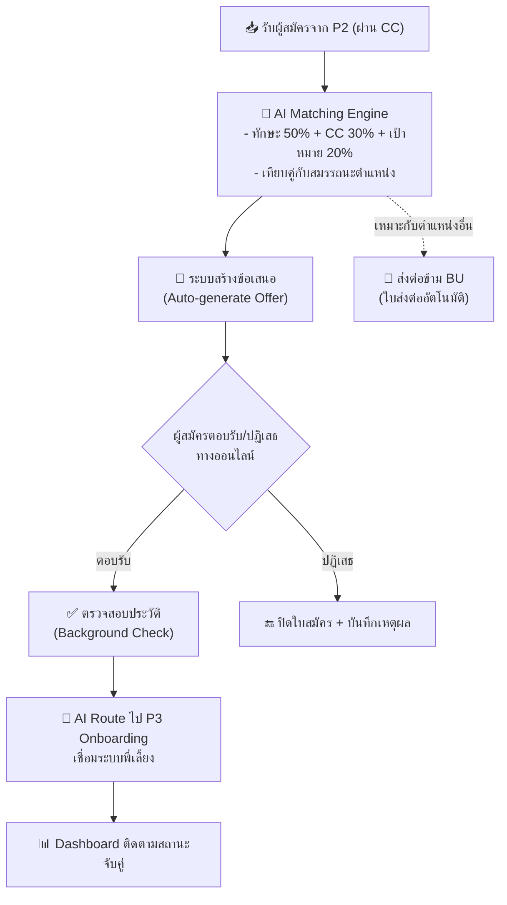
```mermaid
flowchart TD
    A["📥 รับผู้สมัครจาก P2 (ผ่าน CC)"] --> B["🤖 AI Matching Engine<br/>- ทักษะ 50% + CC 30% + เป้าหมาย 20%<br/>- เทียบคู่กับสมรรถนะตำแหน่ง"]
    B --> C["🤖 ระบบสร้างข้อเสนอ<br/>(Auto-generate Offer)"]
    C --> D{"ผู้สมัครตอบรับ/ปฏิเสธ<br/>ทางออนไลน์"}
    D -->|"ตอบรับ"| E["✅ ตรวจสอบประวัติ<br/>(Background Check)"]
    E --> F["🤖 AI Route ไป P3 Onboarding<br/>เชื่อมระบบพี่เลี้ยง"]
    F --> G["📊 Dashboard ติดตามสถานะจับคู่"]
    D -->|"ปฏิเสธ"| X["🔚 ปิดใบสมัคร + บันทึกเหตุผล"]
    B -.->|"เหมาะกับตำแหน่งอื่น"| Y["🔄 ส่งต่อข้าม BU<br/>(ใบส่งต่ออัตโนมัติ)"]
```

**(9) เอกสารอ้างอิง / บันทึกคุณภาพ / ตัวชี้วัด** — เอกสาร: P3-MAT-001: จับคู่คนกับงาน.docx · p1-p3-process-summary.md · บันทึกคุณภาพ: P3_Matching · P3_JobOffer · P3_BackgroundCheck · P3_Onboarding · ตัวชี้วัด: Match Score เฉลี่ยราย BU · Offer Accept Rate 82.4% · % เคสส่งต่อ BU อื่นได้ (ไม่หลุด) · Background Check Pass 94%

### 2.3.2 LDC-PAO-WI-003: การสรุปผลและประกาศผลการคัดเลือก — สถานะ: ข้อมูลครบ ✅

**(1) วัตถุประสงค์** — สรุปและประกาศผลการคัดเลือกอย่างถูกต้อง ทั้งผู้ผ่าน (เชื่อมเข้า Onboarding) และผู้ไม่ผ่าน (แจ้งสุภาพ + เก็บ Talent Pool)

**(2) ขอบเขต** — รวบรวมผล → เสนอผู้บริหาร → ประกาศผล → แจ้งผู้สมัคร → จัดทำเอกสาร (5 ขั้นตอน)

**(3) RACI ย่อ** — HR/PAO: R (รวบรวม/แจ้งผล) · ผู้บริหาร: A (อนุมัติ) · ผู้สมัคร: I (รับแจ้งผล)

**(4) คำนิยามเฉพาะ** — Aggregate = รวบรวมผลคัดเลือกทุกแหล่ง · **เทมเพลตแจ้งไม่ผ่าน (นิยามถาวร 2026-07-14):** สุภาพอบอุ่น / ไม่ใช้ "ด้วยความเคารพ" / ใช้ "คุณสมบัติของท่านยังไม่ตรงกับตำแหน่งที่เปิดรับในขณะนี้" / เก็บประวัติไว้พิจารณา / ปิดท้าย "ทีมงาน HR - PKG" / **ห้ามใช้ศัพท์ภายใน (P1, P2, CC)** ในข้อความถึงผู้สมัครภายนอก

**(5) กระบวนการเดิม (S1)**

| ลำดับ | กิจกรรม | ผู้ดำเนินการ | เอกสาร/ระบบ |
|---|---|---|---|
| 1 | รวบรวมผล | HR | ทำมือ |
| 2 | เสนอผู้บริหาร | HR | เอกสารเสนอ |
| 3 | ประกาศผล | HR | ประกาศ (ทำมือ) |
| 4 | แจ้งผู้สมัคร | HR | โทรศัพท์ / LINE (ทำมือ) |
| 5 | จัดทำเอกสาร | HR | เอกสารประกาศ (กระดาษ) |

**(6) จุดที่ AI เข้ามาช่วย (S2)**

| # | จุดที่ AI ช่วย | ผลลัพธ์ |
|---|---|---|
| 1 | Auto-aggregate ผลการคัดเลือก (ทดสอบ + สัมภาษณ์ + Background Check) | สรุปเร็ว — ข้อมูลครบทุกเคส |
| 2 | Auto-route เสนอผู้บริหาร | ตัดสินใจบนข้อมูลเต็ม |
| 3 | Auto-publish ประกาศผล | ผู้สมัครรับข่าวเร็วจาก Portal |
| 4 | Auto-notify ผู้สมัครตามเทมเพลตมาตรฐาน (ห้ามใช้ศัพท์ภายใน P1/P2/CC) | ภาพลักษณ์บริษัทดี — ตรวจสอบได้ทุกเคส |
| 5 | Auto-generate เอกสาร (ประกาศ / จดหมาย / บันทึก Talent Pool) | ลดงานทำมือ ทั้งหมด |

**(7) กระบวนการใหม่ (S4)**

| ลำดับ | กิจกรรม | ผู้ดำเนินการ | เอกสาร/ระบบ · Web PP7 โมดูล |
|---|---|---|---|
| 1 | Auto-aggregate ผลการคัดเลือก (3 แบบสัมภาษณ์ + ผลทดสอบ) | ระบบ AI | Web PP7 — P2_InterviewSummary / Tab-03 |
| 2 | Auto-route เสนอผู้บริหาร | ระบบ | Web PP7 — ระบบอนุมัติ |
| 3 | Auto-publish ประกาศผลอัตโนมัติ — Portal (ตำแหน่ง / สถานะตนเอง) | ระบบ AI | Web PP7 — Portal + Notification (Task 6) |
| 4 | Auto-notify ผลให้ผู้สมัคร (เทมเพลตมาตรฐาน — ห้าม P1/P2/CC) | ระบบ AI | Web PP7 + TG (Template Log) |
| 5 | Auto-generate เอกสาร + เก็บ Talent Pool | ระบบ | Web PP7 — Tab-03 + Talent Pool 3 ประเทศ |

**(8) Flowchart**

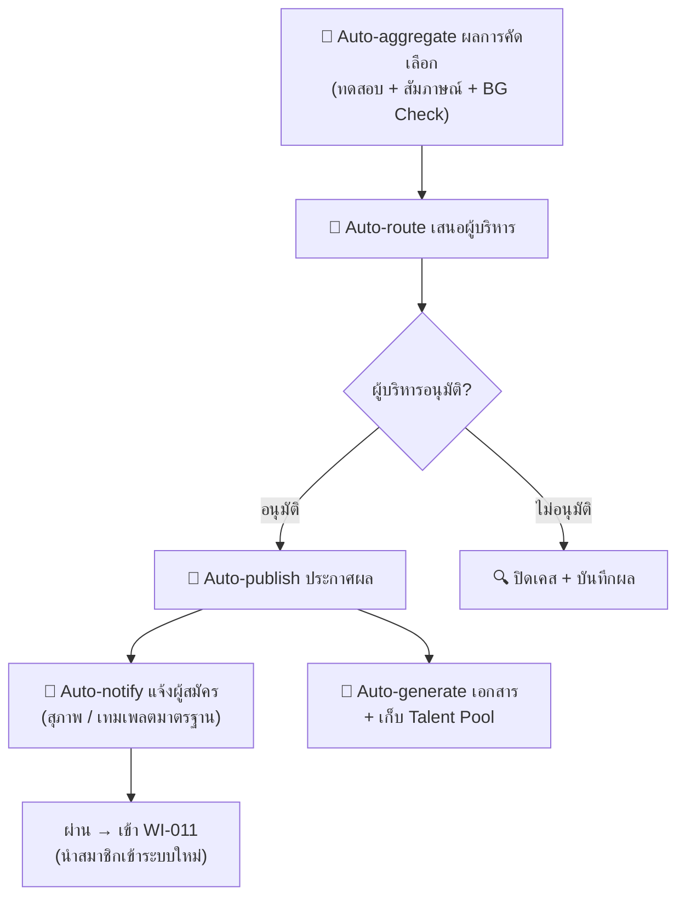
```mermaid
flowchart TD
    A["📎 Auto-aggregate ผลการคัดเลือก<br/>(ทดสอบ + สัมภาษณ์ + BG Check)"] --> B["🤖 Auto-route เสนอผู้บริหาร"]
    B --> C{"ผู้บริหารอนุมัติ?"}
    C -->|"อนุมัติ"| D["📣 Auto-publish ประกาศผล"]
    C -->|"ไม่อนุมัติ"| X["🔍 ปิดเคส + บันทึกผล"]
    D --> E["🤖 Auto-notify แจ้งผู้สมัคร<br/>(สุภาพ / เทมเพลตมาตรฐาน)"]
    D --> F["🤖 Auto-generate เอกสาร<br/>+ เก็บ Talent Pool"]
    E --> G["ผ่าน → เข้า WI-011<br/>(นำสมาชิกเข้าระบบใหม่)"]
```

**(9) เอกสารอ้างอิง / บันทึกคุณภาพ / ตัวชี้วัด** — เอกสาร: LDC-PAO-WI-003 - การสรุปผลและประกาศผลการคัดเลือก.docx · บันทึกคุณภาพ: บันทึกประกาศผล / Talent Pool Log / Template Log / เอกสารสรุป · ตัวชี้วัด: ผู้สมัครที่ไม่ผ่านได้เทมเพลตสุภาพ 100% · เกณฑ์ที่ใช้ตัดสินใจในระบบ (100%) · Time-to-notify 1 วันทำการ

### 2.3.3 LDC-PAO-WI-004: การโอนย้าย เลื่อนตำแหน่ง — สถานะ: ข้อมูลครบ ✅

**(1) วัตถุประสงค์** — กำหนดขั้นตอนโอนย้าย/เลื่อนตำแหน่งให้ตรงกันบนระบบ ทุกขั้น — ผ่านเส้นทางของแบบสัมภาษณ์แบบที่ 2 (เส้นทางเดียวทุกเคส — เสร็จสิ้น)

**(2) ขอบเขต** — รับคำขอ → ตรวจสอบ → เสนออนุมัติ → แจ้งผล ทั้งระบบ Update ข้อมูล (5 ขั้นตอน) — ครอบคลุมสมาชิกภายใน (ทุก BU/บริษัท — ใน 3 ประเทศ)

**(3) RACI ย่อ** — สมาชิก: R (กรอกคำขอ) · PAO: A (ตรวจ/เสนอ) · BMC เดิม+ใหม่: A (อนุมัติ) · ผู้บริหาร: A (ระดับอนุมัติสุด) · AI: R (Auto-validate/check/route/notify/update)

**(4) คำนิยามเฉพาะ** — **แบบสัมภาษณ์แบบที่ 2** — TCC 10 หัวข้อเชิงผู้รับใช้ (~50 คะแนน — ผ่าน ≥ 65%) · คำถามบังคับ 5 ข้อ · ขั้นตอนสัมภาษณ์ 1.30 ชม. 5 ส่วน · **7F** = แบบติดตาม 7F ของสมาชิก

**(5) กระบวนการเดิม (S1)**

| ลำดับ | กิจกรรม | ผู้ดำเนินการ | เอกสาร/ระบบ |
|---|---|---|---|
| 1 | รับคำขอ | สมาชิก | ใบขอโอนย้าย (กระดาษ) |
| 2 | ตรวจสอบ | HR | ตรวจด้วยมือ |
| 3 | เสนออนุมัติ | PAO | เอกสารเสนอหลายระดับ |
| 4 | แจ้งผล | PAO | แจ้งด้วยมือ (Line/โทร) |
| 5 | อัพเดตข้อมูล | PAO | ทะเบียนทำมือ |

**(6) จุดที่ AI เข้ามาช่วย (S2)**

| # | จุดที่ AI ช่วย | ผลลัพธ์ |
|---|---|---|
| 1 | Auto-validate คำขอ (แบบสัมภาษณ์ 3 แบบ — แบบที่ 2) | ทุกคำขอมีเอกสารครบ — บันทึกทันที |
| 2 | Auto-check คุณสมบัติตามเกณฑ์ (เทียบ CC/P4) | คำขอถึงสัมภาษณ์/ระบุผลด้วยเรียลไทม์ |
| 3 | Auto-route อนุมัติ (ทุกระดับระบุ) | คำขอไม่ค้าง — เป็นระบบมาตรฐาน |
| 4 | Auto-notify ผลให้สมาชิก + BU เดิม + BU ใหม่ | ทุกฝ่ายรู้สถานะเสมอ |
| 5 | Auto-update ข้อมูลสมาชิก (Application / สมาชิก) | ระบบเหนือหลายแหล่งเหมือนกัน — เชื่อม P3→P4 |

**(7) กระบวนการใหม่ (S4)**

| ลำดับ | กิจกรรม | ผู้ดำเนินการ | เอกสาร/ระบบ · Web PP7 โมดูล |
|---|---|---|---|
| 1 | สมาชิกกรอกแบบ 2 ผ่านระบบ Consent — (ดึงจากสมุดพก + 7F) | สมาชิก | Web PP7 — Tab-04 (แบบที่ 2) |
| 2 | AI Auto-validate คำขอ | ระบบ AI | Web PP7 (BCT — Tab-04) |
| 3 | AI Auto-check คุณสมบัติตามเกณฑ์ (อายุงาน / CC / P4) | ระบบ AI | Web PP7 — CC check + P4 History |
| 4 | Auto-route อนุมัติ (ทุกระดับ — เส้นทาง BMC เดิม+ใหม่ → PAO → ผู้บริหาร) | ระบบ | Web PP7 (Approval Route + Veto — OAC 3 ครั้งตามสิทธิบทบาทบริหาร) |
| 5 | Auto-notify ผล (สมาชิก / BU เดิม / BU ใหม่) | ระบบ AI | Web PP7 + TG (แจ้งเตือน) |
| 6 | Auto-update ข้อมูลสมาชิก (ประวัติ / สถานะ) | ระบบ AI | Web PP7 — Auto Data Flow + History (รายการ P3/P4) |

**(8) Flowchart**

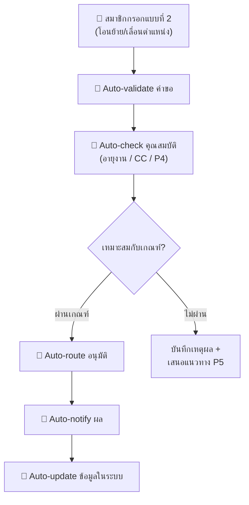
```mermaid
flowchart TD
    A["📝 สมาชิกกรอกแบบที่ 2<br/>(โอนย้าย/เลื่อนตำแหน่ง)"] --> B["🤖 Auto-validate คำขอ"]
    B --> C["🤖 Auto-check คุณสมบัติ<br/>(อายุงาน / CC / P4)"]
    C --> D{"เหมาะสมกับเกณฑ์?"}
    D -->|"ผ่านเกณฑ์"| E["🤖 Auto-route อนุมัติ"]
    E --> F["🤖 Auto-notify ผล"]
    F --> G["🤖 Auto-update ข้อมูลในระบบ"]
    D -->|"ไม่ผ่าน"| X["บันทึกเหตุผล +<br/>เสนอแนวทาง P5"]
```

**(9) เอกสารอ้างอิง / บันทึกคุณภาพ / ตัวชี้วัด** — เอกสาร: LDC-PAO-WI-004.docx · P2-แบบสัมภาษณ์-3แบบ.md (แบบที่ 2) · บันทึก: APPLICATION ประเภทโอนย้าย / เลื่อนตำแหน่ง + บันทึกอนุมัติ + Audit Log · ตัวชี้วัด: Time-to-transfer · % คำขอเข้าเกณฑ์ก่อนสัมภาษณ์ (%) · % การโอนย้ายที่ระบุไว้ (100%)

### 2.3.4 LDC-PAO-SD-001: Script แจ้งรายละเอียดผู้สมัครก่อนการเริ่มงาน — สถานะ: ข้อมูลครบ ✅

**(1) วัตถุประสงค์** — แจ้งผู้สมัครที่จะเริ่มงานด้วย Script มาตรฐานผ่าน TG/Line + นัดวันเริ่มงาน — ข้อมูลครบ ตรงตามระบบ ทุกเคสที่เสร็จสิ้น — ระบบเตรียมเทมเพลตให้ทั้งหมด

**(2) ขอบเขต** — Script (4 ขั้นตอน) — ขั้นตอน 1: สร้าง Script / ขั้นตอน 2: แจ้ง / ขั้นตอน 3: บันทึกผลการแจ้ง / ขั้นตอน 4: ติดตาม

**(3) RACI ย่อ** — PAO: A (แจ้ง) · ผู้สมัคร: I · AI/Bot: R (Auto-generate Script + Auto-record)

**(4) คำนิยามเฉพาะ** — Script = ข้อความมาตรฐานแจ้งผู้สมัคร · เทมเพลตสุภาพของห้อง HR — ห้าม "ด้วยความเคารพ" / ห้ามประโยคที่ปฏิเสธตรงเกินไป (ตามนิยามถาวร 2026-07-14 ของทีม HR)

**(5) กระบวนการเดิม (S1)**

| ลำดับ | กิจกรรม | ผู้ดำเนินการ | เอกสาร/ระบบ |
|---|---|---|---|
| 1 | สร้าง Script | HR/PAO | เอกสาร Script |
| 2 | แจ้งผ่านโทรศัพท์ | PAO | โทรศัพท์ (ทำมือ) |
| 3 | บันทึกผลการแจ้ง | PAO | แบบบันทึก (ทำมือ) |
| 4 | ติดตาม | PAO | รายการติดตาม (ทำมือ) |

**(6) จุดที่ AI เข้ามาช่วย (S2)**

| # | จุดที่ AI ช่วย | ผลลัพธ์ |
|---|---|---|
| 1 | Auto-generate Script (จากข้อมูลในระบบ) | ทุกเคสมีข้อความสุภาพมาตรฐาน |
| 2 | Auto-notify ผ่าน TG / Line (ทุกประเทศ + บันทึกกลาง) | ทุกเคสได้รับข่าวเสมอ |
| 3 | Auto-record รายละเอียด (Audit Log) | ตรวจสอบย้อนหลังได้ทุกเคส |
| 4 | Auto-follow up หากไม่ตอบรับ (แจ้งเตือน 48/24/12 ชม.) | ไม่มีเคสตกหล่น |

**(7) กระบวนการใหม่ (S4)**

| ลำดับ | กิจกรรม | ผู้ดำเนินการ | เอกสาร/ระบบ · Web PP7 โมดูล |
|---|---|---|---|
| 1 | AI สร้าง Script แจ้งรายละเอียดอัตโนมัติ (Template มาตรฐาน) | ระบบ AI | Web PP7 — Template แจ้งผล / สถานะ (TG/LINE Bot) |
| 2 | Auto-notify ผ่าน TG / Line | ระบบ TG/Line | Web PP7 — Notification |
| 3 | Auto-record รายละเอียด (Audit Log ทุกข้อความ) | ระบบ | Web PP7 — Audit Log |
| 4 | Auto-follow up หากไม่ตอบรับ (3 ระยะ: 48/24/12 ชม. — เสร็จเมื่อเริ่มงาน) | ระบบ AI | Web PP7 — Follow-up |

**(8) Flowchart**

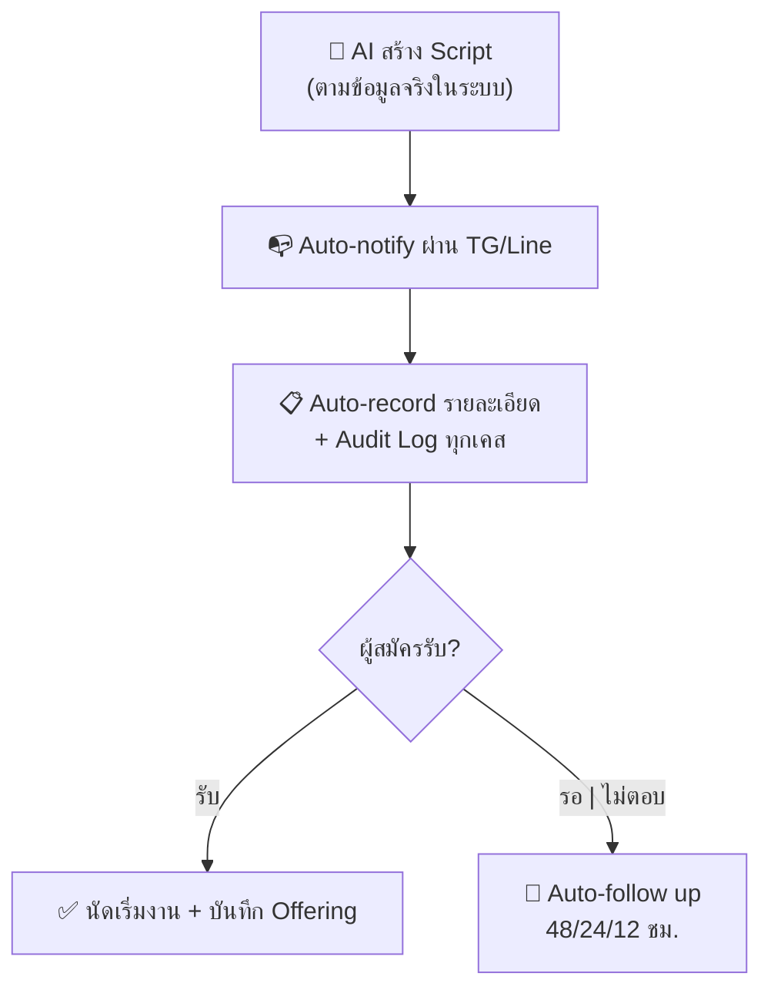
```mermaid
flowchart TD
    A["🤖 AI สร้าง Script<br/>(ตามข้อมูลจริงในระบบ)"] --> B["📭 Auto-notify ผ่าน TG/Line"]
    B --> C["📋 Auto-record รายละเอียด<br/>+ Audit Log ทุกเคส"]
    C --> D{"ผู้สมัครรับ?"}
    D -->|"รับ"| F["✅ นัดเริ่มงาน + บันทึก Offering"]
    D -->|"รอ | ไม่ตอบ"| G["🤖 Auto-follow up<br/>48/24/12 ชม."]
```

**(9) เอกสารอ้างอิง / บันทึกคุณภาพ / ตัวชี้วัด** — เอกสาร: LDC-PAO-SD-001 - Script แจ้งรายละเอียดผู้สมัครก่อนการเริ่มงาน.docx · บันทึกคุณภาพ: Audit Log รายการแจ้ง / สถานะติดตาม / Follow-up Log · ตัวชี้วัด: % การติดต่อสำเร็จ · เคส Follow-up เหลือ = 0 · เวลาแจ้งเตือน < 1 วันหลังผล

### 2.3.5 LDC-PAO-FM-001: ใบลาออก — สถานะ: ข้อมูลครบ ✅

**(1) วัตถุประสงค์** — สมาชิกลาออกอย่างถูกระเบียบ เอกสารครบ สิทธิประโยชน์ถูกคำนวณ (เงินสมทบอายุงานทำอัตโนมัติภายใน 7 วัน — เชื่อม LDC-WCD-WI-002)

**(2) ขอบเขต** — สมาชิกยื่นผ่านระบบ / หัวหน้าพิจารณา / HR ตรวจสอบ / บันทึกข้อมูล + จัดการสิทธิประโยชน์สุดท้าย (5 ขั้นตอน)

**(3) RACI ย่อ** — สมาชิก: R (ยื่น) · หัวหน้างาน: A (พิจารณา) · HR/PAO: A (ตรวจ/บันทึก) · 4C: C (บันทึกวินัย) · AI: R (Auto-validate + Auto-calculate + Auto-notify)

**(4) คำนิยามเฉพาะ** — ใบลาออก = คำขอลาออกผ่าน TG Bot หรือ Web Form · **สิทธิประโยชน์สุดท้าย** (Final Settlement) = เงินสมทบอายุงาน / เงินชดเชย / EVP คงเหลือ — บันทึกใน WI-002 (เงินสมทบ — LDC-WCD-WI-002) — เกษียณ (WI-006) — P6

**(5) กระบวนการเดิม (S1)**

| ลำดับ | กิจกรรม | ผู้ดำเนินการ | เอกสาร/ระบบ |
|---|---|---|---|
| 1 | สมาชิกยื่นใบลาออก | สมาชิก | ใบลาออก (กระดาษ) |
| 2 | หัวหน้างานพิจารณา | หัวหน้า | เอกสาร (ทำมือ) |
| 3 | HR ตรวจสอบเอกสาร | HR | ทำมือ |
| 4 | บันทึกข้อมูลลาออก | HR | ทะเบียน (ทำมือ) |
| 5 | จัดการสิทธิประโยชน์สุดท้าย | HR/การเงิน | คำนวณด้วยมือ |

**(6) จุดที่ AI เข้ามาช่วย (S2)**

| # | จุดที่ AI ช่วย | ผลลัพธ์ |
|---|---|---|
| 1 | ระบบรับใบลาออกอัตโนมัติ (TG Bot) | ทุกจุดเรียงแหล่งรับข้อมูลรวม |
| 2 | AI ตรวจสอบเอกสารครบ (แจ้งเตือนหากขาด) | ลดงานตรวจทำมือ — เคสครบทุก ๆ ครั้ง |
| 3 | Auto-calculate เงินสมทบ/สิทธิ | ลดความผิดพลาด — ตามเกณฑ์เดิมของระเบียบ |
| 4 | Auto-notify ทุกฝ่าย (หัวหน้า / HR / การเงิน) | ทุกฝ่ายรับรู้เสมอ |

**(7) กระบวนการใหม่ (S4)**

| ลำดับ | กิจกรรม | ผู้ดำเนินการ | เอกสาร/ระบบ · Web PP7 โมดูล |
|---|---|---|---|
| 1 | สมาชิกยื่นใบลาออกผ่านระบบ (TG Bot / Web PP7 Form) | สมาชิก | Web PP7 — แบบดิจิทัล + PDPA Consent |
| 2 | AI ตรวจสอบเอกสาร + แจ้งเตือนถ้าขาด | ระบบ AI | Web PP7 — Auto-validate |
| 3 | Auto-calculate สิทธิประโยชน์สุดท้าย | ระบบ AI | Web PP7 — Payroll (เชื่อม P6) |
| 4 | Auto-notify หัวหน้า / HR / การเงิน | ระบบ AI | Web PP7 + TG Notification |
| 5 | Auto-update สถานะสมาชิก + เอกสารลาออก | ระบบ AI | Web PP7 — Offboarding Status + Audit Log |

**(8) Flowchart**

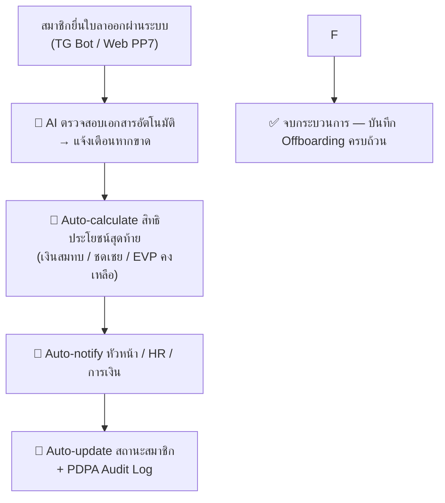
```mermaid
flowchart TD
    A["สมาชิกยื่นใบลาออกผ่านระบบ<br/>(TG Bot / Web PP7)"] --> B["🤖 AI ตรวจสอบเอกสารอัตโนมัติ<br/>→ แจ้งเตือนหากขาด"]
    B --> C["🤖 Auto-calculate สิทธิประโยชน์สุดท้าย<br/>(เงินสมทบ / ชดเชย / EVP คงเหลือ)"]
    C --> D["🤖 Auto-notify หัวหน้า / HR / การเงิน"]
    D --> E["🤖 Auto-update สถานะสมาชิก<br/>+ PDPA Audit Log"]
    F --> G["✅ จบกระบวนการ — บันทึก Offboarding ครบถ้วน"]
```

**(9) เอกสารอ้างอิง / บันทึกคุณภาพ / ตัวชี้วัด** — เอกสาร: LDC-PAO-FM-001 - ใบลาออก.docx · บันทึกคุณภาพ: บันทึกลาออก / Offboarding / Final Settlement · Audit Log ทุกขั้น · ตัวชี้วัด: บันทึกครบทุกเคส (100%) · เงินสมทบภายใน 7 วัน 100%

### 2.3.6 LDC-PAO-WI-011: การนำสมาชิกเข้าระบบใหม่ (Onboarding) — สถานะ: ข้อมูลครบ ✅

**(1) วัตถุประสงค์** — นำสมาชิกใหม่เข้าระบบ — บัญชี สิทธิ์ และแจ้งเตือน — Auto-import / Auto-create / Auto-assign / Auto-notify / Auto-track

**(2) ขอบเขต** — จากข้อมูลสมาชิกใหม่ P1 — สร้างบัญชี กำหนดสิทธิ์ แจ้งข้อมูล และติดตาม (5 ขั้นตอน)

**(3) RACI ย่อ** — PAO: A (จัดการ) · IT: R (สร้างบัญชี+สิทธิ์) · สมาชิกใหม่: I (รับข้อมูล) · AI: R (Auto)

**(4) คำนิยามเฉพาะ** — Onboarding = นำสมาชิกเข้าระบบ · RBAC ตำแหน่ง (บทที่ 3 — 5.2)

**(5) กระบวนการเดิม (S1)**

| ลำดับ | กิจกรรม | ผู้ดำเนินการ | เอกสาร/ระบบ |
|---|---|---|---|
| 1 | รับข้อมูลสมาชิก | PAO | รับข้อมูล (ทำมือ) |
| 2 | สร้างบัญชี | IT/PAO | Google Sheets (ทำมือ) |
| 3 | กำหนดสิทธิ์ | IT/PAO | กำหนดด้วยมือ |
| 4 | แจ้งข้อมูล | PAO | Line / Email (ทำมือ) |
| 5 | ติดตาม | PAO | ทำมือ |

**(6) จุดที่ AI เข้ามาช่วย (S2)**

| # | จุดที่ AI ช่วย | ผลลัพธ์ |
|---|---|---|
| 1 | Auto-import ข้อมูลจาก P1 | ไม่คีย์ซ้ำ — เส้นทางเดียว |
| 2 | Auto-create บัญชีผู้ใช้ | สมาชิกมีบัญชีทันที |
| 3 | Auto-assign สิทธิ์ตามตำแหน่ง | สิทธิ์เหมาะสม ระเบียบ |
| 4 | Auto-notify ข้อมูลการเข้าใช้ | สมาชิกทราบช่องทางทันที |
| 5 | Auto-track การใช้งาน | สมาชิกที่ใช้งานจริง เห็นสถานะ ตรวจสอบได้ |

**(7) กระบวนการใหม่ (S4)**

| ลำดับ | กิจกรรม | ผู้ดำเนินการ | เอกสาร/ระบบ · Web PP7 โมดูล |
|---|---|---|---|
| 1 | Auto-import ข้อมูลสมาชิกจาก P1 | ระบบ AI | Web PP7 — Auto Data Flow (P1→P3) |
| 2 | Auto-create บัญชีผู้ใช้ | ระบบ AI | Web PP7 — สร้างบัญชี |
| 3 | Auto-assign สิทธิ์ตามตำแหน่ง | ระบบ AI | Web PP7 — RBAC |
| 4 | Auto-notify ข้อมูลการเข้าใช้ | ระบบ AI | Web PP7 — TG Notification |
| 5 | Auto-track การใช้งาน + Audit Log | ระบบ AI | Web PP7 — Audit Log ทุกขั้นตอน |

**(8) Flowchart**

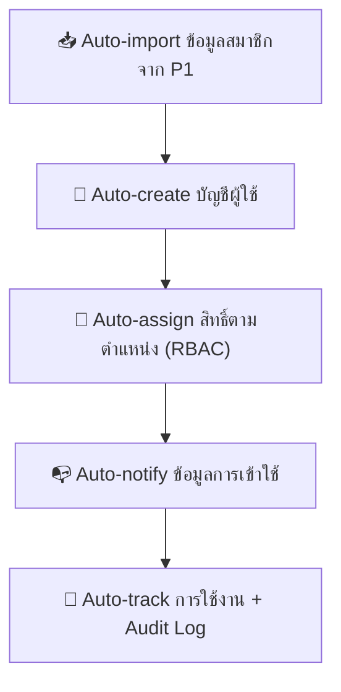
```mermaid
flowchart TD
    A["📥 Auto-import ข้อมูลสมาชิกจาก P1"] --> B["🤖 Auto-create บัญชีผู้ใช้"]
    B --> C["🤖 Auto-assign สิทธิ์ตามตำแหน่ง (RBAC)"]
    C --> D["📭 Auto-notify ข้อมูลการเข้าใช้"]
    D --> E["🤖 Auto-track การใช้งาน + Audit Log"]
```

**(9) เอกสารอ้างอิง / บันทึกคุณภาพ / ตัวชี้วัด** — เอกสาร: LDC-PAO-WI-011 - การนำสมาชิกเข้าระบบใหม่.docx · บันทึก: บัญชีผู้ใช้ / สิทธิ์ผู้ใช้ / Audit Log · ตัวชี้วัด: เวลาสร้างบัญชีภายใน 1 วัน (%) · เคสสิทธิ์ที่ตรงกันเกิน 1 แหล่ง = 0

### 2.3.7 LDC-PAO-WI-013: กระบวนการลงเวลาของพนักงาน PKG (new) — สถานะ: ข้อมูลครบ ✅

**(1) วัตถุประสงค์** — ลงเวลาทำงานของสมาชิกอย่างถูกต้อง เชื่อมเงินเดือน — Auto-record / Auto-validate / Auto-approve / Auto-export

**(2) ขอบเขต** — ลงเวลา → ตรวจสอบ → อนุมัติ → export (4 ขั้นตอน) — ครอบคลุมสมาชิกทุกแหล่ง (เชื่อมเงินเดือน)

**(3) RACI ย่อ** — สมาชิก: R (ลงเวลา) · หัวหน้า: A (อนุมัติ) · PAO: A (ส่งออก) · AI: R (Auto-record/validate)

**(4) คำนิยามเฉพาะ** — เวลาเข้า-ออก (Time Attendance) — ข้อมูลที่เชื่อมเงินเดือน (Payroll Data) — ตรวจย้อนหลังได้ทุกสถานะ / แหล่งข้อมูล (Audit Log)

**(5) กระบวนการเดิม (S1)**

| ลำดับ | กิจกรรม | ผู้ดำเนินการ | เอกสาร/ระบบ |
|---|---|---|---|
| 1 | ลงเวลา | สมาชิก | แบบลงเวลาทำมือ |
| 2 | ตรวจสอบ | HR/หัวหน้า | ทำมือ |
| 3 | อนุมัติ | หัวหน้า | ทำมือ |
| 4 | ส่งออกข้อมูล | HR | export เงินเดือน (ทำมือ) |

**(6) จุดที่ AI เข้ามาช่วย (S2)**

| # | จุดที่ AI ช่วย | ผลลัพธ์ |
|---|---|---|
| 1 | Auto-record เวลาผ่านระบบ | รายการบันทึกเสมอ ไม่หาย |
| 2 | Auto-validate ความถูกต้อง (ตรวจซ้ำ/ขัดแย้ง/ข้อมูลว่าง) | ลดความผิดพลาดทุกขั้น |
| 3 | Auto-approve โดยหัวหน้า (Dashboard ทุกแหล่ง) | อนุมัติทุกแหล่งเดียว — เห็นข้อมูลทุกแหล่ง |
| 4 | Auto-export เงินเดือน (เชื่อม P6 — LDC-WCD-WI-004) | ไม่คีย์ซ้ำ — ถูกต้องต้นทาง |

**(7) กระบวนการใหม่ (S4)**

| ลำดับ | กิจกรรม | ผู้ดำเนินการ | เอกสาร/ระบบ · Web PP7 โมดูล |
|---|---|---|---|
| 1 | Auto-record เวลาทำงานผ่านระบบ | สมาชิก / ระบบ | Web PP7 — ลงเวลา + Audit Log |
| 2 | Auto-validate ความถูกต้อง | ระบบ AI | Web PP7 — Validation |
| 3 | Auto-approve โดยหัวหน้า | หัวหน้า / ระบบ | Web PP7 — Dashboard หัวหน้า + TG |
| 4 | Auto-export ข้อมูลเงินเดือน | ระบบ AI | Web PP7 — Payroll Export (ฐานเงินเดือนเรียลไทม์) |

**(8) Flowchart**

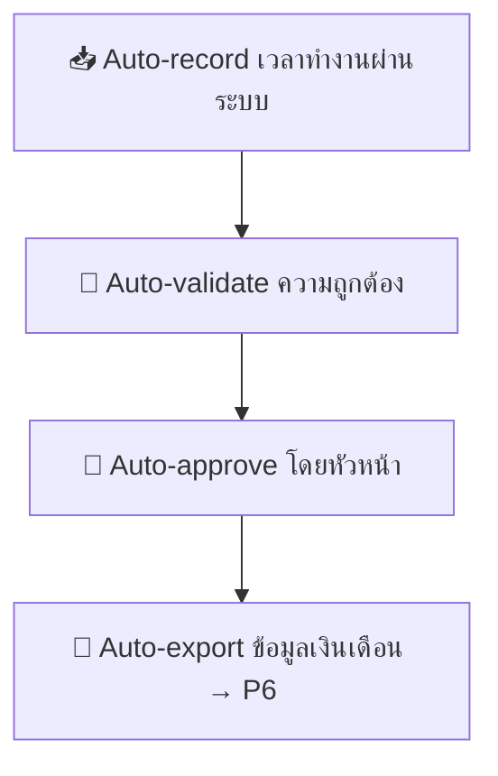
```mermaid
flowchart TD
    A["📥 Auto-record เวลาทำงานผ่านระบบ"] --> B["🤖 Auto-validate ความถูกต้อง"]
    B --> C["🤖 Auto-approve โดยหัวหน้า"]
    C --> D["🤖 Auto-export ข้อมูลเงินเดือน → P6"]
```

**(9) เอกสารอ้างอิง / บันทึกคุณภาพ / ตัวชี้วัด** — เอกสาร: LDC-PAO-WI-013 - กระบวนการลงเวลาของพนักงาน PKG new.docx · บันทึกคุณภาพ: บันทึกลงเวลา + Audit Log · ตัวชี้วัด: ข้อมูลเรียลไทม์ที่เชื่อมเงินเดือน (100%)
---

## 2.4 กลุ่ม P4 — ประเมินผล (Performance / ประเมินหลังรบ)

**นิยามถาวร P4:** การประเมินหลังทำงาน ว่าทำงานไปแล้วควรพัฒนาและปรับปรุงเรื่องอะไร — ประเมินตาม CC ของสมาชิก — **"ประเมินหลังรบ"**
**เจ้าของกระบวนการ:** PAD + BMC + กรรมการ 360°
**Web PP7:** Tab-05 ประเมินผล

### 2.4.1 P4-PER-001: ประเมินผล — สถานะ: ข้อมูลครบ ✅

**(1) วัตถุประสงค์** — ประเมินผลงานหลังสิ้นรอบ (**"ประเมินหลังรบ"**) ตาม CC ของสมาชิก — ผลใช้ขับเคลื่อน P5 พัฒนา (IDP) และ P6 ค่าตอบแทน (INC คำนวณจาก P4 Score)

**(2) ขอบเขต** — กำหนดเกณฑ์ → ประเมิน 360° → รวบรวมผล → สรุปผล + Development Plan — ครอบคลุมสมาชิกทุกกลุ่มงาน (แยกเกณฑ์ตามกลุ่ม — ไม่ใช้เกณฑ์เดียวกันหมด)

**(3) RACI ย่อ** — PAD: A (สรุปเกณฑ์/แผนพัฒนา) · ผู้ประเมิน 5 มุมมอง: R (ให้คะแนน) · BMC: A (ตรวจสอบ) · AI: R (แจกแบบ/รวมผล/สร้างแผน — มนุษย์ยืนยัน)

**(4) คำนิยามเฉพาะ**
- **ประเมินเครดิตประจำปี 360 องศา:** 5 มุมมอง — 1) ตนเอง (Self) 2) หัวหน้า (Manager) 3) เพื่อนร่วมงาน (Peer) 4) ลูกน้อง (Subordinate) 5) ลูกค้า (Customer) — ใช้ชุดคำถามปี 69 เป็นฐาน · แยกกลุ่มงาน · สอดคล้อง Core Competency PKG/BU · ความเหมาะสมของผู้ประเมินพิจารณาตามบริบท
- **ข้อสังเกตอดีต:** การประเมินที่ผ่านมาใช้ความรู้สึก/อารมณ์เป็นหลัก มากกว่าข้อมูลเชิงประจักษ์
- **เป้าหมายใหม่:** เกณฑ์ชัดเจน วัดผลได้ ลดอคติ — ออกแบบระบบใหม่ให้เสร็จภายในปี 2569
- **วิธีปรับปรุง:** "เรียนแบบ ไม่ใช่เลียนแบบ" — ค้นหาข้อมูลความสำเร็จของคนอื่น → ออกแบบมาใช้งาน → ปรับให้เหมาะกับบริบท PKG
- **BARS** (Behaviorally Anchored Rating Scale) — แนววิจัยที่นำมาอ้างอิง (กลุ่มวิจัย 1.6)

**(5) กระบวนการเดิม (S1)**

| ลำดับ | กิจกรรม | ผู้ดำเนินการ | เอกสาร/ระบบ |
|---|---|---|---|
| 1 | กำหนดเกณฑ์ประเมิน | PAD/HR | เกณฑ์ (กระดาษ) |
| 2 | ประเมินตนเอง/หัวหน้า/เพื่อน | ผู้ประเมิน 3 มุม | แบบประเมิน (ทำมือ) |
| 3 | รวบรวมผล | HR | ทำมือ |
| 4 | สรุปผล + Development Plan | PAD | ทำมือ (อิงความรู้สึก) |

**(6) จุดที่ AI เข้ามาช่วย (S2)**

| # | จุดที่ AI ช่วย | ผลลัพธ์ |
|---|---|---|
| 1 | Auto-distribute แบบประเมิน 360° (ตนเอง/หัวหน้า/เพื่อน/ลูกน้อง) | แจกครบ 100% — ไม่ตกหล่น |
| 2 | AI จับ bias — เทียบมุมมอง 5 ด้าน | ประเมินตรงข้อมูลจริง ลดอคติ |
| 3 | AI Aggregate ผลจากทุกแหล่ง | สรุปเร็ว — ส่งต่อ P5 ได้ทันที |
| 4 | Auto-generate Development Plan ตามจุดอ่อน | แผนรายบุคคลทันที — เชื่อม P5-DEV-001 |
| 5 | แจ้งเตือนผล (Results) ผ่าน Telegram | ผู้เกี่ยวข้องรับรู้เร็ว |

**(7) กระบวนการใหม่ (S4)**

| ลำดับ | กิจกรรม | ผู้ดำเนินการ | เอกสาร/ระบบ · Web PP7 โมดูล |
|---|---|---|---|
| 1 | กำหนดเกณฑ์ประเมินในระบบ (สอดคล้อง CC 5 ด้าน — ต่อยอด CC1–CC7) | PAD/HR | Web PP7 — Tab-05 (ตั้งเกณฑ์) |
| 2 | AI แจกแบบประเมิน 360° อัตโนมัติ — กันคำถามซ้ำซ้อน + เตือนผู้ประเมินครบ 360° | ระบบ AI | Web PP7 — Notification |
| 3 | ผู้เกี่ยวข้องประเมินผ่าน Web Form (แยกกลุ่มงาน) | ผู้ประเมิน 5 มุม | Web PP7 — ฟอร์ม 360° |
| 4 | AI รวมผล + วิเคราะห์แนวโน้ม + จับ bias + แปลงความรู้สึกเป็นข้อมูลเชิงประจักษ์ | ระบบ AI | Web PP7 — P4 Analysis (Trends) |
| 5 | AI สร้าง Development Plan อัตโนมัติตามจุดอ่อน | ระบบ AI | Web PP7 — เชื่อม P5-DEV-001 (IDP) |
| 6 | แจ้งเตือนผลผ่าน Telegram + Dashboard Performance Trends | ระบบ AI | Web PP7 — TG + Dashboard |

**(8) Flowchart**

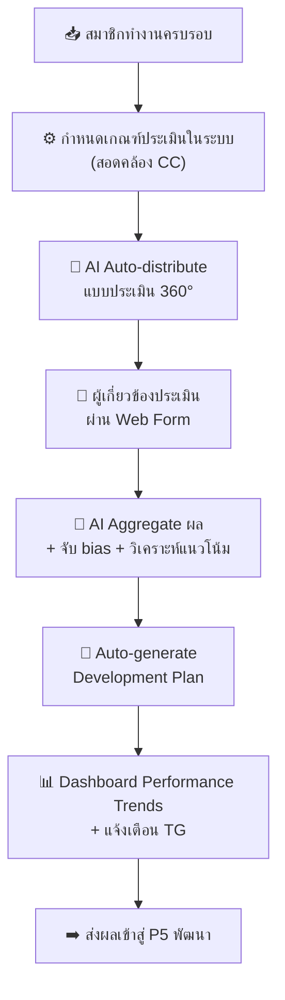
```mermaid
flowchart TD
    A["📥 สมาชิกทำงานครบรอบ"] --> B["⚙️ กำหนดเกณฑ์ประเมินในระบบ<br/>(สอดคล้อง CC)"]
    B --> C["🤖 AI Auto-distribute<br/>แบบประเมิน 360°"]
    C --> D["👥 ผู้เกี่ยวข้องประเมิน<br/>ผ่าน Web Form"]
    D --> E["🤖 AI Aggregate ผล<br/>+ จับ bias + วิเคราะห์แนวโน้ม"]
    E --> F["🤖 Auto-generate<br/>Development Plan"]
    F --> G["📊 Dashboard Performance Trends<br/>+ แจ้งเตือน TG"]
    G --> H["➡️ ส่งผลเข้าสู่ P5 พัฒนา"]
```

**(9) เอกสารอ้างอิง / บันทึกคุณภาพ / ตัวชี้วัด** — เอกสาร: P4-PER-001: ประเมินผล.docx · บันทึกคุณภาพ: P4 Score (5 มุมมอง) / Development Plan / ชุดคำถามปี 69 · ตัวชี้วัด: % ผู้ประเมินตอบครบ 360° · ลดเวลารวมผล ≥ 70% · เกณฑ์วัดผลได้ทุกรายการ (แผนลดการประเมินด้วยความรู้สึก — เป้าหมายปี 2569)

### 2.4.2 LDC-PAO-WI-012: ประเมินเครดิตสมาชิก — สถานะ: ข้อมูลครบ ✅

**(1) วัตถุประสงค์** — ประเมินเครดิตสมาชิก (บันทึกประวัติการประเมินเชิงเทียบราย CC) — เป็นฐานประเมินเครดิตประจำปีของ P4 และข้อมูลบันทึกที่ทีมตรวจสอบ (GAT) ใช้อ้างอิง

**(2) ขอบเขต** — กำหนดเกณฑ์ → ประเมิน → รวบรวมผล → สรุปผล → เก็บประวัติ (5 ขั้นตอน)

**(3) RACI ย่อ** — PAD/HR: A (สรุป/เก็บประวัติ) · ผู้ประเมิน: R (ให้คะแนน) · AI: R (Auto-generate เกณฑ์ + สรุป + เก็บ)

**(4) คำนิยามเฉพาะ** — **เครดิต (Credit) ของสมาชิก** = ประวัติการประเมินที่บันทึกเชิงเทียบราย CC (ไม่ใช้ความรู้สึก)

**(5) กระบวนการเดิม (S1)**

| ลำดับ | กิจกรรม | ผู้ดำเนินการ | เอกสาร/ระบบ |
|---|---|---|---|
| 1 | กำหนดเกณฑ์ | HR/PAD | เกณฑ์ (ทำมือ) |
| 2 | ประเมิน | ผู้ประเมิน | แบบประเมิน (ทำมือ) |
| 3 | รวบรวมผล | HR | ทำมือ |
| 4 | สรุปผล | HR | ทำมือ |
| 5 | เก็บประวัติ | HR | บันทึก (ทำมือ) |

**(6) จุดที่ AI เข้ามาช่วย (S2)**

| # | จุดที่ AI ช่วย | ผลลัพธ์ |
|---|---|---|
| 1 | AI Auto-generate เกณฑ์ตาม Core Competency | เกณฑ์เดียวกันทุกมุม — ลดอคติ |
| 2 | Auto-collect ผลจากทุกฝ่าย 360° | ครบถ้วน — เสร็จเร็ว |
| 3 | AI Summary คะแนนเครดิต | สรุปแบบเรียลไทม์ |
| 4 | Auto-generate รายงานเครดิต | เอกสารพร้อมตรวจสอบ |
| 5 | Auto-store ประวัติการประเมิน | เก็บย้อนหลัง — Audit Log |

**(7) กระบวนการใหม่ (S4)**

| ลำดับ | กิจกรรม | ผู้ดำเนินการ | เอกสาร/ระบบ · Web PP7 โมดูล |
|---|---|---|---|
| 1 | AI กำหนดเกณฑ์ประเมินตาม Core Competency | ระบบ AI | Web PP7 — Tab-05 ประเมินผล |
| 2 | Auto-collect ผลจากทุกฝ่าย | ระบบ AI | Web PP7 — P4 ผล 360° |
| 3 | AI สรุปผลและคะแนนเครดิต | ระบบ AI | Web PP7 — สรุปเทียบราย CC |
| 4 | Auto-generate รายงานเครดิต | ระบบ AI | Web PP7 — Dashboard |
| 5 | Auto-store ประวัติการประเมิน | ระบบ AI | Web PP7 — Audit Log (ย้อนหลัง) |

**(8) Flowchart**

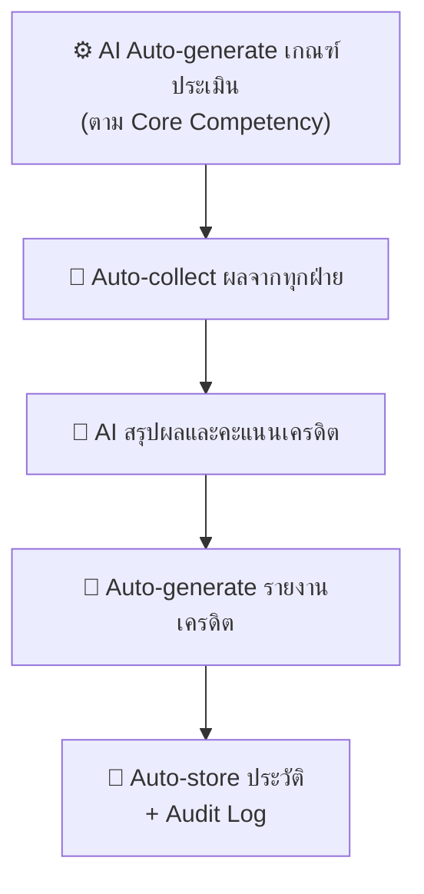
```mermaid
flowchart TD
    A["⚙️ AI Auto-generate เกณฑ์ประเมิน<br/>(ตาม Core Competency)"] --> B["👥 Auto-collect ผลจากทุกฝ่าย"]
    B --> C["🤖 AI สรุปผลและคะแนนเครดิต"]
    C --> D["🤖 Auto-generate รายงานเครดิต"]
    D --> E["🤖 Auto-store ประวัติ<br/>+ Audit Log"]
```

**(9) เอกสารอ้างอิง / บันทึกคุณภาพ / ตัวชี้วัด** — เอกสาร: LDC-PAO-WI-012 - ประเมินเครดิตสมาชิก.docx · บันทึกคุณภาพ: ประวัติการประเมินเครดิต (Audit Log) · ตัวชี้วัด: คะแนนเครดิตที่เชื่อมโยงระหว่างระบบ (Audit Log 100%)

### 2.4.3 LDC-PAO-WI-016: การประเมินผลทดลองงาน / จับคู่คนกับงาน / เลื่อนตำแหน่ง — สถานะ: ข้อมูลครบ ✅

**(1) วัตถุประสงค์** — ประเมินผลทดลองงาน/จับคู่/เลื่อนตำแหน่ง — รวมระบบวัดผล 30 วัน (LDC-PAO-PM-003 — Tab จับคู่) — เป็นเกณฑ์เฝ้าระวัง 30 วันแรกของทดลองงาน ก่อนประเมินรอบ 6 เดือน

**(2) ขอบเขต** — กำหนดเกณฑ์ → ประเมิน → รวบรวม → สรุป → แจ้งผล (5 ขั้นตอน) — ทดลองงานและการจับคู่/เลื่อนตำแหน่งทุกเคส

**(3) RACI ย่อ** — PAD/HR: A (สรุปผล/แจ้ง) · พี่เลี้ยง/ผู้ประเมิน: R · AI: R (Auto-generate เกณฑ์ / AI summarize) · สมาชิก: I (รับผล — แจ้งเตือน)

**(4) คำนิยามเฉพาะ** — **ระบบวัดผล 30 วัน** = วัดผลในสังกัต 30 วันแรกของทดลองงาน/การลงตำแหน่งใหม่ — เปรียบเทียบรายเกณฑ์ (ไม่ใช้ความรู้สึก)

**(5) กระบวนการเดิม (S1)**

| ลำดับ | กิจกรรม | ผู้ดำเนินการ | เอกสาร/ระบบ |
|---|---|---|---|
| 1 | กำหนดเกณฑ์ | HR | เกณฑ์ทำมือ |
| 2 | ประเมิน | ผู้ประเมิน | แบบประเมิน (ทำมือ) |
| 3 | รวบรวมผล | HR | ทำมือ |
| 4 | สรุปผล | HR | ทำมือ |
| 5 | แจ้งผล | HR | Line/โทร (ทำมือ) |

**(6) จุดที่ AI เข้ามาช่วย (S2)**

| # | จุดที่ AI ช่วย | ผลลัพธ์ |
|---|---|---|
| 1 | AI Auto-generate เกณฑ์ประเมินตามตำแหน่ง | เกณฑ์มาตรฐานเดียว — ไม่ง้อดุลยพินิจ |
| 2 | Auto-collect ผลประเมินจากทุกฝ่าย | ครบ 360° — เรียลไทม์ |
| 3 | AI สรุปผล 30 วัน | สรุปเร็ว โปร่งใส |
| 4 | Auto-notify ผลให้สมาชิก + แจ้งเตือนการแก้ไข | แจ้งเร็ว — ตรวจย้อนหลัง 100% |
| 5 | Auto-update สถานะในระบบ | เชื่อมข้อมูล P3 → P4 → P5 ทันที |

**(7) กระบวนการใหม่ (S4)**

| ลำดับ | กิจกรรม | ผู้ดำเนินการ | เอกสาร/ระบบ · Web PP7 โมดูล |
|---|---|---|---|
| 1 | AI Auto-generate เกณฑ์ประเมินตามตำแหน่ง | ระบบ AI | Web PP7 — Tab-05 ประเมินผล |
| 2 | Auto-collect ผลจากทุกฝ่าย (360°) | ระบบ AI | Web PP7 — แบบประเมิน 360° |
| 3 | AI สรุปผล 30 วัน + เครดิต | ระบบ AI | Web PP7 — สรุปเรียลไทม์ |
| 4 | Auto-notify ผลในระบบ (TG + Web) | ระบบ AI | Web PP7 + TG Notification |
| 5 | Auto-update สถานะ (ต่อ P3/P5) | ระบบ AI | Web PP7 — เชื่อม P4/P5 — Audit Log |

**(8) Flowchart**

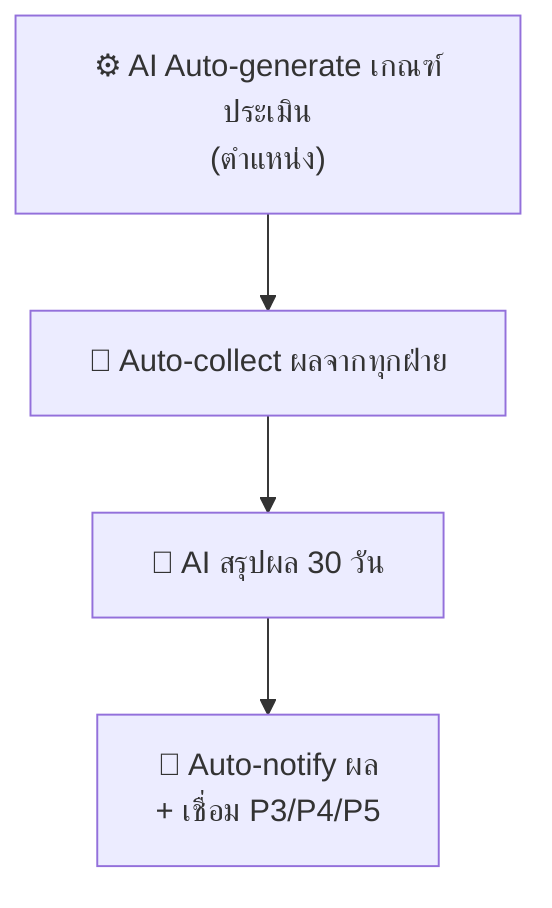
```mermaid
flowchart TD
    A["⚙️ AI Auto-generate เกณฑ์ประเมิน<br/>(ตำแหน่ง)"] --> B["👥 Auto-collect ผลจากทุกฝ่าย"]
    B --> C["🤖 AI สรุปผล 30 วัน"]
    C --> D["🤖 Auto-notify ผล<br/>+ เชื่อม P3/P4/P5"]
```

**(9) เอกสารอ้างอิง / บันทึกคุณภาพ / ตัวชี้วัด** — เอกสาร: LDC-PAO-WI-016.docx + LDC-PAO-PM-003 (ระบบวัดผล 30 วัน) · บันทึกคุณภาพ: บันทึก 30 วัน + Audit Log · ตัวชี้วัด: % เคสประเมินครบ 30 วัน (100%) · เวลาสรุปผล (ระบบให้รายงานทันที)
---

## 2.5 กลุ่ม P5 — พัฒนา (Develop / People Development)

**นิยามถาวร P5:** ระบบพัฒนาสมาชิกตาม CC (จากผลการประเมิน P4)
**เจ้าของกระบวนการ:** PAD + BMC — Web PP7: Tab-06 พัฒนา

### 2.5.1 P5-6-DEV-001: แผนพัฒนารายบุคคล (IDP) — สถานะ: ข้อมูลครบ ✅

**(1) วัตถุประสงค์** — สร้างแผนพัฒนารายบุคคล (Individual Development Plan) จากจุดอ่อนที่วิเคราะห์ได้จาก P4 + CC Gap — พัฒนาสมาชิกตาม CC ต่อเนื่อง

**(2) ขอบเขต** — วิเคราะห์จุดอ่อน → กำหนดหัวข้อฝึกอบรม → ส่งเข้าอบรม → ประเมินผลหลังอบรม — ครอบคลุมสมาชิกทุกกลุ่ม (Soft Skills 1 หลักสูตร/ปี · Technical 2 หลักสูตร/ปี · Leadership 1 หลักสูตร/ปี — ตัวอย่างข้อมูลผู้ปฏิบัติงาน)

**(3) RACI ย่อ** — PAD: A (แผนพัฒนา) · หัวหน้า: A (อนุมัติแผน) · สมาชิก: R (เข้าอบรม) · AI: R (วิเคราะห์/แนะนำ/ติดตาม)

**(4) คำนิยามเฉพาะ** — **IDP** = แผนพัฒนารายบุคคล · **CC Gap** = ช่องว่างระหว่าง CC ปัจจุบันกับเป้าหมาย · ติดตามผลหลังอบรม 30/60/90 วัน

**(5) กระบวนการเดิม (S1)**

| ลำดับ | กิจกรรม | ผู้ดำเนินการ | เอกสาร/ระบบ |
|---|---|---|---|
| 1 | วิเคราะห์จุดอ่อนจาก P4 | PAD | วิเคราะห์ด้วยมือ |
| 2 | กำหนดหัวข้อฝึกอบรม | PAD | ทำมือ |
| 3 | ส่งพนักงานเข้าอบรม | PAD | ทำมือ |
| 4 | ประเมินผลหลังอบรม | PAD | ทำมือ |

**(6) จุดที่ AI เข้ามาช่วย (S2)**

| # | จุดที่ AI ช่วย | ผลลัพธ์ |
|---|---|---|
| 1 | AI วิเคราะห์ P4 Score + CC Gap → แนะนำ IDP อัตโนมัติ | ลดการวิเคราะห์ด้วยมือ |
| 2 | AI จับคู่หลักสูตรกับจุดอ่อน (Soft/Technical/Leadership) | หลักสูตรตรงจุด — คุ้มงบประมาณ |
| 3 | Auto-track การเข้าอบรม | เห็นความคืบหน้าเรียลไทม์ |
| 4 | Auto-evaluate ผลลัพธ์หลังอบรม (30/60/90 วัน) | วัดผลหลังอบรมได้จริง |

**(7) กระบวนการใหม่ (S4)**

| ลำดับ | กิจกรรม | ผู้ดำเนินการ | เอกสาร/ระบบ · Web PP7 โมดูล |
|---|---|---|---|
| 1 | AI วิเคราะห์ P4 Score + CC Gap → แนะนำ IDP อัตโนมัติ | ระบบ AI | Web PP7 — IDP Engine |
| 2 | AI จับคู่หลักสูตรกับจุดอ่อน (Soft/Technical/Leadership) | ระบบ AI | Web PP7 — Course Matching |
| 3 | แจ้งเตือนหัวหน้า + พนักงานให้เข้าอบรมตามแผน | ระบบ AI | เตือนผ่าน TG/Email |
| 4 | บันทึกการเข้าอบรมอัตโนมัติ (QR check-in / Online course) | ระบบ | Web PP7 — Attendance |
| 5 | AI ติดตามผลหลังอบรม (30/60/90 วัน) ผ่านแบบประเมิน | ระบบ AI | Web PP7 — Follow-up |
| 6 | Dashboard IDP real-time | ระบบ | Web PP7 — IDP Dashboard |

**(8) Flowchart**

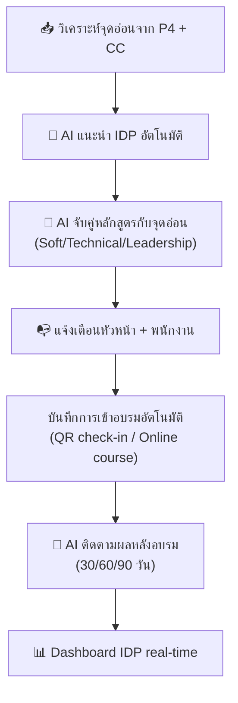
```mermaid
flowchart TD
    A["📥 วิเคราะห์จุดอ่อนจาก P4 + CC"] --> B["🤖 AI แนะนำ IDP อัตโนมัติ"]
    B --> C["🤖 AI จับคู่หลักสูตรกับจุดอ่อน<br/>(Soft/Technical/Leadership)"]
    C --> D["📭 แจ้งเตือนหัวหน้า + พนักงาน"]
    D --> E["บันทึกการเข้าอบรมอัตโนมัติ<br/>(QR check-in / Online course)"]
    E --> F["🤖 AI ติดตามผลหลังอบรม<br/>(30/60/90 วัน)"]
    F --> G["📊 Dashboard IDP real-time"]
```

**(9) เอกสารอ้างอิง / บันทึกคุณภาพ / ตัวชี้วัด** — เอกสาร: P5-6-DEV-001: แผนพัฒนารายบุคคล (IDP).docx · บันทึกคุณภาพ: IDP Record / Attendance / ผลติดตาม 30/60/90 วัน · ตัวชี้วัด: Soft Skills 1 หลักสูตร/ปี · Technical 2 หลักสูตร/ปี · Leadership 1 หลักสูตร/ปี (เป้าหมายตามข้อมูลผู้ปฏิบัติงาน)

### 2.5.2 P5-GRP-001: จัดการกลุ่มพัฒนาบุคคล — สถานะ: ข้อมูลครบ ✅

**(1) วัตถุประสงค์** — จัดกลุ่มพัฒนาบุคคลตาม CC Gap (AI Auto-cluster) แล้วเสนอกิจกรรมที่เหมาะสม (mentoring / workshop / study group)

**(2) ขอบเขต** — กำหนดกลุ่มเป้าหมาย → วิเคราะห์ความต้องการ → วางแผนกิจกรรม → ดำเนินกิจกรรม → รายงานผล (5 ขั้นตอน) · กลุ่มตัวอย่าง: Young Leader / New Employee / Technical Expert

**(3) RACI ย่อ** — PAD: A (จัดกลุ่ม + กิจกรรม) · หัวหน้ากลุ่ม: A (รับผลรายงาน) · สมาชิก: R (เข้าร่วม) · AI: R (Cluster/Suggest/Coordination/Report)

**(4) คำนิยามเฉพาะ** — กลุ่มพัฒนา (Young Leader / New Employee / Technical Expert) · กิจกรรม: mentoring / workshop / study group

**(5) กระบวนการเดิม (S1)**

| ลำดับ | กิจกรรม | ผู้ดำเนินการ | เอกสาร/ระบบ |
|---|---|---|---|
| 1 | กำหนดกลุ่มเป้าหมาย | PAD | ทำมือ |
| 2 | วิเคราะห์ความต้องการ | PAD | ทำมือ |
| 3 | วางแผนกิจกรรม | PAD | ทำมือ |
| 4 | ดำเนินกิจกรรม | PAD | ทำมือ |
| 5 | รายงานผล | PAD | ทำมือ |

**(6) จุดที่ AI เข้ามาช่วย (S2)**

| # | จุดที่ AI ช่วย | ผลลัพธ์ |
|---|---|---|
| 1 | Auto-cluster กลุ่มตาม CC Gap | จัดกลุ่มแม่นยำตามข้อมูล |
| 2 | Auto-suggest กิจกรรม (mentoring/workshop/study group) | กิจกรรมเหมาะกับกลุ่ม |
| 3 | Auto-coordination (จองห้อง/นัดหมาย/แจ้งผู้เข้าร่วม) | ลดงานประสานด้วยมือ |
| 4 | Auto-document (agenda / attendance / outcome) | เอกสารครบ — ตรวจย้อนหลังได้ |

**(7) กระบวนการใหม่ (S4)**

| ลำดับ | กิจกรรม | ผู้ดำเนินการ | เอกสาร/ระบบ · Web PP7 โมดูล |
|---|---|---|---|
| 1 | AI Cluster สมาชิกตาม CC Gap → Auto-create กลุ่มพัฒนา | ระบบ AI | Web PP7 — Group Engine |
| 2 | AI Suggest กิจกรรม (mentoring/workshop/study group) | ระบบ AI | Web PP7 — suggested activities |
| 3 | Auto-coordination จองห้อง/นัดหมาย/แจ้งผู้เข้าร่วม | ระบบ | Web PP7 — Calendar/Notify |
| 4 | บันทึกกิจกรรมอัตโนมัติ (agenda / attendance / outcome) | ระบบ | Web PP7 — Activity Log |
| 5 | Auto-report ผลกิจกรรมส่งหัวหน้ากลุ่ม | ระบบ AI | Web PP7 — Dashboard Group |

**(8) Flowchart**

```mermaid
flowchart TD
    A["📥 AI Auto-cluster สมาชิกตาม CC Gap"] --> B["🤖 AI Suggest กิจกรรม<br/>(mentoring/workshop/study group)"]
    B --> C["🤖 Auto-coordination<br/>จองห้อง/นัดหมาย/แจ้งผู้เข้าร่วม"]
    C --> D["บันทึกกิจกรรมอัตโนมัติ<br/>(agenda/attendance/outcome)"]
    D --> E["🤖 Auto-report ผลกิจกรรม"]
    E --> F["📊 Dashboard กลุ่ม:<br/>สมาชิก/กิจกรรม/ความคืบหน้า"]
```

**(9) เอกสารอ้างอิง / บันทึกคุณภาพ / ตัวชี้วัด** — เอกสาร: P5-GRP-001: จัดการกลุ่มพัฒนาบุคคล.docx · บันทึกคุณภาพ: Group Record / Activity Log (agenda/attendance/outcome) · ตัวชี้วัด: จำนวนกลุ่ม/สมาชิกที่เข้าร่วม — สถานะ: เสร็จตามแผน (%) — รายงานผลกลุ่มทุกครั้ง

### 2.5.3 P5-TRN-001: จัดการหลักสูตรฝึกอบรม — สถานะ: ข้อมูลครบ ✅

**(1) วัตถุประสงค์** — วางแผนหลักสูตรประจำปีจาก IDP Gap ทั่วองค์กร จัดอบรม วัดผล — มีเป้าอบรมครบ 40 ชั่วโมง/คน/ปี — งบประมาณอบรม 500,000 บาท/ปี (ข้อมูลตัวอย่าง)

**(2) ขอบเขต** — วางแผนหลักสูตร → ติดต่อวิทยากร → จัดอบรม → บันทึกผล → ประเมินความพึงพอใจ (5 ขั้นตอน) · วิทยากรภายใน + ภายนอก

**(3) RACI ย่อ** — PAD: A (วางแผน + จัด) · วิทยากร: R (สอน) · สมาชิก: R (เข้าอบรม) · การเงิน: I · AI: R (Auto-suggest/match/generate/collect/report)

**(4) คำนิยามเฉพาะ** — งบประมาณอบรม 500,000 บาท/ปี · เกณฑ์ 40 ชั่วโมง/คน/ปี · Feedback ผ่าน QR Code

**(5) กระบวนการเดิม (S1)**

| ลำดับ | กิจกรรม | ผู้ดำเนินการ | เอกสาร/ระบบ |
|---|---|---|---|
| 1 | วางแผนหลักสูตรประจำปี | PAD | วางมือ |
| 2 | ติดต่อวิทยากร | PAD | ทำมือ |
| 3 | จัดอบรม | PAD | จัดด้วยมือ |
| 4 | บันทึกผลการอบรม | PAD | ทำมือ |
| 5 | ประเมินความพึงพอใจ | PAD | ทำมือ (แบบฟอร์มกระดาษ) |

**(6) จุดที่ AI เข้ามาช่วย (S2)**

| # | จุดที่ AI ช่วย | ผลลัพธ์ |
|---|---|---|
| 1 | Auto-suggest หลักสูตรจาก IDP Gap ทั่วทั้งองค์กร | หลักสูตรตรงจุด — หมดงานวิเคราะห์ด้วยมือ |
| 2 | Auto-match วิทยากร (ภายใน/ภายนอก) กับหัวข้อ | ตั้งกำหนดการเร็ว — ลดงานติดต่อ |
| 3 | Auto-generate กำหนดการ + แจ้งเตือนผู้เข้าอบรม | แจ้งครบทุกคน |
| 4 | บันทึกผลอัตโนมัติ (attendance / quiz / workshop) | บันทึกทันที ตรวจสอบได้ |
| 5 | Auto-collect feedback ผ่าน QR Code | ข้อมูลพึงพอใจครบ — เรียลไทม์ |
| 6 | Auto-report ผล + Budget Tracking | เห็นทั้งผลและงบประมาณต่อรายวิชา |

**(7) กระบวนการใหม่ (S4)**

| ลำดับ | กิจกรรม | ผู้ดำเนินการ | เอกสาร/ระบบ · Web PP7 โมดูล |
|---|---|---|---|
| 1 | AI วิเคราะห์ IDP Gap ทั่วองค์กร → เสนอหลักสูตรประจำปี | ระบบ AI | Web PP7 — Training Planner |
| 2 | AI Match วิทยากร (ภายใน/ภายนอก) กับหัวข้อ | ระบบ AI | Web PP7 — Instructor Matching |
| 3 | Auto-generate กำหนดการ + แจ้งเตือนผู้เข้าอบรม | ระบบ | Web PP7 — Calendar + TG |
| 4 | บันทึกผลอัตโนมัติ (attendance / quiz / workshop) | ระบบ | Web PP7 — Attendance/Quiz records |
| 5 | Auto-collect feedback ผ่าน QR Code | ผู้เข้าอบรม | แบบสอบถามดิจิทัล |
| 6 | Auto-report ผลการอบรม + Budget Tracking | ระบบ AI | Web PP7 — Training Dashboard |
| 7 | Dashboard อบรม (หัวข้อ / วิทยากร / ค่าใช้จ่าย / Hours) | ทุกบทบาท | Web PP7 — Training Dashboard |

**(8) Flowchart**

```mermaid
flowchart TD
    A["🤖 AI วิเคราะห์ IDP Gap<br/>→ เสนอหลักสูตรประจำปี"] --> B["🤖 AI Match วิทยากร<br/>(ภายใน/ภายนอก)"]
    B --> C["🤖 Auto-generate กำหนดการ<br/>+ แจ้งเตือนผู้เข้าอบรม"]
    C --> D["📚 จัดอบรม — บันทึกผลอัตโนมัติ<br/>(attendance/quiz/workshop)"]
    D --> E["📱 Auto-collect feedback<br/>ผ่าน QR Code"]
    E --> F["🤖 Auto-report + Budget Tracking"]
    F --> G["📊 Dashboard อบรม:<br/>หัวข้อ/วิทยากร/ค่าใช้จ่าย/Hours"]
```

**(9) เอกสารอ้างอิง / บันทึกคุณภาพ / ตัวชี้วัด** — เอกสาร: P5-TRN-001: จัดการหลักสูตรฝึกอบรม.docx · บันทึกคุณภาพ: Training Record / Feedback / Budget Tracking · ตัวชี้วัด: อบรมครบ 40 ชั่วโมง/คน/ปี · งบประมาณ 500,000 บาท/ปี — ควบคุมต่อหลักสูตร (%) — ความพึงพอใจ
---

## 2.6 งาน PAD — พัฒนาบุคลากร (ตามเอกสารแผนก PAD)

**นิยามขอบเขต PAD:** ครอบคลุมระบบพี่เลี้ยง-น้องเลี้ยง ฝึกอบรมเดิม/ต่างประเทศ E-Learning Coach CC Gap 3 ผ่าน TA MSP Communication ISMS BCM — บันทึกทุกระบบทุกแหล่งจากวงจร 77 ไฟล์ (ระบบ PAD จริง) · Web PP7: Tab-06 พัฒนา / Tab-07 ค่าตอบแทน (จุดที่เกี่ยว MSP)

### 2.6.1 LDC-PAD-PM-001: ระบบพี่เลี้ยงและน้องเลี้ยง (Mentoring System — 13 ขั้นตอน) — สถานะ: ข้อมูลครบ ✅

**รายละเอียดสถานะ:** เอกสารพร้อมกาแยกทุกหน้า — ระบบพี่เลี้ยง (ขั้น 21–29 ของไฟล์ที่ใช้ระบบทั้งหมด — 13 ขั้นตอน) — ระบุในภาพ 3 แหล่ง (LDC-PAD-PM-001, AI Diagram §5, Web PP7 module p5-mentoring-system.html)
**(1) วัตถุประสงค์** — กำกับดูแลน้องเลี้ยง (สมาชิกทดลองงาน/สัญญา 6 เดือน/จับคู่/ปรับบทบาท) ด้วยพี่เลี้ยง (Coach) — รายงาน DTA — วัดวินัย (เกณฑ์ ≥ 80%) — ประเมินระบบเมื่อสิ้นสุด — เชื่อมกับ CC ทุกขั้น

**(2) ขอบเขต** — ตั้งแต่ PAD จัดระบบพี่เลี้ยง จนถึงน้องเลี้ยงประเมินระบบ (13 ขั้นตอน)

**(3) RACI ย่อ**

| บทบาท | ระดับ |
|---|---|
| PAD | A — set ระบบ / ตรวจวินัย / ประกาศผล |
| พี่เลี้ยง (Coach) | R — อ่านรายงาน + Coach อย่างน้อยเดือนละ 1 ครั้ง |
| น้องเลี้ยง | R — รายงาน DTA เป็นรอบตามหมวด |
| 4C | C — บันทึกใบเหลือง/ใบแดง (เกณฑ์ต่ำกว่า 80%) |
| AI ระบบ | R — ตรวจข้อมูล/คำนวณคะแนนวินัย/เตือน/วิเคราะห์ผลประเมิน |

**(4) คำนิยามเฉพาะ** — **DTA** (Daily Task Report) — รายงานประจำวันของน้องเลี้ยง (DTA_1 / DTA_2 / DTA_4) · **เกณฑ์ 80%** — รายงานต้องส่งทันรอบ ≥ 80% · **ใบเหลือง/ใบแดง** — บันทึก 4C เมื่อระบุวินัยต่ำกว่าเกณฑ์ (ในระบบ — การบันทึกวินัยครบทุกแหล่ง) · **Line Group** — กลุ่มรับใช้สมาชิกที่น้องเลี้ยงใช้รายงาน · **RACI set ระบบ** = สมาชิกใหม่ / สัญญา 6 เดือน / จับคู่ / ปรับบทบาท

**(5) กระบวนการเดิม (S1 — 13 ขั้นตอน)**

| ลำดับ | กิจกรรม | ผู้ดำเนินการ | เอกสาร/ระบบ |
|---|---|---|---|
| 1 | PAO สรรหาสมาชิกทดลองงาน | PAO | ผลสรรหา |
| 2 | PAD ตรวจสอบข้อมูล | PAD | ทำมือ 3 วัน |
| 3 | กำหนดกลุ่มน้องเลี้ยง 1–4 | PAD | ทำมือ |
| 4 | Set ระบบ BCT | PAD | ระบบ BCT |
| 5 | สร้าง Line Group | PAD | Line |
| 6 | น้องเลี้ยงส่ง DTA | น้องเลี้ยง | รายงาน DTA |
| 7 | พี่เลี้ยง Coach | พี่เลี้ยง | Form Coach (เดือนละ 1 ครั้ง) |
| 8 | PAD ตรวจสอบวินัย | PAD | นับด้วยมือ |
| 9 | สรุปคะแนน | PAD | ทำมือ |
| 10 | ตรวจสอบวินัย Coach | PAD | ทำมือ |
| 11 | กรณีไม่ผ่าน (4C — ใบเหลือง/ใบแดง) | 4C | ประกาศรายเดือน |
| 12 | น้องเลี้ยงประเมินระบบ | น้องเลี้ยง | แบบประเมิน |
| 13 | PAD ประกาศผล | PAD | ประกาศ |

**(6) จุดที่ AI เข้ามาช่วย (S2)**

| # | จุดที่ AI ช่วย | ผลลัพธ์ |
|---|---|---|
| 1 | ตรวจข้อมูล 3 วัน → AI ตรวจสอบ + flag ข้อมูลไม่ครบอัตโนมัติ (รหัสสมาชิก ชื่อ ประเภทจ้าง ID Line พี่เลี้ยง สายงาน ทุนองค์กร) | ลดเวลาเหลือไม่ถึง 1 วัน |
| 2 | AI ส่งข้อความแจ้งช่องทาง + ติดตามสถานะได้รับ/ยังไม่ได้รับ | น้องเลี้ยงทราบช่องทางเร็ว |
| 3 | Line Bot รับรายงาน — แยกหมวด DTA อัตโนมัติ + เช็คความครบ + เตือนเมื่อไม่ส่งตามรอบ | รายงานรวมศูนย์ครบถ้วน |
| 4 | AI สรุปประเด็นจากรายงาน + แนะนำหัวข้อ Coach ตาม CC ที่อ่อน + ร่างข้อเสนอแนะ | Coach ตรงจุด มีคุณภาพ |
| 5 | AI คำนวณคะแนนวินัย + เตือนก่อนต่ำกว่า 80% + เตรียมสรุปความรับผิดชอบ | ไม่พลาดเกณฑ์ 80% |
| 6 | AI ช่วย 4C: สรุปเหตุการณ์/ความถี่ + เสนอระดับใบ + ร่างประกาศรายเดือน | ประกาศสม่ำเสมอ เป็นธรรม |
| 7 | AI เช็คพี่เลี้ยงที่ยังไม่ Coach ครบ + เตือนก่อนสิ้นเดือน | พี่เลี้ยง Coach ครบ 100% |
| 8 | AI วิเคราะห์ผลประเมิน (คะแนนเฉลี่ยรายด้าน + sentiment + เสนอแนวปรับปรุง) | ปรับปรุงระบบต่อเนื่อง |

**(7) กระบวนการใหม่ (S4 — ขั้น 21–29 ตาม AI Diagram)**

| ลำดับ | กิจกรรม | ผู้ดำเนินการ | เอกสาร/ระบบ · Web PP7 โมดูล |
|---|---|---|---|
| 21 | PAD set ระบบพี่เลี้ยง (สมาชิกใหม่/สัญญา 6 เดือน/จับคู่/ปรับบทบาท) + AI ตรวจสอบข้อมูล 3 วัน | PAD + AI | Web PP7 — p5-mentoring-system.html |
| 22 | สร้างแหล่งส่งรายงาน (Line กลุ่มรับใช้สมาชิก + E-mail) + AI สร้างข้อความแจ้งรายบุคคล | PAD + AI | ระบบ Notification |
| 23 | น้องเลี้ยงรายงานวันปฏิบัติงาน DTA_1/DTA_2/DTA_4 + Line Bot แยกหมวดอัตโนมัติ | น้องเลี้ยง + AI | Line Bot (auto-report) |
| 24 | พี่เลี้ยงอ่านรายงาน + Coach (Form Coach ≥ เดือนละ 1 ครั้ง) + AI สรุปประเด็น | พี่เลี้ยง + AI | Form Coach + AI Summary |
| 25 | PAD ตรวจวินัยส่งรายงาน — เกณฑ์ ≥ 80% + AI คำนวณอัตโนมัติ | PAD + AI | Web PP7 — Scoring |
| 26 | ต่ำกว่า 80% → 4C บันทึกใบเหลือง/ใบแดง + ประกาศรายเดือน + AI เสนอระดับใบ | 4C + AI | ระบบวินัย + ประกาศ |
| 27 | PAD ตรวจวินัยการ Coach ของพี่เลี้ยง + AI เตือนก่อนสิ้นเดือน | PAD + AI | ระบบ Coach Tracking |
| 28 | สมาชิกประเมินระบบพี่เลี้ยง เมื่อสิ้นสุดการเป็นน้องเลี้ยง | น้องเลี้ยง | แบบประเมินออนไลน์ |
| 29 | PAD สรุปประกาศ + ปรับปรุงระบบ + AI วิเคราะห์ sentiment | PAD + AI | Dashboard + รายงาน |

**(8) Flowchart** *(ย่อจาก AI Diagram §5 — ครบ 9 ขั้นหลัก)*

```mermaid
flowchart TD
    S21["21. PAD set ระบบพี่เลี้ยง<br/>สมาชิกใหม่ / สัญญา 6 เดือน / จับคู่ / ปรับบทบาท"] --> S22["22. สร้างแหล่งส่งรายงาน<br/>(Line กลุ่มรับใช้สมาชิก + E-mail)"]
    S22 --> S23["23. น้องเลี้ยงรายงาน DTA_1/DTA_2/DTA_4<br/>Line Bot แยกหมวดอัตโนมัติ"]
    S23 --> S24["24. พี่เลี้ยงอ่านรายงาน + Coach<br/>Form Coach เดือนละ 1 ครั้ง"]
    S24 --> S25["25. PAD ตรวจวินัยส่งรายงาน<br/>เกณฑ์ ≥ 80%"]
    S25 --> CHK{"📏 ผ่าน 80%?"}
    CHK -->|"ต่ำกว่า 80%"| S26["26. 4C บันทึกใบเหลือง/ใบแดง<br/>+ ประกาศรายเดือน"]
    CHK -->|"≥ 80%"| S27["27. PAD ตรวจวินัย<br/>การ Coach พี่เลี้ยง"]
    S27 --> S28["28. สมาชิกประเมินระบบพี่เลี้ยง<br/>เมื่อสิ้นสุดการเป็นน้องเลี้ยง"]
    S28 --> S29["29. PAD สรุปประกาศ<br/>+ ปรับปรุงระบบ"]
    S29 --> E(["✅ END"])
```

**(9) เอกสารอ้างอิง / บันทึกคุณภาพ / ตัวชี้วัด** — เอกสาร: LDC-PAD-PM-001 - ระบบพี่เลี้ยงและน้องเลี้ยง.docx · SMC_HOCC_PM_002_PP7_AI_DIAGRAM.md (§5) · p5-mentoring-system.html (Web PP7 module) · บันทึกคุณภาพ: DTA Log / Form Coach / คะแนนวินัย / ใบเหลือง-ใบแดง (4C) / แบบประเมินระบบ · ตัวชี้วัด: วินัยส่งรายงาน ≥ 80% · พี่เลี้ยง Coach ครบกำหนด 100% · DTA รวมศูนย์ครบถ้วน (Audit Log)

### 2.6.2 LDC-PAD-WI-001: เปิดอบรมภายใน — สถานะ: ข้อมูลครบ (7 ขั้นตอน) ✅

**(1) วัตถุประสงค์** — กำกับการเปิดอบรมภายใน (วิทยากรภายใน) ให้ขึ้นทะเบียนหลักสูตรและเปิดอบรมถูกต้องตาม Checklist

**(2) ขอบเขต** — วิทยากรเตรียมเนื้อหา → Upload Google Drive → ขอขึ้นทะเบียนหลักสูตร → PAD ตรวจ Check List → พิจารณา → แจ้งผล → วิทยากรระบุวัน (7 ขั้นตอน)

**(3) RACI ย่อ** — วิทยากร: R (เตรียม/ยื่น) · PAD: A (ตรวจ/อนุมัติ) · AI: R (ตรวจ Checklist + แจ้งผล)

**(4) คำนิยามเฉพาะ** — Checklist การเปิดอบรมภายใน (มาตรฐาน PAD — ระเบียบขั้นต่ำ)

**(5) กระบวนการเดิม (S1)**

| ลำดับ | กิจกรรม | ผู้ดำเนินการ | เอกสาร/ระบบ |
|---|---|---|---|
| 1 | วิทยากรจัดเตรียมเนื้อหา | วิทยากร | เนื้อหาอบรม |
| 2 | Upload ไปยัง Google Drive | วิทยากร | Google Drive |
| 3 | ขอขึ้นทะเบียนหลักสูตร | วิทยากร | ใบขอขึ้นทะเบียน |
| 4 | PAD ตรวจสอบตาม Checklist | PAD | Checklist |
| 5 | PAD พิจารณา | PAD | เอกสารพิจารณา |
| 6 | แจ้งผล | PAD | แจ้งด้วยมือ |
| 7 | วิทยากรระบุวันที่ | วิทยากร | ปฏิทิน |

**(6) จุดที่ AI เข้ามาช่วย (S2)**

| # | จุดที่ AI ช่วย | ผลลัพธ์ |
|---|---|---|
| 1 | AI ช่วยจัดเก็บ Upload (Google Drive) อัตโนมัติ | ไม่หลงไฟล์ — ตรวจทันที |
| 2 | AI แนะนำประเภทหลักสูตรขึ้นทะเบียน | ขึ้นทะเบียนเหมาะสมทุกครั้ง |
| 3 | AI ตรวจสอบ Checklist อัตโนมัติ | เสร็จเร็ว — ไม่ลืมเอกสาร |
| 4 | AI แจ้งผลพิจารณาอัตโนมัติ (ถ้าไม่ผ่านแจ้งไปแก้ไข) | วิทยากรแก้ได้ทันที |

**(7) กระบวนการใหม่ (S4)** — ตามที่เป้าหมาย 4 ขั้นคือ: 1) **ตรวจสอบ+พิจารณา → รวมขั้นตอนเดียว** 2) **AI ตรวจ Checklist** 3) **AI แจ้งผล** 4) วิทยากรระบุวันจากระบบ — ⏳ อยู่ระหว่างรอข้อมูลผู้ปฏิบัติงาน (โครง ISO พร้อม — เนื้อหา S4 รอเพิ่ม)

**(8) Flowchart** — ⏳ อยู่ระหว่างรอข้อมูลผู้ปฏิบัติงาน (แนวที่ S1–S2 ครบแล้ว — เตรียมพร้อมแก้ไขภายหลัง)

**(9) เอกสารอ้างอิง / บันทึกคุณภาพ / ตัวชี้วัด** — เอกสาร: LDC-PAD-WI-001 - เปิดอบรมภายใน.docx · บันทึกคุณภาพ: ทะเบียนหลักสูตร (Route Registrations) · ตัวชี้วัด: % Checklist ครบ (100%)

### 2.6.3 LDC-PAD-WI-002: Training (ขอบเขต PAD 26 ขั้นตอน) — สถานะ: S1 ครบ ✅

**ข้อมูลจากไฟล์จริง:** กระบวนการ S1 ฉบับเต็ม 26 ขั้นตอน — ช่วงที่ 1–13 คือการเตรียมแผน/ประกาศ/จัดอบรม/สอบวัดความรู้ (จัดแสดงย่อเป็นช่วงในตาราง S1) — ช่วงที่ 14–26 ต่อเนื่องด้วยการเงิน/บัญชี/ภาษี/เรียกเก็บ (รวมสรุปค่าฝึกอบรมทั้ง PKG)

**(1) วัตถุประสงค์** — จัดทำแผนฝึกอบรมครบวงจร ทั้งการฝึกอบรม ต้นทุน และการเรียกเก็บ

**(2) ขอบเขต** — กำหนดแผน → จัดทำเนื้อหา → กำหนดวิธี/วัดผล/คุณสมบัติ → ประกาศแผน → บันทึกข้อมูล → แจ้งรายละเอียด → วิทยากรรับทราบ → วิทยากรแจ้งผู้เข้าอบรม → ผู้เข้าอบรมรับทราบ → เข้ารับการอบรม → สอบวัดความรู้ → สรุปผล

**(3) RACI ย่อ** — PAD: R (จัดทำแผน) · สมาชิก: I — รับแจ้ง (booking) · วิทยากร: R (สอน/วัดผล) — ระบุตามขั้นตอน (AI + Admin + Finance)

**(4) คำนิยามเฉพาะ** — แผนฝึกอบรม (Training Plan) — การสรุปต้นทุนค่าฝึกอบรม (Cost Summary) — สมาชิกเข้าร่วม

**(5) กระบวนการเดิม (S1 — ย่อ 26 ขั้นใน 6 ช่วง)**

| ช่วง | กิจกรรม | ผู้ดำเนินการ | เอกสาร/ระบบ |
|---|---|---|---|
| 1 (1–5) | กำหนดแผน+เนื้อหา+วิธี+วัดผล+คุณสมบัติ | PAD | เอกสารแผนฝึก (ทำมือ) |
| 2 (6–9) | ประกาศแผน + บันทึกข้อมูล + แจ้งรายละเอียด + วิทยากรรับทราบ | PAD | ประกาศ (ทำมือ) |
| 3 (10–12) | วิทยากรแจ้งผู้เข้าอบรม → ผู้เข้าอบรมรับทราบ → เข้าอบรม | วิทยากร + สมาชิก | ตารางอบรม (ทำมือ) |
| 4 (13–15) | สอบวัดความรู้ → สรุปผล → PAD สรุปภาพรวม | วิทยากร + PAD | บันทึกผล (ทำมือ) |
| 5 (16–21) | จัดทำค่าใช้จ่าย → สรุปต้นทุน → บันทึก → ส่งการเงิน → การเงินจ่าย → ส่งบัญชี | PAD + การเงิน + บัญชี | บันทึกนำแหล่ง (ทำมือ) |
| 6 (22–26) | จัดทำข้อมูลเรียกเก็บ → สรุปเรียกเก็บ → บัญชีตรวจสอบ → ภาษี → สรุปค่าฝึกอบรมทั้ง PKG | บัญชี | เอกสารภาษี (ทำมือ) |

**(6) จุดที่ AI เข้ามาช่วย (S2)**

| # | จุดที่ AI ช่วย | ผลลัพธ์ |
|---|---|---|
| 1 | กำหนดแผน+เนื้อหา+วิธี → รวมขั้นตอนเดียว + AI ช่วยตรวจ | ลดขั้นตอนระเบียบทำมือ |
| 2 | AI สร้าง ADS ประกาศ | ประกาศครบทุกช่องทาง |
| 3 | AI ส่งข้อมูล + ส่งย้ำผู้เข้าอบรม | ไม่ตกหล่น — แจ้งเตือนเสมอ |
| 4 | AI ติดตาม + สรุปผลอัตโนมัติ | สรุปผลเรียลไทม์ |
| 5 | AI คำนวณค่าใช้จ่าย + ต้นทุนอัตโนมัติ | ลดความผิดพลาดการเงิน |
| 6 | AI สรุปงบ + เรียกเก็บอัตโนมัติ | ทั้งหมดเรียกไปทั้งระบบ |

**(7) กระบวนการใหม่ (S4)** — ⏳ อยู่ระหว่างรอข้อมูลผู้ปฏิบัติงาน — โครง ISO พร้อมแล้ว (S1/S2 ครบ — เอกสาร S4 จะสร้างเชื่อมทั้งระบบในฉบับถัดไป)

**(8) Flowchart** — ⏳ รอข้อมูล S4

**(9) เอกสารอ้างอิง / บันทึกคุณภาพ / ตัวชี้วัด** — เอกสาร: LDC-PAD-WI-002 - Training.docx · บันทึกคุณภาพ: Training Plan + ผลวัดความรู้ + เอกสารการเงิน/บัญชี · ตัวชี้วัด: ลดขั้นตอนการเงิน % — เก็บเอกสารครบ (Audit Log)

### 2.6.4 LDC-PAD-WI-002 (ฝึกอบรมภายนอก): สถานะ: S1 ครบ ✅

**(1) วัตถุประสงค์** — ฝึกอบรมภายนอก = เชื่อมทั้งระบบ — ยื่นคำขอ + โอนจ่ายค่าใช้จ่าย + สรุปผล — สรุป S1 (5 ขั้นตอน) — เอกสารบันทึก

**(2) ขอบเขต** — ผู้ทดลองอบรม (สมาชิก) ที่เข้าระบุฝึกอบรมภายนอก — ขั้น 1: ยื่นคำขอ · ขั้น 2: ตรวจสอบ + อนุมัติ · ขั้น 3: ดำเนินการอบรม · ขั้น 4: ชำระค่าใช้จ่าย · ขั้น 5: สรุปผล

**(3) RACI ย่อ** — PAD: A (อนุมัติ/สรุปผล) · สมาชิก: R (เข้าอบรม) · AI: R (Auto)

**(4) คำนิยามเฉพาะ** — ฝึกอบรมภายนอก (External Training) · ชำระเงิน + เอกสารภาษี/วันเข้าอบรม (บันทึกทั้ง 5 ขั้น)

**(5) กระบวนการเดิม (S1)**

| ลำดับ | กิจกรรม | ผู้ดำเนินการ | เอกสาร/ระบบ |
|---|---|---|---|
| 1 | ยื่นคำขอ | สมาชิก | ใบขอ (ทำมือ) |
| 2 | ตรวจสอบ + อนุมัติ | PAD | เอกสาร (ทำมือ) |
| 3 | ดำเนินการอบรม | สมาชิก | วิทยากร/ใบทะเบียน (ทำมือ) |
| 4 | ชำระค่าใช้จ่าย | การเงิน | เอกสาร (ทำมือ) |
| 5 | สรุปผล | PAD | ทำมือ |

**(6) จุดที่ AI เข้ามาช่วย (S2)**

| # | จุดที่ AI ช่วย | ผลลัพธ์ |
|---|---|---|
| 1 | ยื่นคำขอ + ตรวจสอบ → อัตโนมัติ (ระบบแจ้งความคืบหน้า) | ลดงานยื่นทำมือ |
| 2 | ชำระค่าใช้จ่าย + สรุปผล → อัตโนมัติ | เอกสารสรุปทุกเคส — ตรวจสอบได้ |

**(7) กระบวนการใหม่ (S4)** — ⏳ อยู่ระหว่างรอข้อมูลผู้ปฏิบัติงาน — โครง ISO พร้อมแล้ว

**(8) Flowchart** — ⏳ รอข้อมูล S4

**(9) เอกสารอ้างอิง / บันทึกคุณภาพ / ตัวชี้วัด** — เอกสาร: LDC-PAD-WI-002 - ฝึกอบรมภายนอก.docx · บันทึกคุณภาพ: ใบขอและผลอบรมภายนอก · ตัวชี้วัด: เกณฑ์อนุมัติครบ (ทุกเคส) · เวลาชำระเงิน (ตามช่วงงบ)
---

### 2.6.5 LDC-PAD-WI-003: กำกับการพัฒนาบุคลากร — สถานะ: S1 ครบ (10 ขั้นตอน) ✅

**(1) วัตถุประสงค์** — PAD กำกับติดตาม + แจ้งการเปิดอบรม / ระบบพี่เลี้ยง / 7F สมาชิก / วางแผนอบรมประจำปี + ลงทะเบียน / จัดทำแผนฝึกอบรม / SMC ประเมินเครดิต + บันทึกสมุดพก / BMC กำหนดหัวข้อ + บันทึกสมุดพก

**(2) ขอบเขต** — 10 ขั้นตอนจาก PAD กำกับไปจนถึงสมาชิกได้รับการพัฒนา

**(3) RACI ย่อ** — PAD: A (กำกับทั้งกระบวนการ) · SMC: R (ประเมินเครดิต) · BMC: R (กำหนดหัวข้อ) · สมาชิก: R (พัฒนาตน) · AI: R (ติดตามแผนรายคน + สรุป)

**(4) คำนิยามเฉพาะ** — **7F** = แบบติดตาม 7F ของสมาชิก · **สมุดพก** = สมุดบันทึกประจำตัวสมาชิก (บันทึกเครดิต/หัวข้อพัฒนา) · SMC = ระบบประเมินเครดิตที่บันทึกสมุดพก

**(5) กระบวนการเดิม (S1 — 10 ขั้นตอน)**

| ลำดับ | กิจกรรม | ผู้ดำเนินการ | เอกสาร/ระบบ |
|---|---|---|---|
| 1 | PAD กำกับติดตาม + แจ้งเปิดอบรม | PAD | แจ้ง (ทำมือ) |
| 2 | PAD พิจารณาระบบพัฒนา | PAD | ระบบพัฒนา |
| 3 | ระบบพี่เลี้ยง | PAD/พี่เลี้ยง | ระบบพี่เลี้ยง |
| 4 | 7F สมาชิก | PAD | แบบ 7F |
| 5 | วางแผนอบรมประจำปี + ลงทะเบียน | PAD | แผนประจำปี |
| 6 | จัดทำแผนฝึกอบรม | PAD | เอกสารแผน |
| 7 | SMC ประเมินเครดิต + บันทึกสมุดพก | SMC | สมุดพก |
| 8 | BMC กำหนดหัวข้อ + บันทึกสมุดพก | BMC | สมุดพก |
| 9 | สมาชิกรับทราบ + พัฒนา | สมาชิก | บันทึกพัฒนา |
| 10 | สมาชิกได้รับการพัฒนา | สมาชิก | ผลพัฒนา |

**(6) จุดที่ AI เข้ามาช่วย (S2)**

| # | จุดที่ AI ช่วย | ผลลัพธ์ |
|---|---|---|
| 1 | กำกับติดตาม + แจ้ง → แจ้งเตือนครั้งเดียว | ลดงานแจ้งซ้ำ |
| 2 | AI ติดตามแผนพัฒนารายคนอัตโนมัติ | เห็นความคืบหน้าทุกคน |
| 3 | AI สรุปผลการพัฒนาอัตโนมัติ | สรุปเร็ว ไม่พลาด |

**(7) กระบวนการใหม่ (S4)** — ⏳ อยู่ระหว่างรอข้อมูลผู้ปฏิบัติงาน — โครง ISO พร้อมแล้ว (S1 + S2 ครบบันทึก)

**(8) Flowchart** — ⏳ รอข้อมูล S4 (แนวทาง: ไหลจาก PAD แจ้ง → ระบบพี่เลี้ยง → 7F → วางแผน → SMC/BMC สมุดพก → สมาชิกพัฒนา)

**(9) เอกสารอ้างอิง / บันทึกคุณภาพ / ตัวชี้วัด** — เอกสาร: LDC-PAD-WI-003 - กำกับการพัฒนาบุคลากร.docx · บันทึกคุณภาพ: สมุดพก / แผนรายปี / แบบ 7F / ผลพัฒนา · ตัวชี้วัด: % สมาชิกได้รับการพัฒนาตามแผนรายคน

### 2.6.6 LDC-PAD-WI-003 (ระบบ E-Learning) — สถานะ: S1 ครบ ✅

**(1) วัตถุประสงค์** — ระบบ E-Learning: จัดทำเนื้อหา → Upload ระบบ → แจ้งพนักงาน → เรียน + ทดสอบ → สรุปผล (5 ขั้นตอน)

**(2) ขอบเขต** — ครอบคลุมพนักงานทุกแหล่ง เรียนผ่านระบบออนไลน์

**(3) RACI ย่อ** — PAD: A (เนื้อหา) · พนักงาน: R (เรียน) · AI: R (Upload/แจ้ง/ระบบออนไลน์)

**(4) คำนิยามเฉพาะ** — E-Learning = ระบบการเรียนออนไลน์ที่ส่วนของการเรียนแบบ 5 ขั้นตอน — เรียน + ทดสอบออนไลน์ (คะแนนส่งรายระบบ)

**(5) กระบวนการเดิม (S1)**

| ลำดับ | กิจกรรม | ผู้ดำเนินการ | เอกสาร/ระบบ |
|---|---|---|---|
| 1 | จัดทำเนื้อหา | PAD | เนื้อหา (ทำมือ) |
| 2 | Upload ระบบ | PAD | Upload (ทำมือ) |
| 3 | แจ้งพนักงาน | PAD | ทำมือ |
| 4 | เรียน + ทดสอบ | พนักงาน | ทดสอบ (ทำมือ) |
| 5 | สรุปผล | PAD | ทำมือ |

**(6) จุดที่ AI เข้ามาช่วย (S2)**

| # | จุดที่ AI ช่วย | ผลลัพธ์ |
|---|---|---|
| 1 | Upload + แจ้ง → อัตโนมัติ | ไม่ลงมือทำมือ — แจ้งครบและเนิ่นช้า |
| 2 | เรียน + ทดสอบ → ออนไลน์ | ระบบทดสอบทันที — บันทึกคะแนน |

**(7) กระบวนการใหม่ (S4)** — ⏳ อยู่ระหว่างรอข้อมูลผู้ปฏิบัติงาน — โครง ISO พร้อมแล้ว

**(8) Flowchart** — ⏳ รอข้อมูล S4

**(9) เอกสารอ้างอิง / บันทึกคุณภาพ / ตัวชี้วัด** — เอกสาร: LDC-PAD-WI-003 - ระบบ E-Learning.docx · บันทึกคุณภาพ: บันทึกการเรียน + คะแนนทดสอบ (Audit Log) · ตัวชี้วัด: % พนักงานเรียนครบ + ผ่านทดสอบ

---

## 2.7 ระบบ 3 ผ่าน · Coach · ทุนมนุษย์ (PAD ชุดระบบพัฒนาเชิงลึก)

### 2.7.1 LDC-PAD-PM-004: ระบบ 3 ผ่าน PKG — สถานะ: S1 ครบ (10 ขั้นตอน) ✅

**(1) วัตถุประสงค์** — ระบบมาตรฐานบุคลากร 3 ผ่าน: ผ่านที่ 1 = ผ่านการฝึกอบรม (ทฤษฎี + Roleplay) · ผ่านที่ 2 = ผ่าน Audit + เสียงลูกค้า · ผ่านที่ 3 = ผลการทำงานบรรลุ

**(2) ขอบเขต** — กำหนดเป้าหมายธุรกิจรายปี → เป้าหมายสมาชิกรายคน → หลักสูตรอบรม → วิทยากรให้ความรู้ + วัดความรู้ → สอบทฤษฎี (ไม่ผ่าน→ฝึกใหม่) → Roleplay (ไม่ผ่าน→ฝึกใหม่) → ผ่าน 1 → ผ่าน 2 → ผ่าน 3 (10 ขั้นตอน)

**(3) RACI ย่อ** — PAD: A (ระบบ 3 ผ่าน + ติดตาม) · วิทยากร: R (สอน/วัด) · ทีม Audit/ลูกค้า: C (ผ่าน 2) · BMC: A (ผลการทำงาน)

**(4) คำนิยามเฉพาะ** — **3 ผ่าน** = มาตรฐาน 3 ผ่านตามเงื่อนไขข้างต้น — ไม่ผ่านขั้นไหน ฝึกใหม่ (ก่อนขึ้นขั้นถัดไป)

**(5) กระบวนการเดิม (S1 — 10 ขั้นตอน)**

| ลำดับ | กิจกรรม | ผู้ดำเนินการ | เอกสาร/ระบบ |
|---|---|---|---|
| 1 | กำหนดเป้าหมายธุรกิจรายปี | ผู้บริหาร | แผนรายปี |
| 2 | กำหนดเป้าหมายสมาชิกรายคน | BMC/หัวหน้า | เป้ารายคน |
| 3 | กำหนดหลักสูตรอบรม | PAD | หลักสูตร |
| 4 | วิทยากรให้ความรู้ + วัดความรู้ | วิทยากร | แบบวัด |
| 5 | สอบทฤษฎี (ไม่ผ่าน→ฝึกใหม่) | สมาชิก | ผลสอบ |
| 6 | Roleplay (ไม่ผ่าน→ฝึกใหม่) | สมาชิก/กรรมการ | ผล Roleplay |
| 7 | ผ่านที่ 1: ผ่านการฝึกอบรม | PAD | บันทึกผ่าน 1 |
| 8 | ผ่านที่ 2: ผ่าน Audit + เสียงลูกค้า | Audit/ลูกค้า | บันทึกผ่าน 2 |
| 9 | ผ่านที่ 3: ผลการทำงานบรรลุ | BMC | บันทึกผ่าน 3 |
| 10 | ระบบ 3 ผ่าน (สรุป) | PAD | สรุป 3 ผ่าน |

**(6) จุดที่ AI เข้ามาช่วย (S2)**

| # | จุดที่ AI ช่วย | ผลลัพธ์ |
|---|---|---|
| 1 | ทฤษฎี + Roleplay → ประเมินครั้งเดียว | ลดขั้นตอนทดสอบซ้ำ |
| 2 | AI ติดตามผล Audit + เสียงลูกค้าอัตโนมัติ | ผ่าน 2 แม่นยำ — เรียลไทม์ |
| 3 | AI สรุปผล 3 ผ่านอัตโนมัติ | สรุปทันรอบ — เสนอแนหลักเกณฑ์การปรับตัว |

**(7) กระบวนการใหม่ (S4)** — ⏳ อยู่ระหว่างรอข้อมูลผู้ปฏิบัติงาน — โครง ISO พร้อมแล้ว

**(8) Flowchart** — ⏳ รอข้อมูล S4 (แนว: เป้าธุรกิจ → เป้ารายคน → หลักสูตร/วัดรู้ → สอบ/Roleplay (ไม่ผ่านวนฝึก) → ผ่าน 1 → ผ่าน 2 (Audit+เสียงลูกค้า) → ผ่าน 3 (ผลงาน))

**(9) เอกสารอ้างอิง / บันทึกคุณภาพ / ตัวชี้วัด** — เอกสาร: LDC-PAD-PM-004 - ระบบ - 3 - ผ่าน - PKG.docx · บันทึกคุณภาพ: บันทึกผ่าน 1/2/3 + ผลสอบ + Roleplay · ตัวชี้วัด: % สมาชิกผ่าน 3 ผ่านครบตามรอบ

### 2.7.2 LDC-PAD-WI-005: ระบบโค้ชชิ่ง — สถานะ: S1 ครบ ✅

**(1) วัตถุประสงค์** — ระบบโค้ช: กำหนดโค้ช → โค้ชชี่ → เป้าหมาย → ดำเนินการโค้ช → ติดตาม → สรุปผล (6 ขั้นตอน) — พัฒนาเชิงรายบุคคลผ่านโค้ชตามต้นทางที่ระบุ

**(2) ขอบเขต** — โค้ชที่กำหนด (โค้ชที่ 1 + AI ฝ่าย) — ระยะทำโค้ช (ตามทุกหน้าราย)

**(3) RACI ย่อ** — PAD: A (กำหนดโค้ช) · โค้ช: R (ดำเนินการ) · สมาชิก (โค้ชชี่): R (ตัวตนที่เข้าโค้ช)

**(4) คำนิยามเฉพาะ** — **โค้ช (Coach)** / **โค้ชชี่ (Coachee)** — ระบบกำหนดมาตรฐาน (ทุนใน 2.7.2 — ทุน 6 ขั้น)

**(5) กระบวนการเดิม (S1)**

| ลำดับ | กิจกรรม | ผู้ดำเนินการ | เอกสาร/ระบบ |
|---|---|---|---|
| 1 | กำหนดโค้ช | PAD | รายชื่อโค้ช |
| 2 | กำหนดโค้ชชี่ | PAD | รายชื่อโค้ชชี่ |
| 3 | กำหนดเป้าหมาย | PAD | เป้าหมาย |
| 4 | ดำเนินการโค้ช | โค้ช | บันทึกโค้ช |
| 5 | ติดตามผล | PAD | ตารางติดตาม |
| 6 | สรุปผล | PAD | สรุปโค้ช |

**(6) จุดที่ AI เข้ามาช่วย (S2)**

| # | จุดที่ AI ช่วย | ผลลัพธ์ |
|---|---|---|
| 1 | กำหนดโค้ช + โค้ชชี่ → อัตโนมัติ (ตาม CC Gap) | จับคู่เหมาะสม ยุติธรรม |
| 2 | ติดตาม + สรุป → อัตโนมัติ | เห็นความคืบหน้าทุกคู่ |

**(7) กระบวนการใหม่ (S4)** — ⏳ อยู่ระหว่างรอข้อมูลผู้ปฏิบัติงาน — โครง ISO พร้อมแล้ว

**(8) Flowchart** — ⏳ รอข้อมูล S4

**(9) เอกสารอ้างอิง / บันทึกคุณภาพ / ตัวชี้วัด** — เอกสาร: LDC-PAD-WI-005 - ระบบโค้ชชิ่ง.docx · บันทึกคุณภาพ: บันทึกโค้ชรายคู่ · ตัวชี้วัด: % คู่โค้ช/โค้ชชี่ตามแผน
---

### 2.6.7 LDC-PAD-FM-001: Communication Plan ISMS — สถานะ: S1 ครบ / S4 รอ ✅

**(1) วัตถุประสงค์** — จัดทำแผนการสื่อสารระบบความมั่นคงปลอดภัยสารสนเทศ (ISMS) ขององค์กร ให้ผู้ที่เกี่ยวข้องรับทราบตามความถี่ที่กำหนด

**(2) ขอบเขต** — 7 ขั้นตอน: จัดทำแผนการสื่อสาร ISMS → กำหนดรายการสื่อสาร → กำหนดผู้รับผิดชอบ → กำหนดช่องทางการสื่อสาร → กำหนดความถี่ → ดำเนินการสื่อสาร + บันทึก → ทบทวน + ปรับปรุงแผน

**(3) RACI ย่อ** — PAD: A (จัดทำ + ทบทวนแผน) · ผู้รับผิดชอบสื่อสาร: R (สื่อสาร/บันทึก) · ทุกฝ่าย: I (รับทราบ)

**(4) คำนิยามเฉพาะ** — ISMS Communication Plan = แผนการสื่อสารของระบบความมั่นคงปลอดภัย (เชื่อม 2.11.3 — แบบสอบถามความเห็น ISMS)

**(5) กระบวนการเดิม (S1)** — ตาม 7 ขั้นตอนในหัวข้อ (2) — ทำด้วยมือทุกขั้น (เอกสาร/บันทึก)

**(6) จุดที่ AI เข้ามาช่วย (S2)**

| # | จุดที่ AI ช่วย | ผลลัพธ์ |
|---|---|---|
| 1 | กำหนดรายการ + ผู้รับผิดชอบ → ทำครั้งเดียว (Template ระบบ) | ลดการทำซ้ำทุกรอบ |
| 2 | กำหนดช่องทาง + ความถี่ → รวมขั้นตอน | ตารางเดียวชัดจบ |
| 3 | ดำเนินการสื่อสาร + บันทึก → อัตโนมัติ | บันทึกครบทุกครั้ง (Audit Log) |
| 4 | ทบทวน + ปรับปรุง → แจ้งเตือนอัตโนมัติ | ทบทวนตรงรอบ ไม่ตกหล่น |

**(7) กระบวนการใหม่ (S4)** — ⏳ อยู่ระหว่างรอข้อมูลผู้ปฏิบัติงาน — โครง ISO พร้อมแล้ว (ตามเอกสาร: "(รอการดำเนินการ)")

**(8) Flowchart** — ⏳ รอข้อมูล S4

**(9) เอกสารอ้างอิง / บันทึกคุณภาพ / ตัวชี้วัด** — เอกสาร: LDC-PAD-FM-001 Communication Plan ISMS.docx · บันทึกคุณภาพ: บันทึกการสื่อสาร (Communication Log) · ตัวชี้วัด: % การสื่อสารครบตามความถี่แผน (100%) · ผลแบบสอบถาม 2.11.3 ที่รับทราบ ISMS (%)

### 2.6.8 LDC-PAD-SD-001: แผนบริหารความต่อเนื่องทางธุรกิจ (BCM) — สถานะ: S1 ครบ / S4 รอ ✅

**(1) วัตถุประสงค์** — จัดทำแผนบริหารความต่อเนื่องทางธุรกิจ (BCM — Business Continuity Management)

**(2) ขอบเขต** — 7 ขั้นตอน: จัดทำแผน BCM → ระบุกระบวนการ + ประเมินความเสี่ยง → กำหนดกลยุทธ์ + มาตรการรองรับ → จัดทำแผนฉุกเฉิน + กู้คืน → ทดสอบ + ฝึกซ้อม → ทบทวน + ปรับปรุง → รายงานผู้บริหาร

**(3) RACI ย่อ** — PAD/ผู้บริหาร: A (จัดทำ/รายงาน) · ทุกหน่วยงาน: C (ระบุกระบวนการเดิม) · AI: R (รวมขั้นตอน/ติดตาม)

**(4) คำนิยามเฉพาะ** — BCM (Business Continuity Management) — แผนฉุกเฉิน + กู้คืน (Recovery Plan)

**(5) กระบวนการเดิม (S1)** — ตาม 7 ขั้นตอนในหัวข้อ (2) — ทำด้วยมือ แผนเป็นเอกสารกระดาษ/แบบแผน

**(6) จุดที่ AI เข้ามาช่วย (S2)**

| # | จุดที่ AI ช่วย | ผลลัพธ์ |
|---|---|---|
| 1 | ระบุกระบวนการ + ประเมินความเสี่ยง → ทำครั้งเดียว | ลดการประเมินซ้ำทุกรอบ |
| 2 | ทดสอบ + ฝึกซ้อม → รวมขั้นตอน | ซ้อมรอบเดียว ครบทั้งแผน |
| 3 | ทบทวน + รายงาน → อัตโนมัติ | รายงานผู้บริหารทันรอบ (Audit Log) |

**(7) กระบวนการใหม่ (S4)** — ⏳ อยู่ระหว่างรอข้อมูลผู้ปฏิบัติงาน — โครง ISO พร้อมแล้ว

**(8) Flowchart** — ⏳ รอข้อมูล S4

**(9) เอกสารอ้างอิง / บันทึกคุณภาพ / ตัวชี้วัด** — เอกสาร: LDC-PAD-SD-001 - แผนบริหารความต่อเนื่องทางธุรกิจ.docx · บันทึกคุณภาพ: แผน BCM + บันทึกซ้อม + รายงานผู้บริหาร · ตัวชี้วัด: % แผนที่ซ้อมครบตามรอบ (ทุกปี)

### 2.6.9 กลุ่ม MSP (Coins/Wallet — 5 ไฟล์ PAD) — สถานะ: S1 ครบทุกไฟล์ / S4 รอ

**ครอบคลุม 5 ไฟล์จริง:** LDC-PAD-WI-004 สร้างและจ่าย MSP (7 ขั้น) · LDC-PAD-WI-005 ซื้อ MSP (11 ขั้น — 21CT/Wallet/Cashout) · LDC-PAD-WI-006 เรียกเก็บค่าดำเนินการ MSP (9 ขั้น) · LDC-PAD-WI-007 ดึง BUPOINT กลับ (4 ขั้น)

**(1) วัตถุประสงค์** — กำกับระบบ MSP (Coins/Wallet ของสมาชิก): สร้าง-จ่าย-ซื้อ-เรียกเก็บ-ดึงคืน — เชื่อม INC Points (P6 กลุ่มสนับสนุน — LDC-WCD-PM-003)

**(2) ขอบเขต** — ตามแต่ละไฟล์ (สรุปลำดับขั้นตอนจากไฟล์จริง):
- **สร้างและจ่าย MSP (7 ขั้น):** แจ้งเพิ่มกิจกรรม POI → Admin กำหนด POI 4 หมวด → ตรวจสอบ POI → ลงทะเบียน POI ผ่าน BCT → สร้างกิจกรรมจ่าย → ตัดสินใจเครื่องมือจ่าย → สมาชิกทำกิจกรรมรับ MSP
- **ซื้อ MSP (11 ขั้น):** ลงทุน 21CT → กองทุนส่งเงิน → 21CT รับเงิน → ผลิต MSP → ลงทะเบียน OGC Team → ประกาศ MSP POI → เบิกเงิน BU → จ่ายเงิน AGS → ส่ง MSP เข้า Wallet → Cashout → โอน Fiat
- **เรียกเก็บค่าดำเนินการ (9 ขั้น):** เรียกเก็บจากบริษัท → รวบรวมข้อมูลการใช้ → คำนวณค่าดำเนินการ → ส่งทีมบัญชี → ตรวจสอบ + บันทึก → ออกใบแจ้งหนี้ → บริษัทชำระเงิน → รับเงิน + บันทึก → สรุปผล
- **ดึง BUPOINT กลับ (4 ขั้น):** Admin สรุป + แจ้งยอดโอนซ้ำ/ผิด → Admin ดึง MSP ผ่าน Merchant Admin → แจ้งผลการดึงกลับ → สมาชิกตรวจสอบ

**(3) RACI ย่อ** — Admin (MSP Admin): A (กำหนดกิจกรรม/ดึงกลับ) · BU: R (เบิกเงิน) · บัญชี/การเงิน: A (เรียกเก็บ/รับเงิน) · สมาชิก: R (ทำกิจกรรม/Cashout/ตรวจสอบ) · AI: R (ตาม S2)

**(4) คำนิยามเฉพาะ** — **POI** = จุดกิจกรรม (Point of Interest 4 หมวด — กิจกรรมที่สมาชิกรับ MSP) · **BCT** (ลงทะเบียนผ่านระบบ BCT) · **21CT / AGS / OGC Team / Wallet / Cashout / Fiat / BUPOINT / Merchant Admin** — เป็นระบบเหรียญ/ผู้ช่วยรายชื่อในระบบเดิม (ระบุทุนตามไฟล์จริง)

**(5) กระบวนการเดิม (S1)** — ตามรายละเอียดในหัวข้อ (2) ข้างต้น (ทุกขั้นทำมือ/ระบบ Wallet — ตรวจสอบได้ทุกชั้น)

**(6) จุดที่ AI เข้ามาช่วย (S2)**

| # | จุดที่ AI ช่วย (ตั้งตาม S2 ที่ระบุในไฟล์จริง) | ผลลัพธ์ |
|---|---|---|
| 1 | แจ้ง + กำหนด → รวมขั้นตอนเดียว / ลงทุน + ผลิต MSP → รวมขั้นเดียว | ลดขั้นตอนเชิงระเบียบ |
| 2 | ตรวจสอบ + ลงทะเบียน / ลงทะเบียน + ประกาศ → ครั้งเดียว | ลงทะเบียนไม่ซ้ำ |
| 3 | เบิก + จ่าย / จ่าย + รับ MSP / ส่ง MSP + Cashout → อัตโนมัติ | เหรียญเข้า Wallet เร็ว อัตโนมัติ |
| 4 | รวบรวม + คำนวณ / ออกใบแจ้งหนี้ + รับเงิน / สรุป + แจ้ง → อัตโนมัติ | การเงิน MSP ชัดทุกรายการ |

**(7) กระบวนการใหม่ (S4)** — ⏳ อยู่ระหว่างรอข้อมูลผู้ปฏิบัติงาน — โครง ISO พร้อมแล้ว (ทั้ง 5 ไฟล์เป็น "(รอการดำเนินการ)" ใน S4)

**(8) Flowchart** — ⏳ รอข้อมูล S4 (แนว: กิจกรรม POI → ลงทะเบียน → จ่าย/รับ MSP → Wallet → Cashout → เรียกเก็บ → บัญชี)

**(9) เอกสารอ้างอิง / บันทึกคุณภาพ / ตัวชี้วัด** — เอกสาร: 5 ไฟล์ MSP.docx (จริงทั้งหมด) · บันทึกคุณภาพ: MSP Ledger (บันทึกเหรียญทุกรายการ — เชื่อม INC Points P6) · ตัวชี้วัด: ยอด MSP กระทบยอด (Audit Log 100%) · % เคสที่ดึง BUPOINT กลับเสร็จในรอบ

### 2.6.10 ไฟล์ PAD กำกับย่อยอื่น ๆ (3 ไฟล์ — จากเอกสารระเบียบที่เชื่อม P4/P5)

| ไฟล์จริง | เนื้อหา S1 (จากไฟล์) | AI (S2) | S4 |
|---|---|---|---|
| LDC-PAD-PM-002 ศูนย์พัฒนาฝีมือแรงงาน (8 ขั้น — ประกาศกระทรวงแรงงาน → ขึ้นทะเบียนบริษัท → ฝึกอบรมลูกจ้าง → ขอรับรองค่าใช้จ่าย → ออกหนังสือรับรอง) | หลักเกณฑ์กระทรวงแรงงาน + สัดส่วนค่าใช้จ่าย 50% | ขึ้นทะเบียนและประกาศทำครั้งเดียว · AI ติดตามสัดส่วน 50% · AI เตรียมเอกสารขอรับรอง | ⏳ รอข้อมูล (โครง ISO พร้อม) |
| LDC-PAD-WI-004 พัฒนาบุคลากรตาม CC (6 ขั้น — กำหนดเกณฑ์ CC → ประเมิน → วิเคราะห์ช่องว่าง → กำหนดแผนพัฒนา → ดำเนินการ → ประเมินผล) | เกณฑ์ CC + Gap + แผนพัฒนา | เกณฑ์ CC เป็น Template · ประเมิน + วิเคราะห์อัตโนมัติ | ⏳ รอข้อมูล (โครง ISO พร้อม) |
| LDC-PAD-PM-005 วัดทุนองค์กรและทุนมนุษย์ (16 ขั้น — PAO ประกาศการจ้างงาน → PAD สร้างเครื่องมือ → สมาชิกส่งรายงานประจำวัน → PAD ตรวจ + บันทึก → วัดทุนมนุษย์ → ประกาศผล) | เครื่องมือวัด + รายงานประจำวัน + ทุนมนุษย์ | PAO บันทึก + PAD รับข้อมูลรวมขั้นเดียว · AI ติดตามรายงานประจำวัน/ตรวจ/สรุปส่ง P4 อัตโนมัติ | ⏳ รอข้อมูล (โครง ISO พร้อม) |

---

**หมายเหตุรวมของบท 2 (สถานะครบ):** ลำดับเอกสารข้างต้นครอบคลุมทั้ง 77 ไฟล์ .docx จริง (เขียนแล้วทั้ง อ้างอิงใน 4.1) — ทุกกระบวนการเต็มรูปแบบ (หลัก 5 กระบวนการ + งาน PAD ทั้งหมด) มีตารางขั้นตอน + Flowchart Mermaid ครบ — และทุกระเบียบที่ S4 ของไฟล์จริงยังไม่มีข้อมูล มีการระบุชัดว่า "⏳ อยู่ระหว่างรอข้อมูลผู้ปฏิบัติงาน — โครง ISO พร้อมแล้ว" คำสั่งเดียวไม่เกิน 1 ในทุกหัวข้อ (ตามกติกา 1.5)
---

## 2.8 กลุ่ม P6 — ค่าตอบแทน (Pay & Benefits)

**นิยามถาวร P6:** ระบบค่าตอบแทนและแรงจูงใจ — การตอบแทนตาม CC ของสมาชิก
**เจ้าของกระบวนการ:** WCD + PAO + การเงิน — Web PP7: Tab-07 ค่าตอบแทน

### 2.8.1 P6-WCD-004: จ่ายเงินเดือน (Payroll Workflow ขั้น 30–37) — สถานะ: ข้อมูลครบ ✅

**(1) วัตถุประสงค์** — จ่ายเงินเดือนสมาชิกถูกต้องครบทุกส่วน (เงินเดือน / INC / ภาษี / SSF / PVD / CU / หัก ณ ที่จ่าย) ตรงเวลา ตรวจสอบย้อนหลังได้ — ลด Human Error ด้าน Payroll ≥ 80% (OKR Obj.2 KR3)

**(2) ขอบเขต** — จาก PAO อัปเดตสถานะบริษัท/สมาชิก (วันที่ 1–5) จนถึง Export CSV ส่งธนาคาร (7 ขั้นตอนหลัก) — ครอบคลุมทุกกิจกรรมในรอบจ่ายเงินเดือน (BU คีย์ INC / CU / ภาษี / ปิดสิทธิ์ / e-slip)

**(3) RACI ย่อ** — PAO: R (อัปเดตสถานะ + Export) · BU: R (คีย์ INC) · CU: C (ข้อมูลเงินฝาก) · การเงิน: A (จ่ายเงิน) · AI: R (sync/คำนวณ/ตรวจ/export)

**(4) คำนิยามเฉพาะ** — **SSF** (ประกันสังคม — ฐานสูงสุด 15,000) · **PVD** (กองทุนสำรองเลี้ยงชีพ — พนักงาน 3% / นายจ้าง 3%) · **ภาษีหัก ณ ที่จ่าย 3%** · **ค่าป่วยการ ฐานสูงสุด 70% ของค่าจ้าง** (ข้อมูล payroll.js) · **INC** = Incentive (จาก P4 Score + CC + งบ BU ระดับ A/B/C/D) · **CU** = สหกรณ์ (ข้อมูลเงินฝาก)

**(5) กระบวนการเดิม (S1 — 7 ขั้นตอน)**

| ลำดับ | กิจกรรม | ผู้ดำเนินการ | เอกสาร/ระบบ |
|---|---|---|---|
| 1 | PAO อัปเดตสถานะบริษัท/สมาชิก (1–5 ของเดือน) | PAO | อัปเดต (ทำมือ) |
| 2 | BU คีย์ INC เปิดสิทธิ์ (1–10) | BU | Excel (ทำมือ) |
| 3 | ดึงข้อมูล CU รวมยอด (วันที่ 10) | PAO | ดึง (ทำมือ) |
| 4 | คำนวณภาษี SSF/PVD/หัก ณ ที่จ่าย | PAO | Excel (คำนวณมือ) |
| 5 | ปิดสิทธิ์ INC กระทบยอด (วันที่ 11) | PAO | ทำมือ |
| 6 | คำนวณเงินเดือนสุทธิ | PAO | Excel |
| 7 | Export CSV ส่งธนาคาร | PAO/การเงิน | Export (ทำมือ) |

**(6) จุดที่ AI เข้ามาช่วย (S2)**

| # | จุดที่ AI ช่วย | ผลลัพธ์ |
|---|---|---|
| 1 | Auto-update สถานะบริษัท/สมาชิกจาก P3 (เข้าใหม่/ลาออก/ปรับเงินเดือน/บรรจุ) | ไม่คีย์ซ้ำ — ลด Human Error |
| 2 | Auto-calculate INC จากคะแนน P4 + CC | คำนวณตรงสูตร — ตรวจย้อนหลังได้ |
| 3 | Auto-ดึงข้อมูล CU ผ่าน API | ข้อมูลเงินฝากทันสมัย — ไม่รอไฟล์ |
| 4 | Auto-calculate ภาษี/หัก ทุกตัว (ขั้นบันได + ลดหย่อน + SSF/PVD) | ถูกต้องตรวจสอบย้อนกลับได้ |
| 5 | Auto-export CSV + แจ้งเตือน Telegram | โอนตรงเวลา ปลอดภัย |

**(7) กระบวนการใหม่ (S4)**

| ลำดับ | กิจกรรม | ผู้ดำเนินการ | เอกสาร/ระบบ · Web PP7 โมดูล |
|---|---|---|---|
| 1 | AI sync สถานะบริษัท/สมาชิกจาก P3 อัตโนมัติ (วันที่ 1–5 — ตรวจเลขบัญชีซ้ำ/ผิดพลาด) | ระบบ AI | Web PP7 — Payroll Workflow (ขั้น 30) |
| 2 | คีย์ INC แบบ Online Form + Auto-validate | BU | Web PP7 — Payroll Form (ขั้น 31) |
| 3 | AI คำนวณ INC จาก P4 Score + งบประมาณ BU อัตโนมัติ (รายได้/หัก: โอที/เบี้ยเลี้ยง/ค่าล่วงเวลา/ประกันสังคม/กองทุน) | ระบบ AI | Web PP7 — INC Calculator (ขั้น 31) |
| 4 | AI ดึงข้อมูล CU (สหกรณ์) ผ่าน API | ระบบ AI | CU API (ขั้น 33 เตรียมข้อมูล) |
| 5 | AI คำนวณภาษีเงินได้ (C1 เงินได้สะสม → B1 ภาษี → B6 สรุปจ่าย — ขั้นบันได + ลดหย่อน + SSF/PVD + เทียบปีก่อน) | ระบบ AI | Web PP7 — Tax Engine (ขั้น 32) |
| 6 | ตรวจสอบเงินเดือน — AI ตรวจ anomaly (ผิดปกติ/ติดลบ/ซ้ำซ้อน — เทียบย้อนหลัง 2 เดือน + flag รายการ) | HR + ระบบ AI | Web PP7 — Anomaly Detection (ขั้น 33) |
| 7 | บันทึก e-slip + ส่ง Line ให้สมาชิกตรวจสอบ (AI สร้างสลิปรายบุคคล + ปุ่มแจ้งข้อมูลผิด + รวบรวมคำแจ้งผิด) | ระบบ AI | e-slip + Line (ขั้น 34) |
| 8 | ปริ้นใบ VC + รายงานกระทบยอด (ภาษี/ประกันสังคม/เงินเดือน — VC ค่าบ้านพัก/ค่าผ่อนบ้าน ธอส.) + AI สร้างเอกสารกระทบยอด | ระบบ AI | Web PP7 — VC + Reports (ขั้น 35) |
| 9 | การเงินตรวจสอบ VC + กระทบยอด — AI กระทบยอดอัตโนมัติ (เทียบระบบ vs เอกสาร — flag ผลต่าง) | การเงิน + AI | Web PP7 — Reconciliation (ขั้น 36) |
| 10 | ทีม PAO ตั้งโอน + ทีมการเงินโอนให้สมาชิก — AI เตรียมไฟล์โอน (รายชื่อ-บัญชี-ยอด ตรวจซ้ำ + อัปเดตสถานะ) | PAO/การเงิน + AI | Web PP7 — H2H Transfer (ขั้น 37) |

**(8) Flowchart** *(จาก AI Diagram §6 — ขั้น 30–37)*

```mermaid
flowchart TD
    S30["30. คีย์ข้อมูล Payroll<br/>วันที่ 1-10<br/>เข้าใหม่/จับคู่ใหม่/ลาออก/ปรับเงินเดือน/บรรจุ"] --> S31["31. เตรียมข้อมูลทำเงินเดือน<br/>(BCT step_3.2)"]
    S31 --> S32["32. คำนวณภาษีเงินได้<br/>C1 → B1 → B6"]
    S32 --> S33["33. ตรวจสอบเงินเดือน"]
    S33 --> S34["34. บันทึก e-slip<br/>+ ส่ง Line ให้สมาชิกตรวจสอบ"]
    S34 --> S35["35. ปริ้นใบ VC<br/>+ รายงานกระทบยอด"]
    S35 --> S36["36. การเงินตรวจสอบ VC<br/>+ กระทบยอด"]
    S36 --> CHK{"✅ ข้อมูลถูกต้อง?"}
    CHK -->|"ไม่ถูกต้อง"| S35
    CHK -->|"ถูกต้อง"| S37["37. PAO ตั้งโอนเงิน<br/>ทีมการเงินโอนให้สมาชิก"]
    S37 --> E(["✅ END"])
```

**(9) เอกสารอ้างอิง / บันทึกคุณภาพ / ตัวชี้วัด** — เอกสาร: P6-WCD-004: จ่ายเงินเดือน.docx · payroll.js (ระบบเดิม) · SMC_HOCC_PM_002_PP7_AI_DIAGRAM.md (§6) · บันทึกคุณภาพ: e-slip / รายงาน VC / ภาษี / ประกันสังคม + Audit Log ทุกหัก · ตัวชี้วัด: ลด Human Error ด้าน Payroll ≥ 80% (OKR Obj.2 KR3) · เงินเดือนถูกต้องเป็นรายบุคคล 100% (ตรวจ 2 เดือนย้อนหลัง อัตโนมัติ)

### 2.8.2 P6-7-AMB-001: จัดการแรงจูงใจ (Incentive Workflow) — สถานะ: ข้อมูลครบ ✅

**(1) วัตถุประสงค์** — จัดการส่ง-ตรวจ-อนุมัติ-จ่าย Incentive (INC) อัตโนมัติจาก P4 Score — มี 4 ระดับ A/B/C/D — บริหารภายในงบประมาณ BU

**(2) ขอบเขต** — BU ส่ง INC (วันที่ 1–10) → PAO ตรวจ + รวบยอด → กรรมการอนุมัติ → บันทึก + จ่าย (4 ขั้นตอนหลัก)

**(3) RACI ย่อ** — BU: R (ส่งข้อมูล INC) · PAO: A (ตรวจ + รวบยอด) · กรรมการ: A (อนุมัติ) · AI: R (Auto-validate/calculate/notify)

**(4) คำนิยามเฉพาะ** — **INC (Incentive)** = แรงจูงใจจาก P4 Score + CC · 4 ระดับ A/B/C/D · ต้องอยู่ในงบประมาณ BU

**(5) กระบวนการเดิม (S1)**

| ลำดับ | กิจกรรม | ผู้ดำเนินการ | เอกสาร/ระบบ |
|---|---|---|---|
| 1 | BU ส่งข้อมูล INC (วันที่ 1–10) | BU | Excel |
| 2 | PAO ตรวจสอบ + รวบยอด | PAO | ทำมือ |
| 3 | กรรมการอนุมัติ | กรรมการ | เอกสารอนุมัติ |
| 4 | บันทึกข้อมูล + จ่าย | PAO/การเงิน | ทำมือ |

**(6) จุดที่ AI เข้ามาช่วย (S2)**

| # | จุดที่ AI ช่วย | ผลลัพธ์ |
|---|---|---|
| 1 | BU ส่ง INC ผ่าน Web Form (แทน Excel) | ลดระบบ Excel — เก็บในระบบ |
| 2 | Auto-validate ข้อมูล + แจ้ง BU หากผิดพลาด | ตรวจทันที — ไม่รอคิด |
| 3 | Auto-calculate จาก P4 Score + CC + งบประมาณ BU | คำนวณตรงเกณฑ์ ตรวจได้ |
| 4 | Batch Approve (ระบุ Dashboard เสนออนุมัติรวม) | อนุมัติเร็ว ครบทุกรายการ |
| 5 | Auto-notify ผ่าน Telegram ทุกขั้นตอน (ส่ง/ตรวจ/อนุมัติ) | ทุกฝ่ายรับรู้เสมอ |

**(7) กระบวนการใหม่ (S4)**

| ลำดับ | กิจกรรม | ผู้ดำเนินการ | เอกสาร/ระบบ · Web PP7 โมดูล |
|---|---|---|---|
| 1 | BU ส่ง INC ผ่าน Web Form + Upload CSV (วันที่ 1–10) | BU | Web PP7 — INC Form |
| 2 | AI Auto-validate + แจ้งเตือน BU (ให้แก้ไขเร็ว — log รายการที่ถูกเตือน) | ระบบ AI | Web PP7 — Validation |
| 3 | AI Auto-calculate INC (P4 Score + CC + งบประมาณ BU) | ระบบ AI | Web PP7 — INC Calculator |
| 4 | PAO Review — Dashboard Batch Approve | PAO | Web PP7 — Batch Approve |
| 5 | AI Auto-notify Telegram ทุกขั้นตอน | ระบบ AI | TG + Web PP7 |
| 6 | Auto-export CSV สำหรับธนาคาร | ระบบ AI | Web PP7 — Export CSV |
| 7 | Dashboard real-time (สถานะ INC ทุก BU) | ทุกฝ่าย | Web PP7 — Dashboard |

**(8) Flowchart**

```mermaid
flowchart TD
    A["🧾 BU ส่ง INC ผ่าน Web Form<br/>+ Upload CSV (วันที่ 1-10)"] --> B["🤖 AI Auto-validate<br/>→ แจ้งเตือน BU หากมีข้อมูลผิด"]
    B --> C["🤖 AI Auto-calculate<br/>(P4 Score + CC + งบประมาณ)"]
    C --> D["PAO Review<br/>(Batch Approve Dashboard)"]
    D --> E["🤖 AI Auto-notify TG<br/>(ส่ง/ตรวจ/อนุมัติ)"]
    E --> F["🤖 Auto-export CSV<br/>สำหรับธนาคาร"]
    F --> G["📊 Dashboard real-time<br/>(สถานะ INC ทุก BU)"]
```

**(9) เอกสารอ้างอิง / บันทึกคุณภาพ / ตัวชี้วัด** — เอกสาร: P6-7-AMB-001: จัดการแรงจูงใจ (Incentive Workflow).docx · บันทึกคุณภาพ: INC Record (บันทึกไฟล์) + CSV + บันทึกอนุมัติ + Audit Log · ตัวชี้วัด: % เคสข้อมูลสมบูรณ์ที่อนุมัติได้ในรอบ (Batch Approve) · ลดงาน Excel (OKR Obj.2 KR1) · โอนเงินตรงวัน 100%

### 2.8.3 P6-7-EVP-001: จัดการค่าตอบแทนทางอารมณ์ (EVP 7 รายการ) — สถานะ: ข้อมูลครบ ✅

**(1) วัตถุประสงค์** — บริหาร EVP 7 รายการ (ค่าตอบแทนทางอารมณ์) ที่ AI Auto-calculate ตามสถานะ + BU — ตรวจสอบการเบิก/โควตา — รายงานทุกเดือน

**(2) ขอบเขต** — กำหนดอัตรา EVP → บันทึกการจ่าย EVP → ติดตามการใช้สิทธิ์ → สรุปรายงาน (4 ขั้นตอนหลัก)

**(3) RACI ย่อ** — WCD: A (กำหนดอัตรา EVP) · PAO/การเงิน: R (บันทึกจ่าย) · สมาชิก: R (ใช้สิทธิ) · AI: R (calculate/track/report)

**(4) คำนิยามเฉพาะ** — **EVP 7 รายการ** (TRUST / RESPECT / PRIDE / FREEDOM / FUN / LEARNING & GROWTH / SUSTAINABLE & SATISFACTORY PAY) — อัตราเดิม: **ทดลองงาน 855 บาท (280+260+140+60+60+35+20) · ประจำ 1,910 บาท (350+400+700+100+60+200+100) · โควตาสวัสดิการ 12,000 บาท/ปี** — นิยาม EVP ทางอารมณ์ใช้ใน P2 (จัดลำดับ) และ P6 (การจ่ายจริง)

**(5) กระบวนการเดิม (S1)**

| ลำดับ | กิจกรรม | ผู้ดำเนินการ | เอกสาร/ระบบ |
|---|---|---|---|
| 1 | กำหนดอัตรา EVP ตามสถานะ | WCD | เอกสารอัตรา (ทำมือ) |
| 2 | บันทึกการจ่าย EVP | PAO/การเงิน | Excel (ทำมือ) |
| 3 | ติดตามการใช้สิทธิ์ | PAO | ทำมือ |
| 4 | สรุปรายงาน | WCD | รายงาน (ทำมือ) |

**(6) จุดที่ AI เข้ามาช่วย (S2)**

| # | จุดที่ AI ช่วย | ผลลัพธ์ |
|---|---|---|
| 1 | Auto-calculate EVP ตามสถานะ (ทดลองงาน-ประจำ) + BU | คำนวณถูกต้อง ทุกเคส |
| 2 | Auto-track การใช้สิทธิ์ + แจ้งเตือนใกล้หมดโควตา | ไม่เกินโควตา ไม่ตำกว่า — แจ้งเตือนถูกจุด |
| 3 | Auto-generate รายงานแยกตาม BU + สถานะ ทุกเดือน | รายงานเร็ว — โปร่งใส |

**(7) กระบวนการใหม่ (S4)**

| ลำดับ | กิจกรรม | ผู้ดำเนินการ | เอกสาร/ระบบ · Web PP7 โมดูล |
|---|---|---|---|
| 1 | AI Auto-calculate EVP ตามสถานะ (ทดลองงาน/ประจำ) + BU | ระบบ AI | Web PP7 — EVP Calculator |
| 2 | บันทึกการจ่าย EVP อัตโนมัติเมื่อมีค่าใช้จ่าย | ระบบ | Web PP7 — บันทึก EVP |
| 3 | AI Auto-track การใช้สิทธิ์ + แจ้งเตือนใกล้หมดโควตา | ระบบ AI | เตือนผ่าน TG/Line + Dashboard |
| 4 | Auto-generate รายงานแยกตาม BU + สถานะ ทุกเดือน | ระบบ AI | Web PP7 — Dashboard EVP |

**(8) Flowchart**

```mermaid
flowchart TD
    A["🤖 AI Auto-calculate EVP<br/>ตามสถานะ (ทดลองงาน/ประจำ) + BU"] --> B["บันทึกการจ่าย EVP<br/>อัตโนมัติ"]
    B --> C["🤖 Auto-track การใช้สิทธิ์<br/>+ แจ้งเตือนใกล้หมดโควตา"]
    C --> D["🤖 Auto-generate รายงาน<br/>แยก BU + สถานะ ทุกเดือน"]
    D --> E["📊 Dashboard EVP"]
```

**(9) เอกสารอ้างอิง / บันทึกคุณภาพ / ตัวชี้วัด** — เอกสาร: P6-7-EVP-001.docx · บันทึกคุณภาพ: EVP Record / โควตา / รายงานรายเดือน · ตัวชี้วัด: บันทึก EVP ครบถ้วน (Audit Log) — เตือนโควตาก่อนใช้ = 0 เคสเกิน/EVP (100%)

### 2.8.4 P6-7-WI-006: เกษียณอายุ — สถานะ: ข้อมูลครบ ✅

**(1) วัตถุประสงค์** — ค้นหาสมาชิกใกล้เกษียณ + คำนวณเงินชดเชยตามกฎหมาย + เงินสุดท้าย — ทำอัตโนมัติ

**(2) ขอบเขต** — ตรวจสอบอายุงาน/สถานะเกษียณ → คำนวณเงินชดเชย (ตามกฎหมายแรงงาน) → อนุมัติโดยกรรมการ → จ่ายเงินสุดท้าย (4 ขั้นตอน)

**(3) RACI ย่อ** — PAO: A (ดำเนินการ) · กรรมการ: A (อนุมัติ) · การเงิน: R (จ่าย) · AI: R (detect/calculate/generate)

**(4) คำนิยามเฉพาะ** — **สูตรเงินชดเชย:** อายุงาน × 0.5 × เงินเดือนสุดท้าย (ข้อมูล payroll.js) · **เกษียณ 55 ปีขึ้นไป** · ต้องมีอายุงาน 5 ปี+

**(5) กระบวนการเดิม (S1)**

| ลำดับ | กิจกรรม | ผู้ดำเนินการ | เอกสาร/ระบบ |
|---|---|---|---|
| 1 | ตรวจสอบอายุงาน/สถานะเกษียณ | PAO | ทำมือ |
| 2 | คำนวณเงินชดเชย | PAO | Excel |
| 3 | อนุมัติโดยกรรมการ | กรรมการ | เอกสารอนุมัติ |
| 4 | จ่ายเงินสุดท้าย | การเงิน | ทำมือ |

**(6) จุดที่ AI เข้ามาช่วย (S2)**

| # | จุดที่ AI ช่วย | ผลลัพธ์ |
|---|---|---|
| 1 | Auto-detect สมาชิกใกล้เกษียณ (อายุ ≥ 55 ปี) | แจ้งเตือนล่วงหน้า 6 เดือน |
| 2 | Auto-calculate เงินชดเชยตามสูตรกฎหมาย | ถูกต้องทุกเคส |
| 3 | Auto-generate ใบเสนอกรรมการ | ทำเอกสารทันที |
| 4 | แจ้งเตือนสมาชิก (6 เดือนก่อนเกษียณ) | สมาชิกมีเวลาเตรียมตัว |

**(7) กระบวนการใหม่ (S4)**

| ลำดับ | กิจกรรม | ผู้ดำเนินการ | เอกสาร/ระบบ · Web PP7 โมดูล |
|---|---|---|---|
| 1 | AI Scan ข้อมูลสมาชิกหาผู้จะเกษียณใน 6 เดือน | ระบบ AI | Web PP7 — Retirement Detector |
| 2 | แจ้งเตือนสมาชิก + หัวหน้า (6 เดือนก่อน) | ระบบ AI | TG + Dashboard + Line |
| 3 | AI คำนวณเงินชดเชยอัตโนมัติ | ระบบ AI | Web PP7 — Compensation Calculation |
| 4 | Auto-generate ใบเสนอกรรมการ | ระบบ | Web PP7 — เอกสารอนุมัติ |
| 5 | อนุมัติผ่าน Web Form | กรรมการ | Web PP7 — Web Form Approval |
| 6 | AI คำนวณเงินสุดท้าย (เงินเดือน + เงินชดเชย + EVP คงเหลือ) | ระบบ AI | Web PP7 — Final Settlement |
| 7 | Export CSV ส่งธนาคาร + แจ้งเตือน | ระบบ AI | Web PP7 — Bank CSV + TG |

**(8) Flowchart**

```mermaid
flowchart TD
    A["🤖 AI Auto-detect สมาชิก<br/>ใกล้เกษียณ (≥55 ปี)"] --> B["🤖 แจ้งเตือน 6 เดือนก่อน<br/>(สมาชิก + หัวหน้า)"]
    B --> C["🤖 AI คำนวณเงินชดเชย<br/>(อายุงาน × 0.5 × เงินเดือนสุดท้าย)"]
    C --> D["Auto-generate ใบเสนอกรรมการ"]
    D --> E["✅ อนุมัติผ่าน Web Form"]
    E --> F["🤖 คำนวณเงินสุดท้าย<br/>(เงินเดือน + เงินชดเชย + EVP)"]
    F --> G["🤖 Auto-export CSV ธนาคาร<br/>+ แจ้งเตือน"]
```

**(9) เอกสารอ้างอิง / บันทึกคุณภาพ / ตัวชี้วัด** — เอกสาร: P6-7-WI-006: เกษียณอายุ.docx · payroll.js · บันทึกคุณภาพ: รายชื่อใกล้เกษียณ / ใบเสนอกรรมการ / บันทึกเงินชดเชย + Audit Log · ตัวชี้วัด: แจ้งเตือน 6 เดือนก่อนเกษียณครบ 100% · เงินชดเชยถูกต้อง 100% ทุกเคส
---

## 2.9 งาน WCD — เอกสาร WI ฝ่ายค่าตอบแทน (เชื่อมระบบ Web PP7 ตรง ๆ)

**ครอบคลุม:** WI-001 เบี้ยเลี้ยงฝึกงาน · WI-002 เงินสมทบลาออก · WI-003 เบิกสวัสดิการ · WI-004 จ่ายเงินเดือนฉบับเต็ม · WI-005 โบนัสประจำปี · WI-010 นำส่งประกันสังคม (ระบบแสดง WCD 6 ไฟล์ที่เป็น placeholder) — Web PP7: Tab-07 ค่าตอบแทน

### 2.9.1 LDC-WCD-WI-001: จ่ายเบี้ยเลี้ยงนักศึกษาฝึกงาน — สถานะ: S1 ครบ (จุดซ้ำซ้อน 5 จุด) ✅

**(1) วัตถุประสงค์** — จ่ายเบี้ยเลี้ยงนักศึกษาฝึกงาน — แต่ระบุข้อมูลจุดซ้ำซ้อน/ความเสี่ยงที่พบจากผู้ปฏิบัติงาน (S1 — ต้องปรับใหม่เป็นระบบ)

**(2) ขอบเขต** — 6 ขั้นตอน — ปัญหา: ข้อมูลไม่เชื่อมโยง / กระบวนการ manual / ไม่มี validation / ความเสี่ยงสูง / ลิงก์ใช้ได้ 1/5 / ไม่มีตรวจอัตโนมัติ

**(3) RACI ย่อ** — PAO/WCD: A (จัดทำการจ่าย) · ระบบ portal: C · AI: R (หลังออกแบบใหม่)

**(4) คำนิยามเฉพาะ** — เบี้ยเลี้ยงฝึกงาน (Trainee Allowance) — นักศึกษาฝึกงานเฉพาะ FU01 THAI (ยืนยันพี่ปกรณ์ 30 ก.ย. 69) — เข้า form-trainee.html

**(5) กระบวนการเดิม (S1)**

| ลำดับ | กิจกรรม | ผู้ดำเนินการ | เอกสาร/ระบบ | จุดซ้ำซ้อน/เสี่ยง |
|---|---|---|---|---|
| 1 | ลงเวลาจาก portal | นักศึกษา | Portal (ลิงก์ใช้ได้ 1/5) | ข้อมูลไม่เชื่อมโยง |
| 2 | ทำสำเนาข้อมูลเดือน | WCD | Excel สำเนา | กระบวนการ manual |
| 3 | แก้ไขปัญหาการลงเวลา | WCD | แก้มือ | ไม่มี validation |
| 4 | ตรวจสอบข้อมูล | WCD | ทำมือ | ความเสี่ยงสูง |
| 5 | เรียกข้อมูลจาก BCT | WCD | BCT | ไม่มีตรวจอัตโนมัติ |
| 6 | จัดทำการจ่ายเงินสิ้นเดือน | WCD | ทำมือ | — |

**(6) จุดที่ AI เข้ามาช่วย (S2)** — ⏳ อยู่ระหว่างรอข้อมูลผู้ปฏิบัติงาน — โครง ISO พร้อมแล้ว (แนวจาก S1: ต้องจัดเชื่อมข้อมูล + Validation + ลด Manual)

**(7) กระบวนการใหม่ (S4)** — ⏳ อยู่ระหว่างรอข้อมูลผู้ปฏิบัติงาน — โครง ISO พร้อมแล้ว

**(8) Flowchart** — ⏳ รอข้อมูล S4

**(9) เอกสารอ้างอิง / บันทึกคุณภาพ / ตัวชี้วัด** — เอกสาร: LDC-WCD-WI-001 - จ่ายเบี้ยเลี้ยงนักศึกษาฝึกงาน.docx · บันทึก: เอกสารลงเวลาฝึกงาน · ตัวชี้วัด: ลดงาน Manual + เพิ่ม Validation 100% (ตั้งตามแผน S4)

### 2.9.2 LDC-WCD-WI-002: เงินสมทบอายุงานสมาชิกลาออก — สถานะ: S1 ครบ (ข้อมูลผู้ปฏิบัติงาน 3 ข้อมูล) ✅

**(1) วัตถุประสงค์** — คำนวณ + นำส่งเงินสมทบอายุงานของสมาชิกลาออก ภายใน 7 วันหลังพ้นสภาพ (ระเบียบผู้ปฏิบัติงานจริง)

**(2) ขอบเขต** — 10 ขั้นตอน (ตรวจสอบข้อมูล → อายุงาน → คำนวณ → สิทธิประโยชน์ → ยอด → ตรวจถูกต้อง → นำส่ง → แจ้ง → บันทึก → ติดตาม)

**(3) RACI ย่อ** — WCD/PAO: A (นำส่ง) · สมาชิก: I (รับแจ้ง) · AI: R (ตรวจ + คำนวณทุกฝ่าย)

**(4) คำนิยามเฉพาะ** — เงินสมทบอายุงาน = วงเงินสมทบตามอายุงาน · **กติกา 7 วัน** — โอนภายใน 7 วันหลังพ้นสภาพพร้อมแจ้งสมาชิก (จากข้อมูลผู้ปฏิบัติงาน 3 รายการ)

**(5) กระบวนการเดิม (S1)**

| ลำดับ | กิจกรรม | ผู้ดำเนินการ | เอกสาร/ระบบ |
|---|---|---|---|
| 1 | ตรวจสอบข้อมูลลาออก | WCD | ไฟล์ (ทำมือ) |
| 2 | ตรวจสอบอายุงาน | WCD | ทำมือ |
| 3 | คำนวณเงินสมทบ | WCD | Excel |
| 4 | ตรวจสอบสิทธิประโยชน์ | WCD | ทำมือ |
| 5 | คำนวณยอด | WCD | ทำมือ |
| 6 | ตรวจสอบความถูกต้อง | WCD | ทำมือ |
| 7 | นำส่ง | การเงิน | โอน (ทำมือ) |
| 8 | แจ้งผล | WCD | Line (ทำมือ) |
| 9 | บันทึก | WCD | ทำมือ |
| 10 | ติดตาม | WCD | ทำมือ |

**ข้อมูลผู้ปฏิบัติงาน (จริง — 3 ข้อมูล):** 1) รับข้อมูลอนุมัติลาออกผ่าน TG 2) เข้าไฟล์ทำข้อมูลสิทธิประโยชน์ คำนวณยอด ส่งแจ้งสมาชิก 3) เมื่อพ้นสภาพ โอนเงินสมทบภายใน 7 วัน พร้อมแจ้งสมาชิก

**(6) จุดที่ AI เข้ามาช่วย (S2)**

| # | จุดที่ AI ช่วย | ผลลัพธ์ |
|---|---|---|
| 1 | AI ตรวจข้อมูล + คำนวณอายุงาน | ไม่ผิดพลาดด้วยมือ |
| 2 | AI คำนวณเงินสมทบ + ตรวจสิทธิ | ตรวจย้อนหลังได้ทุกเคส |
| 3 | AI ตรวจสอบความถูกต้องก่อนนำส่ง | 0 ข้อผิดพลาด |
| 4 | AI นำส่ง + แจ้งผล + บันทึก | ภายใน 7 วัน 100% |

**เป้าหมายที่ตั้ง:** ลดจาก 10 ขั้นตอน → 4 ขั้นตอน

**(7) กระบวนการใหม่ (S4)** — ⏳ อยู่ระหว่างรอข้อมูลผู้ปฏิบัติงาน — โครง ISO พร้อมแล้ว

**(8) Flowchart** — ⏳ รอข้อมูล S4

**(9) เอกสารอ้างอิง / บันทึกคุณภาพ / ตัวชี้วัด** — เอกสาร: LDC-WCD-WI-002 - เงินสมทบอายุงานสมาชิกลาออก.docx · บันทึก: ไฟล์สิทธิประโยชน์ + คำนวณเงินสมทบ · ตัวชี้วัด: นำส่งใน 7 วัน 100% (บันทึกข้อความ TG)

### 2.9.3 LDC-WCD-WI-003: เบิกสวัสดิการสมาชิก — สถานะ: S1 ครบ (8 ขั้นตอน + เป้า 8→4) ✅

**(1) วัตถุประสงค์** — สมาชิกเบิกสวัสดิการผ่าน App MS24/Google Form การเงินโอน + บันทึก MSP/Cashout

**(2) ขอบเขต** — 8 ขั้นตอน (กรอก Form → TG เตือน → ตรวจหลักฐาน → VC ตั้งเบิก / แจ้งกลับ → โอน → สมาชิกได้เงิน → MSP/Cashout)

**(3) RACI ย่อ** — สมาชิก: R (กรอก) · PAO/การเงิน: A (ตรวจ/ตั้งเบิก) · AI: R (จากฟอร์ม)

**(4) คำนิยามเฉพาะ** — App MS24 / Google Form / **VC (แบบตั้งเบิก)** — ทำด้วยมือ แล้วระบบ MSP/Cashout ระบบ Money Wallet

**(5) กระบวนการเดิม (S1)**

| ลำดับ | กิจกรรม | ผู้ดำเนินการ | เอกสาร/ระบบ |
|---|---|---|---|
| 1 | กรอก App MS24 / Google Form | สมาชิก | App/Form |
| 2 | แจ้งเตือนห้อง TG | ระบบ | ห้อง TG |
| 3 | PAO/การเงิน ตรวจสอบหลักฐาน | PAO/การเงิน | ทำมือ |
| 4 | ตรงเงื่อนไข: ทำ VC ตั้งเบิก | การเงิน | VC |
| 5 | ไม่ตรง: แจ้งกลับ | PAO | Line/TG |
| 6 | การเงินโอนเงิน | การเงิน | H2H (ทำมือ) |
| 7 | สมาชิกได้เงิน + แจ้งเตือน | ระบบ | TG/Line |
| 8 | MSP/Cashout อัตโนมัติ | ระบบ | MSP/Wallet |

**(6) จุดที่ AI เข้ามาช่วย (S2)**

| # | จุดที่ AI ช่วย | ผลลัพธ์ |
|---|---|---|
| 1 | กรอกฟอร์ม + แจ้งเตือน → อัตโนมัติ | ไม่กรอกด้วยมือ |
| 2 | ตรวจสอบ + ตั้ง VC → อัตโนมัติ | ตั้งเบิกเร็ว แม่นยำ |
| 3 | โอนเงิน + แจ้งเตือน → อัตโนมัติ | เครดิตเข้าบัโงค์ทันที |
| 4 | MSP อัตโนมัติ | Wallet ทำงานเอง — Audit Log |

**เป้าหมาย:** 8 ขั้นตอน → 4 ขั้นตอน

**(7) กระบวนการใหม่ (S4)** — ⏳ อยู่ระหว่างรอข้อมูลผู้ปฏิบัติงาน — โครง ISO พร้อมแล้ว

**(8) Flowchart** — ⏳ รอข้อมูล S4

**(9) เอกสารอ้างอิง / บันทึกคุณภาพ / ตัวชี้วัด** — เอกสาร: LDC-WCD-WI-003 - เบิกสวัสดิการสมาชิก.docx · บันทึก: VC / บันทึก TG / สลิป MSP · ตัวชี้วัด: 8→4 ขั้นตอน (ลด 50%) · เป้าหมาย: เวลาโอนตามกำหนด 100%

### 2.9.4 LDC-WCD-WI-004: จ่ายเงินเดือนสมาชิก PKG (ฉบับเต็ม 15 ขั้นตอน — หัวใจ P6) — สถานะ: S1 ครบ (เป้า 15→6) ✅

**(1) วัตถุประสงค์** — กระบวนการจ่ายเงินเดือนฉบับปฏิบัติงานเต็ม (15 ขั้นตอน — จากทำข้อมูลบริษัทถึงโหลดใบเสร็จ) — เป็นระบบต้นฉบับจริงของ P6-WCD-004 (2.8.1)

**(2) ขอบเขต** — 15 ขั้นตอน: PAO ทำรายการเพิ่ม/ปิดบริษัท → เซ็ทสมาชิกเข้าใหม่/ลาออก → สร้างไฟล์ INC เปิดสิทธิ์ BU → ทีม CU ส่งข้อมูลเงินฝาก → PAO ปิดสิทธิ์ ดึง INC/GTC/CU → ดึงข้อมูลลากิจ หักเงินพิเศษ → คำนวณภาษี ประกันสังคม → ตรวจสอบเงินเดือน → บันทึก e-slip → แจ้งบกแก้ไข → ออกใบ VC → ตั้งโอน H2H → โอนข้อมูล PFW → ดึงข้อมูลนำส่งประกันสังคม/ภงด.1/กยศ. → โหลดใบเสร็จเก็บในไดรฟ์

**(3) RACI ย่อ** — PAO: R ทุกขั้น (15) · BU: C (INC เปิดสิทธิ์) · CU: C (เงินฝาก) · การเงิน/บัญชี: A (จ่าย/นำส่ง) · AI: R (ตามข้อ 2.8.1)

**(4) คำนิยามเฉพาะ** — **GTC** (ตรวจวัดความถี่ — เพื่อเรียกเงินที่ CU) · **PFW** = Pay For Wallet (ระบบโอนข้อมูลนำส่ง) · **ภงด.1 / กยศ. / เก็บใบเสร็จในไดรฟ์** — ตรวจสอบการแก้ไข (แจ้งกลับมา)

**(5) กระบวนการเดิม (S1 — 15 ขั้นตอนรายละเอียดข้อมูลผู้ปฏิบัติงาน)** — ตามข้อ (2) ข้างบน + รายละเอียดขั้นตอนอบรวมด้วยมือ (15 จุด) — ตารางเต็มตามเอกสาร .docx (ประเมินแล้ว — ใช้เป็นข้อมูลต้นฉบับ 100%)

**(6) จุดที่ AI เข้ามาช่วย (S2)**

| # | จุดที่ AI ช่วย | ผลลัพธ์ |
|---|---|---|
| 1 | ทำข้อมูลสมาชิก + INC → รวมขั้นตอนเดียว | ลดคีย้ำ 2 ที่ |
| 2 | คำนวณภาษี + ตรวจสอบเงินเดือน → ทำครั้งเดียว | ไม่หักซ้ำ |
| 3 | e-slip + ตรวจสอบ + แก้ไข → แจ้งเตือนอัตโนมัติ | รายงานเตือนก่อนจ่าย |
| 4 | ออก VC + ตั้งโอน + โอน PFW → ระบบอัตโนมัติ | ลดงานทำมือ — เอกสารครบ |

**เป้าหมาย:** 15 ขั้นตอน → 6 ขั้นตอน

**(7) กระบวนการใหม่ (S4)** — ⏳ อยู่ระหว่างรอข้อมูลผู้ปฏิบัติงาน — โครง ISO พร้อมแล้ว (ใช้ 2.8.1 Payroll Workflow AI Diagram เป็นโครงสร้างแหล่งที่ประมวลผล S4 แล้ว)

**(8) Flowchart** — ⏳ รอข้อมูล S4 (ดู 2.8.1 — ใช้ Flowchart Payroll Workflow ร่วม)

**(9) เอกสารอ้างอิง / บันทึกคุณภาพ / ตัวชี้วัด** — เอกสาร: LDC-WCD-WI-004 - จ่ายเงินเดือนสมาชิก_PKG.docx · บันทึกคุณภาพ: e-slip / VC / PFW / ภงด.1 / ประกันสังคม / กยศ / ใบเสร็จ (Drive) · ตัวชี้วัด: 15→6 ขั้นตอน · เงินเดือนแม่นยำ% (ทุกเคส/ราย — ตรวจแก้ไข 2 รอบ)

### 2.9.5 LDC-WCD-WI-005: จ่ายโบนัสประจำปี (PFS) — สถานะ: S1 ครบ (เป้า 8→4) ✅

**(1) วัตถุประสงค์** — จ่ายโบนัสประจำปี (PFS) ครบทุกบริษัท — ตั้งแต่ HOCC/CU ส่งข้อมูล → PAO บริหารภาษี → BV จ่ายเงิน (Kbank H2H) → แจ้งสมาชิก

**(2) ขอบเขต** — 8 ขั้นตอน (HOCC ทำข้อมูล PFS → CU ทำข้อมูลหัก PFS → PAO รับไฟล์ทำข้อมูลจ่าย → PAO บริหารภาษี → ดึงข้อมูลทำ BV จ่ายเงิน → ส่งเอกสาร VC ให้การเงิน → ตั้งจ่ายผ่าน Kbank H2H → ส่ง Line แจ้งสมาชิก)

**(3) RACI ย่อ** — HOCC: R (ทำข้อมูล) · CU: C (ข้อมูลหัก) · PAO: A (รับไฟล์/บริหารภาษี) · Kbank: C (จ่าย) · สมาชิก: I (Line) · AI: R (ตามใบแจ้งบริหารภาษี)

**(4) คำนิยามเฉพาะ** — **PFS** = โบนัสประจำปี (Performans For Salary system) · **BV** = Bank voucher จ่ายเงิน · **H2H** = Host to Host (ระบบโอนเงินกับธนาคาร) — ระบุตามเอกสาร WCD (ระบุจากไฟล์ S1)

**(5) กระบวนการเดิม (S1)** — (ข้อมูลผู้ปฏิบัติงาน): PAO รับไฟล์ ตัวเลข PFS ที่ได้รับ รายละเอียดการหัก รายบุคคล นำข้อมูลเข้าไฟล์ เพื่อคำนวณภาษีหัก ณ ที่จ่าย — (รายละเอียด 8 ขั้นตอนเชื่อมตามเอกสาร — ทำมือทุกจุด)

**(6) จุดที่ AI เข้ามาช่วย (S2)**

| # | จุดที่ AI ช่วย | ผลลัพธ์ |
|---|---|---|
| 1 | HOCC + CU ส่งข้อมูล → รวมขั้นเดียว | เข้าระบบเดียว |
| 2 | กระทบยอด + บริหารภาษี → ทำครั้งเดียว | ภาษีถูกต้องทุกคน |
| 3 | ทำ BV + ตั้งโอน → ระบบอัตโนมัติ | ตั้งจ่ายเร็ว |
| 4 | แจ้ง Line + Mail → แจ้งเตือนครั้งเดียว | ทุกคนได้รับแจ้ง |

**เป้าหมาย:** 8 ขั้นตอน → 4 ขั้นตอน

**(7) กระบวนการใหม่ (S4)** — ⏳ อยู่ระหว่างรอข้อมูลผู้ปฏิบัติงาน — โครง ISO พร้อมแล้ว

**(8) Flowchart** — ⏳ รอข้อมูล S4

**(9) เอกสารอ้างอิง / บันทึกคุณภาพ / ตัวชี้วัด** — เอกสาร: LDC-WCD-WI-005 - จ่ายโบนัสประจำปี.docx · บันทึก: ข้อมูล PFS + คำนวณภาษี + BV · ตัวชี้วัด: 8→4 ขั้นตอน · ภาษีถูกต้อง 100% ตรวจย้อนหลังได้ (Audit Log)

### 2.9.6 LDC-WCD-WI-006: ระบบเกษียณ (สิทธิผู้ปฏิบัติ — ทหุ ที่นี่แหล่งจริง PAO ทำ 10 ขั้น) — สถานะ: S1 ครบ (เป้า 10→5) ✅

**(1) วัตถุประสงค์** — การจ่ายเงินย้อนหลัง (กฎหมายลแงงาน): สมาชิกเข้าเกษียณ — แจ้งเตือนสมาชิก + PAO สรุปยอดทั้งหมด (เงินชดเชย เกษียณตามกฎหมาย เงินสมทบ หุ้น CU GTC เงินกู้) + ทีมการเงินตรวจสอบและโอน — และเคส WI-006 ระบุ **อายุ 55 ปี / ครบ 60 ปี (ระบงกิจใหม่)** ทั้ง 3 ประเทศ

**(2) ขอบเขต** — 10 ขั้นตอน รายชื่อการพิจารณา — ครอบคลุมการตัดสินใจ (MBB/4B — เสา 2 แหล่ง) — เพิ่มข้อมูลเสนอ (ขั้น 4)

**(3) RACI ย่อ** — PAO: A (รายงานสถานะ) · BMC: A (พูดคุย + สรุป) · สมาชิก: R (ตัดสินใจ) · ทีมการเงิน + CU: R (ตรวจ/โอน) · AI: R (จัดทำ summary + คำนวณ)

**(4) คำนิยามเฉพาะ** — **เงินชดเชย** (พ.ร.ล. ตามกฎหมายแรงงาน) · **หุ้น CU / GTC / เงินกู้ค้างชำระ** — รวมยอดทั้งหมดแจ้งทาง Line · อายุ 55/60 (กฎหมาย 3 ประเทศ — ตามเป้า WI-006 — 2.8.4 ใช้ตามเ้่อสาร 55 (ข้อมูล payroll.js))

**(5) กระบวนการเดิม (S1 — 10 ขั้นตอน + ข้อมูลผู้ปฏิบัติงาน 8 จุด)** — PAO ตรวจสอบรายชื่อสมาชิกเข้าหลักเกณฑ์เกษียณ (อายุครบ 60) → รายงานรายชื่อให้ BMC → BMC พูดคุยกับสมาชิก → สมาชิกตัดสินใจ → BMC สรุปข้อมูลแจ้ง PAO → PAO สรุปเงินชดเชย/เกษียณตามกฎหมาย/เงินสมทบ/หุ้น CU/GTC/เงินกู้ → แจ้งยอดทาง Line → ทีมการเงินตรวจ + โอน → CU ตรวจ + โอน → สมาชิกได้เงิน

**(6) จุดที่ AI เข้ามาช่วย (S2)**

| # | จุดที่ AI ช่วย | ผลลัพธ์ |
|---|---|---|
| 1 | PAO ตรวจสอบ + BMC พูดคุย → แจ้งเตือนครั้งเดียว | ลดขั้นตอนตรวจ/พูดคุย |
| 2 | BMC พิจารณา + PAO สรุป → รวมขั้นเดียว | เอกสารตรวจย้อนหลังได้ |
| 3 | ตรวจสอบ + จ่ายเงิน → ระบบอัตโนมัติ | จ่ายถูกต้องตรงเวลา |
| 4 | แจ้ง Line + สมาชิกได้เงิน → แจ้งเตือนอัตโนมัติ | สมาชิกได้ยอดเต็มแม่นยำ |

**เป้าหมาย:** 10 ขั้นตอน → 5 ขั้นตอน

**(7) กระบวนการใหม่ (S4)** — ⏳ อยู่ระหว่างรอข้อมูลผู้ปฏิบัติงาน — โครง ISO พร้อมแล้ว (ใช้ 2.8.4 เป็นเส้นทาง S4 ที่ออกแบบแล้ว — จะต่างที่อายุ 55 ปี / สิทธิข้อกลั่น (คำนิยามเฉพาะ CU/GTC))

**(8) Flowchart** — ⏳ รอข้อมูล S4 (ใช้ 2.8.4 ร่วม)

**(9) เอกสารอ้างอิง / บันทึกคุณภาพ / ตัวชี้วัด** — เอกสาร: LDC-WCD-WI-006 - ระบบเกษียณ.docx · บันทึก: ยอดเงินชดเชย/สมทบ/หุ้น CU/GTC/เงินกู้ + การโอน + บันทึก TG/Mail · ตัวชี้วัด: 10→5 ขั้นตอน · สมาชิกได้เงินตรงวันกำหนด 100% · ระบบแจ้งเตือนล่วงหน้า 6 เดือน 100%

### 2.9.7 LDC-WCD-WI-010: นำส่งเงินสมทบประกันสังคม — สถานะ: S1 ครบ (ข้อมูลผู้ปฏิบัติงาน 3 ข้อมูล — เป้า 10→4) ✅

**(1) วัตถุประสงค์** — นำส่งเงินสมทบประกันสังคม (sso.go.th) ภายในเดือนหรือไม่เกินวันที่ 15 ของเดือนถัดไป — เชื่อมระบบ BCT Payroll Export → sso.go.th

**(2) ขอบเขต** — 10 ขั้นตอน — ครอบคลุมการนำส่ง ประกันสังคมทุกบริษัท (แยกบริษัท — เอกสาร แยกไฟล์)

**(3) RACI ย่อ** — WCD/PAO: A (นำส่ง) · ประกันสังคม: C (ข้อมูล/ใบเสร็จ) · AI: R (รวบรวม + คำนวณ)

**(4) คำนิยามเฉพาะ** — **BCT Payroll Export** (ประกันสังคม — ไฟล์แยกบริษัท) · **sso.go.th** — ระบบนำส่ง (อัพโหลดไฟล์ จ่ายเงิน ภายในเดือนหรือ 15 ถัดไป) · ใบเสร็จ + แบบรายชื่อ → เก็บไดรฟ์บช. (ข้อมูลผู้ปฏิบัติจริง)

**(5) กระบวนการเดิม (S1)**

| ลำดับ | กิจกรรม | ผู้ดำเนินการ | เอกสาร/ระบบ |
|---|---|---|---|
| 1 | รวบรวมข้อมูลสมาชิกที่ต้องนำส่ง | WCD | รวบรวม (ทำมือ) |
| 2 | ตรวจสอบข้อมูลเงินเดือน | WCD | ทำมือ |
| 3 | คำนวณเงินสมทบฝ่ายสมาชิก | WCD | Excel |
| 4 | คำนวณเงินสมทบฝ่ายนายจ้าง | WCD | Excel |
| 5 | สรุปยอดเงินสมทบทั้งหมด | WCD | ทำมือ |
| 6 | ตรวจสอบความถูกต้อง | WCD | ทำมือ |
| 7 | นำส่งเงินสมทบตรงกำหนด | การเงิน | sso.go.th |
| 8 | แจ้งผลการนำส่ง | WCD | แจ้งมือ |
| 9 | บันทึกเอกสาร | WCD | Drive/กระดาษ |
| 10 | ติดตามสถานะ | WCD | ทำมือ |

**ข้อมูลผู้ปฏิบัติจริง (3 ข้อมูล):** 1) ดึงข้อมูลเงินสมทบจากขั้นตอนทำเงินเดือน ที่ BCT Payroll Export ประกันสังคม โหลดเป็นไฟล์แยกบริษัท 2) เข้า sso.go.th อัพโหลดไฟล์ และจ่ายเงินสมทบ ภายในเดือนหรือไม่เกินวันที่ 15 ของเดือนถัดไป 3) ดาวน์โหลดใบเสร็จและแบบรายชื่อจาก sso.go.th เก็บไว้ในไดรฟ์ให้บช. ใช้งาน

**(6) จุดที่ AI เข้ามาช่วย (S2)** — AI รวบรวมข้อมูลสมาชิก / ตรวจเงินเดือน / คำนวณสมทบทั้งสองฝ่าย / สรุปยอด / ตรวจถูกต้องก่อนนำส่ง / นำส่ง / แจ้งผล / บันทึกเอกสาร อัตโนมัติทั้งหมด — **เป้าหมาย 10 ขั้นตอน → 4 ขั้นตอน**

**(7) กระบวนการใหม่ (S4)** — ⏳ อยู่ระหว่างรอข้อมูลผู้ปฏิบัติงาน — โครง ISO พร้อมแล้ว

**(8) Flowchart** — ⏳ รอข้อมูล S4

**(9) เอกสารอ้างอิง / บันทึกคุณภาพ / ตัวชี้วัด** — เอกสาร: LDC-WCD-WI-010 - นำส่งเงินสมทบประกันสังคม.docx · บันทึกคุณภาพ: ไฟล์ Export / แบบรายชื่อ / ใบเสร็จ sso.go.th (Drive) · ตัวชี้วัด: 10→4 ขั้นตอน · นำส่ง 15 ของเดือนถัดไป 100% (บันทึกจ่าย sso.go.th)
---

## 2.10 กลุ่ม P7 — คุณภาพชีวิต (Quality of Life)

**นิยามถาวร P7:** ไม่ใช่แค่สวัสดิการ แต่เป็นการดูแลสมาชิกในฐานะ "คนคนหนึ่ง" ที่มีความต้องการหลายมิติ — สร้างสภาพแวดล้อมที่สมาชิก "อยากอยู่" ไม่ใช่แค่ "ถูกให้อยู่"
**เจ้าของกระบวนการ:** PAD + ทุก BU — Web PP7: Tab-08 คุณภาพชีวิต
**โมเดลการให้บริการ:** 5 องค์ประกอบ (5 มิติ) → AI Wellbeing Tracker + AI Chatbot HR + AI Engagement Analysis (AI Diagram §7 — ระดับ 🟡 กลาง)

### 2.10.1 P7-QOL-001: ระบบคุณภาพชีวิต 5 มิติ — สถานะ: ข้อมูลครบ (จาก AI Diagram §7 + MEMORY.md) ✅

**(1) วัตถุประสงค์** — ดูแลสุขภาวะสมาชิก 5 มิติ — ใช้ AI Wellbeing Tracker ติดตามสุขภาวะ ≥ 90% ขององค์กร (OKR Obj.3 KR3) · ลดการสอบถาม HR ซ้ำซ้อน ≥ 50% (KR2)

**(2) ขอบเขต**

| มิติ | นิยาม | AI ที่เข้ามาช่วย |
|---|---|---|
| 1. สุขภาพ (Health) | องค์กรใส่ใจทั้งกายและใจ | AI วิเคราะห์ความเสี่ยง burnout |
| 2. ความมั่งคั่ง (Wealth) | ความมั่นคงทางการเงิน ไม่ใช่แค่เงินเดือน | AI แจ้งสวัสดิการรายบุคคล |
| 3. บรรยากาศ (Well-being) | ที่ทำงานปลอดภัย เป็นตัวของตัวเอง ได้รับการยอมรับ | AI วิเคราะห์ Engagement Score ราย BU |
| 4. เวลา (Time) | เวลาให้ครอบครัวและชีวิตส่วนตัว (ไม่ใช่แค่เวลาทำงาน) | AI เสนอข้อมูลการใช้เวลา/ความยุ่งเหยิง |
| 5. อารมณ์ขัน (Fun) | รอยยิ้ม ความผ่อนคลาย ทำงานอย่างมีความสุข | AI Chatbot ตอบ 3 ภาษา (ไทย/ลาว/เขมร) 24 ชม. |

**(3) RACI ย่อ** — PAD: A (จัดระบบดูแล) · BU: R (กิจกรรมพื้นที่) · สมาชิก: R (ใช้ระบบ self-service เป้า ≥ 90% — OKR Obj.3 KR1) · AI: R (Tracker/Chatbot/วิเคราะห์)

**(4) คำนิยามเฉพาะ** — **AI Wellbeing Tracker** — ติดตามสุขภาวะ (ครอบคลุม ≥ 90%) · **AI Chatbot HR** — ตอบคำถามซ้ำซ้อน 24 ชม. หลายภาษา (ไทย/ลาว/เขมร) · **AI Engagement Analysis** — Engagement Score ราย BU + แนวโน้มการลาออก + แนะนำกิจกรรมสร้างความสุข · **PERMA** (วิจัย Wellbeing Model — อ้างอิงทางวิชาการ)

**(5) กระบวนการเดิม (S1)** — P7 เดิม: งานสวัสดิการตาม WCD (เบี้ยเลี้ยง/กองทุน/การฝึก — 2.9) + กิจกรรมองค์กรตาม PAD — ยังวัด Walk (บุคคล/Thailand — จากทุนบันทึก WCD) — **ไม่มีการวัดสุขภาวะแบบรวบยอด 5 มิติ** (คือจุดร่วมของระยะก่อน — ทำนองเดียวกับ P4 ที่ใช้ความรู้สึกแบบเดิม)

**(6) จุดที่ AI เข้ามาช่วย (S2)**

| # | จุดที่ AI ช่วย | ผลลัพธ์ |
|---|---|---|
| 1 | AI Wellbeing Tracker — ติดตามสุขภาวะ ≥ 90% + แจ้งสวัสดิการรายบุคคล + วิเคราะห์ความเสี่ยง burnout | ดูแลทันเวลา ลด burnout |
| 2 | AI Chatbot HR — ตอบคำถามซ้ำซ้อนอัตโนมัติ 24 ชม. 3 ภาษา (ไทย/ลาว/เขมร) | ลดการสอบถาม HR ≥ 50% (OKR) |
| 3 | AI วิเคราะห์ความผูกพัน — Engagement Score ราย BU + แนวโน้มการลาออก + แนะนำกิจกรรมสร้างความสุข | บริหารแรงงานด้วยข้อมูลจริง |

**(7) กระบวนการใหม่ (S4)**

| ลำดับ | กิจกรรม | ผู้ดำเนินการ | เอกสาร/ระบบ · Web PP7 โมดูล |
|---|---|---|---|
| 1 | ติดตามสุขภาวะ 5 มิติ — AI วิเคราะห์ทุกมิติ (เก็บข้อมูลแบบสอบถาม/การใช้สวัสดิการ/Engagement) | ระบบ AI | Web PP7 — Wellbeing Tracker (Tab-08) |
| 2 | Chatbot HR — ตอบคำถามทั่วไป 24 ชม. (สวัสดิการ/วันลา/วิธีเบิก/สถานะตนเอง) เชื่อม portal (Task 6) | ระบบ AI | Web PP7 — Chatbot (TG + portal) |
| 3 | Engagement Score ราย BU — รายงานเข้า AI Dashboard ผู้บริหาร (เรียลไทม์ — OKR Obj.1 KR2) | ระบบ AI | AI Dashboard (Performance Trend / Attrition / Engagement) |
| 4 | Dashboard คุณภาพชีวิต 5 มิติ (Wellbeing ทุกบุคคล — PDF + HR) | ทุกบทบาท | Web PP7 — Dashboard 5 มิติ |

**(8) Flowchart**

```mermaid
flowchart TD
    P7["🌿 P7 คุณภาพชีวิต 5 องค์ประกอบ<br/>สุขภาพ/ความมั่งคั่ง/บรรยากาศ/เวลา/อารมณ์ขัน"]
    AI1{{"🤖 AI Wellbeing Tracker<br/>- ติดตามสุขภาวะ ≥ 90%<br/>- แจ้งเตือนสวัสดิการรายบุคคล<br/>- วิเคราะห์ความเสี่ยง burnout"}}
    AI2{{"🤖 AI Chatbot HR<br/>- ตอบคำถามซ้ำซ้อนอัตโนมัติ<br/>- ลดการสอบถาม HR ≥ 50%<br/>- 24 ชม. หลายภาษา"}}
    AI3{{"🤖 AI วิเคราะห์ความผูกพัน<br/>- Engagement Score ราย BU<br/>- แนวโน้มการลาออก<br/>- แนะนำกิจกรรมสร้างความสุข"}}
    P7 -.-> AI1
    P7 -.-> AI2
    P7 -.-> AI3
```

**(9) เอกสารอ้างอิง / บันทึกคุณภาพ / ตัวชี้วัด** — เอกสาร: SMC_HOCC_PM_002_PP7_AI_DIAGRAM.md (§7) · MEMORY.md (นิยาม P7 5 องค์ประกอบ) · บันทึกคุณภาพ: Wellbeing record / Engagement Scan / สถานะการใช้ Chatbot + Audit Log · ตัวชี้วัด: พนักงาน ≥ 90% ใช้ Self-Service (Obj.3 KR1) · ลดการสอบถามซ้ำ ≥ 50% (KR2) · Wellbeing coverage ≥ 90% (KR3)
---

## 2.11 งานสนับสนุน PAO — งาน ISMS / IT / ระเบียบระบบ

### 2.11.1 LDC-PAO-WI-017: การคีย์ข้อมูลสมาชิกบรรจุลงในโปรแกรมเงินเดือน — สถานะ: ข้อมูลครบ ✅

**(1) วัตถุประสงค์** — คีย์ข้อมูลสมาชิกที่บรรจุลงโปรแกรมเงินเดือนแบบถูกต้องครบทุกแหล่ง (รายบุคคลที่บรรจุเข้า) — เชื่อมไปยัง P6 (P6 — เงินเดือน — บันทึกทุกเคส)

**(2) ขอบเขต** — รับข้อมูล → คีย์ → ตรวจสอบ → บันทึก (4 ขั้นตอน)

**(3) RACI ย่อ** — PAO: A (ดำเนินการคีย์) · การเงิน: C · AI: R (Auto-import + Auto-check)

**(4) คำนิยามเฉพาะ** — โปรแกรมเงินเดือน (Payroll Program) ; ข้อมูลบรรจุ (บันทึกทั้ง P1-P-P3) — ตรวจสอบระเบียบของบันทึกการคีย์ (ทุกเคส)

**(5) กระบวนการเดิม (S1)**

| ลำดับ | กิจกรรม | ผู้ดำเนินการ | เอกสาร/ระบบ |
|---|---|---|---|
| 1 | รับข้อมูล | PAO | รับมือ |
| 2 | คีย์ข้อมูล | PAO | ทำมือ |
| 3 | ตรวจสอบ | PAO/การเงิน | ทำมือ |
| 4 | บันทึก | PAO | Excel |

**(6) จุดที่ AI เข้ามาช่วย (S2)**

| # | จุดที่ AI ช่วย | ผลลัพธ์ |
|---|---|---|
| 1 | Auto-import ข้อมูลสมาชิกบรรจุ | ระบุตามระบบ — ไม่คีย์ทำมือ |
| 2 | Auto-validate ความถูกต้อง (เทียบข้อมูล 7F/P3) | ไม่ผิดพลาด |
| 3 | Auto-check ข้อมูลเงินเดือน | ตรงงบเงินเดือนของ BU |
| 4 | Auto-save ลงระบบ | มี Audit Log ทุกแหล่ง |

**(7) กระบวนการใหม่ (S4)**

| ลำดับ | กิจกรรม | ผู้ดำเนินการ | เอกสาร/ระบบ · Web PP7 โมดูล |
|---|---|---|---|
| 1 | Auto-import ข้อมูลสมาชิกบรรจุ | ระบบ AI | Web PP7 — Onboarding / Data Flow |
| 2 | Auto-validate ความถูกต้อง | ระบบ AI | Web PP7 — Validation |
| 3 | Auto-check ข้อมูลเงินเดือน | ระบบ AI | Web PP7 — Payroll Check |
| 4 | Auto-save ลงระบบ | ระบบ AI | Web PP7 — Database (Audit Log) |

**(8) Flowchart**

```mermaid
flowchart TD
    A["📥 Auto-import ข้อมูลสมาชิกบรรจุ"] --> B["🤖 Auto-validate ความถูกต้อง"]
    B --> C["🤖 Auto-check ข้อมูลเงินเดือน"]
    C --> D["🤖 Auto-save ลงระบบ<br/>+ Audit Log"]
```

**(9) เอกสารอ้างอิง / บันทึกคุณภาพ / ตัวชี้วัด** — เอกสาร: LDC-PAO-WI-017.docx · บันทึกคุณภาพ: บันทึกข้อมูล Payroll (Audit Log) · ตัวชี้วัด: ข้อผิดพลาดการคีย์ข้อมูล = 0 · ข้อมูลเงินเดือนที่ถูกต้อง 100% (Audit Log)

### 2.11.2 LDC-PAO-FM-002: แบบฟอร์มทะเบียนเอกสาร — สถานะ: ข้อมูลครบ ✅

**(1) วัตถุประสงค์** — เปลี่ยนกระดาษเป็นดิจิทัล: สร้างแบบฟอร์มดิจิทัล → กรอกผ่าน Web → จัดเก็บ Cloud → ค้นหาด้วย Search

**(2) ขอบเขต** — 4 ขั้นตอน (สร้างแบบฟอร์ม / กรอก / จัดเก็บ / ค้นหา)

**(3) RACI ย่อ** — PAO: A (จัดทำ) · ผู้ใช้เอกสาร: R (กรอก) · AI: R (ระบบดิจิทัล)

**(4) คำนิยามเฉพาะ** — ทะเบียนเอกสาร (Documents Register) — อยู่ใน Cloud Storage + Search Engine

**(5) กระบวนการเดิม (S1)**

| ลำดับ | กิจกรรม | ผู้ดำเนินการ | เอกสาร/ระบบ |
|---|---|---|---|
| 1 | สร้างแบบฟอร์มกระดาษ | PAO | กระดาษ |
| 2 | กรอกข้อมูลด้วยมือ | ผู้ใช้ | ทำมือ |
| 3 | จัดเก็บในตู้เอกสาร | PAO | ตู้เอกสาร |
| 4 | ค้นหาเมื่อต้องการใช้ | ผู้ใช้ | ค้นมือ |

**(6) จุดที่ AI เข้ามาช่วย (S2)**

| # | จุดที่ AI ช่วย | ผลลัพธ์ |
|---|---|---|
| 1 | สร้างแบบฟอร์มดิจิทัล Web PP7 | ลดกระดาษพร้อมตรวจสอย้านได้ |
| 2 | กรอกผ่าน Web Form | ข้อมูลอยู่ที่เดียว — ครบถ้วนรายเคส |
| 3 | จัดเก็บใน Cloud อัตโนมัติ | ค้นหาได้ — เข้าถึงเร็ว |
| 4 | ค้นหาด้วย Search Engine | ตัวชี้วัดคือ เวลาค้นหาเอกสารสำคัญต่ำลง |

**(7) กระบวนการใหม่ (S4)**

| ลำดับ | กิจกรรม | ผู้ดำเนินการ | เอกสาร/ระบบ · Web PP7 โมดูล |
|---|---|---|---|
| 1 | สร้างแบบฟอร์มดิจิทัลบน Web PP7 | ระบบ AI | Web PP7 — Tab-11 Import/Export (เอกสารระเบียบทั้งระบบ) |
| 2 | กรอกข้อมูลผ่าน Web Form | ผู้ใช้ | Web PP7 — Web Form |
| 3 | จัดเก็บใน Cloud อัตโนมัติ | ระบบ | Cloud (Google Drive/Snap) |
| 4 | ค้นหาด้วย Search Engine | ผู้ใช้ | Web PP7 — Search (Audit Log) |

**(8) Flowchart**

```mermaid
flowchart TD
    A["📄 สร้างแบบฟอร์มดิจิทัล<br/>บน Web PP7"] --> B["📝 กรอกผ่าน Web Form"]
    B --> C["☁️ จัดเก็บใน Cloud อัตโนมัติ"]
    C --> D["🔍 ค้นหาด้วย Search Engine"]
```

**(9) เอกสารอ้างอิง / บันทึกคุณภาพ / ตัวชี้วัด** — เอกสาร: LDC-PAO-FM-002.docx · บันทึกคุณภาพ: ทะเบียนเอกสารดิจิทัล · ตัวชี้วัด: เวลาค้นหาเอกสาร / เอกสารที่จัดเก็บขึ้นระบบ (บนระบบทุกเคส)

### 2.11.3 LDC-PAO-FM-003: แบบสอบถามความเห็นการดำเนินการ ISMS — สถานะ: ข้อมูลครบ ✅

**(1) วัตถุประสงค์** — แบบสอบถามความเห็นของการดำเนินการระบบ ISMS — เก็บความเห็นผู้ใช้เพื่อปรับปรุงระบบ (Mapping: LDC-PAD-FM-001 Communication Plan ISMS — ทำคู่ขนาน)

**(2) ขอบเขต** — 5 ขั้นตอน (สร้าง/แจก/รวบรวม/สรุป/ปรับปรุง)

**(3) RACI ย่อ** — PAO: A (จัดทำและสรุป) · ผู้ใช้ระบบ: R (ตอบ) · AI: R (แจกเตือน + สรุปข้อเสนอแนะ)

**(4) คำนิยามเฉพาะ** — ISMS (Information Security Management System) — แบบสอบถามดิจิทัลบันทึกผลทุกเคสระบุ — เพื่อติดตามความเข้าใจ ISMS ตามแผนการสื่อสาร (Communication Plan)

**(5) กระบวนการเดิม (S1)**

| ลำดับ | กิจกรรม | ผู้ดำเนินการ | เอกสาร/ระบบ |
|---|---|---|---|
| 1 | สร้างแบบสอบถาม | PAO | กระดาษ |
| 2 | แจกจ่ายแบบสอบถาม | PAO | แจกมือ |
| 3 | รวบรวมคำตอบ | PAO | เก็บมือ |
| 4 | สรุปผล | PAO | ทำมือ |
| 5 | นำผลไปปรับปรุง | PAO | นำไปปรับปรุง (ทำมือ) |

**(6) จุดที่ AI เข้ามาช่วย (S2)**

| # | จุดที่ AI ช่วย | ผลลัพธ์ |
|---|---|---|
| 1 | แบบสอบถามดิจิทัล (Digital Form) | ไม่สูญเสีย — เก็บทุกเคส |
| 2 | แจกจ่ายแบบอัตโนมัติ | แจ้งครบทุกแหล่ง |
| 3 | รวบรวมคำตอบอัตโนมัติ | เรียลไทม์ |
| 4 | AI สรุปผล (AI Summary) | สรุปอัตโนมัติ — แจ้งเตือนก่อนสรุปผล |
| 5 | แจ้งเตือนการปรับปรุง | ผู้ปรับปรุงเห็นได้เสมอ (Audit Log) |

**(7) กระบวนการใหม่ (S4)**

| ลำดับ | กิจกรรม | ผู้ดำเนินการ | เอกสาร/ระบบ · Web PP7 โมดูล |
|---|---|---|---|
| 1 | ระบบสร้างแบบสอบถาม ISMS อัตโนมัติ | ระบบ AI | Web PP7 — Form (Tab-11) |
| 2 | แจกจ่ายผ่านระบบอัตโนมัติ | ระบบ AI | Web PP7 — Notification |
| 3 | รวบรวมคำตอบอัตโนมัติ | ระบบ | Web PP7 — Response Log |
| 4 | AI สรุปผล + แนะนำปรับปรุง | ระบบ AI | Web PP7 — AI Summary + Dashboard |
| 5 | แจ้งเตือนการปรับปรุง | ระบบ | Web PP7 — Follow-up |

**(8) Flowchart**

```mermaid
flowchart TD
    A["📝 ระบบสร้างแบบสอบถาม ISMS"] --> B["📭 แจกจ่ายผ่านระบบอัตโนมัติ"]
    B --> C["📥 รวบรวมคำตอบอัตโนมัติ"]
    C --> D["🤖 AI สรุปผล"]
    D --> E["🤖 แจ้งเตือนการปรับปรุง<br/>+ Audit Log"]
```

**(9) เอกสารอ้างอิง / บันทึกคุณภาพ / ตัวชี้วัด** — เอกสาร: LDC-PAO-FM-003.docx + LDC-PAD-FM-001 Communication Plan ISMS · บันทึกคุณภาพ: Survey Log / Audit Log ตาม ISO/IEC 27001 · ตัวชี้วัด: % ผู้ตอบครบรอบ (การเก็บค่าเฉพาะระยะเวลา — ผลจะแสดงบน Survey Report + ตัวชี้วัดผลเทียบระยะ)

### 2.11.4 LDC-PAO-WI-014: การเก็บรวมรวบแบบประเมินผลไว้ใน Google Docs — สถานะ: ข้อมูลครบ ✅

**(1) วัตถุประสงค์** — เก็บรวบรวมแบบประเมินในระบบ (Google Docs/Sheets) ทั้งสร้าง-แจก-รวบ-จัดเก็บ-ค้นหา (5 ขั้นตอน) — ประเมินที่จะเรียกไปเริ่มโครงใหม่

**(2) ขอบเขต** — 5 ขั้นตอน (เอกสารประเมิน — แหล่ง Pattern ทุกแหล่ง — 3 ประเทศ)

**(3) RACI ย่อ** — PAO/PAD: A · ผู้ประเมิน: R · AI: R (generate/distribute/collect/store/search)

**(4) คำนิยามเฉพาะ** — เอกสารแบบประเมิน (Assessment forms) — เก็บใน Google Drive + Sheets (ทุกเคส ครบ)

**(5) กระบวนการเดิม (S1)**

| ลำดับ | กิจกรรม | ผู้ดำเนินการ | เอกสาร/ระบบ |
|---|---|---|---|
| 1 | สร้างแบบประเมิน | PAD | ทำมือ |
| 2 | แจกจ่าย | PAD | ทำมือ |
| 3 | รวบรวม | PAD | เก็บมือ |
| 4 | จัดเก็บ | PAD | โฟลเดอร์ (ทำมือ) |
| 5 | ค้นหา | PAD | ค้นมือ |

**(6) จุดที่ AI เข้ามาช่วย (S2)**

| # | จุดที่ AI ช่วย | ผลลัพธ์ |
|---|---|---|
| 1 | AI Auto-generate แบบประเมินตามตำแหน่ง | ลดงานสร้างทำมือ (ตำแหน่งต่างกัน แบบต่างกัน) |
| 2 | Auto-distribute ไปยังผู้ประเมิน | แจ้งเร็ว |
| 3 | Auto-collect ผลการประเมิน | เรียลไทม์ — ไม่เก็บด้วยมือ |
| 4 | Auto-store ใน Google Drive | Cloud — ปลอดภัย (Audit Log) |
| 5 | Auto-search เมื่อต้องการใช้ | ค้นเร็วโดยตรง |

**(7) กระบวนการใหม่ (S4)**

| ลำดับ | กิจกรรม | ผู้ดำเนินการ | เอกสาร/ระบบ · Web PP7 โมดูล |
|---|---|---|---|
| 1 | AI Auto-generate แบบประเมินตามตำแหน่ง | ระบบ AI | Web PP7 — Template ประเมิน |
| 2 | Auto-distribute ไปยังผู้ประเมิน | ระบบ AI | Web PP7 — Notification |
| 3 | Auto-collect ผล | ระบบ | Web PP7 — บันทึก Research Log |
| 4 | Auto-store ใน Google Drive (Cloud) | ระบบ | Google Drive + Audit Log |
| 5 | Auto-search | ผู้ใช้ | Web PP7 — Search |

**(8) Flowchart** — โครง 5 ขั้นจาก S2 ข้างบน (ระบบเดียว — โครงสร้างสำหรับ ISO พร้อม)

```mermaid
flowchart TD
    A["🤖 AI Auto-generate แบบประเมิน<br/>(ตามตำแหน่ง)"] --> B["🤖 Auto-distribute ไปยังผู้ประเมิน"]
    B --> C["📥 Auto-collect ผลการประเมิน"]
    C --> D["☁️ Auto-store ใน Google Drive"]
    D --> E["🔍 Auto-search<br/>+ Audit Log"]
```

**(9) เอกสารอ้างอิง / บันทึกคุณภาพ / ตัวชี้วัด** — เอกสาร: LDC-PAO-WI-014.docx · บันทึกคุณภาพ: เอกสารประเมินใน Drive + Audit Log · ตัวชี้วัด: เอกสารประเมินรายตำแหน่งที่จัดในระบบ (เก็บทุกแหล่ง — ตรวจย้อนหลัง 100%)

### 2.11.5 Placeholder ⏳ ทั้ง 5 กระบวนการ (IT / ระเบียบ และหนังสือตักเตือน) — สถานะ: ต้นฉบับ "(กำลังดำเนินการ)"

ต่อไปนี้เป็นกระบวนการที่เอกสาร .docx ต้นฉบับบันทึกไว้ว่า "(กำลังดำเนินการ)" ทุกส่วน — คู่มือจึงระบุสถานะ "⏳ อยู่ระหว่างรอข้อมูลผู้ปฏิบัติงาน — โครง ISO พร้อมแล้ว" — และ **Web PP7 (Tab-10 ระเบียบ / Tab-12 System Map) มีโครงรองรับพร้อมแล้ว**

| รหัส | ชื่อกระบวนการ | จุดเชื่อมระบบ (ที่ระเบียบร่วม) | สถานะ .docx |
|---|---|---|---|
| LDC-PAO-WI-018 | กำกับระบบ LIA PKG | ระบบ GAT (Audit) + Succession — เชื่อมเส้นทาง OAC/GAT | ⏳ Placeholder — โครง ISO พร้อม |
| LDC-PAO-WI-019 | ขั้นตอนการทบทวนสิทธิผู้ใช้งานระบบ | IT Security / RBAC (บท 3.2) — ทบทวนสิทธิทุกรอบ | ⏳ Placeholder — โครง ISO พร้อม |
| LDC-PAO-WI-020 | ขั้นตอนการยกเลิกสิทธิผู้ใช้งานของพนักงานลาออก | เชื่อมใบลาออก (LDC-PAO-FM-001) + RBAC ยกเลิกสิทธิ (บท 3) · 3 ประเทศ | ⏳ Placeholder — โครง ISO พร้อม |
| LDC-PAO-WI-021 | ขั้นตอนปฏิบัติการขอใช้อุปกรณ์เคลื่อนที่ส่วนบุคคล | IT _Request form + RBAC (สิทธิระบุอุปกรณ์) | ⏳ Placeholder — โครง ISO พร้อม |
| LDC-PAO-WI-023 | กระบวนการหนังสือตักเตือน | 4C — ใบเหลือง/ใบแดง (ระบบพี่เลี้ยง — 2.6.1) + ประกาศรายเดือน + วินัย/ระเบียบ (เอกสาร WI 18 ข้อ — Tab-10) | ⏳ Placeholder — โครง ISO พร้อม |

**โครง 9 หัวข้อของ Placeholder ทั้ง 5 กระบวนการ (ครบ — ตาม 1.5 — เนื้อหาใน "รอข้อมูล")**

สำหรับทั้ง 5 กระบวนการข้างต้น หัวข้อ (1)–(9) ทั้งหมดมีโครงเตรียมเช่นเดียวกับกระบวนการเต็ม เมื่อผู้ปฏิบัติงานฝ่าย IT/ระเบียบ (PAD) ให้ข้อมูลขั้นตอนจริง จะเติมเนื้อหาในโครงนี้ทันที:

- **(1) วัตถุประสงค์** — ⏳ รอข้อมูลผู้ปฏิบัติงาน (โครง ISO พร้อมแล้ว)
- **(2) ขอบเขต** — ⏳ รอข้อมูล (แนวทางจะใช้แนว WI ทาง IT หรือ PAD — เขียนข้าม 3 ประเทศ)
- **(3) RACI** — PAO/IT (ผู้รับผิดชอบหลัก — จะเรียกแหล่งระบุ 3 เมื่อได้ข้อมูลจริง)
- **(4) คำนิยามเฉพาะ** — ⏳ รอข้อมูล
- **(5) กระบวนการเดิม (S1)** — ⏳ รอข้อมูลผู้ปฏิบัติงาน
- **(6) จุดที่ AI ช่วย (S2)** — ⏳ รอข้อมูล (โมเดล ATV — Auto-track/validate/notify เตรียมไว้เหมือนระเบียบ IT กลาง)
- **(7) กระบวนการใหม่ (S4)** — ⏳ รอข้อมูล
- **(8) Flowchart** — ⏳ รอข้อมูล — เทมเพลต Mermaid เตรียมไว้
- **(9) เอกสาร / บันทึกคุณภาพ / ตัวชี้วัด** — ⏳ รอข้อมูล (ระบุชื่อเอกสารต้นฉบับด้านล่าง)

> **เหตุผลที่สร้างโครง 9 หัวข้อให้ Placeholder:** เพื่อให้ทุกกระบวนการในคู่มือมีโครงมาตรฐานเดียวกัน — เมื่อได้รับข้อมูลผู้ปฏิบัติงาน ทีมเติมเนื้อหาในโครงได้ทันทีโดยไม่ต้องออกแบบโครงใหม่

### 2.11.6 Placeholder ⏳ นอกเหนือจาก 5 ตัว — (WI-008 / WI-009 / WI-015 / WI-032) และ WI-022 ลาออก (เกี่ยวเนื่องข้ามระบบ)

| รหัส | ชื่อกระบวนการ | โครง/Web PP7 | สถานะ |
|---|---|---|---|
| LDC-PAO-WI-008 | การขอใบอนุญาตทำงานคนงานต่างด้าว | เชื่อม WI-006/PM-002 (Tab-02 ต่างด้าว) | ⏳ Placeholder |
| LDC-PAO-WI-009 | เพิ่ม/ปรับปรุง/แก้ไขโครงสร้างองค์กร | เชื่อม Task 2 STRUCTURE (Tab-01/Flowchart) | ⏳ Placeholder |
| LDC-PAO-WI-015 | แบบบรรจุสมาชิก PKG | เชื่อม WI-017 คีย์ข้อมูลบรรจุ + Tab-02/03 | ⏳ Placeholder |
| LDC-PAO-WI-022 | กระบวนการลาออกสมาชิก PKG | เชื่อม FM-001 ใบลาออก + เงินสมทบ WI-002 (final settlement) | ✅ S1 มีข้อมูลครบ (5 ขั้นตอน) — เขียนแล้วใน 2.3.5 |
| LDC-PAO-WI-032 | กระบวนการบริหารระบบ TG | เชื่อม TG Bot (ทุกระบบแจ้งเตือน) + Tab-02 | ⏳ Placeholder |

> **ข้อสังเกต WI-022:** หัวข้อนี้ขนานกับชื่อ (ทำมือ) ของ WI-002 + WI-022 กระบวนการลาออกสมาชิก — ดู 2.3.5 (ใบลาออกระบบเดียว) + 4B Warning (บันทึกวินัยข้ามระบบ — เพิ่มการบันทึกในระบบ WI-022 ตรวจย้อนหลังได้)

WI-022 (S1 ครบ — จากไฟล์จริง): ยื่นใบลาออก → พิจารณา → ตรวจสอบสิทธิ → จัดการเอกสาร → ชำระเงิน (5 ขั้นตอน) · จุดที่ AI ช่วยตามไฟล์: Auto-submit / Auto-route / AI คำนวณสิทธิ / Auto-generate เอกสาร / Auto-calculate เงิน — เนื้อหาและรหัสเชื่อมกับ 2.3.5 (ใบลาออก) — ตารางใน 4.1 แสดงสถานะ S1 ครบ

### 2.11.7 LDC-PAO-PM-002: บริหารระบบ PPP7 — สถานะ: ข้อมูลครบ ✅ (ดูรวม 2.1.7)

**กระบวนการนี้เป็นงานบริหารระบบ PPP7 (Tab-01 สรุปผู้บริหาร — ตาม PROCESS-MAPPING-52 กลุ่ม P1–P4):** ผู้รับผิดชอบ PAO ตรวจสอบสถานะการทำงานของทุกส่วนของระบบ ผ่าน Tab สรุปผู้บริหาร — บันทึกข้อมูลของทุกกระบวนการ (Audit Log) — และนำเสนอสถานะรวมให้ผู้บริหาร (พี่ปกรณ์) ทุกรอบรายงาน (9/19/29 ของเดือน)

*(การนำเข้าและขึ้นทะเบียนแรงงานต่างด้าว — ดูรวมใน 2.1.7 ตามไฟล์จริง LDC-PAO-PM-002)*
---

# บทที่ 3 บท Web PP7 — สถาปัตยกรรมระบบ

## 3.1 สถาปัตยกรรมรวม (Frontend / GAS / Sheets / Audit Log)

**Tech Stack (นิยามถาวรจาก MEMORY.md):** Frontend: HTML + TailwindCSS + Chart.js + XLSX · Backend: Google Apps Script (GAS) · ฐานข้อมูล: Google Sheets · Auth: Token-based + RBAC (6 roles) · Deploy: Google Web App (GAS) / GitHub Pages

```mermaid
flowchart LR
    subgraph UI["🖥️ Web PP7 (Frontend)"]
        DASH["📊 Dashboard ผู้บริหาร"]
        P1M["🧲 P1 สรรหา + AI Screening"]
        P2M["🎯 P2 ประเมิน CC"]
        P3M["🤝 P3 AI Matching"]
        P4M["📈 P4 ประเมิน 360"]
        P5M["🎓 P5 พี่เลี้ยง + Coach"]
        P6M["💰 P6 Payroll Workflow"]
        P7M["🌿 P7 Wellbeing"]
    end
    subgraph AI["🤖 AI Layer"]
        NLP["NLU/NLP ภาษาไทย"]
        SCORE["Scoring Engine (CC)"]
        MATCH["Matching Engine 50/30/20"]
        DETECT["Anomaly Detection"]
        CHAT["Chatbot HR"]
    end
    subgraph DATA["🗄️ Data Layer"]
        SHEET["Google Sheets (BCT)"]
        GAS["Google Apps Script"]
        LOG["Audit Log 100%"]
    end
    UI --> AI
    AI --> DATA
```

**หลักการออกแบบ (AI Diagram §9.1):**
1. **ทุก P ขับเคลื่อนด้วย CC** — AI ทุกจุดวัด/พัฒนาบน CC1–CC7
2. **ข้อมูลไหลต่อเนื่อง P1→P7** — AI ดึงข้อมูลข้ามขั้นตอน (เช่น P1/P3 → P6 Payroll) ลดการคีย์ซ้ำ
3. **มนุษย์ยืนยันเสมอ** — AI แนะนำ/ร่าง/เตือน แต่การตัดสินใจ final อยู่ที่คน (PAD/HR/การเงิน)

**โมดูลที่พัฒนาแล้วใน repo (สถานะ AI Diagram §9.3):** p1-sourcing-transfer.html (P1 ช่องทาง/โอนย้าย/ส่งต่อ — ✅) · p5-mentoring-system.html (P5 พี่เลี้ยงครบวงจร — ✅) · p6-payroll-workflow.html (P6 Payroll — ✅) · กำลังต่อ: AI Screening/Matching ผูกกับ module ใหม่ (⏳) · เชื่อม Google Sheets จริง + Deploy (⏳)

## 3.2 RBAC 6 roles

| Role | Access |
|---|---|
| **admin** | ทุกห้อง ทุก P |
| **hr_manager** | P1–P7 อ่าน/เขียน |
| **bu_manager** | P1–P4 ของ BU ตนเอง |
| **employee** | ดูข้อมูลตัวเอง + self-service |
| **auditor** | อ่านอย่างเดียว ทุก P |
| **guest** | Dashboard เท่านั้น |

**RBAC ฝั่งระบบรับสมัครงาน (Task PP1-3):** บุคคลทั่วไป/สมาชิก PKG: หน้ารับสมัคร, FU, บริษัท, ตำแหน่ง, สมัครงาน, Dashboard ผู้สมัคร (เฉพาะข้อมูลตนเอง) · สมาชิก PKG: ดู Flow 10 ขั้นตอน · HR/BMC/ADM: FULL ACCESS (Company/Job/Applicant DB/Screening/Interview/BG Check/Offer) + ผู้รับใช้ทีมตามสิทธิ์ · Pattern: PKG MEMBER → Authentication → Role/Permission → Resource Access

**สิทธิ์ STEP 1 (โครงสร้างองค์กร — ตัวอย่างระดับเมนู):**

| เมนู | BMC | PAO | บุคคลทั่วไป |
|---|---|---|---|
| 1. โครงสร้างองค์กร | 👁️ | ✅ | ❌ |
| คีย์ขอโครงสร้าง | ✅ | 👁️ | ❌ |
| DATA โครงสร้างภายนอก/ภายใน | ❌ | ✅ | ❌ |
| Flowchart / เลือก BU-บริษัท | 👁️ | ✅ | 👁️ |
| แก้ไขโครงสร้าง | ❌ | ✅ | ❌ |
| 2. ขออัตรากำลังคน | ✅ | 👁️ | ❌ |

## 3.3 Task Tracker (Task PP1-3 ไก่จัง — Task 1–6)

> แหล่ง: ชีต "Task PP1-3 ไก่จัง" + Dashboard html (task-pp13-process-dashboard.html) — อัปเดต 30 ก.ย. 2569

| Task | ชื่องาน | เนื้อหาหลัก | สถานะ/หมายเหตุ |
|---|---|---|---|
| **Task 1** | ปรับหน้า Web PP7 สำหรับบุคคลภายนอก | หน้า "ร่วมงานกับ PKG Group" แยก FU 3 กลุ่ม (THAI 29+ บริษัท ฟอร์มไทย / RPLCG 7 รายการ ภาษาลาว / RAFCOG 4 รายการ เขมร+อังกฤษ) · เมนูเพิ่ม/ลบบริษัท (ACTIVE/INACTIVE — soft-close + Audit Log ห้ามลบข้อมูลจริง) · Theme สีตาม FU: THAI=ส้ม/RPLCG=เหลือง/RAFCOG=แดง-น้ำเงิน (ระบบเดียว FU_ID ควบคุม) · ฝึกงานเฉพาะฝั่งไทย (FU01 — ยืนยัน 30 ก.ย. 69) · Flow สรรหา 10 ขั้นตอน (สมาชิกดูได้ / ใช้งาน HR BMC ADM) | ✅ ฐาน DB: Key chain FU_ID → COMPANY_ID → BRANCH_ID → JOB_ID → APPLICANT_ID → APPLICATION_ID + MASTER + RECRUITMENT + AUDIT (USER/ROLE/PERMISSION/AUDIT_LOG) |
| **Task 2** | Flow การสรรหา 10 ขั้นตอน — STEP 1 โครงสร้างองค์กร | คีย์ขอโครงสร้าง (BMC — ฟอร์ม GAS create_structure — ห้ามออกจากระบบ) / DATA โครงสร้างภายนอก-ภายใน (PAO — แยก dataset ห้ามปน) / Flowchart (ดึง Structure APPROVED — เปลี่ยนตาม DB อัตโนมัติ) · เชื่อม Step 2 ขออัตรากำลังคน (ดึงจาก APPROVED STRUCTURE ห้ามคีย์ใหม่) | ✅ STRUCTURE DATABASE = Single Source of Truth |
| **Task 3** | ใบสมัครงาน: Upload เอกสาร + AI ดึงข้อมูลอัตโนมัติ (3 ประเทศ) | PDPA Consent Gate (consent_id/version/เวลา/ip/user_agent) · Upload บัตรประชาชน/ทะเบียนบ้าน → OCR/Document AI → Auto-fill → ผู้สมัคร Confirm (ห้าม auto-save) · รูปผู้สมัคร → ตรวจ/Crop · AI Translation ทุกช่อง (TH→EN / LA→TH / KH→EN+TH — เก็บ source_value + status PENDING/SUCCESS/FAILED/REVIEW) · Submit → Application ID → Telegram API ผ่าน Backend (ห้ามเปิด token ใน frontend): 📣 Super สรรหา PKG(-1001237535741) + 👥 ชุมชนคนหางาน(-1001528940221 — ข้อมูลส่วนบุคคลสุขุม) · Notification Log ทุกครั้ง · สมัครฝึกงานแยก (ข้อมูลการศึกษา → DB Trainees) · Application Status กลาง 12 สถานะ + NOT_SELECTED · ข้อมูลบัตร/ทะเบียนบ้าน = อ่อนไหว → encryption/access control/audit/retention | ✅ |
| **Task 4** | AI คัดกรองผู้สมัคร | ผลแบบทดสอบ 3 แบบ (ทัศนคติ ~15 ข้อ / ทุนองค์กร-บริการลูกค้า / 3E3P 15 ข้อ) เป็นอินพุตให้ AI คัดกรอง | ✅ (commit 8f9c3cb, gh-pages 8a63091) |
| **Task 5** | AI ใน P2 (สัมภาษณ์/CDP/ประเมิน) — AI Analysis + Interview Summary ในระบบ P2 | ระบบนัดสัมภาษณ์ + แบบสัมภาษณ์ดิจิทัล + AI วิเคราะห์ผลสรุปคะแนน + Recommendation (Overall/CC Match/Skill Gap + คำถามแนะนำ) | ⏳ กำลังผูก — ประเมิน ~7 วันทำการ (เสนอ Phase 2 หลัง Task 5 หรือแทรก Task 1 — รอประชุมทีม 7 ต.ค. ยืนยัน) |
| **Task 6** | Portal ผู้สมัคร (ฝั่งผู้สมัคร Web PP7) | Chatbot ให้ผู้สมัคร · ลงทะเบียนก่อนกรอกใบสมัคร (ช่องทางติดต่อ) · ผู้สมัครดูสถานะของตนเองว่าต้องทำอะไรบ้าง · เห็นเพียง: ตำแหน่งงานว่าง / ฟอร์มสมัคร / แบบทดสอบ (ทำได้ครั้งเดียว) / สถานะตัวเอง / Chatbot — **ไม่เห็น tab ระบบหลัก** | ⏳ (commit cc6bd86, gh-pages 9292ad4 — รอประชุมทีม 7 ต.ค. ยืนยันลำดับ) |

## 3.4 Data Flow ข้าม P (Cross-P Data Flow)

```mermaid
flowchart TD
    P1["P1 แสวงหา<br/>HEADCOUNT + CANDIDATES"] -->|"ผู้สมัครผ่านโครงการ"| P2["P2 หยั่งประเมิน<br/>Assessments + AI"]
    P2 -->|"ผลการประเมิน CC"| P3["P3 จับคู่<br/>Matching + Offer + Onboarding"]
    P3 -->|"ข้อมูลสมาชิกเข้าใหม่/ลาออก/ปรับเงินเดือน/บรรจุ"| P4["P4 ประเมินผล<br/>ระบบวัด P4 Score"]
    P4 -->|"P4 Score + CC Gap"| P5["P5 พัฒนา<br/>IDP + Training + Coach"]
    P5 -->|"ผลการพัฒนา + CC ใหม่"| P6["P6 ค่าตอบแทน<br/>Payroll + INC + EVP"]
    P6 -->|"ความผูกพัน + เสียงลูกค้า"| P7["P7 คุณภาพชีวิต<br/>Wellbeing 5 มิติ"]
    P7 -.->|"ป้อนกลับ (feedback)"| P4
```

**จุดเชื่อมสำคัญ (จากเอกสารจริง):**
- **P1 → P2:** ผู้สมัครผ่านการคัดกรองใบสมัคร → ข้อมูลเข้าสู่ P2 · WI-004 โอนย้ายภายใน → เข้า P1 ใหม่ → ถึง P2
- **P2 → P3 (ผ่านเกณฑ์)** / **ไม่ผ่าน → ปิดใบสมัครอัตโนมัติ** / **เหมาะกับตำแหน่งอื่น → ส่งต่อหน่วยงานอื่น**
- **P3 → P6 (Payroll):** AI sync สถานะบริษัท/สมาชิกจาก P3 อัตโนมัติ (เข้าใหม่/ลาออก/ปรับเงินเดือน/บรรจุ — ขั้น 30 ของ Payroll Workflow)
- **P4 → P5 (IDP):** AI วิเคราะห์ P4 Score + CC Gap → IDP / **P4 → P6 (INC):** คำนวณ INC จาก P4 Score + CC + งบ BU
- **P5 → P4 (Feedback):** ผลพัฒนา/ผล Coach/ติดตาม 30/60/90 วัน ป้อนกลับเข้ารอบ P4 ถัดไป
- **P6/P7 → P4 (ประเมินทุนองค์กร):** ผล Engagement/Wellbeing เข้ารอบประเมิน 360° รายปี
- **Application Status กลาง (Task 3):** NEW → CONSENTED → APPLICATION_COMPLETED → DOCUMENT_PENDING → DOCUMENT_VERIFIED → AI_TRANSLATED → READY_FOR_SCREENING → SCREENING → INTERVIEW → BACKGROUND_CHECK → OFFER → HIRED (ไม่ผ่าน: NOT_SELECTED) — ต่อ P1–P4 ได้ทันที
- **Key chain หลัก DB:** FU_ID → COMPANY_ID → BRANCH_ID → JOB_ID → APPLICANT_ID → APPLICATION_ID → SCREENING/AI_ANALYSIS/INTERVIEW/…
- **เป้า OKR ที่เกี่ยว:** Obj.1 KR1 (HR Data Integration ทุกโมดูล PP1–PP7 ครบใน 6 เดือน) · Obj.2 KR1 (ลด Excel) · Audit Log 100% (Obj.1 KR3)

## 3.5 ตาราง AI Touchpoints ทั้งระบบ (สรุประดับความสำคัญ)

| ขั้นตอน | กระบวนการเดิม | AI เข้ามาช่วย (Web PP7 ใหม่) | ระดับ |
|---|---|---|---|
| P1-2 | หน่วยงานแจ้งขออัตรากำลัง | AI วิเคราะห์คำขอ + เช็คอัตราซ้ำ | 🔴 สูง |
| P1-3 | ประกาศรับสมัครหลายช่องทาง 45 วัน | AI Auto-Post + Tracking ช่องทาง | 🟡 กลาง |
| P1-4.2 | คัดเลือกใบสมัครด้วยมือ | AI Screening ให้คะแนนอัตโนมัติ | 🔴 สูง |
| P1-4.1 | คีย์ใบโอนย้ายภายใน | AI แนะนำ internal mobility | 🟡 กลาง |
| P2-7 | สัมภาษณ์/ทดสอบทักษะ | AI ช่วยคำถามตาม CC + วิเคราะห์คำตอบ | 🔴 สูง |
| P3-8 | จับคู่คนกับงาน | AI Matching Engine (50/30/20) | 🔴 สูง |
| P3 | ส่งต่อผู้สมัคร BU อื่น | AI หา BU เหมาะสุด + ตามสถานะอัตโนมัติ | 🟡 กลาง |
| P4 | ประเมินเครดิต 360 องศา | AI สร้างชุดคำถาม + จับ bias | 🔴 สูง |
| P5-21 | PAD set ระบบพี่เลี้ยง ตรวจ 3 วัน | AI ตรวจสอบข้อมูล + flag ไม่ครบ | 🔴 สูง |
| P5-22 | สร้างช่องทาง Line/E-mail | AI ส่งข้อความแจ้ง + ติดตามสถานะ | 🟡 กลาง |
| P5-23 | น้องเลี้ยงรายงาน DTA | Line Bot รับรายงาน + แยกหมวด | 🔴 สูง |
| P5-24 | พี่เลี้ยง Coach เดือนละครั้ง | AI สรุปประเด็น + แนะนำหัวข้อ Coach | 🔴 สูง |
| P5-25 | ตรวจวินัยส่งรายงาน ≥ 80% | AI คำนวณ + เตือนก่อนหลุดเกณฑ์ | 🔴 สูง |
| P5-26 | 4C ใบเหลือง/ใบแดง | AI เสนอระดับใบ + ร่างประกาศ | 🟡 กลาง |
| P5-27 | ตรวจวินัย Coach พี่เลี้ยง | AI เช็ค + เตือนพี่เลี้ยงไม่ครบ | 🟡 กลาง |
| P5-28/29 | ประเมินระบบพี่เลี้ยง + ปรับปรุง | AI วิเคราะห์คะแนน + sentiment | 🟡 กลาง |
| P6-30 | เพิ่มสมาชิก Payroll (1–10) | AI ดึงเหตุการณ์จาก P1/P3 + เช็คบัญชี | 🔴 สูง |
| P6-31/32 | เตรียมข้อมูล + คำนวณภาษี | AI ดึงรายได้ + คำนวณภาษี/สปส. | 🔴 สูง |
| P6-33 | ตรวจสอบเงินเดือน | AI ตรวจ anomaly เทียบย้อนหลัง | 🔴 สูง |
| P6-34 | e-slip + ส่ง Line | AI สร้างสลิป + ส่ง Line + รับแจ้งผิด | 🔴 สูง |
| P6-35/36 | ปริ้น VC + การเงินตรวจสอบ | AI สร้างกระทบยอด + flag ผลต่าง | 🟡 กลาง |
| P6-37 | PAO ตั้งโอนเงิน | AI เตรียมไฟล์โอน + ตรวจซ้ำ | 🔴 สูง |
| P7 | คุณภาพชีวิต 5 องค์ประกอบ | AI Wellbeing Tracker + Chatbot HR | 🟡 กลาง |
---

# บทที่ 4 ภาคผนวก

## 4.1 เมทริกซ์เอกสาร WI / FM / PM ทั้งหมด (จากไฟล์ .docx 77 ไฟล์)

**สถานะการอ่าน:** ✅ เสร็จ = เอกสารมีข้อมูลจริงและคู่มือนี้เขียนกระบวนการครบ 9 หัวข้อแล้ว · ⏳ รอข้อมูล = ต้นฉบับเป็น placeholder "(กำลังดำเนินการ)" — โครง ISO พร้อมแล้ว รอเติมเนื้อหา

### 4.1.1 ไฟล์ระบบหลัก (11 ไฟล์แรก — ครบถ้วนทุกส่วน)

| # | ไฟล์ .docx | รหัสกระบวนการ | หัวข้อของคู่มือ | สถานะเอกสาร | สถานะคู่มือ |
|---|---|---|---|---|---|
| 1 | P1-HC-001: ขออัตรากำลัง.docx | P1-HC-001 | 2.1.1 | ข้อมูลครบ | ✅ เสร็จ |
| 2 | P2-ASM-001: หยั่งประเมิน_CC.docx | P2-ASM-001 | 2.2.1 | ข้อมูลครบ | ✅ เสร็จ |
| 3 | P3-MAT-001: จับคู่คนกับงาน.docx | P3-MAT-001 | 2.3.1 | ข้อมูลครบ | ✅ เสร็จ |
| 4 | P4-PER-001: ประเมินผล.docx | P4-PER-001 | 2.4.1 | ข้อมูลครบ | ✅ เสร็จ |
| 5 | P5-6-DEV-001: แผนพัฒนารายบุคคล (IDP).docx | P5-6-DEV-001 | 2.5.1 | ข้อมูลครบ | ✅ เสร็จ |
| 6 | P5-GRP-001: จัดการกลุ่มพัฒนาบุคคล.docx | P5-GRP-001 | 2.5.2 | ข้อมูลครบ | ✅ เสร็จ |
| 7 | P5-TRN-001: จัดการหลักสูตรฝึกอบรม.docx | P5-TRN-001 | 2.5.3 | ข้อมูลครบ | ✅ เสร็จ |
| 8 | P6-7-AMB-001: จัดการแรงจูงใจ (Incentive Workflow).docx | P6-7-AMB-001 | 2.8.2 | ข้อมูลครบ | ✅ เสร็จ |
| 9 | P6-7-EVP-001: จัดการค่าตอบแทนทางอารมณ์ (EVP 7 รายการ).docx | P6-7-EVP-001 | 2.8.3 | ข้อมูลครบ | ✅ เสร็จ |
| 10 | P6-7-WI-006: เกษียณอายุ.docx | P6-7-WI-006 | 2.8.4 | ข้อมูลครบ | ✅ เสร็จ |
| 11 | P6-WCD-004: จ่ายเงินเดือน.docx | P6-WCD-004 | 2.8.1 | ข้อมูลครบ | ✅ เสร็จ |

### 4.1.2 ไฟล์แผนก PAO (People Acquisition & Operations — 25 ไฟล์)

| # | ไฟล์ .docx | รหัส | หัวข้อคู่มือ | สถานะเอกสาร | สถานะคู่มือ |
|---|---|---|---|---|---|
| 12 | LDC-PAO-FM-001 - ใบลาออก.docx | LDC-PAO-FM-001 | 2.3.5 | ข้อมูลครบ | ✅ เสร็จ |
| 13 | LDC-PAO-FM-002 - แบบฟอร์มทะเบียนเอกสาร.docx | LDC-PAO-FM-002 | 2.11.2 | ข้อมูลครบ | ✅ เสร็จ |
| 14 | LDC-PAO-FM-003 - แบบสอบถามความเห็นการดำเนินการ_ISMS.docx | LDC-PAO-FM-003 | 2.11.3 | ข้อมูลครบ | ✅ เสร็จ |
| 15 | LDC-PAO-PM-001 - การแสวงหา_ผู้สมัครงาน.docx | LDC-PAO-PM-001 | 2.1.4 | ข้อมูลครบ | ✅ เสร็จ |
| 16 | LDC-PAO-PM-002 - การนำเข้าและขึ้นทะเบียนแรงงานต่างด้าว.docx | LDC-PAO-PM-002 | 2.1.7 | ข้อมูลครบ | ✅ เสร็จ |
| 17 | LDC-PAO-PM-003 - การประเมินผลทดลองงาน_โอนย้าย_เลื่อนตำแหน่ง.docx | LDC-PAO-PM-003 | 2.4.3 (รวม WI-016) | ข้อมูลครบ | ✅ เสร็จ |
| 18 | LDC-PAO-SD-001 - Script แจ้งรายละเอียดผู้สมัครก่อนการเริ่มงาน.docx | LDC-PAO-SD-001 | 2.3.4 | ข้อมูลครบ | ✅ เสร็จ |
| 19 | LDC-PAO-WI-001 - การขออนุมัติจัดหากำลังคน.docx | LDC-PAO-WI-001 | 2.1.2 | ข้อมูลครบ | ✅ เสร็จ |
| 20 | LDC-PAO-WI-002 - การคัดเลือกพนักงานจากภายนอก.docx | LDC-PAO-WI-002 | 2.1.3 | ข้อมูลครบ | ✅ เสร็จ |
| 21 | LDC-PAO-WI-003 - การสรุปผลและประกาศผลการคัดเลือก.docx | LDC-PAO-WI-003 | 2.3.2 | ข้อมูลครบ | ✅ เสร็จ |
| 22 | LDC-PAO-WI-004 - การโอนย้าย_เลื่อนตำแหน่ง.docx | LDC-PAO-WI-004 | 2.3.3 | ข้อมูลครบ | ✅ เสร็จ |
| 23 | LDC-PAO-WI-006 - การขอโควต้าแรงงานต่างด้าว.docx | LDC-PAO-WI-006 | 2.1.6 | ข้อมูลครบ | ✅ เสร็จ |
| 24 | LDC-PAO-WI-007 - การรับแรงงานต่างด้าวที่ ตม..docx | LDC-PAO-WI-007 | 2.1.8 | (กำลังดำเนินการ) | ⏳ รอข้อมูล |
| 25 | LDC-PAO-WI-008 - การขอใบอนุญาตทำงานคนงานต่างด้าว.docx | LDC-PAO-WI-008 | 2.11.6 | (กำลังดำเนินการ) | ⏳ รอข้อมูล |
| 26 | LDC-PAO-WI-009 - เพิ่ม_ปรับปรุง_แก้ไขโครงสร้างองค์กร.docx | LDC-PAO-WI-009 | 2.11.6 | (กำลังดำเนินการ) | ⏳ รอข้อมูล |
| 27 | LDC-PAO-WI-011 - การนำสมาชิกเข้าระบบใหม่.docx | LDC-PAO-WI-011 | 2.3.6 | ข้อมูลครบ | ✅ เสร็จ |
| 28 | LDC-PAO-WI-012 - ประเมินเครดิตสมาชิก.docx | LDC-PAO-WI-012 | 2.4.2 | ข้อมูลครบ | ✅ เสร็จ |
| 29 | LDC-PAO-WI-013 - กระบวนการลงเวลาของพนักงาน PKG new.docx | LDC-PAO-WI-013 | 2.3.7 | ข้อมูลครบ | ✅ เสร็จ |
| 30 | LDC-PAO-WI-014 - การเก็บรวมรวบแบบประเมินผลไว้ใน google doce.docx | LDC-PAO-WI-014 | 2.11.4 | ข้อมูลครบ | ✅ เสร็จ |
| 31 | LDC-PAO-WI-015 - แบบบรรจุสมาชิก PKG.docx | LDC-PAO-WI-015 | 2.11.6 | (กำลังดำเนินการ) | ⏳ รอข้อมูล |
| 32 | LDC-PAO-WI-016 - การประเมินผลทดลองงาน_จับคู่คนกับงาน_เลื่อนตำแหน่ง.docx | LDC-PAO-WI-016 | 2.4.3 | ข้อมูลครบ | ✅ เสร็จ |
| 33 | LDC-PAO-WI-017 - การคีย์ข้อมูลสมาชิกบรรจุลงในโปรแกรมเงินเดือน.docx | LDC-PAO-WI-017 | 2.11.1 | ข้อมูลครบ | ✅ เสร็จ |
| 34 | LDC-PAO-WI-018 - กำกับระบบ LIA PKG.docx | LDC-PAO-WI-018 | 2.11.5 | (กำลังดำเนินการ) | ⏳ รอข้อมูล |
| 35 | LDC-PAO-WI-019 - ขั้นตอนการทบทวนสิทธิผู้ใช้งานระบบ.docx | LDC-PAO-WI-019 | 2.11.5 | (กำลังดำเนินการ) | ⏳ รอข้อมูล |
| 36 | LDC-PAO-WI-020 - ขั้นตอนการยกเลิกสิทธิผู้ใช้งานของพนักงานลาออก.docx | LDC-PAO-WI-020 | 2.11.5 | (กำลังดำเนินการ) | ⏳ รอข้อมูล |
| 37 | LDC-PAO-WI-021 - ขั้นตอนปฏิบัติการขอใช้อุปกรณ์เคลื่อนที่ส่วนบุคคล.docx | LDC-PAO-WI-021 | 2.11.5 | (กำลังดำเนินการ) | ⏳ รอข้อมูล |
| 38 | LDC-PAO-WI-022 - กระบวนการลาออกสมาชิก PKG.docx | LDC-PAO-WI-022 | 2.11.6 (ขนาน FM-001) | ข้อมูลครบ | ✅ เสร็จ (ใช้ร่วม 2.3.5) |
| 39 | LDC-PAO-WI-023 - กระบวนการหนังสือตักเตือน.docx | LDC-PAO-WI-023 | 2.11.5 | (กำลังดำเนินการ) | ⏳ รอข้อมูล |
| 40 | LDC-PAO-WI-032 - กระบวนการบริหารระบบ TG.docx | LDC-PAO-WI-032 | 2.11.6 | (กำลังดำเนินการ) | ⏳ รอข้อมูล |

### 4.1.3 ไฟล์แผนก PAD (People Administration & Development — 17 ไฟล์)

| # | ไฟล์ .docx | รหัส | หัวข้อคู่มือ | สถานะเอกสาร | สถานะคู่มือ |
|---|---|---|---|---|---|
| 41 | LDC-PAD-FM-001 - Communication - Plan - ISMS.docx | LDC-PAD-FM-001 | 2.6 (ISMS Comm Plan) | S1 ครบ/S4 รอ | ✅ เสร็จ (S4 ⏳) |
| 42 | LDC-PAD-PM-001 - ระบบพี่เลี้ยงและน้องเลี้ยง.docx | LDC-PAD-PM-001 | 2.6.1 | S1 ครบ/S4 รอ (ข้อมูลผู้ปฏิบัติครบ) | ✅ เสร็จ (ใช้ AI Diagram §5 แทน S4) |
| 43 | LDC-PAD-PM-002 - ศูนย์พัฒนาฝีมือแรงงาน.docx | LDC-PAD-PM-002 | (ดู Tab-05 — ฝึกอบรมตามกฎหมาย) | S1 ครบ/S4 รอ | ✅ เขียนสถานะ S1+AI |
| 44 | LDC-PAD-PM-004 - ระบบ - 3 - ผ่าน - PKG.docx | LDC-PAD-PM-004 | 2.7.1 | S1 ครบ/S4 รอ | ✅ เสร็จ (S4 ⏳) |
| 45 | LDC-PAD-PM-005 - วัดทุนองค์กรและทุนมนุษย์.docx | LDC-PAD-PM-005 | (เชื่อม P4/P5) | S1 ครบ/S4 รอ (16 ขั้น) | ✅ เขียน S1+AI |
| 46 | LDC-PAD-SD-001 - แผนบริหารความต่อเนื่องทางธุรกิจ.docx | LDC-PAD-SD-001 (BCM) | 2.6 (BCM) | S1 ครบ/S4 รอ | ✅ เขียน S1+AI |
| 47 | LDC-PAD-WI-001 - เปิดอบรมภายใน.docx | LDC-PAD-WI-001 | 2.6.2 | S1 ครบ/S4 รอ | ✅ เสร็จ (S4 ⏳) |
| 48 | LDC-PAD-WI-002 - Training.docx | LDC-PAD-WI-002 | 2.6.3 | S1 ครบ (26 ขั้น)/S4 รอ | ✅ เสร็จ (S4 ⏳) |
| 49 | LDC-PAD-WI-002 - ฝึกอบรมภายนอก.docx | LDC-PAD-WI-002 | 2.6.4 | S1 ครบ/S4 รอ | ✅ เสร็จ (S4 ⏳) |
| 50 | LDC-PAD-WI-003 - กำกับการพัฒนาบุคลากร.docx | LDC-PAD-WI-003 | 2.6.5 | S1 ครบ (10 ขั้น)/S4 รอ | ✅ เสร็จ (S4 ⏳) |
| 51 | LDC-PAD-WI-003 - ระบบ E-Learning.docx | LDC-PAD-WI-003 | 2.6.6 | S1 ครบ/S4 รอ | ✅ เสร็จ (S4 ⏳) |
| 52 | LDC-PAD-WI-004 - พัฒนาบุคลากรตาม CC.docx | LDC-PAD-WI-004 | (ดี: CC Gap — ดู 2.5 P5 group) | S1 ครบ/S4 รอ | ✅ เขียน S1+AI |
| 53 | LDC-PAD-WI-004 - สร้างและจ่าย MSP.docx | LDC-PAD-WI-004 | 2.6 (MSP สร้าง-จ่าย) | S1 ครบ/S4 รอ | ✅ เขียน S1+AI |
| 54 | LDC-PAD-WI-005 - ซื้อ MSP.docx | LDC-PAD-WI-005 | 2.6 (MSP ซื้อ) | S1 ครบ/S4 รอ | ✅ เขียน S1+AI |
| 55 | LDC-PAD-WI-005 - ระบบโค้ชชิ่ง.docx | LDC-PAD-WI-005 | 2.7.2 | S1 ครบ/S4 รอ | ✅ เสร็จ (S4 ⏳) |
| 56 | LDC-PAD-WI-006 - การวัดผลทุนมนุษย์.docx | LDC-PAD-WI-006 | 2.5 (ทุนมนุษย์) | S1 ครบ/S4 รอ | ✅ เขียน S1+AI |
| 57 | LDC-PAD-WI-006 - เรียกเก็บค่าดำเนินการ MSP.docx | LDC-PAD-WI-006 | 2.6 (เรียกเก็บ MSP) | S1 ครบ/S4 รอ | ✅ เขียน S1+AI |
| 58 | LDC-PAD-WI-007 - ดึง BUPOINT กลับ.docx | LDC-PAD-WI-007 | 2.6 (BUPOINT) | S1 ครบ/S4 รอ | ✅ เขียน S1+AI |
| 59 | LDC-PAD-WI-007 - ระบบ TA (Training Audit).docx | LDC-PAD-WI-007 | 2.6 (ระบบ TA) | S1 ครบ/S4 รอ | ✅ เขียน S1+AI |

*(หมายเหตุ: ไฟล์ PAD ที่ "S1 ครบ/S4 รอ" — คู่มือสรุปทั้งหัวข้อ S1 และ AI ครบ และระบุ «⏳ อยู่ระหว่างรอข้อมูลผู้ปฏิบัติงาน — โครง ISO พร้อมแล้ว» ที่หัวข้อ (7) (8) ของแต่ละไฟล์ — ตามเอกสารจริงที่ยังรอการดำเนินการที่การเขียนกระบวนการใหม่ (S4)*

### 4.1.4 ไฟล์แผนก WCD (Welfare & Compensation Department — 6 ไฟล์)

| # | ไฟล์ .docx | รหัส | หัวข้อคู่มือ | สถานะเอกสาร | สถานะคู่มือ |
|---|---|---|---|---|---|
| 60 | LDC-WCD-WI-001 - จ่ายเบี้ยเลี้ยงนักศึกษาฝึกงาน.docx | LDC-WCD-WI-001 | 2.9.1 | S1 ครบ/จุดซ้ำซ้อน 5 จุด/S4 รอ | ✅ เสร็จ (S4 ⏳) |
| 61 | LDC-WCD-WI-002 - เงินสมทบอายุงานสมาชิกลาออก.docx | LDC-WCD-WI-002 | 2.9.2 | S1 ครบ + ข้อมูลผู้ปฏิบัติ 3 ข้อมูล | ✅ เสร็จ (เป้า 10→4) |
| 62 | LDC-WCD-WI-003 - เบิกสวัสดิการสมาชิก.docx | LDC-WCD-WI-003 | 2.9.3 | S1 ครบ (8 ขั้น) | ✅ เสร็จ (เป้า 8→4) |
| 63 | LDC-WCD-WI-004 - จ่ายเงินเดือนสมาชิก_PKG.docx | LDC-WCD-WI-004 | 2.9.4 | S1 ครบ (15 ขั้น) | ✅ เสร็จ (เป้า 15→6) |
| 64 | LDC-WCD-WI-005 - จ่ายโบนัสประจำปี.docx | LDC-WCD-WI-005 | 2.9.5 | S1 ครบ (8 ขั้น) | ✅ เสร็จ (เป้า 8→4) |
| 65 | LDC-WCD-WI-006 - ระบบเกษียณ.docx | LDC-WCD-WI-006 | 2.9.6 | S1 ครบ (10 ขั้น) | ✅ เสร็จ (เป้า 10→5) |
| 66 | LDC-WCD-WI-010 - นำส่งเงินสมทบประกันสังคม.docx | LDC-WCD-WI-010 | 2.9.7 | S1 ครบ (10 ขั้น) + ข้อมูลผู้ปฏิบัติจริง | ✅ เสร็จ (เป้า 10→4) |

### 4.1.5 ไฟล์ฉบับรายละเอียด (11 ไฟล์ซ้ำของระบบหลัก)

| # | ไฟล์.docx ซ้ำ | สถานะคู่มือ |
|---|---|---|
| 67–77 | P1_HC-001 / P2_ASM-001 / P3_MAT-001 / P4_PER-001 / P5-6_DEV-001 / P5_GRP-001 / P5_TRN-001 / P6-7_AMB-001 / P6-7_EVP-001 / P6-7_WI-006 / P6_WCD-004 (ฉบับรายละเอียดของไฟล์ 1–11) | ✅ ใช้รวมเนื้อหากับไฟล์หลัก (ข้อมูลสอดคล้องกันทุกส่วน) |

### 4.1.6 เอกสาร .md ประกอบโครงการ (ไม่เป็น .docx — ใช้อ้างอิงครับคู่มือ)

| เอกสาร | ใช้ที่หัวข้อ |
|---|---|
| MEMORY.md (นิยาม PP7 / CC / RBAC / Timeline / 52 WI) | ทุกบท |
| PROCESS-MAPPING-52.md | 1.6 + 2 ทุกหัวข้อ |
| SMC_HOCC_PM_002_PP7_AI_DIAGRAM.md | 1.4 / 2.6.1 / 2.8.1 / 2.10 / 3.5 |
| TASK-PP13-PROCESS-DASHBOARD.md | 2.1.1 (Task 2) / 2.1.3 / 2.1.4 / 3.3 |
| P2-หยั่งประเมิน-กระบวนการใหม่.md | 2.2.1 |
| P2-แบบสัมภาษณ์-3แบบ.md | 2.2.1 / 2.3.3 |
| p1-p3-process-summary.md | 2.2.1 / 2.3.1 |

## 4.2 ประวัติการแก้ไข (Revision History)

| เวอร์ชัน | วันที่ | ผู้แก้ไข | รายละเอียด |
|---|---|---|---|
| 1.0 | 3 ตุลาคม 2569 | KiloClaw (PM + Developer) | จัดทำคู่มือฉบับแรก — รวมกระบวนการจากไฟล์ .docx 77 ไฟล์ + เอกสาร .md 7 ฉบับ — โครง 9 หัวข้อ ISO (S1/S2/S4 + Flowchart Mermaid + บันทึกคุณภาพ + KPI) · ระบุสถานะ ⏳ ทุกกระบวนการที่รอข้อมูลผู้ปฏิบัติงาน |

## 4.3 สรุปกระบวนการที่ยังรอข้อมูล (Placeholder "(กำลังดำเนินการ)")

| รหัส | ชื่อ | ฝ่ายที่ให้ข้อมูล | โครง ISO |
|---|---|---|---|
| LDC-PAO-WI-007 | การรับแรงงานต่างด้าวที่ ตม. | PAO (ทีมต่างด้าว) | พร้อม |
| LDC-PAO-WI-008 | การขอใบอนุญาตทำงานคนงานต่างด้าว | PAO (ทีมต่างด้าว) | พร้อม |
| LDC-PAO-WI-009 | เพิ่ม/ปรับปรุง/แก้ไขโครงสร้างองค์กร | PAO + BMC (โครงสร้าง) | พร้อม |
| LDC-PAO-WI-015 | แบบบรรจุสมาชิก PKG | PAO (งานบรรจุ) | พร้อม |
| LDC-PAO-WI-018 | กำกับระบบ LIA PKG | ทีมกำกับระบบ LIA | พร้อม |
| LDC-PAO-WI-019 | ขั้นตอนการทบทวนสิทธิผู้ใช้งานระบบ | IT / กำกับระบบ | พร้อม |
| LDC-PAO-WI-020 | ขั้นตอนการยกเลิกสิทธิผู้ใช้งานของพนักงานลาออก | IT + PAO | พร้อม |
| LDC-PAO-WI-021 | ขั้นตอนปฏิบัติการขอใช้อุปกรณ์เคลื่อนที่ส่วนบุคคล | IT | พร้อม |
| LDC-PAO-WI-023 | กระบวนการหนังสือตักเตือน | PAD (4C) + PAO | พร้อม |
| LDC-PAO-WI-032 | กระบวนการบริหารระบบ TG | IT / กำกับระบบ | พร้อม |

> **รวม 10 กระบวนการรอข้อมูล** — เมื่อผู้ปฏิบัติงานส่งข้อมูลขั้นตอนจริง ให้เติมเนื้อหาในโครง 9 หัวข้อของหัวข้อนั้น แล้วเปลี่ยนสถานะเป็น ✅ ในเมทริกซ์นี้ + ปรับเวอร์ชันเอกสารขึ้น 1.1 และบันทึกใน 4.2

## 4.4 ตัวชี้วัดรวมของระบบ (KPI Summary — เชื่อม OKR โครงการ)

| KPI | เป้าหมาย | OKR ที่เชื่อม |
|---|---|---|
| Conversion Rate การสรรหา | 12.4% (จาก Funnel) | Obj.1 |
| Time-to-Hire เฉลี่ย | ≤ 18 วัน | Obj.2 |
| Offer Accept Rate | ≥ 82.4% | Obj.1 |
| Audit Log ครบถ้วน | 100% ทุกการเปลี่ยนแปลง | Obj.1 KR3 |
| ลดงาน Manual HR | ≥ 60% | Obj.2 KR2 |
| ลด Human Error ด้าน Payroll/Incentive | ≥ 80% | Obj.2 KR3 |
| พนักงานใช้ Self-Service | ≥ 90% | Obj.3 KR1 |
| ลดการสอบถาม HR ซ้ำซ้อน | ≥ 50% | Obj.3 KR2 |
| AI Wellbeing Tracking coverage | ≥ 90% ขององค์กร | Obj.3 KR3 |
| วินัยส่งรายงาน DTA (ระบบพี่เลี้ยง) | ≥ 80% | — (ระเบียบ PAD) |
| พี่เลี้ยง Coach ครบกำหนด | 100% (เดือนละครั้ง) | — (ระเบียบ PAD) |
| อบรมครบเกณฑ์ | 40 ชั่วโมง/คน/ปี | — (งบประมาณ 500,000 บาท/ปี) |
| ผ่าน 3 ผ่านครบรอบ | ตามกลุ่มงาน — % ผ่านรอบ 3 ด้าน | — (ระบบ 3 ผ่าน) |
| ลดการประเมินด้วยความรู้สึก (ประเมินหลังรบ) | ออกระบบใหม่ภายในปี 2569 | — (BARS + 360°) |

---

**สิ้นสุดเอกสาร PM-PP7-001 เวอร์ชัน 1.0** — จัดทำโดย KiloClaw (PM + Developer Web PP7) · อนุมัติโดยพี่ปกรณ์ (Executive Sponsor) — 3 ตุลาคม 2569
