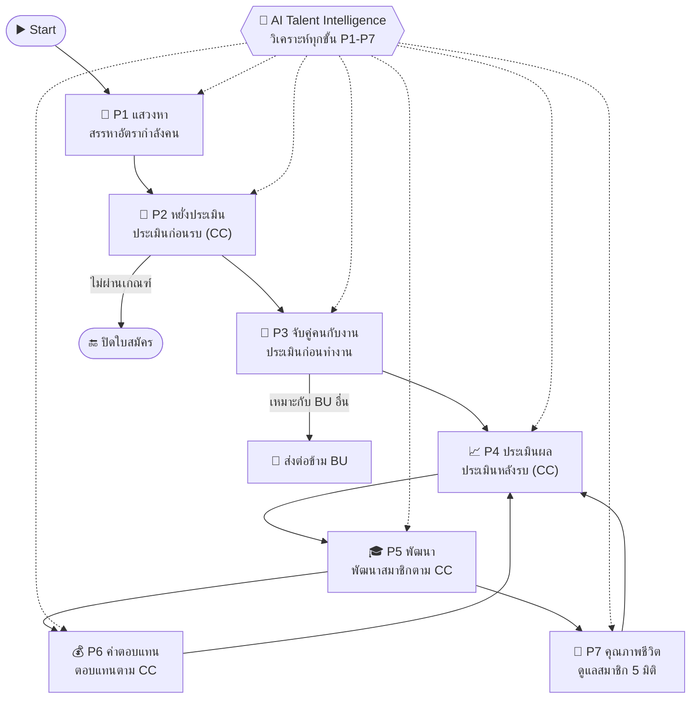
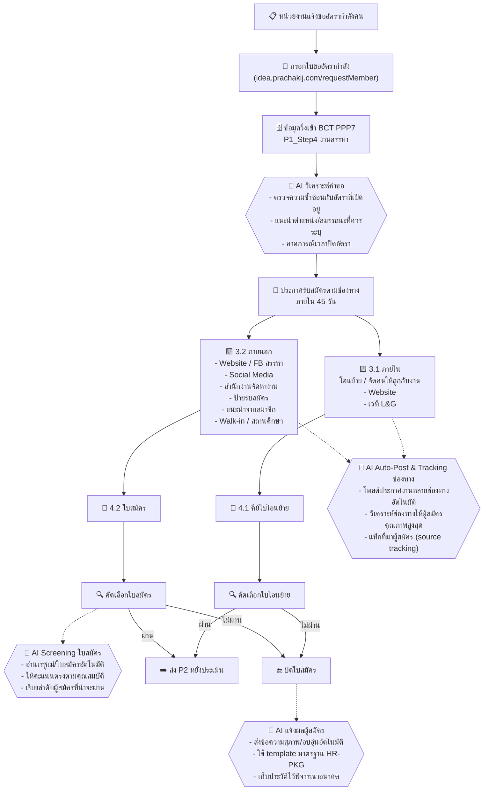
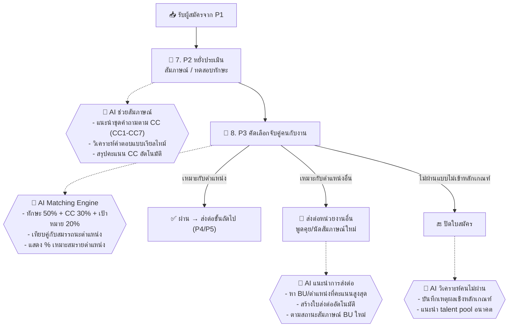
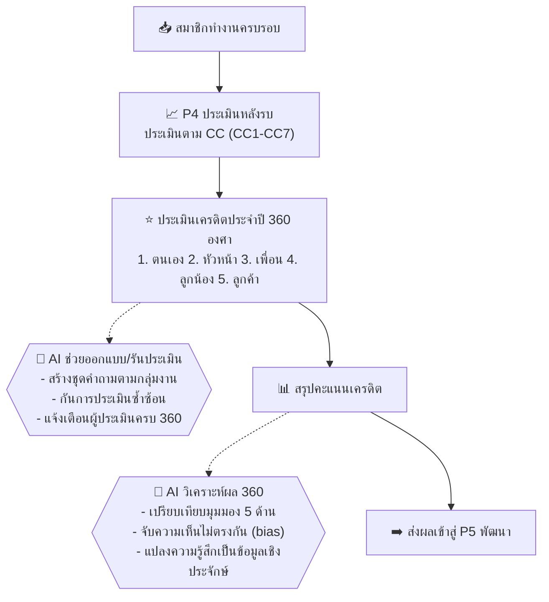
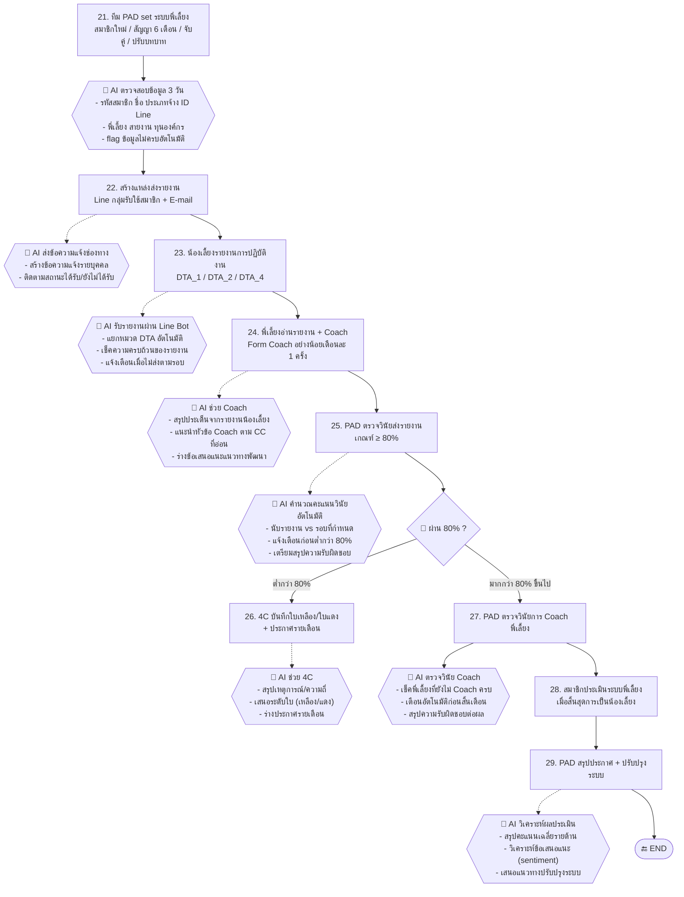
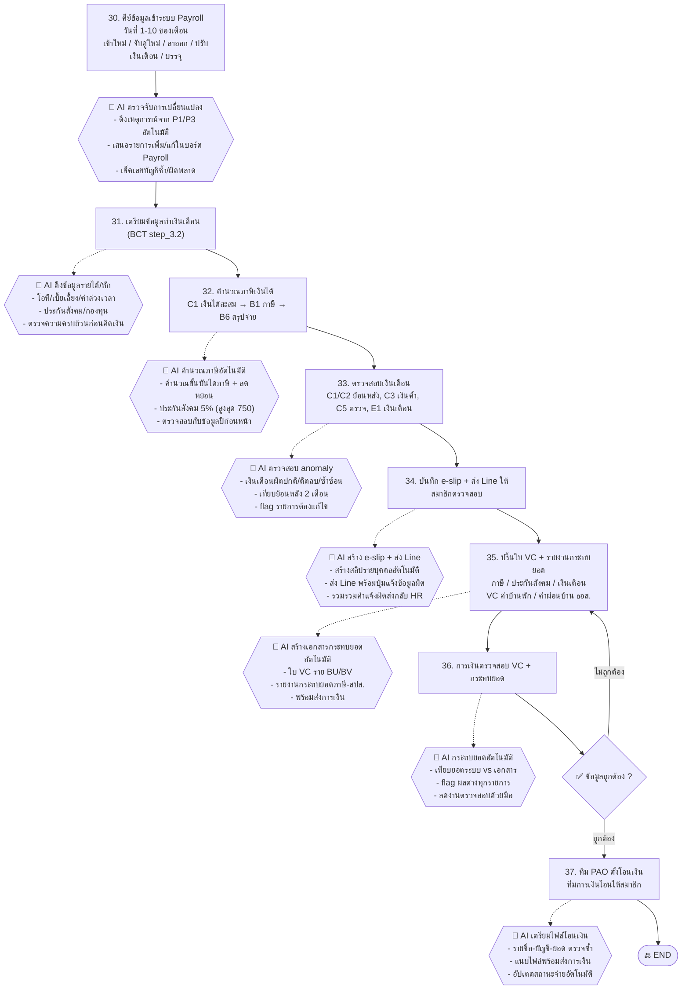
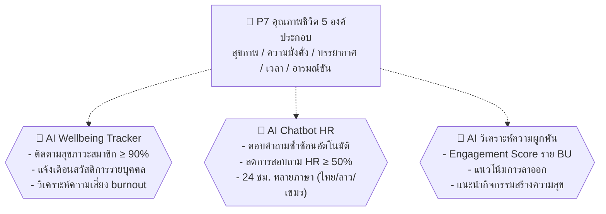

# 🤖 Diagram กระบวนการ PP7 ใหม่ — นำ AI เข้ามาช่วย

> **ที่มา:** แปลงจาก `SMC_HOCC_PM_002_การบริหารระบบ_PP7 (draw.io)` — ปรับปรุงเป็นกระบวนการดิจิทัลที่ AI เข้ามาช่วยในทุกขั้นตอน
> **อ้างอิงการพัฒนา:** Web PP7 (repo `web-pp7`) — module `p5-mentoring-system.html`, `p6-payroll-workflow.html`, `p1-sourcing-transfer.html`
> **สัญลักษณ์:** 🟨 = กระบวนการเดิม · 🤖 = จุดที่ AI เข้ามาช่วย · 🟩 = กระบวนการใหม่

---

## 1. ภาพรวมระบบ PP7 (Flowchart ใหญ่)

---

## 2. P1 แสวงหา (Recruit / People Sourcing)

### 2.1 กระบวนการ (เดิม + AI)

### 2.2 จุดที่ AI เข้ามาช่วย (P1)

| # | กระบวนการเดิม | AI เข้ามาช่วย | ผลลัพธ์ |
|---|---------------|---------------|---------|
| 1 | HR อ่านใบขออัตรากำลังเอง | AI วิเคราะห์คำขอ + เช็คอัตราซ้ำ | ลดเวลาเตรียมประกาศ 50% |
| 2 | โพสต์ประกาศงานทีละช่องทาง | AI Auto-Post หลายช่องทาง + แท็กที่มา | รู้ช่องทาง effective ที่สุด |
| 3 | HR อ่านใบสมัครทีละใบ | AI Screening ให้คะแนน + เรียงลำดับ | ลดเวลาคัดกรอง 70% |
| 4 | ส่งจดหมาย/ไลน์แจ้งผลเอง | AI ส่งข้อความแจ้งผลสุภาพอัตโนมัติ | ผู้สมัครได้ feedback เร็วขึ้น |

---

## 3. P2 หยั่งประเมิน + P3 จับคู่คนกับงาน

### 3.1 กระบวนการ (เดิม + AI)

### 3.2 จุดที่ AI เข้ามาช่วย (P2–P3)

| # | กระบวนการเดิม | AI เข้ามาช่วย | ผลลัพธ์ |
|---|---------------|---------------|---------|
| 1 | คณะกรรมการตั้งคำถามเอง | AI แนะนำคำถามตาม CC + วิเคราะห์คำตอบ | ประเมินตรง CC ลดอคติ |
| 2 | จับคู่คนกับงานจากดุลยพินิจ | AI Matching Engine (ทักษะ+CC+เป้าหมาย) | คู่คน-งานแม่นยำขึ้น |
| 3 | ส่งต่อ BU อื่นด้วยเอกสาร | AI หา BU เหมาะสุด + ใบส่งต่ออัตโนมัติ | ผู้สมัครไม่หลุดจากระบบ |
| 4 | เก็บข้อมูลคนไม่ผ่านกระจัดกระจาย | AI สร้าง Talent Pool สำหรับอนาคต | ฐานข้อมูลสรรหาในองค์กร |

---

## 4. P4 ประเมินผล (Performance)

### 4.1 กระบวนการ (เดิม + AI)

### 4.2 จุดที่ AI เข้ามาช่วย (P4)

| # | กระบวนการเดิม | AI เข้ามาช่วย | ผลลัพธ์ |
|---|---------------|---------------|---------|
| 1 | ออกแบบประเมินด้วยมือทุกปี | AI สร้างชุดคำถามตามกลุ่มงาน (เรียนแบบ ไม่ใช่เลียนแบบ) | ลดภาระ HR อย่างมาก |
| 2 | ประเมินด้วยความรู้สึก/อารมณ์ | AI วิเคราะห์แนวโน้ม + จับ bias ข้ามมุมมอง | ประเมินตรงข้อมูลจริง |
| 3 | สรุปผลช้า | AI สรุปผล + แนะนำจุดพัฒนารายคน | ส่งต่อ P5 ได้ทันที |

---

## 5. P5 พัฒนา — ระบบพี่เลี้ยง (Mentoring System) ขั้น 21–29

### 5.1 กระบวนการ (เดิม + AI)

### 5.2 จุดที่ AI เข้ามาช่วย (P5)

| # | กระบวนการเดิม | AI เข้ามาช่วย | ผลลัพธ์ |
|---|---------------|---------------|---------|
| 1 | PAD ตรวจข้อมูลมือ 3 วัน | AI ตรวจสอบ + flag ข้อมูลไม่ครบทันที | ลดเวลาเหลือไม่ถึง 1 วัน |
| 2 | ส่งช่องทางรายงานด้วยมือ | AI สร้าง/ส่งข้อความแจ้ง + ติดตามสถานะ | น้องเลี้ยงทราบช่องทางเร็ว |
| 3 | น้องเลี้ยงส่งรายงานหลายช่องทาง | Line Bot รับรายงาน + แยก DTA อัตโนมัติ | รายงานรวมศูนย์ครบถ้วน |
| 4 | พี่เลี้ยงอ่านรายงานเอง | AI สรุปประเด็น + แนะนำหัวข้อ Coach | Coach ตรงจุด มีคุณภาพ |
| 5 | PAD นับวินัยเอง | AI คำนวณ % + เตือนก่อนหลุดเกณฑ์ | ไม่พลาดเกณฑ์ 80% |
| 6 | 4C ตัดสินใบเหลือง/แดงเอง | AI เสนอระดับใบตามความรุนแรง | ประกาศสม่ำเสมอ เป็นธรรม |
| 7 | PAD ไล่เช็คพี่เลี้ยง Coach | AI เช็ค + เตือนอัตโนมัติ | พี่เลี้ยง Coach ครบ 100% |
| 8 | สรุปผลประเมินด้วยมือ | AI วิเคราะห์คะแนน + ข้อเสนอแนะ | ปรับปรุงระบบต่อเนื่อง |

---

## 6. P6 ค่าตอบแทน — Payroll Workflow ขั้น 30–37

### 6.1 กระบวนการ (เดิม + AI)

### 6.2 จุดที่ AI เข้ามาช่วย (P6)

| # | กระบวนการเดิม | AI เข้ามาช่วย | ผลลัพธ์ |
|---|---------------|---------------|---------|
| 1 | HR คีย์เหตุการณ์เองทุกเดือน | AI ดึงจาก P1/P3 + เสนอรายการ | ลด Human Error ด้าน Payroll ≥ 80% |
| 2 | ดึงข้อมูลโอที/เบี้ยเลี้ยงด้วยมือ | AI ดึง + ตรวจความครบถ้วน | เตรียมข้อมูลเร็วขึ้น |
| 3 | คำนวณภาษีใน Excel | AI คำนวณขั้นบันได + ลดหย่อนอัตโนมัติ | ถูกต้อง ตรวจสอบย้อนกลับได้ |
| 4 | ตรวจเงินเดือนด้วยสายตา | AI ตรวจ anomaly + เทียบย้อนหลัง | จับผิดก่อนจ่าย |
| 5 | ทำสลิป + ส่งทีละคน | AI สร้าง e-slip + ส่ง Line + รับคำแจ้งผิด | สมาชิกตรวจสอบเองได้ |
| 6 | จัดทำกระทบยอดด้วยมือ | AI สร้างรายงานกระทบยอดอัตโนมัติ | การเงินตรวจไวขึ้น |
| 7 | ตั้งโอนเงินคีย์ซ้ำ | AI เตรียมไฟล์โอน + ตรวจซ้ำ | โอนตรงเวลา ปลอดภัย |

---

## 7. P7 คุณภาพชีวิต (Quality of Life)

---

## 8. ตารางสรุป AI Touchpoints ทั้งระบบ

| ขั้นตอน | กระบวนการเดิม (SMC_HOCC_PM_002) | AI เข้ามาช่วย (Web PP7 ใหม่) | ระดับ |
|---------|----------------------------------|------------------------------|-------|
| P1-2 | หน่วยงานแจ้งขออัตรากำลัง | AI วิเคราะห์คำขอ + เช็คอัตราซ้ำ | 🔴 สูง |
| P1-3 | ประกาศรับสมัครหลายช่องทาง 45 วัน | AI Auto-Post + Tracking ช่องทาง | 🟡 กลาง |
| P1-4.2 | คัดเลือกใบสมัครด้วยมือ | AI Screening ให้คะแนนอัตโนมัติ | 🔴 สูง |
| P1-4.1 | คีย์ใบโอนย้ายภายใน | AI แนะนำ internal mobility | 🟡 กลาง |
| P2-7 | สัมภาษณ์/ทดสอบทักษะ | AI ช่วยคำถามตาม CC + วิเคราะห์คำตอบ | 🔴 สูง |
| P3-8 | จับคู่คนกับงาน | AI Matching Engine (50/30/20) | 🔴 สูง |
| P3 | ส่งต่อผู้สมัคร BU อื่น | AI หา BU เหมาะสุด + ตามสถานะอัตโนมัติ | 🟡 กลาง |
| P4 | ประเมินเครดิต 360 องศา | AI สร้างชุดคำถาม + จับ bias | 🔴 สูง |
| P5-21 | PAD set ระบบพี่เลี้ยง ตรวจ 3 วัน | AI ตรวจสอบข้อมูล + flag ไม่ครบ | 🔴 สูง |
| P5-22 | สร้างช่องทาง Line/E-mail | AI ส่งข้อความแจ้ง + ติดตามสถานะ | 🟡 กลาง |
| P5-23 | น้องเลี้ยงรายงาน DTA | Line Bot รับรายงาน + แยกหมวด | 🔴 สูง |
| P5-24 | พี่เลี้ยง Coach เดือนละครั้ง | AI สรุปประเด็น + แนะนำหัวข้อ Coach | 🔴 สูง |
| P5-25 | ตรวจวินัยส่งรายงาน ≥ 80% | AI คำนวณ + เตือนก่อนหลุดเกณฑ์ | 🔴 สูง |
| P5-26 | 4C ใบเหลือง/ใบแดง | AI เสนอระดับใบ + ร่างประกาศ | 🟡 กลาง |
| P5-27 | ตรวจวินัย Coach พี่เลี้ยง | AI เช็ค + เตือนพี่เลี้ยงไม่ครบ | 🟡 กลาง |
| P5-28/29 | ประเมินระบบพี่เลี้ยง + ปรับปรุง | AI วิเคราะห์คะแนน + sentiment | 🟡 กลาง |
| P6-30 | เพิ่มสมาชิก Payroll (1–10) | AI ดึงเหตุการณ์จาก P1/P3 + เช็คบัญชี | 🔴 สูง |
| P6-31/32 | เตรียมข้อมูล + คำนวณภาษี | AI ดึงรายได้ + คำนวณภาษี/สปส. | 🔴 สูง |
| P6-33 | ตรวจสอบเงินเดือน | AI ตรวจ anomaly เทียบย้อนหลัง | 🔴 สูง |
| P6-34 | e-slip + ส่ง Line | AI สร้างสลิป + ส่ง Line + รับแจ้งผิด | 🔴 สูง |
| P6-35/36 | ปริ้น VC + การเงินตรวจสอบ | AI สร้างกระทบยอด + flag ผลต่าง | 🟡 กลาง |
| P6-37 | PAO ตั้งโอนเงิน | AI เตรียมไฟล์โอน + ตรวจซ้ำ | 🔴 สูง |
| P7 | คุณภาพชีวิต 5 องค์ประกอบ | AI Wellbeing Tracker + Chatbot HR | 🟡 กลาง |

---

## 9. แนวทางออกแบบโครงสร้าง Web PP7 (ต่อท้าย)

### 9.1 หลักการ
- **ทุก P ขับเคลื่อนด้วย CC (Core Competency)** — AI ทุกจุดวัด/พัฒนาบน CC1–CC7
- **ข้อมูลไหลต่อเนื่อง P1→P7** — AI ดึงข้อมูลข้ามขั้นตอน (เช่น P1/P3 → P6 Payroll) ลดการคีย์ซ้ำ
- **มนุษย์ยืนยันเสมอ** — AI แนะนำ/ร่าง/เตือน แต่การตัดสินใจ final อยู่ที่คน (PAD/HR/การเงิน)

### 9.2 สถาปัตยกรรม Web PP7

```mermaid
flowchart LR
    subgraph UI["🖥️ Web PP7 (Frontend)"]
        DASH["📊 Dashboard ผู้บริหาร"]
        P1M["🧲 P1 สรรหา + AI Screening"]
        P2M["🎯 P2 ประเมิน CC"]
        P3M["🤝 P3 AI Matching"]
        P4M["📈 P4 ประเมิน 360"]
        P5M["🎓 P5 พี่เลี้ยง + Coach"]
        P6M["💰 P6 Payroll Workflow"]
        P7M["🌿 P7 Wellbeing"]
    end
    subgraph AI["🤖 AI Layer"]
        NLP["NLU/NLP ภาษาไทย"]
        SCORE["Scoring Engine (CC)"]
        MATCH["Matching Engine 50/30/20"]
        DETECT["Anomaly Detection"]
        CHAT["Chatbot HR"]
    end
    subgraph DATA["🗄️ Data Layer"]
        SHEET["Google Sheets (BCT)"]
        GAS["Google Apps Script"]
        LOG["Audit Log 100%"]
    end
    UI --> AI
    AI --> DATA
```

### 9.3 ลำดับการพัฒนา (Roadmap)

| ระยะ | สิ่งที่พัฒนา | สถานะ |
|------|-------------|-------|
| ✅ เสร็จแล้ว | P1 ช่องทาง/โอนย้าย/ส่งต่อ (`p1-sourcing-transfer.html`) | ✅ |
| ✅ เสร็จแล้ว | P5 ระบบพี่เลี้ยงครบวงจร (`p5-mentoring-system.html`) | ✅ |
| ✅ เสร็จแล้ว | P6 Payroll Workflow (`p6-payroll-workflow.html`) | ✅ |
| ⏳ ถัดไป | ผูก AI Screening/ Matching เข้ากับ module ใหม่ | ⏳ |
| ⏳ ถัดไป | หน้า 2 ของ diagram (P4/P7) ทบทวนเพิ่มเติม | ⏳ |
| ⏳ ถัดไป | เชื่อม Google Sheets จริง + Deploy | ⏳ |

---

> **เอกสารนี้จัดทำโดย KiloClaw (PM + Developer Web PP7)** — 31 สิงหาคม 2569
> อัปเดตตามคำขอ: "ช่วยเขียน Diagram ใหม่ ที่นำ AI เข้ามาช่วย โดยเขียนเป็น .md"
