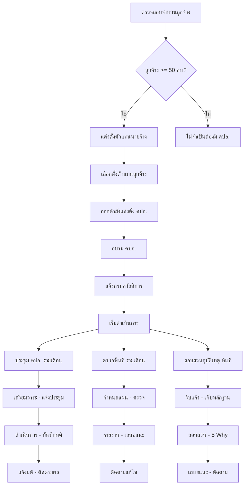

```mermaid
flowchart TD
    A["ตรวจสอบจำนวนลูกจ้าง"] --> B{"ลูกจ้าง >= 50 คน?"}
    B -->|ใช่| C["แต่งตั้งตัวแทนนายจ้าง"]
    B -->|ไม่| Z["ไม่จำเป็นต้องมี คปอ."]
    C --> D["เลือกตั้งตัวแทนลูกจ้าง"]
    D --> E["ออกคำสั่งแต่งตั้ง คปอ."]
    E --> F["อบรม คปอ."]
    F --> G["แจ้งกรมสวัสดิการ"]
    G --> H["เริ่มดำเนินการ"]
    H --> I["ประชุม คปอ. รายเดือน"]
    H --> J["ตรวจพื้นที่ รายเดือน"]
    H --> K["สอบสวนอุบัติเหตุ ทันที"]
    I --> I1["เตรียมวาระ - แจ้งประชุม"]
    I1 --> I2["ดำเนินการ - บันทึกมติ"]
    I2 --> I3["แจ้งมติ - ติดตามผล"]
    J --> J1["กำหนดแผน - ตรวจ"]
    J1 --> J2["รายงาน - เสนอแนะ"]
    J2 --> J3["ติดตามแก้ไข"]
    K --> K1["รับแจ้ง - เก็บหลักฐาน"]
    K1 --> K2["สอบสวน - 5 Why"]
    K2 --> K3["เสนอแนะ - ติดตาม"]
```
