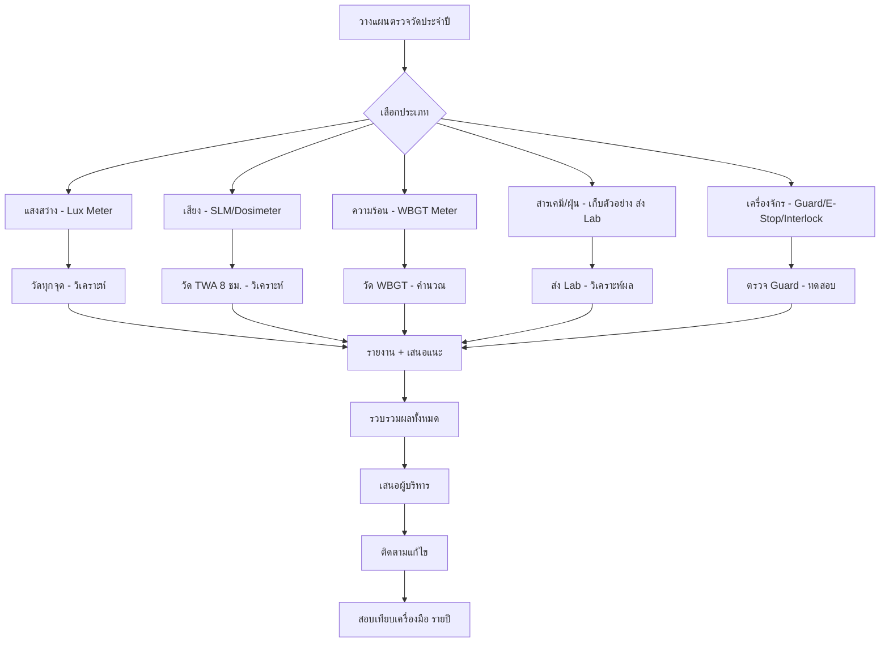

```mermaid
flowchart TD
    A["วางแผนตรวจวัดประจำปี"] --> B{"เลือกประเภท"}
    B --> C["แสงสว่าง - Lux Meter"]
    B --> D["เสียง - SLM/Dosimeter"]
    B --> E["ความร้อน - WBGT Meter"]
    B --> F["สารเคมี/ฝุ่น - เก็บตัวอย่าง ส่ง Lab"]
    B --> G["เครื่องจักร - Guard/E-Stop/Interlock"]
    C --> C1["วัดทุกจุด - วิเคราะห์"]
    D --> D1["วัด TWA 8 ชม. - วิเคราะห์"]
    E --> E1["วัด WBGT - คำนวณ"]
    F --> F1["ส่ง Lab - วิเคราะห์ผล"]
    G --> G1["ตรวจ Guard - ทดสอบ"]
    C1 --> H["รายงาน + เสนอแนะ"]
    D1 --> H
    E1 --> H
    F1 --> H
    G1 --> H
    H --> I["รวบรวมผลทั้งหมด"]
    I --> J["เสนอผู้บริหาร"]
    J --> K["ติดตามแก้ไข"]
    K --> L["สอบเทียบเครื่องมือ รายปี"]
```
