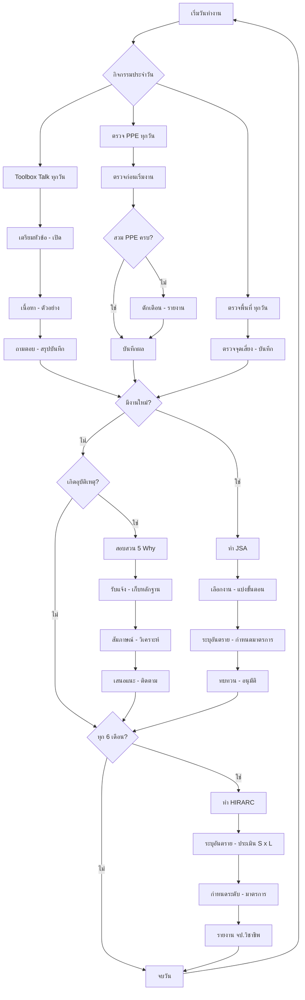

```mermaid
flowchart TD
    A["เริ่มวันทำงาน"] --> B{"กิจกรรมประจำวัน"}
    B --> C["Toolbox Talk ทุกวัน"]
    B --> D["ตรวจ PPE ทุกวัน"]
    B --> E["ตรวจพื้นที่ ทุกวัน"]
    C --> C1["เตรียมหัวข้อ - เปิด"]
    C1 --> C2["เนื้อหา - ตัวอย่าง"]
    C2 --> C3["ถามตอบ - สรุปบันทึก"]
    D --> D1["ตรวจก่อนเริ่มงาน"]
    D1 --> D2{"สวม PPE ครบ?"}
    D2 -->|ใช่| D3["บันทึกผล"]
    D2 -->|ไม่| D4["ตักเตือน - รายงาน"]
    D4 --> D3
    E --> E1["ตรวจจุดเสี่ยง - บันทึก"]
    C3 --> F{"มีงานใหม่?"}
    D3 --> F
    E1 --> F
    F -->|ใช่| G["ทำ JSA"]
    G --> G1["เลือกงาน - แบ่งขั้นตอน"]
    G1 --> G2["ระบุอันตราย - กำหนดมาตรการ"]
    G2 --> G3["ทบทวน - อนุมัติ"]
    F -->|ไม่| H{"เกิดอุบัติเหตุ?"}
    H -->|ใช่| I["สอบสวน 5 Why"]
    I --> I1["รับแจ้ง - เก็บหลักฐาน"]
    I1 --> I2["สัมภาษณ์ - วิเคราะห์"]
    I2 --> I3["เสนอแนะ - ติดตาม"]
    H -->|ไม่| J{"ทุก 6 เดือน?"}
    J -->|ใช่| K["ทำ HIRARC"]
    J -->|ไม่| L["จบวัน"]
    K --> K1["ระบุอันตราย - ประเมิน S x L"]
    K1 --> K2["กำหนดระดับ - มาตรการ"]
    K2 --> K3["รายงาน จป.วิชาชีพ"]
    I3 --> J
    G3 --> J
    K3 --> L
    L --> A
```
