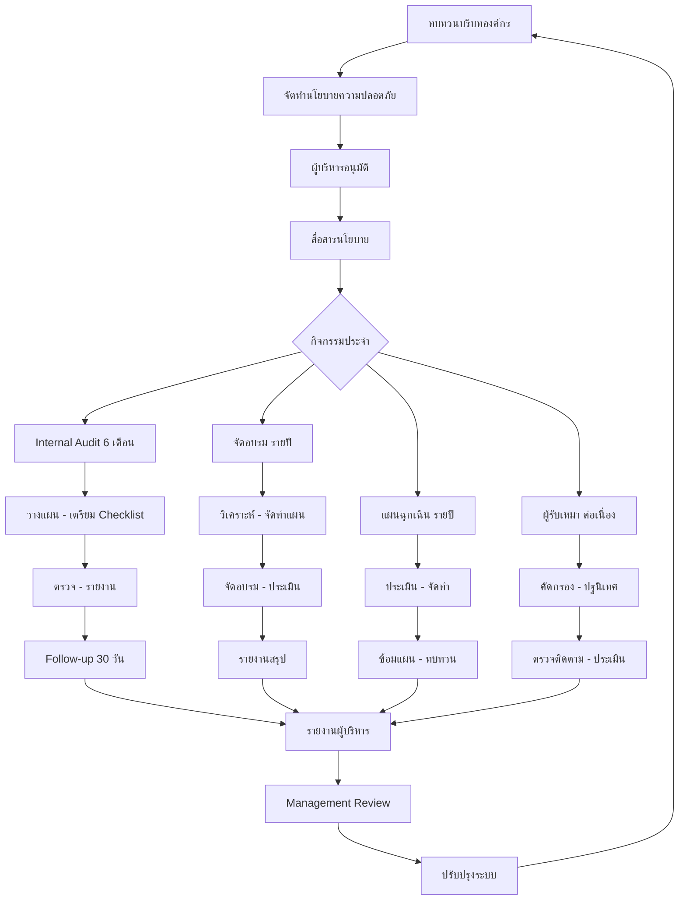

```mermaid
flowchart TD
    A["ทบทวนบริบทองค์กร"] --> B["จัดทำนโยบายความปลอดภัย"]
    B --> C["ผู้บริหารอนุมัติ"]
    C --> D["สื่อสารนโยบาย"]
    D --> E{"กิจกรรมประจำ"}
    E --> F["Internal Audit 6 เดือน"]
    E --> G["จัดอบรม รายปี"]
    E --> H["แผนฉุกเฉิน รายปี"]
    E --> I["ผู้รับเหมา ต่อเนื่อง"]
    F --> F1["วางแผน - เตรียม Checklist"]
    F1 --> F2["ตรวจ - รายงาน"]
    F2 --> F3["Follow-up 30 วัน"]
    G --> G1["วิเคราะห์ - จัดทำแผน"]
    G1 --> G2["จัดอบรม - ประเมิน"]
    G2 --> G3["รายงานสรุป"]
    H --> H1["ประเมิน - จัดทำ"]
    H1 --> H2["ซ้อมแผน - ทบทวน"]
    I --> I1["คัดกรอง - ปฐนิเทศ"]
    I1 --> I2["ตรวจติดตาม - ประเมิน"]
    F3 --> J["รายงานผู้บริหาร"]
    G3 --> J
    H2 --> J
    I2 --> J
    J --> K["Management Review"]
    K --> L["ปรับปรุงระบบ"]
    L --> A
```
