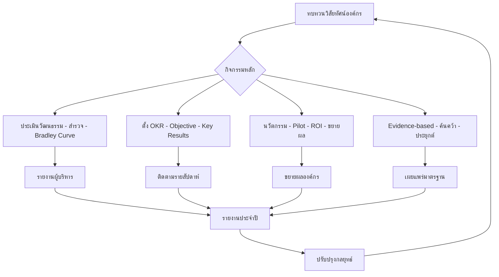

```mermaid
flowchart TD
    A["ทบทวนวิสัยทัศน์องค์กร"] --> B{"กิจกรรมหลัก"}
    B --> C["ประเมินวัฒนธรรม - สำรวจ - Bradley Curve"]
    B --> D["ตั้ง OKR - Objective - Key Results"]
    B --> E["นวัตกรรม - Pilot - ROI - ขยายผล"]
    B --> F["Evidence-based - ค้นคว้า - ประยุกต์"]
    C --> C1["รายงานผู้บริหาร"]
    D --> D1["ติดตามรายสัปดาห์"]
    E --> E1["ขยายผลองค์กร"]
    F --> F1["เผยแพร่มาตรฐาน"]
    C1 --> G["รายงานประจำปี"]
    D1 --> G
    E1 --> G
    F1 --> G
    G --> H["ปรับปรุงกลยุทธ์"]
    H --> A
```
