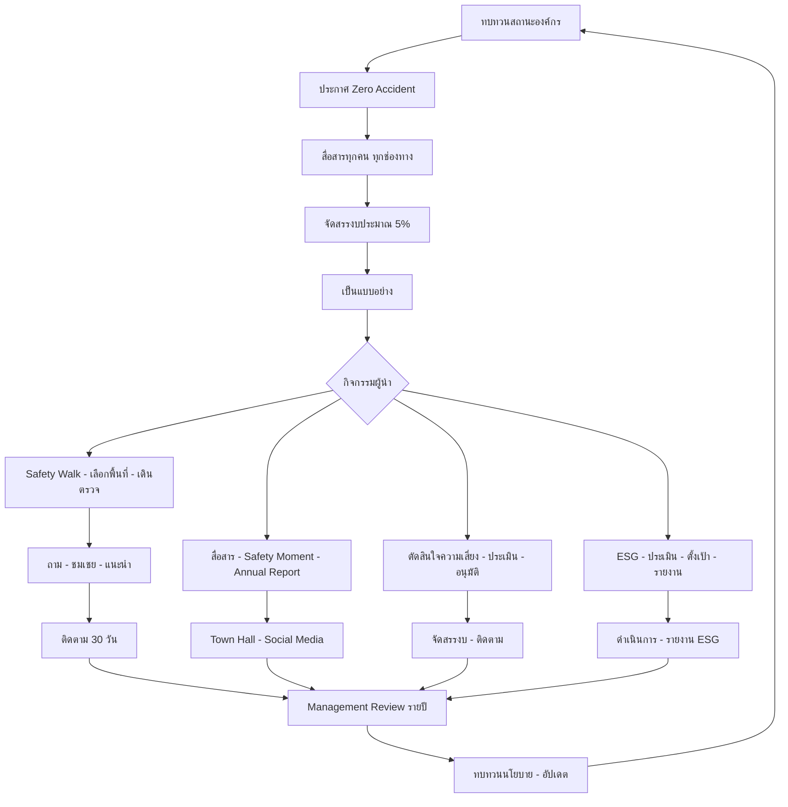

```mermaid
flowchart TD
    A["ทบทวนสถานะองค์กร"] --> B["ประกาศ Zero Accident"]
    B --> C["สื่อสารทุกคน ทุกช่องทาง"]
    C --> D["จัดสรรงบประมาณ 5%"]
    D --> E["เป็นแบบอย่าง"]
    E --> F{"กิจกรรมผู้นำ"}
    F --> G["Safety Walk - เลือกพื้นที่ - เดินตรวจ"]
    F --> H["สื่อสาร - Safety Moment - Annual Report"]
    F --> I["ตัดสินใจความเสี่ยง - ประเมิน - อนุมัติ"]
    F --> J["ESG - ประเมิน - ตั้งเป้า - รายงาน"]
    G --> G1["ถาม - ชมเชย - แนะนำ"]
    G1 --> G2["ติดตาม 30 วัน"]
    H --> H1["Town Hall - Social Media"]
    I --> I1["จัดสรรงบ - ติดตาม"]
    J --> J1["ดำเนินการ - รายงาน ESG"]
    G2 --> K["Management Review รายปี"]
    H1 --> K
    I1 --> K
    J1 --> K
    K --> L["ทบทวนนโยบาย - อัปเดต"]
    L --> A
```
