# Diagram Code — PM/WI จป. ทั้ง 6 ระดับ

ใช้ Mermaid.js เพื่อสร้าง Diagram — รองรับโดย:
- GitHub, Notion, Obsidian, VS Code (Mermaid extension)
- mermaid.live (online editor)

---

## 1. คปอ. — Flowchart

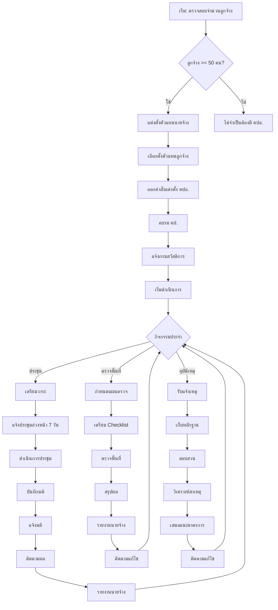

---

## 2. จป.เทคนิค — Flowchart

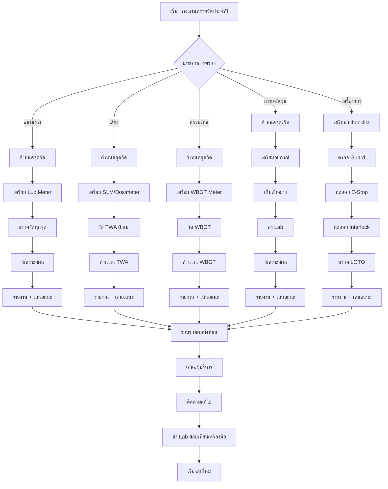

---

## 3. จป.หัวหน้างาน — Flowchart

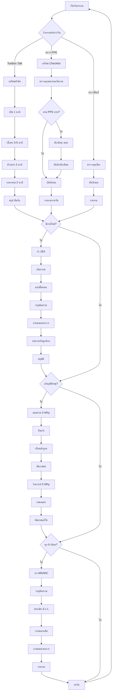

---

## 4. จป.วิชาชีพ — Flowchart

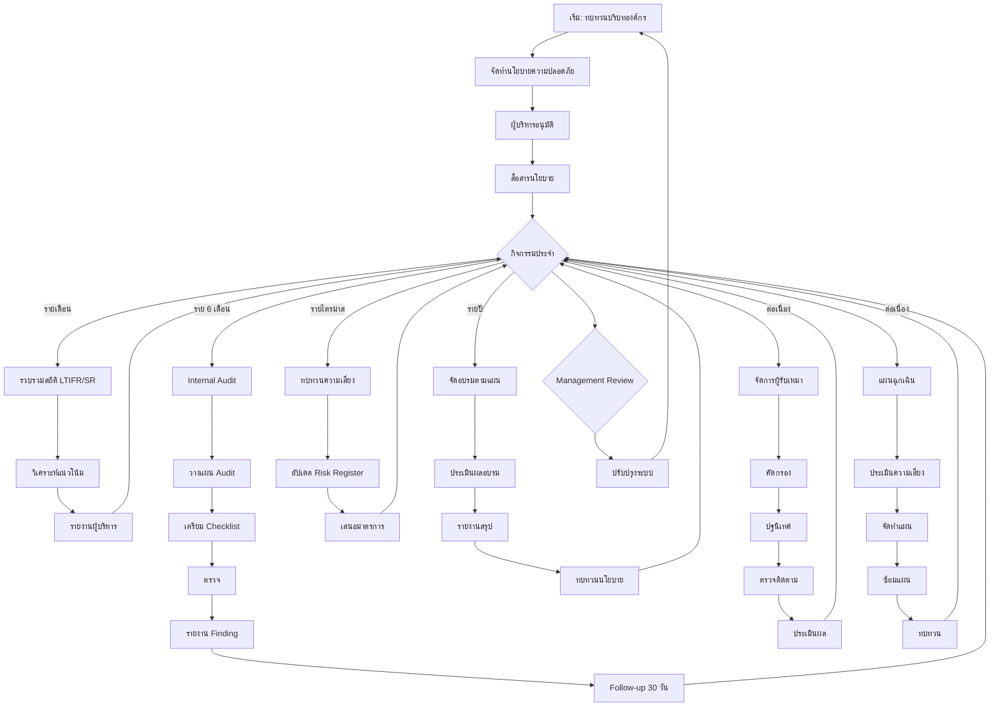

---

## 5. จป.ขั้นสูง — Flowchart

```mermaid
flowchart TD
    A[เริ่ม: ทบทวนวิสัยทัศน์องค์กร] --> B{กิจกรรมหลัก}

    B -->|ประเมินวัฒนธรรม| C[สำรวจพนักงาน]
    C --> D[สัมภาษณ์ตัวแทน]
    D --> E[สังเกตพฤติกรรม]
    E --> F[ให้คะแนน Bradley Curve]
    F --> G[รายงานผู้บริหาร]
    G --> H{ระดับวัฒนธรรม}
    H -->|Reactive| I1[บังคับใช้กฎ + อบรม]
    H -->|Dependent| I2[สร้างความเข้าใจ]
    H -->|Independent| I3[สร้างทีม ผู้นำแบบอย่าง]
    H -->|Interdependent| I4[รักษาโมเมนตัม]
    I1 --> J
    I2 --> J
    I3 --> J
    I4 --> J

    B -->|ตั้ง OKR| J1[ระบุปัญหา]
    J1 --> J2[ตั้ง Objective]
    J2 --> J3[ตั้ง Key Results]
    J3 --> J4[ผู้บริหารอนุมัติ]
    J4 --> J5[ติดตามรายสัปดาห์]
    J5 --> J6[ทบทวนรายไตรมาส]
    J6 --> J

    B -->|นวัตกรรม| K1[ระบุปัญหา]
    K1 --> K2[ศึกษาเทคโนโลยี]
    K2 --> K3[Pilot]
    K3 --> K4[ประเมิน ROI]
    K4 --> K5{ROI >= 100%?}
    K5 -->|ใช่| K6[ขยายผล]
    K5 -->|ไม่| K7[ปรับปรุง]
    K7 --> K3
    K6 --> K

    B -->|Evidence-based| L1[ระบุคำถาม]
    L1 --> L2[ค้นหางานวิจัย]
    L2 --> L3[ประเมินหลักฐาน]
    L3 --> L4[ประยุกต์ใช้]
    L4 --> L5[ทดสอบ]
    L5 --> L6[เผยแพร่]
    L6 --> L

    B -->|Mentoring| M1[ประเมินความต้องการ]
    M1 --> M2[จัดทำแผน]
    M2 --> M3[ให้คำปรึกษา]
    M3 --> M4[ติดตาม]
    M4 --> M5[ประเมินผล]
    M5 --> M

    J --> N[รายงานประจำปี]
    K --> N
    L --> N
    M --> N
    N --> O[ปรับปรุงกลยุทธ์]
    O --> A
```

---

## 6. จป.ผู้บริหาร — Flowchart

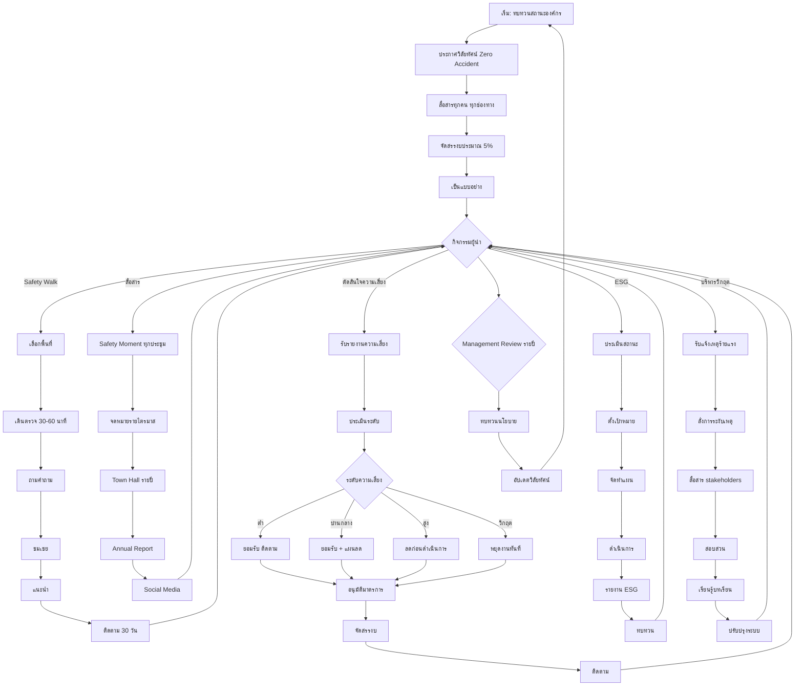

---

## Sequence Diagrams

### คปอ. — ประชุม

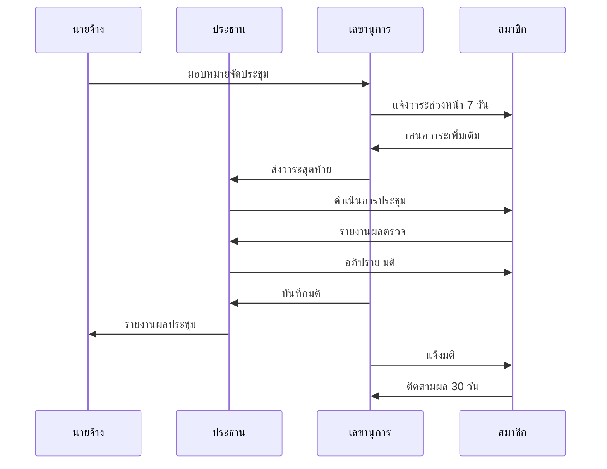

### หัวหน้างาน — Toolbox Talk

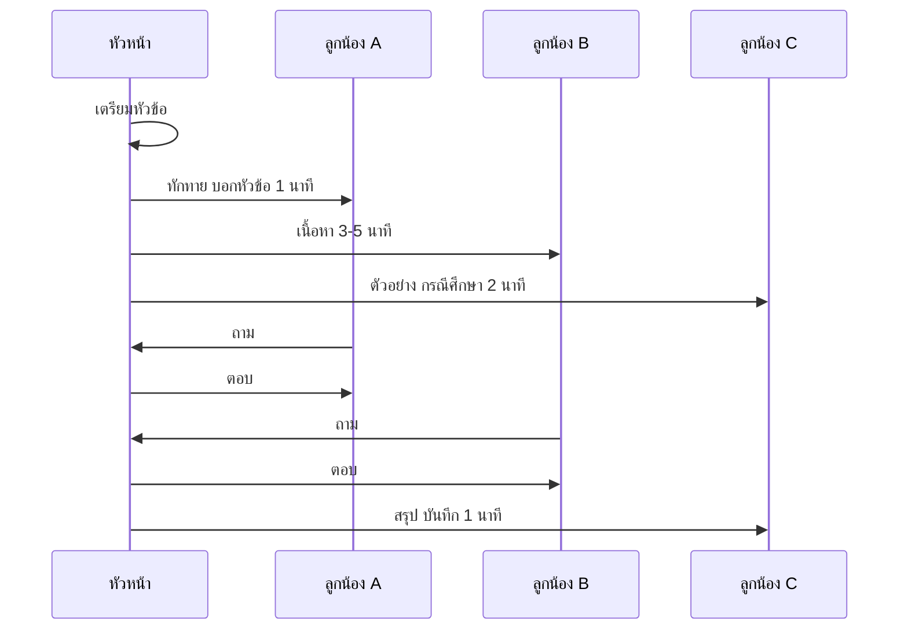

### ผู้บริหาร — Safety Walk

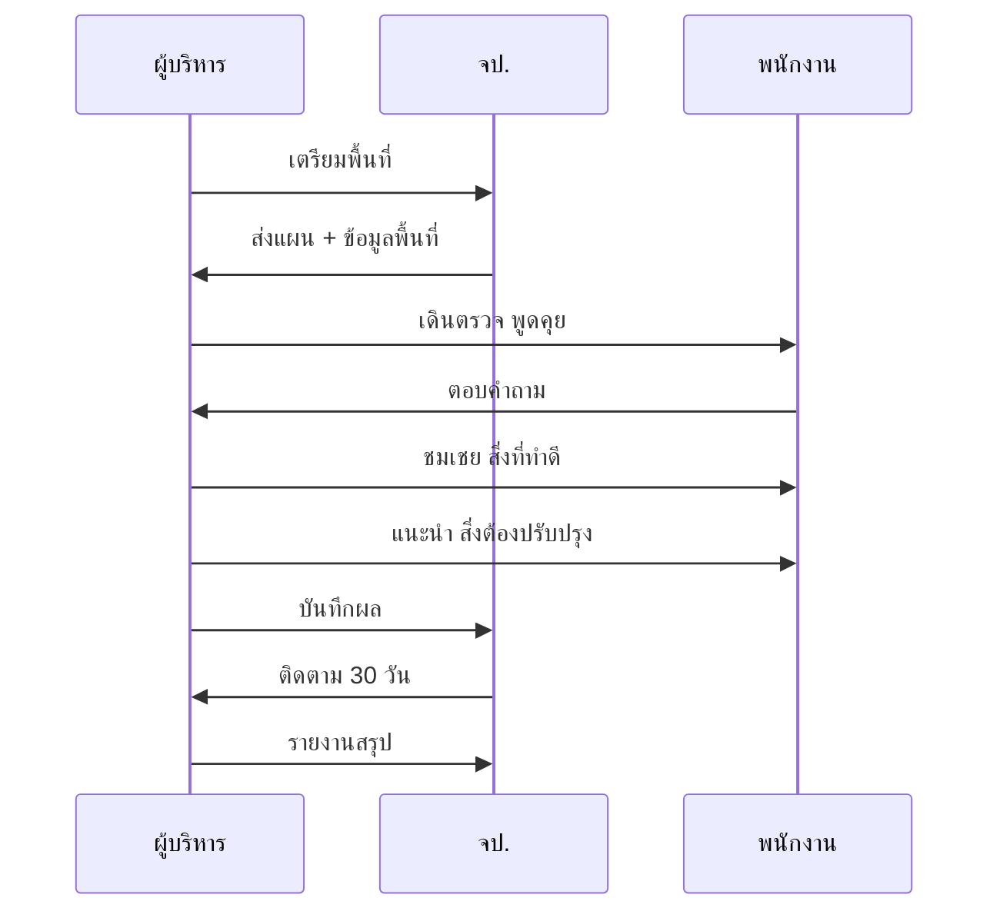

---

## ER Diagram — ระบบ จป.

```mermaid
erDiagram
    คปอ ||--o{ การประชุม : จัด
    คปอ ||--o{ การตรวจพื้นที่ : ดำเนิน
    คปอ ||--o{ การสอบสวน : ดำเนิน

    จปเทคนิค ||--o{ ผลตรวจวัด : ดำเนิน
    จปเทคนิค ||--o{ การสอบเทียบ : จัด

    จปหัวหน้างาน ||--o{ ToolboxTalk : จัด
    จปหัวหน้างาน ||--o{ JSA : ดำเนิน
    จปหัวหน้างาน ||--o{ HIRARC : ดำเนิน

    จปวิชาชีพ ||--o{ InternalAudit : ดำเนิน
    จปวิชาชีพ ||--o{ การอบรม : จัด
    จปวิชาชีพ ||--o{ แผนฉุกเฉิน : จัด

    จปขั้นสูง ||--o{ OKR : กำหนด
    จปขั้นสูง ||--o{ นวัตกรรม : นำมาใช้
    จปขั้นสูง ||--o{ Mentoring : ให้

    จปผู้บริหาร ||--o{ SafetyWalk : ดำเนิน
    จปผู้บริหาร ||--o{ ESG_Report : จัดทำ
    จปผู้บริหาร ||--o{ งบประมาณ : จัดสรร

    อุบัติเหตุ ||--o{ การสอบสวน : ถูกสอบสวน
    อุบัติเหตุ ||--o{ NearMiss : เกี่ยวข้อง
```

---

## Gantt Chart — แผนงาน PM/WI จป.

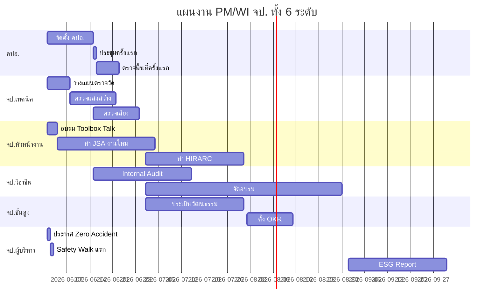

---

## Class Diagram — โครงสร้าง จป.

```mermaid
classDiagram
    class SafetyOfficer {
        +String name
        +String level
        +String certificate
        +inspect()
        +report()
        +recommend()
    }

    class คปอ {
        +List~Member~ members
        +Date term
        +holdMeeting()
        +inspectArea()
        +investigateAccident()
    }

    class จปเทคนิค {
        +LuxMeter luxMeter
        +SLM slm
        +WBGTMeter wbgt
        +measureLight()
        +measureNoise()
        +measureHeat()
    }

    class จปหัวหน้างาน {
        +String department
        +conductToolboxTalk()
        +createJSA()
        +createHIRARC()
    }

    class จปวิชาชีพ {
        +String registrationNo
        +createPolicy()
        +internalAudit()
        +organizeTraining()
    }

    class จปขั้นสูง {
        +int cultureScore
        +assessCulture()
        +setOKR()
        +mentor()
    }

    class จปผู้บริหาร {
        +String title
        +safetyWalk()
        +approveBudget()
        +declareVision()
    }

    SafetyOfficer <|-- คปอ
    SafetyOfficer <|-- จปเทคนิค
    SafetyOfficer <|-- จปหัวหน้างาน
    SafetyOfficer <|-- จปวิชาชีพ
    SafetyOfficer <|-- จปขั้นสูง
    SafetyOfficer <|-- จปผู้บริหาร
```
